# The Ghost Whale: Practical Privacy with Selective Disclosure on the Post-Pectra EVM

**Author:** Benjamin Ofem  
**X:** @CulturedBadBoy1  
**LinkedIn:** https://www.linkedin.com/in/benjamin-ofem-894a5a318/  
**Date:** June 2026  
**Protocol:** GhostShard 
**Repository:** https://github.com/giantgun/ghost-shard-protocol

---

## Table of Contents

<!-- toc -->

- [Abstract](#abstract)
- [1. Introduction](#1-introduction)
  * [1.1 Motivation](#11-motivation)
  * [1.2 Limitations of Existing Approaches](#12-limitations-of-existing-approaches)
  * [1.3 Design Goals](#13-design-goals)
- [2. Design Rationale](#2-design-rationale)
  * [2.1 The Fundamental Privacy Failure of EVM Systems](#21-the-fundamental-privacy-failure-of-evm-systems)
  * [2.2 Why Ownership Topology?](#22-why-ownership-topology)
  * [2.2b Why Privacy Must Be the Default](#22b-why-privacy-must-be-the-default)
  * [2.3 What Is Disposable Ownership?](#23-what-is-disposable-ownership)
  * [2.4 How Do We Achieve Disposable Ownership?](#24-how-do-we-achieve-disposable-ownership)
  * [2.5 Fragmentation Problem](#25-fragmentation-problem)
  * [2.6 How Do We Guarantee One-Time Use?](#26-how-do-we-guarantee-one-time-use)
  * [2.7 Transfer Amount as a Privacy Leak](#27-transfer-amount-as-a-privacy-leak)
  * [2.8 Dust Protection](#28-dust-protection)
  * [2.9 How Do We Coordinate Shards Without ETH?](#29-how-do-we-coordinate-shards-without-eth)
  * [2.10 How Do We Verify and Execute Gas Sponsorship?](#210-how-do-we-verify-and-execute-gas-sponsorship)
  * [2.11 How Do We Enable ERC-20 Gas Sponsorship?](#211-how-do-we-enable-erc-20-gas-sponsorship)
  * [2.12 Announcement and Discovery](#212-announcement-and-discovery)
  * [2.13 Selective Disclosure and Compliance](#213-selective-disclosure-and-compliance)
  * [2.14 How Do We Privatize NFTs?](#214-how-do-we-privatize-nfts)
  * [2.15 Metadata Length Standardization](#215-metadata-length-standardization)
  * [2.16 Architectural Evolution](#216-architectural-evolution)
- [3. Comparison with Existing Privacy Systems](#3-comparison-with-existing-privacy-systems)
  * [3.1 Privacy Models](#31-privacy-models)
  * [3.2 System Comparison](#32-system-comparison)
  * [3.3 Privacy as an Action vs Privacy as a State](#33-privacy-as-an-action-vs-privacy-as-a-state)
  * [3.4 Recipient Privacy](#34-recipient-privacy)
  * [3.5 Sender Privacy](#35-sender-privacy)
  * [3.6 Ownership Privacy](#36-ownership-privacy)
  * [3.7 Capital Concentration and Honeypot Risk](#37-capital-concentration-and-honeypot-risk)
  * [3.8 Compliance and Selective Disclosure](#38-compliance-and-selective-disclosure)
  * [3.9 Composability](#39-composability)
  * [3.10 User Experience and Developer Experience](#310-user-experience-and-developer-experience)
  * [3.11 Summary](#311-summary)
- [4. System Overview](#4-system-overview)
  * [4.1 System Components](#41-system-components)
  * [4.2 End-to-End Transaction Flow](#42-end-to-end-transaction-flow)
  * [4.3 Ownership Lifecycle](#43-ownership-lifecycle)
  * [4.4 Data Flow](#44-data-flow)
- [5. Cryptographic Foundation](#5-cryptographic-foundation)
  * [5.2 Identity and Key Hierarchy](#52-identity-and-key-hierarchy)
  * [5.3 Meta-Addresses](#53-meta-addresses)
  * [5.4 Stealth Address Generation](#54-stealth-address-generation)
  * [5.5 Announcement Discovery](#55-announcement-discovery)
  * [5.6 Metadata Confidentiality](#56-metadata-confidentiality)
  * [5.7 Selective Disclosure](#57-selective-disclosure)
  * [5.8 Deterministic Shared Key Generation](#58-deterministic-shared-key-generation)
  * [5.10 Summary](#510-summary)
- [6. Execution Model](#6-execution-model)
  * [Status](#status)
  * [6.1 EIP-7702](#61-eip-7702)
  * [6.2 Transaction Lifecycle](#62-transaction-lifecycle)
  * [6.3 Execution Architecture](#63-execution-architecture)
  * [6.5 Shard Authorization Model](#65-shard-authorization-model)
  * [6.6 Sponsored Execution](#66-sponsored-execution)
  * [6.7 Simulation Pipeline](#67-simulation-pipeline)
  * [6.8 Chapter Summary](#68-chapter-summary)
- [7. Economic Model](#7-economic-model)
  * [Economic Principles](#economic-principles)
  * [Economic Foundations](#economic-foundations)
  * [Status](#status-1)
  * [7.1 Relayer Economics](#71-relayer-economics)
  * [7.3 Escrow Accounting](#73-escrow-accounting)
  * [7.3 Escrow Accounting](#73-escrow-accounting-1)
  * [7.4 Chapter Summary](#74-chapter-summary)
- [8. Privacy Analysis](#8-privacy-analysis)
  * [8.1 Ownership Unlinkability](#81-ownership-unlinkability)
  * [8.2 Sender Privacy](#82-sender-privacy)
  * [8.3 Recipient Privacy](#83-recipient-privacy)
  * [8.4 Recipient–Change Ambiguity](#84-recipient%E2%80%93change-ambiguity)
  * [8.5 Wallet Reconstruction Resistance](#85-wallet-reconstruction-resistance)
  * [8.6 NFT Privacy](#86-nft-privacy)
  * [8.9 Trust Assumptions and Privacy Boundaries](#89-trust-assumptions-and-privacy-boundaries)
  * [8.10 Privacy Summary: Ownership Unlinkability](#810-privacy-summary-ownership-unlinkability)
- [9. Selective Disclosure](#9-selective-disclosure)
  * [9.1 Viewing Keys Are Not Disclosure Mechanisms](#91-viewing-keys-are-not-disclosure-mechanisms)
  * [9.2 Transaction-Level Disclosure](#92-transaction-level-disclosure)
  * [9.3 Disclosure Hierarchy](#93-disclosure-hierarchy)
  * [9.4 Regulatory Considerations](#94-regulatory-considerations)
  * [9.5 Summary](#95-summary)
- [10. Security Analysis](#10-security-analysis)
  * [10.1 Threat Model](#101-threat-model)
  * [10.2 Authorization Security](#102-authorization-security)
  * [10.3 Front-Running and Transaction Ordering](#103-front-running-and-transaction-ordering)
  * [10.4 Paymaster Security](#104-paymaster-security)
  * [10.5 Relayer Security](#105-relayer-security)
  * [10.6 Shard Abuse and Spam Resistance](#106-shard-abuse-and-spam-resistance)
  * [10.7 Key Management Security](#107-key-management-security)
  * [10.8 Smart Contract Security](#108-smart-contract-security)
  * [10.9 Cryptographic Assumptions](#109-cryptographic-assumptions)
  * [10.10 Security Boundary Summary](#1010-security-boundary-summary)
- [11. Performance Evaluation](#11-performance-evaluation)
  * [11.1 Experimental Methodology](#111-experimental-methodology)
  * [11.2 Gas Cost Breakdown](#112-gas-cost-breakdown)
  * [11.3 Scaling Analysis](#113-scaling-analysis)
  * [11.4 Verification Cost Scaling](#114-verification-cost-scaling)
  * [11.5 Execution Cost Scaling](#115-execution-cost-scaling)
  * [11.6 Amortization Analysis](#116-amortization-analysis)
  * [11.7 Discovery Performance](#117-discovery-performance)
- [12. Roadmap and Future Work](#12-roadmap-and-future-work)
  * [12.1 Roadmap](#121-roadmap)
  * [12.2 Future Work](#122-future-work)
- [Conclusion](#conclusion)
- [14. Appendices](#14-appendices)
  * [Appendix A — Protocol Parameters](#appendix-a--protocol-parameters)
  * [Appendix B — Gas Measurement Dataset](#appendix-b--gas-measurement-dataset)
  * [Appendix C — Threat Model Assumptions](#appendix-c--threat-model-assumptions)
  * [Appendix D — Example Mesh Transaction](#appendix-d--example-mesh-transaction)
  * [Appendix E — ERC-5564 Announcement Format](#appendix-e--erc-5564-announcement-format)
  * [Appendix F — Glossary](#appendix-f--glossary)

<!-- tocstop -->

---

# Abstract

GhostShard is a privacy protocol for post-Pectra Ethereum Virtual Machine (EVM) chains that introduces UTXO-style privacy to standard externally owned accounts (EOAs) without requiring zero-knowledge circuits, trusted setup ceremonies, mixer pools, shielded state trees, or custom execution environments.

The protocol is based on the observation that privacy can emerge from **ownership topology** rather than cryptographic hiding of transaction contents. GhostShard decomposes account ownership into one-time-use stealth accounts called *shards*. Every deposit creates a new shard, while every spend consumes existing shards and creates fresh replacement shards. Asset transfers are executed through **mesh transactions**: atomic EIP-7702 transactions that combine multiple input shards, multiple output stealth addresses, and multiple ERC-5564 announcements into a single execution unit. This many-to-many transaction structure eliminates deterministic relationships between inputs and outputs while preserving full self-custody.

GhostShard combines ERC-5564 stealth addressing, EIP-7702 delegation, and sponsored transaction execution to provide private transfers for native assets, ERC-20 tokens, and ERC-721 NFTs. The protocol introduces a randomized coin-selection engine, opportunistic shard compression, recipient/change indistinguishability, and selective disclosure mechanisms for optional auditability.

An implementation of GhostShard v0 was deployed on Arbitrum Sepolia and evaluated across twenty-two measured transactions spanning native ETH, ERC-20, and ERC-721 transfers. Experimental results show that total gas consumption scales linearly with transfer count, with transfer commands explaining approximately 97% of observed gas variance. Verification and execution costs exhibit predictable linear behavior, while transaction bundling produces substantial amortization benefits, reducing effective gas per transfer by more than 3× across the measured range. Analytical evaluation further shows that ERC-5564 view tags reduce announcement-discovery cryptographic workload by approximately 256× relative to naive scanning.

These results demonstrate that disposable ownership can be implemented within the existing EVM account model while maintaining self-custody, preserving composability, and achieving predictable scaling characteristics without relying on zero-knowledge systems.

**Keywords:** Privacy, EIP-7702, ERC-5564, Stealth Addresses, Account Abstraction, Ethereum, UTXO, NFT Privacy, Gas Sponsorship, Disposable Ownership.
# 1. Introduction

## 1.1 Motivation

Every transaction executed on a public Ethereum Virtual Machine (EVM) network permanently records the core parameters of a state transition: the sender, receiver, execution data, transferred amount, token contract, and timestamp. This transparency is a fundamental property of public blockchain systems and enables independent verification of network state. However, within the EVM's account-based model, transparency comes at the cost of persistent ownership visibility.

Unlike UTXO-based systems, where ownership can be distributed across many independent outputs, an EVM Externally Owned Account (EOA) functions simultaneously as a user's execution origin, asset container, and public identity. Over time, this creates a persistent financial profile that can be observed, analyzed, and correlated across the entire history of the chain.

The current state of EVM privacy introduces several significant challenges:

### Deterministic Transfer Transparency

Every transfer of native assets or ERC-20 tokens is publicly observable. Standardized events such as:

```solidity
Transfer(address indexed from, address indexed to, uint256 value)
```

allow observers to reconstruct the exact flow of assets across the network. Any participant operating a standard RPC node can index and analyze these transfers in real time.

### Address Clustering and Identity Correlation

Chain analysis systems employ clustering heuristics to associate multiple addresses with a single entity. Common signals include:

* Shared funding sources
* Exchange withdrawal patterns
* Co-spend behavior
* Temporal transaction correlation
* Repeated interaction patterns

Over time, these techniques allow observers to build increasingly accurate ownership maps linking seemingly independent addresses.

### NFT Ownership Exposure

The ERC-721 and ERC-1155 standards expose ownership through public view functions such as `ownerOf()` and `balanceOf()`. As a result, any observer can enumerate the complete non-fungible asset portfolio of a target address.

Because NFTs often represent unique assets, memberships, identities, achievements, or event attendance records, they can become powerful correlation anchors that connect on-chain activity to real-world personas.

### Wealth Inference and Economic Targeting

Public state visibility enables observers to estimate a user's financial position by aggregating balances across native assets, tokens, staking positions, and yield-bearing protocols.

This transparency creates opportunities for:

* Targeted phishing campaigns
* Social engineering attacks
* Competitive intelligence gathering
* MEV exploitation
* Real-world coercion and extortion

### Transaction Graph Analysis

The transaction graph reveals far more than balances. Counterparty relationships, business operations, interaction frequency, and behavioral patterns can all be inferred from historical activity.

By analyzing contract interactions, trading patterns, lending activity, bridge usage, and transaction timing, adversaries can construct behavioral profiles capable of identifying users and predicting future actions.

### The Ownership Visibility Problem

The consequence of these properties is not merely transaction transparency but persistent ownership transparency.

An observer can often determine:

* What assets a user owns
* How much they own
* Who they interact with
* How they use their assets
* How their holdings evolve over time

As a result, privacy failures on the EVM are fundamentally ownership failures rather than transaction failures.

GhostShard begins from the observation that meaningful privacy cannot be achieved solely by obscuring individual transactions. Instead, privacy should emerge from the structure of ownership itself. The remainder of this paper explores an ownership-centric privacy model designed to preserve self-custody, maintain EVM compatibility, and provide practical privacy for both fungible and non-fungible assets.
## 1.2 Limitations of Existing Approaches

Existing EVM privacy systems generally fall into three categories:

* Mixers (e.g. Tornado Cash)
* Shielded pools (e.g. Railgun)
* Stealth address systems (e.g. ERC-5564)

Each improves privacy, but they do so by operating primarily at the transaction layer.

Mixers and shielded pools attempt to hide relationships between deposits, transfers, and withdrawals through shared anonymity sets or zero-knowledge proofs.

Stealth address systems improve recipient privacy through one-time receiving addresses.

However, none directly address the underlying visibility of ownership within the EVM.

Persistent ownership remains observable.

Addresses accumulate:

* Transaction history
* Balance history
* Relationship history
* Behavioral history

As a result, privacy is typically achieved through specialized workflows rather than existing as the default ownership state.

Users must actively enter a privacy environment by:

* Depositing into a mixer
* Shielding assets into a privacy pool
* Managing notes, commitments, or proofs
* Funding stealth addresses for future spending
* Consolidating fragmented balances
* Exiting back into public ownership when assets are ultimately used

These workflows often introduce additional complexity, delays, operational overhead, and composability constraints.

They also create usability challenges.

Users may be required to:

* Learn privacy-specific concepts and tooling
* Manage additional wallets, notes, or keys
* Understand anonymity set assumptions
* Wait for privacy-preserving withdrawal windows
* Coordinate gas funding for private accounts
* Navigate workflows that differ from standard EVM usage

Consequently, privacy becomes an explicit action the user performs rather than a property of ownership itself.

Even when transaction relationships are obscured, ownership remains a long-lived observable object.

GhostShard begins from a different premise.

Rather than hiding relationships between known owners, GhostShard makes ownership itself disposable.

Ownership is fragmented into temporary units called shards.

Shards receive, hold, spend, and retire.

No ownership unit accumulates history indefinitely.

Privacy therefore emerges from ownership topology rather than transaction concealment.

The goal is not merely to improve privacy, but to make private ownership compatible with existing EVM assets, existing wallet models, and familiar user workflows.

The remainder of this paper develops this approach and describes how disposable ownership can be implemented on the post-Pectra EVM using ERC-5564, EIP-7702, sponsored execution, and atomic mesh transactions.
## 1.3 Design Goals

GhostShard is designed around eight core principles:

**1. Privacy as a property of ownership.** Privacy should emerge from ownership structure rather than transaction concealment. Assets should be private by default, not through explicit privacy actions. Users should not enter or exit privacy systems; ownership itself should be ambiguous.

**2. Self-custodial privacy.** Users retain full control of their assets. No trusted operators, custodial pools, delegated ownership, or trusted intermediaries are required.

**3. Privacy beyond fungible assets.** Privacy must extend to any ownership unit—including ERC-20 tokens, ERC-721 NFTs, and native assets—without requiring separate privacy systems for different asset classes.

**4. Privacy as the default state.** Privacy should not depend on user expertise, specialized operational knowledge, or explicit privacy workflows. Users should obtain privacy through normal ownership and transfer activity.

**5. Compatibility with existing EVM infrastructure.** The protocol should operate on existing EVM chains using existing wallets, existing assets, and existing developer tooling. No new chain, virtual machine, consensus mechanism, or execution environment should be required.

**6. Composable privacy primitives.** GhostShard is infrastructure rather than an application. Its contracts, SDK, services, relayers, and paymasters should be independently usable and composable with existing DeFi protocols and applications.

**7. Economically sustainable privacy.** Privacy should emerge from ordinary asset movement rather than requiring a separate privacy economy. Costs should remain comparable to normal transfers, with no percentage-based privacy fees, staking requirements, lockup periods, or participation incentives.

**8. Compliant privacy without total anonymity.** Privacy should support selective disclosure. Users must be able to prove specific ownership relationships or transactions to auditors, regulators, counterparties, or other authorized parties without exposing their complete financial history. Privacy does not imply opacity; it implies controlled cryptographic disclosure on the user's terms.

The Design Rationale chapter (Chapter 2) traces how these goals constrain and ultimately shape the architecture—from ownership topology to disposable ownership, shards, mesh transactions, recipient/change ambiguity, sponsored execution, and protocol infrastructure.
# 2. Design Rationale

GhostShard was not designed as a privacy wrapper around existing EVM accounts. It was designed from the observation that the primary source of information leakage in EVM systems is the persistence of ownership itself.

Most privacy discussions focus on hiding transactions. While transaction privacy is important, transactions are temporary events. Ownership, by contrast, is long-lived state that persists across every interaction performed by a user.

As addresses accumulate assets, interact with applications, and participate in economic activity, they gradually reveal relationships, balances, behavioral patterns, and historical activity. Over time these signals combine to create an increasingly complete picture of the owner.

This observation leads to a different design objective:

> Rather than hiding individual transactions, GhostShard attempts to reduce the visibility, persistence, and certainty of ownership.

To achieve this goal, the protocol introduces several architectural concepts that differ significantly from traditional account-based systems:

- Disposable ownership through independently controlled shards.
- Mesh transactions that coordinate multiple shards within a single execution.
- Ownership ambiguity rather than absolute anonymity.
- Separation of discovery, ownership, and execution.
- Selective disclosure mechanisms that preserve compliance without sacrificing privacy.

The following sections develop these ideas progressively, beginning with the fundamental ownership problem present in all conventional EVM systems and then motivating the design choices that ultimately lead to the GhostShard architecture.

## 2.1 The Fundamental Privacy Failure of EVM Systems

EVM systems are transparent by design. Every transaction publicly reveals the sender, receiver, transferred asset, amount, execution data, and timestamp. This transparency enables independent verification of network state and is fundamental to the operation of public blockchains.

However, transaction transparency is not the primary privacy failure of EVM systems.

The core insight of GhostShard is that **privacy failures on EVM networks are fundamentally ownership failures rather than transaction failures**.

A transaction is a discrete event. Ownership is persistent state.

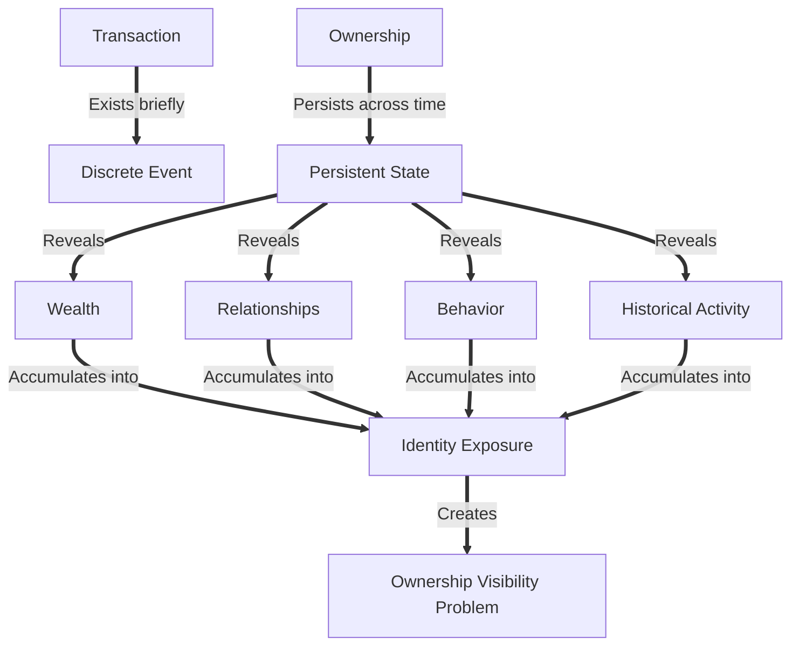
```mermaid
flowchart TD

    T["Transaction"]
        ==>|"Exists briefly"| TE["Discrete Event"]

    O["Ownership"]
        ==>|"Persists across time"| PS["Persistent State"]

    PS ==>|"Reveals"| W["Wealth"]
    PS ==>|"Reveals"| R["Relationships"]
    PS ==>|"Reveals"| B["Behavior"]
    PS ==>|"Reveals"| H["Historical Activity"]

    W ==>|"Accumulates into"| ID["Identity Exposure"]
    R ==>|"Accumulates into"| ID
    B ==>|"Accumulates into"| ID
    H ==>|"Accumulates into"| ID

    ID ==>|"Creates"| OP["Ownership Visibility Problem"]
```

While transactions occur momentarily, ownership persists across every block, every interaction, and every asset held by an address. As a result, ownership becomes a long-lived source of information that continuously leaks data about the user.

When an observer identifies an address, they can often determine:

* What assets the address owns
* How much value it controls
* Who it interacts with
* How its holdings evolve over time
* Which actions represent payments versus internal transfers

This information remains available indefinitely and accumulates throughout the lifetime of the address.

Consequently, the privacy problem extends beyond individual transactions. Even if specific transfers were partially obscured, persistent ownership would continue to reveal relationships, balances, behavioral patterns, and financial history.

GhostShard therefore approaches privacy from a different perspective. Rather than attempting to conceal individual transactions, it seeks to reduce the visibility and persistence of ownership itself.

The remainder of this chapter explores how this observation leads to an ownership-centric privacy model based on disposable ownership, shards, mesh transactions, and ownership ambiguity.
## 2.2 Why Ownership Topology?

### What Information Does Ownership Reveal?

On a transparent ledger, ownership is not a single fact. It is a composite of multiple information leaks, each of which can independently compromise privacy.

**Wealth.** The aggregate value of assets held by an address reveals a user's financial position. Once an address is associated with an identity, an observer can immediately determine balances, portfolio composition, and changes in wealth over time.

**Relationships.** Every transaction from address A to address B reveals a relationship. Not merely that value was transferred, but that two parties chose to interact. Over time, the transaction graph becomes a social graph, exposing business partnerships, organizational structures, personal relationships, and networks of influence.

**Behavior.** Transaction frequency, timing patterns, gas price preferences, and contract interaction habits form a behavioral fingerprint. An observer can infer when a user is active, which protocols they prefer, how sophisticated they are, and whether they are operating manually or through automation. Similar behavioral patterns can be used to cluster otherwise unrelated addresses.

**Intent.** The assets an address chooses to hold reveal information about its objectives and preferences. Governance tokens signal participation in a protocol. NFTs signal community membership or cultural affiliation. Stablecoin-heavy portfolios may indicate different risk preferences than portfolios dominated by volatile assets. Ownership becomes a behavioral profile.

**Network Position.** An address's location within the transaction graph reveals structural importance. Its centrality, connectivity, and role within liquidity or payment networks can indicate influence far beyond the value of its holdings. A large holder is not merely wealthy; it may be systemically significant.

Collectively, these information leaks transform ownership into a persistent identity layer. The observer learns not only what assets exist, but who likely controls them, how they are used, and how they relate to the broader network.

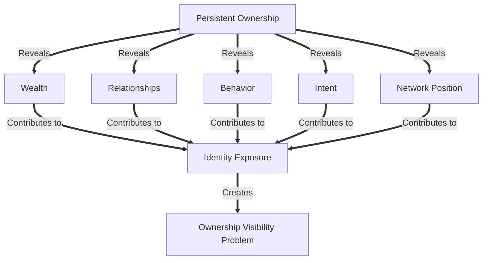
```mermaid
flowchart TD

    O["Persistent Ownership"]

    O ==>|"Reveals"| W["Wealth"]
    O ==>|"Reveals"| R["Relationships"]
    O ==>|"Reveals"| B["Behavior"]
    O ==>|"Reveals"| I["Intent"]
    O ==>|"Reveals"| N["Network Position"]

    W ==>|"Contributes to"| P["Identity Exposure"]
    R ==>|"Contributes to"| P
    B ==>|"Contributes to"| P
    I ==>|"Contributes to"| P
    N ==>|"Contributes to"| P

    P ==>|"Creates"| Q["Ownership Visibility Problem"]
```

### The Fundamental Question

At what layer should privacy operate?

Most existing privacy systems operate at the **transaction layer**:

* **Transaction concealment** (mixers): Hide the relationship between transaction inputs and outputs.
* **Transaction encryption** (shielded systems): Hide transaction contents entirely.
* **Transaction obfuscation** (stealth addresses): Hide specific transaction participants.

Although these approaches differ technically, they share a common assumption: ownership remains persistent while transactions are hidden.

Privacy is therefore applied to what happens *between* ownership states rather than to ownership itself.

### Why Transaction Concealment Is Insufficient

Even a hypothetical system that makes every transaction perfectly untraceable does not solve the ownership problem.

Consider a user whose transactions remain permanently concealed for five years. Every transfer, swap, payment, and interaction is cryptographically hidden. Yet the assets must still exist somewhere on the ledger. They must still be owned.

If those ownership containers are persistent, they become long-lived observation points. A single identity leak—a KYC withdrawal, public donation, exchange interaction, or operational mistake—can attach a real-world identity to that ownership structure.

Once ownership is identified, an observer can often infer wealth, relationships, behavior, and historical activity regardless of how well individual transactions were concealed.

This reveals a fundamental distinction:

* **Transaction privacy protects actions.**
* **Ownership privacy protects identity.**

Actions occur momentarily. Ownership persists.

A transaction exists for a block. Ownership may exist for years.

For this reason, GhostShard treats ownership visibility—not transaction visibility—as the primary privacy problem.

### Why Ownership Topology Is the Correct Abstraction

The key insight is that ownership is not a property of transactions. Ownership is a property of the ledger's topology.

Who owns what is ultimately a question about the structure of the graph rather than any individual edge within it.

GhostShard therefore operates at the ownership layer.

Instead of asking:

> How do we hide this transaction?

GhostShard asks:

> How do we make ownership itself ambiguous?

The answer is **disposable ownership**.

Ownership units should not persist indefinitely. They should exist only long enough to participate in an ownership cycle and then be permanently retired.

Without persistent ownership containers:

* There is no long-lived address to observe.
* There is no stable identity to cluster.
* There is no persistent portfolio to analyze.
* There is no ownership graph to reconstruct over time.

This is not simply a stronger form of transaction privacy. It is a fundamentally different privacy model.

Transaction privacy attempts to hide the edges of the graph.

Ownership privacy changes the graph itself.

Instead of concealing activity between persistent owners, the protocol minimizes the persistence of ownership.

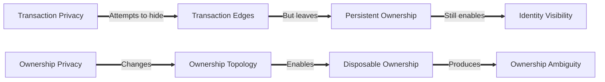
```mermaid
flowchart LR

    TP["Transaction Privacy"]
        ==>|"Attempts to hide"| TE["Transaction Edges"]

    TE ==>|"But leaves"| PO["Persistent Ownership"]

    PO ==>|"Still enables"| IV["Identity Visibility"]

    OP["Ownership Privacy"]
        ==>|"Changes"| OT["Ownership Topology"]

    OT ==>|"Enables"| DO["Disposable Ownership"]

    DO ==>|"Produces"| OA["Ownership Ambiguity"]
```

### Design Outcome

GhostShard adopts privacy through ownership topology.

Rather than concealing transactions, encrypting transaction data, or requiring dedicated privacy environments, the protocol seeks to make ownership itself ambiguous.

This represents a fundamentally different privacy model. Transaction privacy attempts to hide activity occurring within a visible ownership structure. Ownership privacy alters the structure itself.

The result is a system in which transactions may remain fully observable while ownership relationships become difficult to determine. An observer can inspect the ledger, follow every state transition, and verify every transaction, yet still be unable to reliably answer the most important question:

**Who owns what?**
## 2.2b Why Privacy Must Be the Default

The previous section established that privacy should operate at the ownership layer. This section establishes a second requirement:

**Privacy must be the default state, not an optional feature.**

This is not primarily a usability consideration. It is an architectural requirement.

The privacy guarantees provided by GhostShard depend upon every user in the protocol participating in the same ownership model. If privacy were optional, the anonymity set would fragment, ownership patterns would become distinguishable, and the combinatorial ambiguity provided by mesh transactions would weaken significantly.

For this reason, GhostShard is designed around privacy by default.

### What Privacy by Default Means

In GhostShard, privacy is not a mode that users activate.

Every deposit creates one or more shards.

Every spend consumes shards and creates new shards.

Every ownership transition is announced through ERC-5564-compatible announcements containing encrypted metadata.

There is no public mode, private mode, shielded mode, or unshielded mode.

There is only the ownership model.

Privacy is therefore not a feature layered onto the protocol. It is a property of how ownership exists within the protocol.

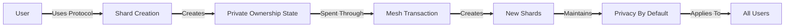
```mermaid
flowchart LR

    U["User"]
        ==>|"Uses Protocol"| S["Shard Creation"]

    S ==>|"Creates"| O["Private Ownership State"]

    O ==>|"Spent Through"| M["Mesh Transaction"]

    M ==>|"Creates"| N["New Shards"]

    N ==>|"Maintains"| P["Privacy By Default"]

    P ==>|"Applies To"| A["All Users"]
```

### Argument 1: The Privacy Set Must Be Everyone

Privacy systems derive strength from the size of the set in which an individual becomes indistinguishable.

If only a small percentage of users choose privacy, then participation in the privacy system becomes a distinguishing signal. The privacy set becomes self-selecting, identifiable, and potentially suspicious.

An observer no longer asks:

> Which user performed this action?

Instead they ask:

> Which user among the small set of privacy users performed this action?

As the privacy set shrinks, anonymity weakens.

GhostShard avoids this problem by making privacy universal. Every participant uses the same ownership model, creating the largest possible anonymity set: the entire user base.

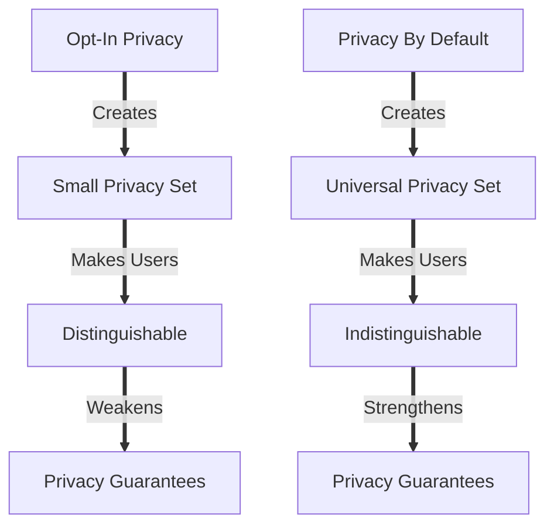
```mermaid
flowchart TD

    A["Opt-In Privacy"]

    A ==>|"Creates"| B["Small Privacy Set"]

    B ==>|"Makes Users"| C["Distinguishable"]

    C ==>|"Weakens"| D["Privacy Guarantees"]

    E["Privacy By Default"]

    E ==>|"Creates"| F["Universal Privacy Set"]

    F ==>|"Makes Users"| G["Indistinguishable"]

    G ==>|"Strengthens"| H["Privacy Guarantees"]
```

### Argument 2: The Opt-In Moment Is a Metadata Leak

Traditional privacy systems require users to perform a visible action to enter the privacy set.

Examples include:

* Depositing into a mixer
* Shielding assets into a privacy pool
* Activating a privacy mode
* Moving funds into specialized privacy infrastructure

Even if subsequent activity is concealed, the entry action remains permanently visible.

The act of choosing privacy becomes observable metadata.

GhostShard eliminates the entry point entirely.

There is no transaction that signals:

> This user is now entering a privacy system.

Users simply interact with the protocol. Every ownership transition follows the same model regardless of intent.

### Argument 3: Regulatory Targeting Requires a Target

Systems that separate public activity from private activity create identifiable regulatory surfaces.

When users explicitly enter a privacy environment, regulators can monitor entry events, track participation, sanction infrastructure providers, or classify participation itself as suspicious behavior.

GhostShard does not create a distinct privacy environment.

There is no privacy pool.

There is no shielding transaction.

There is no transition from public ownership into private ownership.

The ownership model itself is the protocol.

As a result, there is no singular event that identifies a user's decision to seek privacy.

### Argument 4: Defaults Determine Behavior

Most users interact with systems exactly as those systems are presented.

Opt-in privacy requires users to:

* Understand privacy risks
* Navigate additional workflows
* Accept additional complexity
* Pay additional costs
* Make a deliberate decision to become private

Most users will not do this.

This is not irrational behavior. It is normal behavior.

If privacy requires effort, adoption decreases.

If privacy is the default, adoption increases.

Because anonymity depends on participation, privacy systems cannot rely on widespread manual opt-in.

The default must be private.

### Argument 5: Indistinguishability Requires Uniformity

GhostShard's mesh transaction model derives privacy from ambiguity.

When an observer sees multiple inputs and multiple outputs, they cannot reliably determine:

* Which outputs are payments
* Which outputs are change
* Which outputs belong to which participant
* Which ownership transitions represent internal restructuring

This ambiguity emerges from uniform transaction structure.

If some transactions are private while others remain public, observers gain a baseline for comparison. Public transactions leak information that can be used to reduce uncertainty about private transactions.

The anonymity set begins to fragment.

For mesh transactions to achieve their intended privacy properties, all transactions must participate in the same ownership model.

Privacy therefore cannot be an optional mode.

It must be the default state of the system.

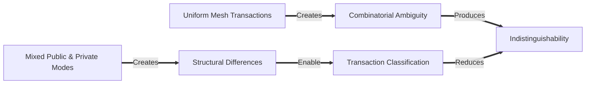
```mermaid
flowchart LR

    A["Uniform Mesh Transactions"]
        ==>|"Creates"| B["Combinatorial Ambiguity"]

    B ==>|"Produces"| C["Indistinguishability"]

    D["Mixed Public & Private Modes"]
        ==>|"Creates"| E["Structural Differences"]

    E ==>|"Enable"| F["Transaction Classification"]

    F ==>|"Reduces"| C
```

### Design Outcome

GhostShard makes privacy the default state of ownership.

There is no privacy toggle, no shielding phase, no opt-in workflow, and no special transaction type that signals a user's desire for privacy.

Every deposit creates shards.

Every spend consumes shards and creates new shards.

Every ownership transition follows the same model.

This is not merely a user-experience decision. It is a structural requirement for maintaining indistinguishability and preserving the combinatorial ambiguity on which GhostShard's privacy model depends.
## 2.3 What Is Disposable Ownership?

The previous sections established two conclusions:

1. Privacy failures on EVM systems are fundamentally ownership failures.
2. Privacy must be the default state of the system rather than an optional mode.

The next question is therefore:

> If ownership visibility is the problem, why not simply hide owners?

The answer is that hiding owners does not eliminate the underlying issue.

The problem is not merely that ownership is visible.

The problem is that ownership is **persistent**.

### Why Persistent Ownership Fails

Persistent ownership continuously accumulates information over time.

Every interaction adds new information to the ownership record:

1. **History Accumulation** — Every transaction contributes to a growing historical record. An address with one hundred transactions reveals significantly more information than an address with one transaction.

2. **Balance Accumulation** — Assets received over time accumulate into visible balances. The balance itself becomes a source of information regarding wealth and economic activity.

3. **Relationship Accumulation** — Every interaction adds edges to a transaction graph. Over time, counterparties, organizations, and social relationships become visible.

4. **Behavioral Accumulation** — Transaction timing, spending frequency, preferred protocols, and usage patterns form recognizable behavioral signatures.

A long-lived ownership container becomes increasingly identifiable simply by existing.

Even if individual transactions were hidden, the ownership structure itself would continue accumulating information.

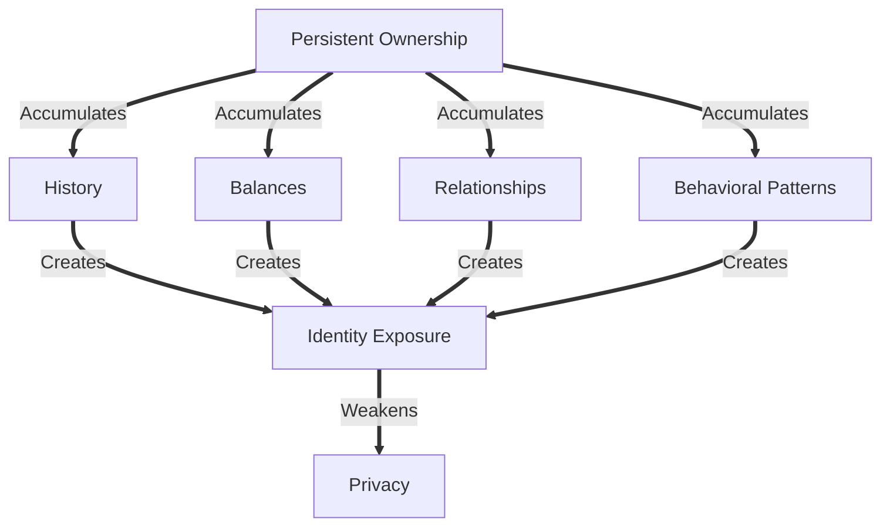
```mermaid
flowchart TD

    P["Persistent Ownership"]

    P ==>|"Accumulates"| H["History"]

    P ==>|"Accumulates"| B["Balances"]

    P ==>|"Accumulates"| R["Relationships"]

    P ==>|"Accumulates"| BP["Behavioral Patterns"]

    H ==>|"Creates"| I["Identity Exposure"]
    B ==>|"Creates"| I
    R ==>|"Creates"| I
    BP ==>|"Creates"| I

    I ==>|"Weakens"| PR["Privacy"]
```

### The Disposable Ownership Insight

The key insight of GhostShard is that ownership does not need to be hidden.

It needs to be **disposable**.

Instead of attempting to conceal a long-lived ownership structure, the protocol eliminates the persistence of ownership itself.

Each ownership unit exists for a single ownership cycle and is then permanently retired.

Because ownership does not persist:

* History does not accumulate.
* Balances do not accumulate.
* Relationship graphs do not accumulate.
* Behavioral signatures do not accumulate.

The ownership container disappears before meaningful information can collect around it.

### What Disposable Ownership Means

A disposable ownership unit follows a simple lifecycle:

1. An ownership unit is created when value is received.
2. The ownership unit temporarily holds that value.
3. The ownership unit is consumed during a spend.
4. The ownership unit is permanently retired.
5. Future ownership is represented by entirely new ownership units.

No ownership unit participates in multiple spending cycles.

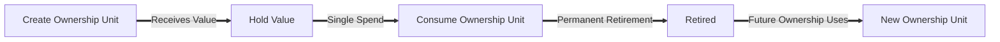
```mermaid
flowchart LR

    C["Create Ownership Unit"]
        ==>|"Receives Value"| H["Hold Value"]

    H ==>|"Single Spend"| S["Consume Ownership Unit"]

    S ==>|"Permanent Retirement"| R["Retired"]

    R ==>|"Future Ownership Uses"| N["New Ownership Unit"]
```

### Why Not Persistent Stealth Accounts?

Stealth addresses improve recipient privacy, but they do not eliminate ownership persistence.

A stealth address that remains active for months or years still accumulates:

* Transaction history
* Asset balances
* Counterparty relationships
* Behavioral signatures

Although the ownership container becomes pseudonymous, it remains persistent.

Eventually, sufficient information accumulates around the address to support clustering and analysis.

GhostShard addresses a different problem.

Rather than obscuring a persistent ownership container, it minimizes the lifetime of the ownership container itself.

### Why Not Note-Based Systems?

Note-based privacy systems hide ownership through encrypted notes and cryptographic commitments.

While powerful, they introduce a separate state-management problem.

Notes must be:

* Created
* Stored
* Tracked
* Proven
* Destroyed

This creates additional lifecycle complexity and introduces its own metadata management requirements.

GhostShard instead adopts a simpler ownership model:

> Receive. Hold. Spend. Retire.

The privacy mechanism emerges from ownership disposal rather than long-lived hidden state.

### Design Outcome

GhostShard adopts disposable ownership.

Assets are held by one-time-use ownership units that participate in exactly one ownership cycle before permanent retirement.

Privacy is achieved not by hiding persistent ownership, but by eliminating ownership persistence itself.

The next question naturally follows:

> If ownership is disposable, what form should these ownership units take?

The answer is introduced in the next section through the concept of **shards**.
## 2.4 How Do We Achieve Disposable Ownership?

The previous section established that ownership should be disposable.

The next question is practical:

> If ownership units are disposable, what form should those ownership units take?

Disposable ownership is a privacy model. To implement that model, the protocol requires a concrete ownership representation.

The representation must satisfy a number of constraints imposed by the EVM itself.

### Requirements for the Ownership Representation

Any ownership representation used by GhostShard must satisfy the following requirements:

1. **Standard EVM Compatibility**

   Ownership units must interact with existing smart contracts without requiring protocol-specific integrations. Assets should remain usable throughout the broader EVM ecosystem.

2. **Independent Ownership**

   Each ownership unit must be independently controllable. Compromise of one ownership unit must not compromise all others.

3. **One-Time Use**

   Ownership units must support the disposable ownership model. After participating in a spend, they must be permanently retired.

4. **Minimal Creation Cost**

   Creating ownership units should be inexpensive enough to support large numbers of units without prohibitive gas costs.

5. **Universal Asset Support**

   The representation must support ETH, ERC-20 tokens, and ERC-721 assets without requiring different ownership models for different asset types.

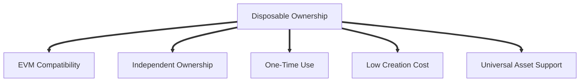
```mermaid
flowchart TD

    A["Disposable Ownership"]

    A ==> B["EVM Compatibility"]
    A ==> C["Independent Ownership"]
    A ==> D["One-Time Use"]
    A ==> E["Low Creation Cost"]
    A ==> F["Universal Asset Support"]
```

### Evaluating Alternative Representations

Several possible ownership representations were considered.

#### Smart Contracts

One option is to represent each ownership unit as an independently deployed smart contract.

While this provides flexibility, it introduces significant drawbacks:

* Contract deployment costs are substantial.
* Large ownership sets become prohibitively expensive.
* Contract bytecode creates protocol-identifiable artifacts.
* Additional deployment transactions increase operational complexity.

The ownership representation becomes visible as a protocol-specific object rather than blending into normal EVM activity.

#### Shielded Notes

Another option is a note-based ownership model similar to shielded systems.

While note systems can provide strong privacy guarantees, they require:

* Specialized state management
* Note creation and destruction logic
* Proof generation infrastructure
* Additional discovery mechanisms
* Restricted interoperability with existing EVM protocols

The resulting architecture becomes significantly more complex than the ownership model requires.

### Why EOA Shards?

GhostShard adopts standard EVM accounts as ownership units.

Each ownership unit is represented by a unique EOA controlled by a unique private key.

This approach satisfies every design requirement:

* **Zero deployment cost** — EOAs require no contract deployment.
* **Native EVM compatibility** — EOAs interact with existing protocols without modification.
* **Independent ownership** — Every shard has independent cryptographic control.
* **Protocol indistinguishability** — Shards appear identical to ordinary EVM accounts.
* **Universal asset support** — ETH, ERC-20, and ERC-721 assets can all be held directly.

Most importantly, EOAs already exist as a fundamental EVM primitive.

Rather than inventing a new ownership container, GhostShard repurposes an existing one.

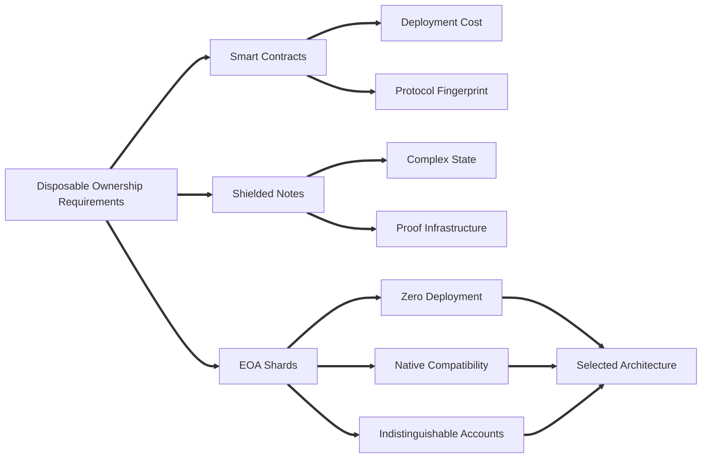
```mermaid
flowchart LR

    A["Disposable Ownership Requirements"]

    A ==> B["Smart Contracts"]
    A ==> C["Shielded Notes"]
    A ==> D["EOA Shards"]

    B ==> E["Deployment Cost"]
    B ==> F["Protocol Fingerprint"]

    C ==> G["Complex State"]
    C ==> H["Proof Infrastructure"]

    D ==> I["Zero Deployment"]
    D ==> J["Native Compatibility"]
    D ==> K["Indistinguishable Accounts"]

    I ==> L["Selected Architecture"]
    J ==> L
    K ==> L
```

### The Shard Lifecycle

A shard progresses through three states during its lifetime.

#### Active

The shard currently holds assets and is available for selection during transaction construction.

At this stage:

* The shard is discoverable by its owner.
* Assets remain under the shard's control.
* The shard can participate in future mesh transactions.

#### Pending

The shard has been selected for spending and a transaction has been submitted.

At this stage:

* The spend has been initiated.
* The transaction has not yet finalized.
* The shard is temporarily unavailable for future selection.

#### Spent

The transaction has finalized successfully.

At this stage:

* The shard is permanently retired.
* Assets are no longer associated with the shard.
* The shard can never be reused.

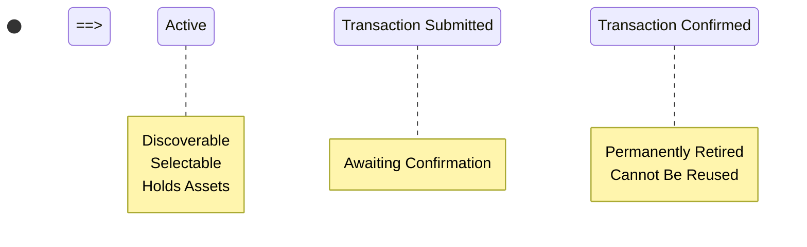
```mermaid
stateDiagram-v2

    [*] ==> Active

    Active ==> Pending : Transaction Submitted

    Pending ==> Spent : Transaction Confirmed

    Spent ==> [*]

    note right of Active
        Discoverable
        Selectable
        Holds Assets
    end note

    note right of Pending
        Awaiting Confirmation
    end note

    note right of Spent
        Permanently Retired
        Cannot Be Reused
    end note
```

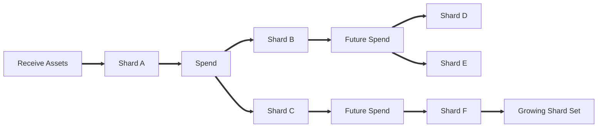
```mermaid
flowchart LR

    A["Receive Assets"]
        ==> B["Shard A"]

    B ==> C["Spend"]

    C ==> D["Shard B"]
    C ==> E["Shard C"]

    D ==> F["Future Spend"]

    F ==> G["Shard D"]
    F ==> H["Shard E"]

    E ==> I["Future Spend"]

    I ==> J["Shard F"]

    J ==> K["Growing Shard Set"]
```

### Design Outcome

GhostShard implements disposable ownership through **EOA shards**.

Each shard represents a one-time-use ownership unit controlled by an independent private key. Shards hold assets, participate in exactly one spending cycle, and are permanently retired after use.

The resulting ownership model achieves disposable ownership using only standard EVM primitives while remaining compatible with existing wallets, assets, and protocols.

However, disposable ownership immediately introduces a new challenge.

If every receipt creates a new shard and every spend retires existing shards while creating replacement shards, ownership naturally fragments over time.

A user who receives many payments may eventually control dozens or even hundreds of independent shards.

While fragmentation improves ownership privacy, it also creates practical challenges for transaction construction, balance management, and asset utilization.

This introduces the next architectural problem:

> How can a system preserve disposable ownership without making fragmented ownership unusable?

The next section examines fragmentation as the first major consequence of disposable ownership and the architectural pressures it creates.
## 2.5 Fragmentation Problem

Shards provide disposable ownership.

However, disposable ownership introduces a new challenge:

> Ownership becomes fragmented across many independent units.

Every deposit creates a new shard. Over time, a user accumulates a growing collection of shards, each holding a portion of their total balance.

A user who receives 100 deposits may eventually own 100 separate shards.

This is not a flaw in the architecture. It is a direct consequence of disposable ownership.

The question becomes:

> How can a system maintain disposable ownership without allowing fragmentation to grow without bound?

### Why Fragmentation Is a Problem

Fragmentation introduces several operational challenges.

#### 1. Gas Cost

Spending from many shards requires processing many inputs.

As shard count increases, transaction construction and execution costs increase approximately linearly with the number of participating shards.

#### 2. Discovery Cost

Each shard must be discovered through announcement scanning, trial decryption, and balance verification.

More shards increase client-side computational requirements.

#### 3. State Growth

The client must maintain metadata for every shard:

* Ownership information
* Asset balances
* Spent status
* Synchronization cursors

Without management, shard state grows indefinitely.

### Fragmentation Growth

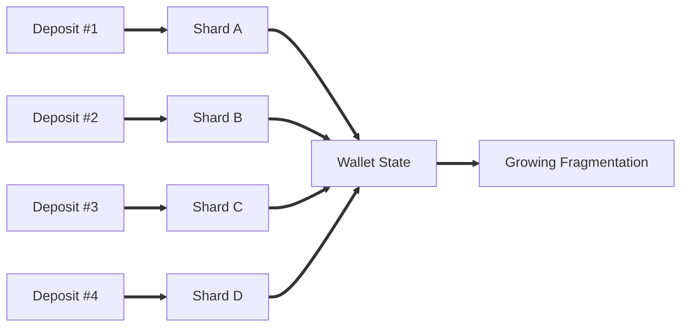
```mermaid
flowchart LR

    D1["Deposit #1"]
        ==> S1["Shard A"]

    D2["Deposit #2"]
        ==> S2["Shard B"]

    D3["Deposit #3"]
        ==> S3["Shard C"]

    D4["Deposit #4"]
        ==> S4["Shard D"]

    S1 ==> W["Wallet State"]
    S2 ==> W
    S3 ==> W
    S4 ==> W

    W ==> F["Growing Fragmentation"]
```

Each deposit increases ownership fragmentation.

Without intervention, wallet complexity grows continuously over time.

---

### The User Intent Execution Problem

Fragmentation creates a deeper problem than state growth.

Consider a user who wants to send:

> 2 ETH to Bob

The wallet may need to combine many shards to satisfy the payment amount.

For example:

```text
Shard A = 0.4 ETH
Shard B = 0.5 ETH
Shard C = 0.3 ETH
Shard D = 0.8 ETH

Total = 2.0 ETH
```

The user's intent is simple:

> Send 2 ETH.

The protocol's ownership model is fragmented:

> Spend four independent ownership units.

These are not the same thing.

The user's intent is singular.

The ownership representation is distributed.

This creates a coordination problem.

If one shard transfer succeeds while another fails, ownership becomes inconsistent.

Some shards may be consumed.

Others may remain unspent.

The intended transfer never completes.

The user's state becomes corrupted.

### Why Partial Execution Is Unacceptable

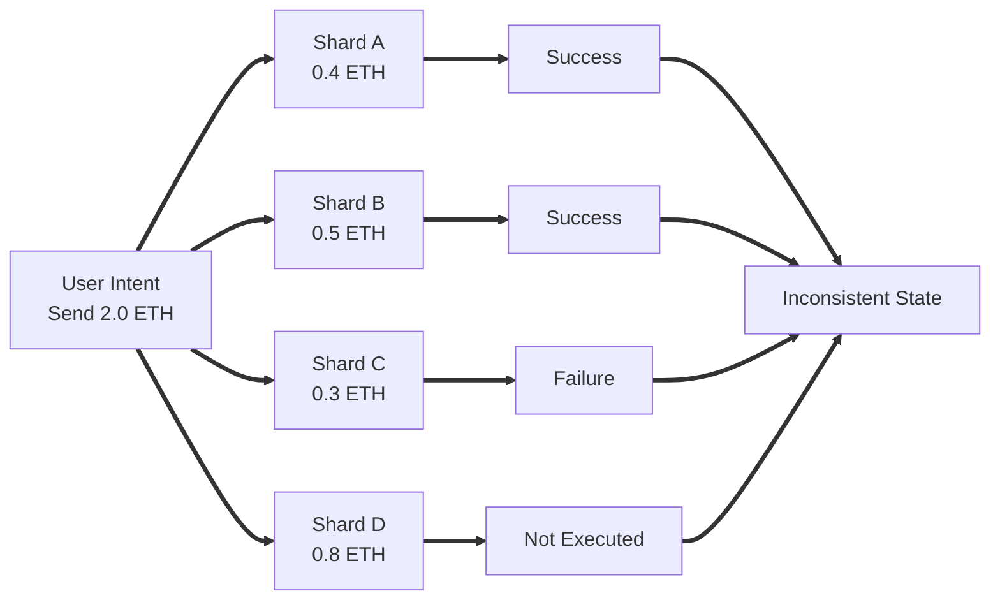
```mermaid
flowchart LR

    U["User Intent<br/>Send 2.0 ETH"]

    U ==> A["Shard A<br/>0.4 ETH"]
    U ==> B["Shard B<br/>0.5 ETH"]
    U ==> C["Shard C<br/>0.3 ETH"]
    U ==> D["Shard D<br/>0.8 ETH"]

    A ==> S1["Success"]
    B ==> S2["Success"]

    C ==> F["Failure"]

    D ==> N["Not Executed"]

    S1 ==> X["Inconsistent State"]
    S2 ==> X
    F ==> X
    N ==> X
```

The user requested one transfer.

The system executed only part of it.

This outcome is worse than complete failure.

Funds become stranded across multiple ownership states and the intended transfer never occurs.

### Architectural Requirement

All shards participating in a transaction must behave as a single unit.

The protocol therefore requires:

> Either every shard transfer succeeds, or none of them succeed.

This is an atomicity requirement.

Not a privacy requirement.

Not a usability requirement.

A correctness requirement.

---

### Solution Part I — Compression

The first solution addresses shard growth.

When constructing a transaction, the wallet selects:

* Required payment shards
* Additional compression shards

Compression shards are included even when they are not strictly necessary for the payment.

The number of compression shards scales with wallet size with a hard cap of 15 to prevent fingerprinting:

```text
extraShards = random(floor(sqrt(walletSize) * 0.8))
```

These shards are consumed alongside the payment and merged into fewer outputs.

Over time:

* Fragmentation decreases
* State growth slows
* Average wallet complexity converges

#### Compression Effect

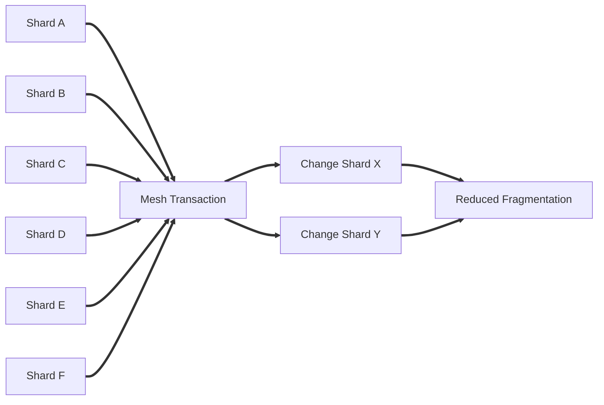
```mermaid
flowchart LR

    A["Shard A"]
    B["Shard B"]
    C["Shard C"]
    D["Shard D"]
    E["Shard E"]
    F["Shard F"]

    A ==> T["Mesh Transaction"]
    B ==> T
    C ==> T
    D ==> T
    E ==> T
    F ==> T

    T ==> G["Change Shard X"]
    T ==> H["Change Shard Y"]

    G ==> R["Reduced Fragmentation"]
    H ==> R
```

Compression continuously converts many shards into fewer shards.

Fragmentation therefore remains bounded rather than growing indefinitely.

---

### Solution Part II — Atomic Execution

Compression solves wallet growth.

It does not solve intent execution.

The second solution is atomic execution.

All shard transfers participating in a transaction execute within a single state transition.

If any transfer fails:

* The transaction reverts.
* All shard state changes roll back.
* No shard is consumed.

The user either receives complete execution or no execution at all.

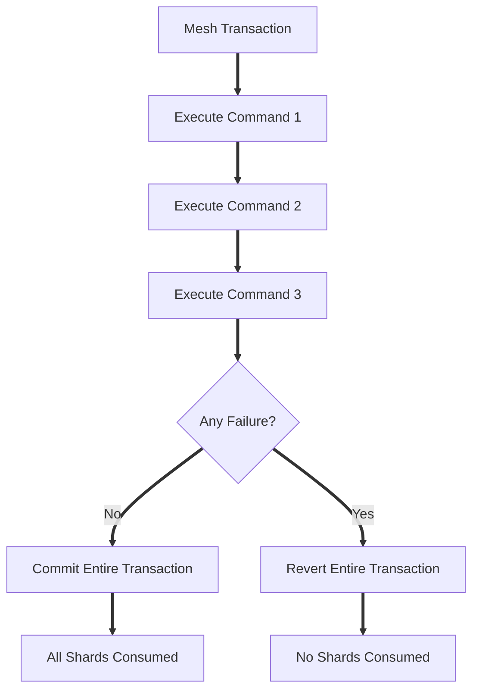
```mermaid
flowchart TD

    A["Mesh Transaction"]

    A ==> B["Execute Command 1"]
    B ==> C["Execute Command 2"]
    C ==> D["Execute Command 3"]

    D ==> E{"Any Failure?"}

    E ==>|No| F["Commit Entire Transaction"]

    E ==>|Yes| G["Revert Entire Transaction"]

    F ==> H["All Shards Consumed"]

    G ==> I["No Shards Consumed"]
```

---

### Why Atomic Execution Requires EIP-7702

Independent EOAs cannot coordinate execution.

Each shard possesses:

* Its own private key
* Its own nonce
* Its own state

Without coordination, multiple shard spends become independent transactions.

Independent transactions cannot provide atomic guarantees.

GhostShard solves this using EIP-7702 delegation.

All participating shards temporarily delegate execution authority to a shared execution environment:

**GhostRouter**.

GhostRouter executes every command within a single execution context.

If any command fails:

* `innerExecuteMesh()` reverts
* All state changes roll back
* Every shard returns to its original state

This transforms many independent ownership units into a single atomic execution unit.

---

### Additional Privacy Benefits

Compression provides privacy benefits beyond state management.

#### Wallet-Size Obfuscation

Because compression shard selection is randomized and scales non-linearly with wallet size, observers cannot reliably infer the number of shards owned by a user from a single transaction.

#### Partial Amount Obfuscation

Compression also obscures transaction amounts.

Observers can see the total value entering a mesh transaction, but cannot immediately determine:

* Which inputs funded the payment
* Which inputs were included solely for compression

Full amount ambiguity emerges only after compression is combined with output scattering (Section 2.7).

---

### Design Outcome

Fragmentation is an unavoidable consequence of disposable ownership.

GhostShard addresses fragmentation through two complementary mechanisms:

1. **Compression**, which continuously reduces shard growth and bounds wallet complexity.
2. **Atomic execution**, which guarantees that all shards participating in a user intent behave as a single execution unit.

The result is a system that preserves disposable ownership while remaining operationally practical.

Ownership may be fragmented.

User intent is not.
## 2.6 How Do We Guarantee One-Time Use?

Shards are designed to be used exactly once. After a shard participates in a mesh transaction, it must never be spendable again.

At first glance this appears straightforward. However, EIP-7702 introduces subtle execution semantics that make one-time-use enforcement significantly more complex than simply checking account state.

The protocol therefore evaluates multiple approaches before selecting a final mechanism.

### The Requirement

A one-time-use guarantee must satisfy four properties:

1. **Correctness**

   A successfully spent shard must never become spendable again.

2. **Retry Safety**

   A failed transaction must not permanently destroy an unspent shard.

3. **Unambiguous State**

   The protocol must be able to determine with certainty whether a shard has been consumed.

4. **Persistence**

   Once a shard is consumed, that state must be permanent and irreversible.

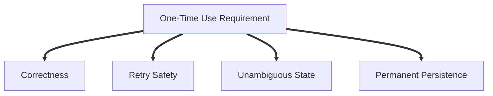
```mermaid
flowchart TD

    A["One-Time Use Requirement"]

    A ==> B["Correctness"]
    A ==> C["Retry Safety"]
    A ==> D["Unambiguous State"]
    A ==> E["Permanent Persistence"]
```

### Approach 1: Check the Shard Nonce

The most obvious solution is to verify that a shard's nonce is zero.

A shard that has already been used would have a nonce greater than zero and therefore be rejected.

#### Why It Fails

Under EIP-7702, authorization processing increments the nonce before transaction execution begins.

This increment occurs regardless of whether execution eventually succeeds or reverts.

Consider the following sequence:

1. Shard nonce is `0`.
2. The shard is included in a mesh transaction.
3. Another operation inside the mesh transaction fails.
4. The entire transaction reverts.
5. The shard nonce is now `1`.
6. The shard was never actually spent.

The shard's assets remain intact, but the nonce now falsely indicates that it has already been consumed.

The shard becomes permanently stranded despite never successfully participating in a transfer.

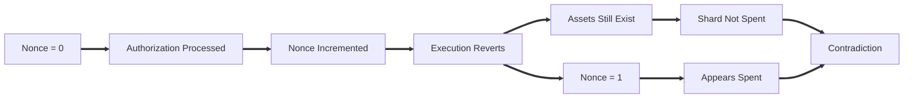
```mermaid
flowchart LR

    A["Nonce = 0"]
        ==> B["Authorization Processed"]

    B ==> C["Nonce Incremented"]

    C ==> D["Execution Reverts"]

    D ==> E["Assets Still Exist"]

    D ==> F["Nonce = 1"]

    E ==> G["Shard Not Spent"]
    F ==> H["Appears Spent"]

    G ==> I["Contradiction"]
    H ==> I
```

The nonce therefore measures **attempted execution**, not **successful consumption**.

For a system that relies on transaction reversion for atomicity, this distinction is fatal.

### Approach 2: Check the Shard Code

A second possibility is to inspect the shard's delegated code.

When EIP-7702 authorization is processed, the shard receives delegated execution code:

```text
0xef0100 || GhostRouter
```

One might attempt to treat the presence of delegated code as evidence that the shard has already been used.

#### Why It Fails

Delegation state is persistent.

The delegated code remains on the account even if execution later reverts.

This creates ambiguity:

1. Authorization is processed.
2. Delegated code is installed.
3. Execution reverts.
4. Delegated code remains.

Later observations cannot distinguish between:

* A shard that was successfully consumed.
* A shard whose transaction reverted.
* A shard that was delegated for some other purpose.

The delegated code only proves that authorization occurred.

It does **not** prove successful consumption.

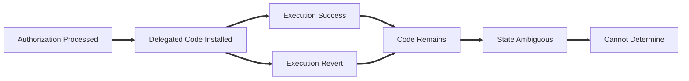
```mermaid
flowchart LR

    A["Authorization Processed"]
        ==> B["Delegated Code Installed"]

    B ==> C["Execution Success"]
    B ==> D["Execution Revert"]

    C ==> E["Code Remains"]
    D ==> E

    E ==> F["State Ambiguous"]

    F ==> G["Cannot Determine"]
```

Code-based detection therefore fails the unambiguous-state requirement.

### Approach 3: On-Chain Spent Tracking

The final approach introduces explicit protocol state.

GhostRouter maintains:

```solidity
mapping(address => bool) public isShardSpent;
```

Before processing a shard:

```solidity
require(!isShardSpent[shard], "ShardAlreadySpent");
```

After successful execution:

```solidity
isShardSpent[shard] = true;
```

The flag is written only during successful mesh execution.

#### Why It Works

Unlike nonce and code inspection, spent tracking records the exact event the protocol cares about:

> Successful shard consumption.

The mapping is:

* Independent of authorization processing.
* Independent of nonce changes.
* Independent of delegated code state.
* Updated only after successful execution.

If execution reverts, the state write reverts as well.

The shard remains spendable.

If execution succeeds, the flag becomes permanently true.

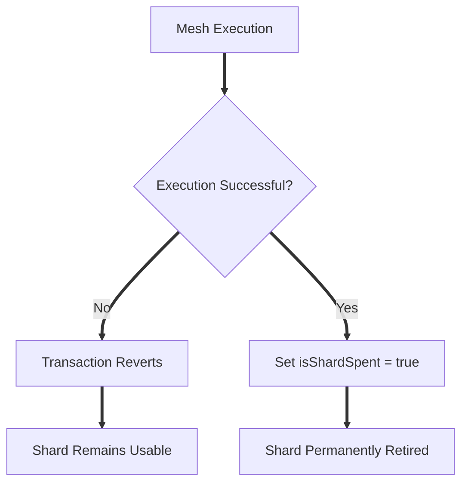
```mermaid
flowchart TD

    A["Mesh Execution"]

    A ==> B{"Execution Successful?"}

    B ==>|No| C["Transaction Reverts"]

    B ==>|Yes| D["Set isShardSpent = true"]

    C ==> E["Shard Remains Usable"]

    D ==> F["Shard Permanently Retired"]
```

### Tradeoff Analysis

The primary drawback is storage cost.

The first write to a new storage slot incurs approximately:

```text
~20,000 gas
```

per shard.

However, this cost is paid exactly once during the shard's lifetime.

The protocol intentionally accepts this overhead because it provides the only mechanism that simultaneously satisfies:

* Correctness
* Retry safety
* Unambiguous state
* Permanent persistence

### Design Outcome

GhostShard guarantees one-time use through explicit on-chain spent tracking.

Neither nonce inspection nor delegated-code inspection can reliably distinguish successful consumption from failed execution under EIP-7702.

Instead, GhostRouter maintains a permanent `isShardSpent` mapping that is updated only after successful execution.

The result is a deterministic and irreversible one-time-use guarantee:

* Unspent shards remain spendable.
* Failed transactions remain retryable.
* Successfully consumed shards can never be reused.

Disposable ownership therefore becomes cryptographically enforceable rather than merely conventional.
## 2.7 Transfer Amount as a Privacy Leak

The previous section established that compression manages fragmentation and that atomic execution preserves user intent.

However, even a perfectly coordinated spend still leaks information.

The remaining problem is **amount visibility**.

### The Amount Privacy Problem

Consider a user who controls two shards:

* Shard A: 1.5 ETH
* Shard B: 1.0 ETH

The user wishes to send 2.0 ETH to a recipient.

The resulting transaction appears as:

* Inputs: 1.5 ETH + 1.0 ETH = 2.5 ETH
* Payment Output: 2.0 ETH
* Change Output: 0.5 ETH

An observer can immediately infer the user's intent.

```mermaid
flowchart LR

    A["Shard A<br/>1.5 ETH"]
    B["Shard B<br/>1.0 ETH"]

    A ==> T["Transaction"]
    B ==> T

    T ==> P["Payment<br/>2.0 ETH"]
    T ==> C["Change<br/>0.5 ETH"]
```

The privacy failure is not ownership.

The privacy failure is arithmetic.

Because the inputs and outputs are deterministic, the payment amount is directly observable.

The observer knows:

* Total value consumed
* Total value returned
* Exact payment amount
* Exact change amount

Ownership may be fragmented, but intent remains visible.

### Why Compression Alone Is Insufficient

Section 2.5 introduced compression shards.

Compression increases ambiguity by adding additional inputs that are not strictly required for the payment.

However, compression alone does not fully solve the amount problem.

Even if ten shards are consumed, an observer can still determine the payment amount whenever the payment output remains distinguishable from change outputs.

Compression obscures the input side.

Amount privacy also requires ambiguity on the output side.

### The Core Insight

Privacy requires **amount ambiguity**.

An observer should be unable to answer three questions:

1. Which outputs represent payment?
2. Which outputs represent change?
3. What amount was actually transferred?

As long as those questions remain unanswered, user intent remains private.

This requires payment and change to become structurally indistinguishable.

### Mesh Transactions

GhostShard achieves amount ambiguity through mesh transactions.

A mesh transaction:

1. Consumes many shards.
2. Produces many shards.
3. Splits value into randomized outputs.
4. Announces all outputs identically.

The result is that value no longer leaves the transaction as a single payment output and a single change output.

Instead, value exits as a collection of indistinguishable ownership units.

```mermaid
flowchart LR

    I1["Input Shard<br/>0.7 ETH"]
    I2["Input Shard<br/>0.5 ETH"]
    I3["Input Shard<br/>0.6 ETH"]
    I4["Input Shard<br/>0.7 ETH"]
    I5["Input Shard<br/>0.4 ETH"]

    I1 ==> M["Mesh Transaction"]
    I2 ==> M
    I3 ==> M
    I4 ==> M
    I5 ==> M

    M ==> O1["Output<br/>0.9 ETH"]
    M ==> O3["Output<br/>0.8 ETH"]
    M ==> O4["Output<br/>0.7 ETH"]
    M ==> O2["Output<br/>0.5 ETH"]
```

The observer sees four outputs totaling 2.9 ETH.

However, the observer cannot determine:

* Which outputs belong to the recipient.
* Which outputs belong to the sender.
* Whether there is one recipient or many.
* Which subset represents the payment.
* Which subset represents change.

Multiple interpretations become simultaneously valid.

```mermaid
flowchart TD

    A["Observed Outputs<br/>0.8 • 0.7 • 0.9 • 0.5"]

    A ==> B["Interpretation 1<br/>Payment = 2.0 ETH"]
    A ==> C["Interpretation 2<br/>Payment = 1.5 ETH"]
    A ==> D["Interpretation 3<br/>Payment = 2.4 ETH"]
    A ==> E["Interpretation 4<br/>Multiple Recipients"]

    B ==> X["Observer Cannot Determine Intent"]
    C ==> X
    D ==> X
    E ==> X
```

The ambiguity is combinatorial.

As the number of outputs increases, the number of valid interpretations grows rapidly.

The observer sees every output but cannot reliably reconstruct intent.

### Why Atomic Execution Matters

The mesh structure alone is insufficient.

If transfers and announcements occur separately, observers can correlate outputs through:

* Block timing
* Transaction ordering
* Gas patterns
* Event sequencing

GhostShard therefore executes the entire mesh atomically.

Inputs are consumed, outputs are created, and announcements are published within a single state transition.

No intermediate state exists for an observer to analyze.

The transaction appears as one indivisible ownership transformation.

---

### 2.7.1 Recipient and Change Ambiguity

Mesh transactions provide more than amount privacy.

They also create **recipient ambiguity**.

Every output produced by a mesh transaction shares the same structure:

* Fresh shard address
* No transaction history
* ERC-5564 announcement
* Encrypted metadata
* Randomized value

From the observer's perspective, every output appears identical.

```mermaid
flowchart TD

    M["Mesh Transaction"]

    M ==> O1["Output 1"]
    M ==> O2["Output 2"]
    M ==> O3["Output 3"]
    M ==> O4["Output 4"]

    O1 ==> Q["?"]
    O2 ==> Q
    O3 ==> Q
    O4 ==> Q

    Q ==> R["Recipient or Change?"]
```

This creates a stronger privacy property than amount ambiguity alone.

The sender's change and the recipient's payment become structurally equivalent.

An observer cannot determine:

* Which outputs belong to the sender.
* Which outputs belong to the recipient.
* How many recipients exist.
* Whether value was split among multiple parties.

The recipient can identify their outputs through trial decryption using their viewing key.

Everyone else sees only a set of indistinguishable ownership units.

#### Design Outcome

GhostShard adopts mesh transactions as the fundamental spending primitive.

A mesh transaction consumes **N** shards, creates **M** shards, and publishes **M** announcements atomically.

Payment and change are both scattered across randomized outputs.

Because every output is structurally identical, observers cannot reliably determine:

* Payment amount
* Change amount
* Recipient count
* Recipient ownership
* Sender ownership

The ledger remains fully transparent.

The ownership relationships embedded within it do not.
## 2.8 Dust Protection

Mesh transactions scatter outputs across multiple shards. This improves amount privacy but introduces a new problem:

**dust shards.**

Because output amounts are randomized, some outputs may receive values so small that spending them later costs more than the value they contain.

A shard may remain perfectly private and technically spendable while being economically irrational to use.

### Example

Consider a mesh transaction that creates four outputs:

| Output  | Amount     |
| ------- | ---------- |
| Shard A | 0.8 ETH    |
| Shard B | 0.7 ETH    |
| Shard C | 0.0001 ETH |
| Shard D | 0.9 ETH    |

The third output may require more gas to spend than the value it contains.

The shard is valid.

The shard is private.

The shard is recoverable.

But spending it would destroy economic value.

This is a dust shard.

---

### Why Dust Matters

Dust is not primarily a privacy problem.

All outputs remain structurally identical:

* Fresh shard addresses
* Fresh announcements
* Encrypted metadata
* Randomized output values

An observer cannot determine which outputs are dust.

The problem is operational.

Over time, dust shards accumulate inside the user's shard store:

* More shards to discover
* More balances to track
* More coin-selection candidates
* More synchronization work

Without protection, the wallet gradually fills with economically unusable ownership units.

---

### Why Dust Cannot Be Eliminated Completely

The root cause is output randomization.

Mesh transactions deliberately avoid deterministic output amounts because deterministic outputs leak payment information.

For example:

```text
2.9 ETH
   ↓
0.8 + 0.7 + 0.9 + 0.5
```

Some randomized distributions will inevitably create very small outputs.

Removing randomness would weaken amount ambiguity and reintroduce payment inference attacks.

Dust prevention must therefore coexist with randomized splitting rather than replace it.

```mermaid
flowchart TD

    A["Amount Ambiguity"]

    A ==> B["Randomized Output Splits"]

    B ==> C["Small Outputs Sometimes Occur"]

    C ==> D["Dust Shards"]

    D ==> E["Economic Problem"]
```

---

### The Fundamental Difficulty

Preventing dust requires answering a deceptively difficult question:

> Is this output worth spending later?

For native assets this is relatively straightforward.

Both the output value and the spending cost are denominated in ETH.

For ERC-20 assets the problem becomes significantly harder.

The output value is denominated in the token.

The spending cost is denominated in ETH.

Determining whether an output is dust therefore requires some method of comparing:

```text
Token Value
      vs
Future Spending Cost
```

This immediately becomes a pricing problem.

The protocol must determine how much of a token is equivalent to the cost of spending that token.

Without a pricing mechanism, there is no reliable way to determine whether a token output is economically recoverable.

```mermaid
flowchart LR

    A["ERC-20 Output"]

    A ==> B["Token Value"]

    C["Future Spend"]

    C ==> D["ETH Gas Cost"]

    B ==> E["Need Exchange Rate"]

    D ==> E

    E ==> F["Dust Decision"]
```

---

### Alternative Designs Considered

#### DEX-Based Pricing

One possibility is querying DEX liquidity directly.

The SDK could estimate:

> How much token T is equivalent to the ETH required to spend token T?

While theoretically accurate, this approach introduces several problems:

* Dependence on external liquidity
* Susceptibility to price manipulation
* Cross-chain implementation complexity
* Increased SDK responsibilities
* Inconsistent behavior during volatile markets

Dust prevention becomes dependent on market infrastructure rather than protocol infrastructure.

---

#### Oracle-Based Pricing

Another possibility is relying on price oracles.

This simplifies valuation but introduces new trust assumptions:

* Oracle availability
* Oracle correctness
* Oracle freshness
* Additional infrastructure dependencies

GhostShard avoids introducing separate oracle dependencies solely for dust estimation.

---

### Why Paymaster Quotes Are the Correct Abstraction

The paymaster already performs economic evaluation.

To sponsor gas using arbitrary assets, the paymaster must determine the relationship between:

* ETH-denominated gas costs
* Asset-denominated payments

The pricing infrastructure therefore already exists.

Rather than introducing separate DEX integrations or oracle dependencies, GhostShard reuses the same economic authority responsible for gas sponsorship.

The SDK can request a quote from the paymaster:

> How much of asset T is required to cover a transfer costing X gas?

The response directly provides the minimum economically meaningful amount for that asset under current conditions.

This makes the paymaster the natural source of truth for dust estimation.

```mermaid
flowchart LR

    A["Transfer Cost"]

    A ==> B["Paymaster Quote"]

    C["Asset T"]

    C ==> B

    B ==> D["Dust Threshold"]

    D ==> E["Output Generation"]
```

---

### GhostShard v0 Approach

GhostShard v0 uses a fixed minimum output threshold.

Outputs below the threshold are not created.

Instead, the value is absorbed into other outputs during the split process.

The fixed threshold prevents obviously uneconomical shards from being generated while avoiding pricing dependencies in the initial implementation.

```mermaid
flowchart TD

    A["Randomized Output Generation"]

    A ==> B{"Output Below Threshold?"}

    B ==>|Yes| C["Merge Into Other Outputs"]

    B ==>|No| D["Create Shard"]

    C ==> E["No Dust Created"]

    D ==> E
```

---

### Limitations of the v0 Approach

A fixed threshold is intentionally conservative.

However:

* Different assets have different transfer costs.
* Different chains have different gas markets.
* Different market conditions affect economic recoverability.

As a result, a threshold that is appropriate for one asset may be inappropriate for another.

The fixed threshold should therefore be viewed as an implementation compromise rather than the final architecture.

---

### Future Direction: Paymaster-Based Dust Estimation

Future GhostShard versions replace the fixed threshold with paymaster-derived dust thresholds.

For assets not yet known to the SDK:

1. The SDK requests a paymaster quote.
2. The paymaster determines the asset cost of spending that asset.
3. The SDK derives a minimum economically recoverable output.
4. Future mesh transactions enforce that threshold.

This allows dust protection to adapt automatically to:

* Asset type
* Chain conditions
* Transfer complexity
* Market pricing

while preserving the privacy guarantees of randomized output generation.

---

### Privacy Considerations

A fixed threshold introduces a recognizable output pattern.

If every transaction enforces the same minimum output value, that value becomes part of a visible fingerprint.

Paymaster-derived thresholds reduce this fingerprint.

Different assets naturally produce different minimum outputs, causing output distributions to more closely resemble ordinary asset transfers.

---

### Design Outcome

Randomized output splitting inevitably creates the possibility of dust.

GhostShard v0 mitigates this through a fixed minimum threshold.

Future versions derive asset-specific thresholds directly from paymaster quotes, reusing the same economic infrastructure already required for gas sponsorship.

This eliminates separate pricing dependencies while ensuring that created shards remain economically recoverable under current market conditions.
## 2.9 How Do We Coordinate Shards Without ETH?

The previous sections established two important properties of the GhostShard architecture:

1. Ownership is distributed across many disposable shards.
2. A user's intent may require spending multiple shards atomically.

This creates a practical challenge.

Shards are created at unpredictable addresses and typically hold no ETH. Yet they must still execute code, authorize transfers, and participate in mesh transactions.

The user cannot simply pre-fund shards with ETH:

* Pre-funding creates additional observable transactions.
* Pre-funding introduces identity-linkage opportunities.
* Shard addresses are derived through ECDH and are not known in advance.

The protocol therefore requires a mechanism for coordinating many independent shards without requiring those shards to maintain ETH balances.

```mermaid
flowchart TD

    A["Disposable Shards"]

    A ==> B["Hold Assets"]

    B ==> C["No ETH Balance"]

    C ==> D["Cannot Pay Gas"]

    D ==> E["Need Sponsored Execution"]

    E ==> F["Need Coordination Layer"]
```

### The Self-Sovereign Ideal

The ideal architecture is fully self-sovereign.

A shard holding assets should be capable of participating in transaction execution without relying on a custody layer, pooled funds, or protocol-controlled asset management.

Using EIP-7702, a shard can temporarily gain smart-contract functionality while retaining its identity as a standard EOA.

In principle, one shard could coordinate the entire transaction:

* Gathering shard authorizations
* Constructing the mesh transaction
* Managing transfer execution
* Returning change
* Coordinating payment delivery

The user's funds effectively manage themselves.

### What Self-Sovereignty Means

Self-sovereignty in GhostShard means that ownership never leaves the user's control.

No protocol contract holds user funds.

No liquidity pool aggregates ownership.

No custodian can freeze, seize, or redirect assets.

All assets remain controlled by user-owned shards throughout the transaction lifecycle.

The supporting infrastructure operates under minimal trust assumptions:

* **Relayer** — may broadcast or refuse to broadcast.
* **Paymaster** — may sponsor or refuse to sponsor.

Neither component can:

* Modify transfers
* Forge ownership
* Create valid shard signatures
* Redirect funds
* Spend assets without authorization

The architecture therefore preserves user custody even when sponsored execution is required.

### The ERC-4337 Path

At first glance, ERC-4337 appears to solve this problem.

ERC-4337 provides:

* Gas sponsorship through paymasters
* Transaction inclusion through bundlers
* Account abstraction infrastructure
* Broad ecosystem compatibility

A shard could use EIP-7702 delegation, behave as a smart account, and submit a UserOperation through the existing ERC-4337 ecosystem.

This would provide sponsored execution while remaining compatible with existing tooling.

### The Limitation

The difficulty arises from the structure of the current ERC-4337 EntryPoint.

Each UserOperation is centered around a single account.

The EntryPoint validation flow accepts a single sender:

```text
validateUserOp(...)
validatePaymasterUserOp(...)
```

Both validation paths assume one account per operation.

There is no mechanism for carrying multiple EOA authorizations inside a single UserOperation.

Importantly, this is not a limitation of account abstraction itself.

It is a limitation of the current ERC-4337 EntryPoint design.

A future EntryPoint could support multi-account authorization models.

The current infrastructure does not.

### Consequence: One UserOp per Shard

If a transaction requires N shards, the user must submit N independent UserOperations.

```mermaid
flowchart LR

    U["User Intent<br/>Spend 10 Shards"]

    U ==> U1["UserOp 1"]
    U ==> U2["UserOp 2"]
    U ==> U3["UserOp 3"]
    U ==> U4["UserOp 4"]
    U ==> UN["UserOp N"]

    U1 ==> EP["ERC-4337 EntryPoint"]
    U2 ==> EP
    U3 ==> EP
    U4 ==> EP
    UN ==> EP
     EP ==> P["Partial Execution Risk"]
```

This immediately introduces two problems.

#### Gas Overhead

Every UserOperation pays EntryPoint overhead.

For large shard sets, overhead grows approximately linearly with shard count.

A transaction involving ten shards incurs the overhead of ten independent UserOperations before any transfer logic executes.

The coordination layer becomes increasingly expensive as shard count increases.

#### Loss of Atomicity

More importantly, atomicity is lost.

The user's intent is no longer represented by a single state transition.

Instead, it is fragmented across multiple independent operations.

Consider a transaction involving three shards:

```mermaid
flowchart LR

    A["User Intent<br/>Send Payment"]

    A ==> B["UserOp 1"]
    A ==> C["UserOp 2"]
    A ==> D["UserOp 3"]

    B ==> E["Success"]
    C ==> E

    D ==> F["Failure"]

    E ==> G["Partial Execution"]

    F ==> G

    G ==> H["Intent Broken"]
```

If UserOperation 3 fails:

* UserOperations 1 and 2 may already have executed.
* Assets may already have moved.
* Remaining operations never execute.
* The user's intended transfer is only partially completed.

This recreates the same user-intent execution problem identified in Section 2.5.

The architecture requires all participating shards to succeed together or fail together.

The current ERC-4337 model cannot provide this property.

### Native Multi-Authorization with EIP-7702

EIP-7702 provides a different execution model.

A single type-4 transaction can carry multiple shard authorizations simultaneously.

Rather than creating N UserOperations, the transaction carries N authorizations directly.

All shards delegate into a shared execution context.

Execution occurs once.

Validation occurs once.

Atomicity is preserved.

```mermaid
flowchart LR

    S1["Shard 1"]
    S2["Shard 2"]
    S3["Shard 3"]
    SN["Shard N"]

    S1 ==> T["Single Type-4 Transaction"]
    S2 ==> T
    S3 ==> T
    SN ==> T

    T ==> R["Relayer Broadcast"]

    R ==> A["Sponsored Gas"]

    A ==> P["GhostRouter"]

    P ==> B["Atomic Execution"]
```

### The GhostShard Coordination Model

GhostShard adopts a custom coordination layer built around EIP-7702's native multi-authorization capability.

The architecture combines:

* Multi-shard authorization through EIP-7702
* Sponsored execution through a paymaster
* Transaction broadcasting through a relayer
* Atomic execution through GhostRouter

Rather than coordinating many independent UserOperations, all shard authorizations are executed inside a single transaction.

If any transfer fails:

* Execution reverts.
* State rolls back.
* No shard is partially consumed.
* No ownership becomes stranded.

The user's intent succeeds completely or not at all.

### Design Outcome

The fragmentation problem established that a user's intent may span many disposable shards and therefore requires atomic execution.

This section explains how that atomicity is achieved despite shards holding no ETH and existing as independent EOAs.

GhostShard combines EIP-7702 multi-authorization, sponsored execution, and a custom relayer architecture to allow many disposable ownership units to behave as a single coherent actor.

The result is self-sovereign fund management with minimal trust assumptions, low coordination overhead, and full atomic execution across all participating shards.
## 2.10 How Do We Verify and Execute Gas Sponsorship?

Shards are intentionally created without ETH.

This improves ownership privacy because users never need to fund newly created shard addresses directly. However, it introduces an immediate execution problem:

> How can a shard execute transactions if it cannot pay gas?

GhostShard solves this through sponsored execution.

A paymaster agrees to cover transaction costs, a relayer broadcasts the transaction, and GhostRouter enforces settlement rules that guarantee both parties are treated fairly.

The challenge is not simply paying gas.

The challenge is ensuring that:

* The paymaster cannot be overcharged.
* The relayer cannot be underpaid.
* The user cannot forge sponsorship approval.
* The router can verify sponsorship entirely on-chain.

This section describes how GhostShard achieves those guarantees.

---

### Participants

Gas sponsorship involves three actors:

#### User

Constructs the mesh transaction and obtains a sponsorship quote.

The user never pays ETH directly from participating shards.

#### Paymaster

Computes gas limits, approves sponsorship, and provides the economic backing for execution.

The paymaster maintains an ETH deposit inside GhostRouter.

#### Relayer

Broadcasts the transaction to the network and receives reimbursement after execution.

The relayer temporarily fronts gas costs and is compensated through post-execution reconciliation.

```mermaid
flowchart LR

    U["User"]
    P["Paymaster"]
    R["Relayer"]
    G["GhostRouter"]

    U ==>|"Request Quote"| P

    P ==>|"Signed Sponsorship"| U

    U ==>|"Mesh Transaction"| R

    R ==>|"Broadcast"| G

    G ==>|"Gas Reimbursement"| R

    G ==>|"Deposit Settlement"| P
```

---

### Sponsorship Approval

Before execution, the paymaster performs gas estimation using the Double Simulation process described in Chapter 9.

From this simulation the paymaster derives:

* Verification gas limit
* Execution gas limit
* Pre-verification gas
* Expiration timestamp

The paymaster then signs a commitment covering the entire transaction context.

The commitment binds sponsorship approval to a specific transaction and prevents modification after signing.

```solidity
paymasterHash = keccak256(
    abi.encode(
        block.chainid,
        address(this),
        keccak256(abi.encode(commands)),
        keccak256(abi.encode(announcements)),
        validUntil,
        keccak256(abi.encode(limits))
    )
);
```

The signed payload commits to:

* The chain
* The GhostRouter instance
* The transfer commands
* The announcement set
* The expiration window
* The approved gas limits

Any modification changes the hash and invalidates the signature.

```mermaid
flowchart TD

    A["Commands"]
    B["Announcements"]
    C["Gas Limits"]
    D["Expiry"]
    E["Chain Context"]

    A ==> H["paymasterHash"]
    B ==> H
    C ==> H
    D ==> H
    E ==> H

    H ==> S["Paymaster Signature"]
```

---

### On-Chain Verification

When `executeMesh()` is called, GhostRouter reconstructs the sponsorship hash from the submitted transaction parameters.

The router then:

1. Rebuilds the hash.
2. Applies the EIP-191 message prefix.
3. Recovers the signer.
4. Verifies the signer matches the configured paymaster.
5. Verifies the sponsorship has not expired.

Conceptually:

```solidity
ethHash = toEthSignedMessageHash(paymasterHash);

signer = ECDSA.recover(
    ethHash,
    paymasterSignature
);

require(signer = paymaster);
require(block.timestamp <= validUntil);
```

If either check fails, execution terminates before any asset movement occurs.

This ensures sponsorship cannot be forged, replayed outside its validity window, or modified after approval.

---

### Prefund Reservation

Before executing any mesh commands, GhostRouter reserves the maximum approved gas budget.

The reservation is computed as:

```solidity
prefund =
    (
        verificationGasLimit +
        callGasLimit +
        preVerificationGas
    ) * tx.gasprice;
```

The router verifies that the paymaster has sufficient deposited funds.

```solidity
require(
    paymasterDeposits[paymaster] >= prefund
);
```

The prefund amount is then temporarily deducted.

```solidity
paymasterDeposits[paymaster] -= prefund;
```

This guarantees that reimbursement funds already exist before execution begins.

```mermaid
flowchart LR

    P["Paymaster Deposit"]

    P ==>|"Reserve Prefund"| R["Execution Budget"]

    R ==>|"Execute Mesh"| E["Mesh Execution"]

    E ==>|"Reconcile"| F["Final Settlement"]
```

---

### Gas Reconciliation

After execution completes, GhostRouter calculates actual gas consumption.

Conceptually:

```solidity
totalGasUsed =
    startGas -
    gasleft() +
    POST_EXECUTION_OVERHEAD +
    preVerificationGas;
```

The final charge is capped by the previously approved prefund amount.

```solidity
totalGasCost =
    min(
        totalGasUsed * tx.gasprice,
        prefund
    );
```

Any unused portion is returned to the paymaster.

```solidity
paymasterDeposits[paymaster]
    += (prefund - totalGasCost);
```

The relayer receives reimbursement for actual execution cost.

```solidity
msg.sender.call{
    value: totalGasCost
}("");
```

This creates a bounded-loss system:

* The paymaster cannot lose more than the approved prefund.
* The relayer cannot receive less than the measured execution cost.
* The user cannot manipulate reimbursement calculations.

```mermaid
flowchart TD

    A["Prefund Reserved"]

    A ==> B["Execute Transaction"]

    B ==> C["Measure Actual Gas"]

    C ==> D["Compute Cost"]

    D ==> E["Refund Surplus To Paymaster"]

    D ==> F["Pay Relayer"]
```

---

### Relayer Self-Protection

The relayer does not blindly trust the paymaster's quote.

Before broadcasting, the relayer independently performs Double Simulation.

The simulated gas requirements are compared against the paymaster's signed limits.

If the quote appears underfunded, the relayer rejects the transaction.

This protects relayers from consistently broadcasting transactions that reimburse less than actual execution cost.

As a result:

* Paymasters verify transaction cost.
* Relayers verify paymaster estimates.
* GhostRouter verifies both.

No participant is required to trust the others blindly.

---

### Incentive Alignment

The sponsorship system is designed so that every participant acts in its own economic interest while preserving correct execution.

| Participant | Goal                | Protection                             |
| ----------- | ------------------- | -------------------------------------- |
| User        | Execute without ETH | Sponsored execution                    |
| Paymaster   | Avoid overpayment   | Signed limits + prefund cap            |
| Relayer     | Avoid losses        | Independent simulation + reimbursement |
| Router      | Enforce correctness | On-chain verification                  |

The system therefore achieves gas sponsorship through verification rather than trust.

---

### Design Outcome

GhostShard enables ETH-less shard execution through a sponsorship model built around signed approvals, prefunded deposits, and post-execution reconciliation.

The paymaster authorizes a bounded execution budget. GhostRouter verifies that authorization on-chain, reserves the approved funds, executes the mesh transaction, and reconciles actual gas usage after completion. Relayers independently verify quotes before broadcasting, ensuring they are not exposed to systematic losses.

The result is a trust-minimized sponsorship architecture in which shards can execute transactions without holding ETH while preserving economic safety for users, paymasters, and relayers.
## 2.11 How Do We Enable ERC-20 Gas Sponsorship?

GhostShard v0 implements **ETH-based gas sponsorship only**.

Paymasters maintain ETH deposits inside GhostRouter, sponsorship approvals are signed off-chain, and execution costs are settled through ETH-based gas reconciliation.

This design keeps the initial architecture simple while validating the core sponsorship model.

However, many users may hold only ERC-20 assets and no ETH.

Supporting gas payments directly from ERC-20 balances is therefore a natural extension of the protocol.

The challenge is that gas is ultimately paid in ETH, while the user wishes to pay using a different asset.

This introduces an additional pricing and settlement layer that does not exist in the ETH sponsorship model.

---

### The Pricing Problem

ETH sponsorship is straightforward because both costs and settlement occur in the same asset.

ERC-20 sponsorship is different.

The protocol must answer a fundamental question:

> How many units of token T are equivalent to the ETH required to execute this transaction?

This requires an exchange rate between ETH and the selected ERC-20 token.

GhostShard's proposed approach is a paymaster-signed quote.

The paymaster provides a signed statement specifying:

* The token being accepted
* The ETH-to-token conversion rate
* The quote expiration timestamp

Conceptually:

```text
1 ETH = X TOKEN T
Valid Until = Timestamp
```

The quote is signed by the paymaster and included as part of the transaction context.

This allows the router to convert ETH-denominated gas costs into token-denominated settlement amounts.

```mermaid
flowchart LR

    A["Gas Cost (ETH)"]

    B["Paymaster Quote"]

    A ==> C["ETH → Token Conversion"]

    B ==> C

    C ==> D["ERC-20 Settlement"]
```

---

### Quote Verification

Execution follows the same trust-minimized model used for ETH sponsorship.

The router reconstructs the quote payload, verifies the paymaster signature, and validates the expiration window.

Only quotes signed by an approved paymaster are accepted.

This ensures that users cannot fabricate exchange rates and relayers cannot modify settlement terms.

The paymaster remains fully responsible for determining the quoted conversion rate.

---

### ERC-20 Prefunding

Once a quote is verified, the router can calculate the maximum ERC-20 amount required to cover execution.

Conceptually:

```text
Maximum Token Cost
    =
Maximum ETH Cost
    ×
Quoted Exchange Rate
```

The corresponding token amount is reserved before execution begins.

This reservation serves the same purpose as ETH prefunding in the v0 architecture:

* Relayers receive guaranteed reimbursement.
* Users cannot spend the same funds twice.
* Paymasters can bound their economic exposure.

---

### The Remaining Funds Problem

Unlike ETH sponsorship, ERC-20 sponsorship introduces a new challenge.

The exact execution cost is unknown before execution begins.

As a result, the prefunded token amount must exceed the expected cost.

After reconciliation, excess tokens remain.

Those excess tokens must be returned to the user.

The question is:

> Where should they go?

This turns out to be surprisingly difficult.

---

### Option 1: Dedicated Gas Shards

One approach is to create a dedicated shard specifically for gas refunds.

Unused tokens would be transferred to this shard after reconciliation.

```mermaid
flowchart LR

    A["ERC-20 Prefund"]

    A ==> B["Execution"]

    B ==> C["Unused Tokens"]

    C ==> D["Gas Refund Shard"]
```

This approach preserves ownership of the excess funds but introduces several drawbacks:

* Additional shard management complexity
* Extra state growth
* Additional discovery overhead
* Potential linkage opportunities if refund shards are reused incorrectly

The refund mechanism itself becomes part of the ownership graph.

---

### Option 2: Sweep Back to a Spent Shard

Another possibility is returning excess funds to one of the shards consumed during execution.

The user already possesses the shard's private key and can theoretically recover the funds later.

```mermaid
flowchart LR

    A["ERC-20 Prefund"]

    A ==> B["Execution"]

    B ==> C["Unused Tokens"]

    C ==> D["Previously Spent Shard"]
```

This approach avoids creating additional ownership structures.

However, it introduces different tradeoffs:

* Recovery becomes an off-protocol operation.
* Small residual balances may be uneconomical to recover.
* Accurate gas estimation becomes more important.
* Excessive overestimation can strand value.

The economic cost of estimation error is shifted toward the user.

---

### Why This Remains Open Research

Both approaches solve part of the problem.

Neither solves it completely.

Dedicated refund shards preserve protocol-native recovery but increase complexity.

Spent-shard recovery simplifies protocol state but increases reliance on estimation accuracy.

Additional designs are possible, including:

* Dynamic refund shards
* Refund pools
* Deferred settlement models
* Hybrid approaches

Each introduces different privacy, complexity, and economic tradeoffs.

The optimal design remains an open research question.

---

### Current Status

GhostShard v0 deliberately avoids this complexity.

The current implementation supports:

* Paymaster verification
* ETH sponsorship
* Deposit prefunding
* Gas reconciliation
* Relayer reimbursement

ERC-20 gas sponsorship is not part of the v0 protocol.

The architecture described in this section represents a future extension rather than a deployed component.

---

### Design Outcome

GhostShard v0 implements gas sponsorship exclusively through ETH-backed paymaster deposits.

ERC-20 sponsorship introduces additional pricing and settlement challenges because transaction costs are denominated in ETH while user balances are denominated in arbitrary tokens.

The protocol's proposed approach uses paymaster-signed exchange-rate quotes and token-based prefunding. However, the problem of returning excess funds without introducing complexity, economic inefficiency, or privacy leakage remains unresolved.

ERC-20 gas sponsorship therefore remains future work and is intentionally excluded from the v0 implementation.
## 2.12 Announcement and Discovery

The previous sections established how ownership is created, fragmented, compressed, transferred, and coordinated.

A mesh transaction consumes existing shards and creates new shards.

This naturally raises two questions:

> How are receiving shards determined?

> How do recipients discover which shards belong to them?

These questions are fundamental.

GhostShard's ownership model requires **permissionless ownership transfer**.

A sender must be able to create ownership units for a recipient:

* Without prior coordination
* Without requiring the recipient to be online
* Without revealing the recipient's ownership publicly

At the same time, recipients must be able to discover newly received shards without exposing their ownership graph to observers.

The protocol therefore requires a discovery mechanism that satisfies three properties:

1. Anyone can send ownership units to a recipient.
2. Only the intended recipient can identify those ownership units.
3. Discovery does not reveal ownership to external observers.

---

### Meta-Addresses

Before a sender can create receiving shards, it must have a way to reference the recipient without learning or reusing the recipient's actual ownership addresses.

GhostShard solves this using **ERC-5564 meta-addresses**.

A meta-address is a public receiving identifier that allows anyone to derive receiving shards for a recipient without learning the recipient's ownership graph.

Importantly, a meta-address is **not** an ownership address.

It never directly holds assets.

Instead, it acts as a reusable destination from which fresh receiving shards can be derived.

```mermaid
flowchart LR

    A["Recipient"]

    A ==> B["Meta-Address"]

    C["Sender"]

    C ==> B

    B ==> D["Fresh Receiving Shard"]

    D ==> E["Ownership Transfer"]
```

A recipient may publish a meta-address through:

* Direct communication
* Application-level contact sharing
* QR codes
* An ERC-ERC6538 registry

The mechanism used to derive receiving shards from a meta-address is discussed in Chapter 4.

For the purposes of this chapter, the important observation is architectural:

> Meta-addresses allow recipients to expose a stable receiving identifier without exposing ownership addresses.

---

### Receiving Shards

GhostShard uses ERC-5564 as its ownership announcement and discovery mechanism.

When constructing a mesh transaction, the sender uses the recipient's meta-address to derive one or more receiving shards.

The recipient does not need to pre-generate receiving addresses, remain online, or participate in the transaction.

Ownership can therefore be transferred permissionlessly.

```mermaid
flowchart LR

    A["Sender"]

    B["Recipient Meta-Address"]

    A ==> B

    B ==> C["Create Receiving Shards"]

    C ==> D["Mesh Transaction"]

    D ==> E["Recipient Offline or Online"]
```

The mechanism used to derive receiving shards is defined by ERC-5564 and discussed in detail in Chapter 4.

For the purposes of this chapter, the important observation is architectural:

> Receiving ownership can be created without prior interaction between sender and recipient.

---

### Announcements

Creating a shard alone is insufficient.

The recipient must also learn that the shard exists.

GhostShard therefore publishes ERC-5564 announcements alongside mesh transaction outputs.

Announcements serve as ownership discovery signals.

They allow recipients to identify newly received ownership units without revealing ownership publicly.

Observers can see that announcements exist.

They cannot determine:

* Who the intended recipient is.
* Which shard belongs to which recipient.
* Whether a particular recipient owns any output at all.

```mermaid
flowchart LR

    A["Mesh Transaction"]

    A ==> B["Create Output Shards"]

    A ==> C["Publish ERC-5564 Announcements"]

    B ==> D["Public Blockchain"]

    C ==> D
```

The exact announcement format, encryption scheme, and key derivation process are discussed later in Chapter 4.

---

### Discovery

Recipients discover ownership by scanning announcements and applying the ERC-5564 discovery process.

Successful discovery reveals ownership information to the intended recipient.

Unsuccessful discovery reveals nothing.

From an external observer's perspective, all announcements appear identical.

The observer can see that discovery is possible.

They cannot determine who successfully discovered ownership.

```mermaid
flowchart LR

    A["Announcements"]

    A ==> B["Recipient Scan"]

    B ==> C["ERC-5564 Discovery"]

    C ==> D["Owned Shards"]

    D ==> E["Local Shard Store"]
```

The cryptographic mechanisms that make this possible are examined in Chapter 4.

This chapter focuses only on the architectural role of discovery within the ownership lifecycle.

---

### Architectural Significance

Announcements complete the disposable ownership model.

Without meta-addresses, senders would have no way to derive receiving ownership.

Without announcements, ownership could be transferred but not discovered.

Without discovery, ownership would exist but be unusable.

Together, meta-addresses and announcements provide the missing link between ownership creation and ownership utilization.

```mermaid
flowchart LR

    A["Meta-Address"]

    A ==> B["Create Receiving Shard"]

    B ==> C["Publish Announcement"]

    C ==> D["Recipient Discovery"]

    D ==> E["Shard Available"]

    E ==> F["Future Mesh Spend"]

    F ==> G["Shard Retired"]
```

The important observation is architectural:

> Ownership can be transferred permissionlessly while remaining discoverable only by the intended recipient.

A shard can now be created, transferred, discovered, spent, and retired without exposing persistent ownership relationships on-chain.

This completes the ownership lifecycle.

The cryptographic foundations that make announcement and discovery possible are deferred to Chapter 4.

The next question naturally follows:

> If ownership remains private by default, how can users selectively prove ownership when required?

The answer leads directly to the selective disclosure model.
## 2.13 Selective Disclosure and Compliance

Privacy and compliance are often presented as opposing goals.

GhostShard rejects this assumption.

The objective of privacy is not to make information impossible to reveal.

The objective is to ensure that information is revealed **only when the owner chooses to reveal it**.

This distinction is critical for institutional adoption.

Organizations must regularly demonstrate compliance with tax authorities, auditors, regulators, counterparties, and internal governance processes.

A privacy system that prevents disclosure entirely is unusable for institutional finance.

A privacy system that exposes everything by default is incompatible with financial confidentiality.

GhostShard therefore adopts a model of **selective disclosure**:

> Reveal exactly what is required, and nothing more.

---

### The Compliance Problem

Institutions frequently need to prove that specific transfers occurred.

Examples include:

* Vendor payments
* Payroll distributions
* Treasury operations
* Tax reporting
* Regulatory investigations
* Financial audits

In a transparent blockchain system, proving a transfer is trivial because the transaction is publicly visible.

In a privacy-preserving system, the transaction is intentionally hidden.

This creates a new requirement:

> How can a user prove a transaction without exposing their entire financial history?

GhostShard addresses this through layered disclosure mechanisms.

---

### Disclosure Granularity

Not all compliance requirements require the same level of visibility.

Different situations require different disclosure scopes.

```mermaid
flowchart TD

    A["Selective Disclosure"]

    A ==> B["Single Transfer"]

    A ==> C["Bounded Transaction Set"]

    A ==> D["Full History"]

    B ==> E["Vendor Payment"]
    C ==> F["Audit Sample"]
    D ==> G["Regulatory Investigation"]
```

The goal is always to disclose the smallest amount of information necessary.

---

### Level 1: Transaction-Level Disclosure

The default disclosure mechanism in GhostShard v0 is transaction-level disclosure.

A user can prove a specific transfer without revealing unrelated activity.

The proof reveals only the information associated with the transfer being examined.

For example:

* Asset type
* Amount
* Timestamp
* Recipient relationship
* Relevant announcement data

All unrelated shards remain private.

All unrelated balances remain private.

All future activity remains private.

```mermaid
flowchart LR

    A["Wallet History"]

    A ==> B["Transfer A"]
    A ==> C["Transfer B"]
    A ==> D["Transfer C"]
    A ==> E["Transfer D"]

    C ==> F["Disclosed"]

    B ==> G["Private"]
    D ==> G
    E ==> G
```

This represents the preferred disclosure model for most business use cases.

---

### Level 2: Bounded Historical Disclosure

Some compliance scenarios require proving multiple related transactions.

Examples include:

* Quarterly audits
* Treasury reviews
* Counterparty reconciliation
* Internal investigations

In these situations, a user may wish to disclose a specific subset of historical activity without exposing the remainder of their transaction history.

The disclosed set remains bounded and explicitly selected.

Only the chosen transactions become visible.

The rest of the ownership graph remains private.

Future activity remains private.

This capability is a future enhancement and is expected to rely on cryptographic proofs that demonstrate ownership relationships without exposing viewing credentials.

---

### Level 3: Full Historical Disclosure

As a last resort, a user may voluntarily disclose complete wallet history.

This level of disclosure may be appropriate for:

* Regulatory investigations
* Comprehensive audits
* Tax authority reviews
* Legal proceedings

Under full disclosure, an authorized reviewer gains visibility into all discoverable ownership associated with the disclosed wallet.

```mermaid
flowchart LR

    A["Wallet History"]

    A ==> B["Transaction 1"]
    A ==> C["Transaction 2"]
    A ==> D["Transaction 3"]
    A ==> E["Transaction N"]

    B ==> F["Auditor"]
    C ==> F
    D ==> F
    E ==> F
```

Because this disclosure scope is broad and difficult to revoke, it should be treated as an exceptional rather than routine action.

---

### Deterministic Institutional Proofs

Large institutions face a practical challenge when generating transaction proofs.

A payment may need to be verified months or years after it occurred.

Managing large volumes of transaction-specific proof material can become operationally expensive.

GhostShard therefore supports deterministic proof generation from existing business identifiers.

Examples include:

* Invoice identifiers
* Purchase order numbers
* Settlement references
* UUIDs
* Internal payment references

Rather than maintaining separate proof-management infrastructure, institutions can derive proof material from identifiers that already exist within their operational workflows.

```mermaid
flowchart LR

    A["Invoice ID / UUID"]

    A ==> B["Deterministic Derivation"]

    B ==> C["Generate Proof"]

    C ==> D["Auditor Verification"]
```

This reduces operational complexity while preserving the ability to generate localized compliance proofs.

The cryptographic details of deterministic proof generation are discussed in Chapter 4.

For the purposes of this chapter, the important observation is architectural:

> Existing business identifiers can act as anchors for future compliance proofs.

---

### Privacy–Compliance Coexistence

GhostShard does not attempt to eliminate disclosure.

Instead, it transfers control of disclosure from the public blockchain to the asset owner.

The owner decides:

* What is disclosed.
* To whom it is disclosed.
* At what level of granularity disclosure occurs.

Privacy and compliance therefore become complementary rather than contradictory.

Privacy protects information by default.

Compliance reveals information by exception.

---

### Design Outcome

GhostShard adopts a selective disclosure model rather than a transparency model.

Transactions remain private by default, but users retain the ability to disclose information at multiple levels of granularity:

| Disclosure Level  | Scope                    | Typical Use Case                    |
| ----------------- | ------------------------ | ----------------------------------- |
| Transaction-Level | Single transfer          | Vendor payment verification         |
| Bounded History   | Selected transaction set | Audit samples, reconciliation       |
| Full History      | Complete wallet history  | Regulatory review, legal disclosure |

The result is a system that preserves privacy during normal operation while remaining compatible with institutional auditing, reporting, and compliance requirements.
## 2.14 How Do We Privatize NFTs?

NFTs are fundamentally harder to privatize than fungible assets.

Fungible assets can be divided, pooled, merged, compressed, and redistributed across many ownership units.

NFTs cannot.

An NFT exists as a single indivisible token controlled by a single address at any point in time.

This creates a challenge for most privacy systems.

Privacy mechanisms designed for fungible assets typically rely on denomination pools, note systems, or balance aggregation. None of these approaches naturally apply to unique assets.

The question therefore becomes:

> How can ownership of a unique asset be privatized without modifying the NFT itself?

---

### Why Existing Approaches Struggle

Many privacy systems are built around fungibility.

#### Mixers

Mixers rely on identical denominations.

Users deposit assets into a common pool and later withdraw equivalent assets.

This works because one ETH is interchangeable with another ETH.

NFTs are unique.

A CryptoPunk cannot be exchanged for another CryptoPunk without changing the asset itself.

As a result, mixer-based privacy does not naturally extend to NFTs.

---

#### Privacy Pools

Privacy pools represent ownership as fungible notes.

Each note corresponds to some claim on pooled assets.

NFTs do not fit this model because ownership cannot be represented as interchangeable shares.

The NFT must either:

* Remain outside the pool
* Be wrapped into another asset type

Both approaches introduce additional complexity and trust assumptions.

---

#### Zero-Knowledge Ownership Systems

Some privacy systems use zero-knowledge proofs to hide NFT ownership.

These systems can provide strong privacy guarantees but often require:

* Specialized circuits
* Asset-specific logic
* Complex proving systems
* Additional protocol infrastructure

While powerful, they significantly increase implementation complexity.

---

### The GhostShard Observation

GhostShard does not attempt to privatize the NFT itself.

Instead, GhostShard privatizes the **ownership unit** that controls the NFT.

The NFT remains unchanged.

The ERC-721 contract remains unchanged.

The transfer mechanics remain unchanged.

Only ownership attribution changes.

The NFT is held by a shard.

That shard is unlinkable to the owner.

Therefore ownership of the NFT becomes unlinkable.

```mermaid
flowchart LR

    A["NFT #123"] ==> B["Shard Address"]

    B ==> C["Ownership Hidden"]

    C ==> D["Owner Unknown"]
```

This is the same mechanism that privatizes:

* ETH
* ERC-20 tokens
* ERC-721 NFTs

GhostShard introduces no NFT-specific privacy infrastructure.

The shard model already provides the required ownership ambiguity.

---

### Receiving NFTs

NFT transfers follow the same recipient derivation process used for fungible assets.

The sender:

1. Uses the recipient's ERC-5564 meta-address.
2. Derives a shared secret.
3. Derives a receiving shard.
4. Transfers the NFT to that shard.

```mermaid
flowchart LR

    A["Recipient Meta-Address"]

    A ==> B["ECDH Shared Secret"]

    B ==> C["Receiving Shard"]

    C ==> D["Transfer NFT"]
```

The recipient does not need to be online.

No interaction is required.

No receiving address must be pre-generated.

---

### NFT Announcements

After transferring the NFT, the sender publishes an ERC-5564 announcement.

The announcement allows the recipient to discover ownership of the newly created shard.

For NFT transfers:

* `assetType = ERC721`
* `identifier = tokenId`

The token identifier is encoded within the announcement payload.

Only the intended recipient can decrypt and interpret this information.

Observers see the announcement but cannot determine:

* The recipient
* The shard owner
* The decrypted metadata

```mermaid
flowchart LR

    A["NFT Transfer"]

    A ==> B["ERC-5564 Announcement"]

    B ==> C["Recipient Discovery"]

    C ==> D["NFT Shard Recovered"]
```

---

### Discovery

Discovery is identical to the discovery process described in the previous section.

The recipient scans announcements and performs trial decryption.

If the announcement belongs to them:

* The shared secret is recovered.
* The shard address is reconstructed.
* The NFT ownership is added to the shard store.

No NFT-specific discovery logic is required.

The discovery pipeline is entirely asset-agnostic.

```mermaid
flowchart LR

    A["Announcements"]

    A ==> B["Trial Decryption"]

    B ==> C{"Valid?"}

    C ==>|No| D["Ignore"]

    C ==>|Yes| E["Recover NFT Shard"]

    E ==> F["Add To Wallet"]
```

---

### Spending NFTs

NFT transfers are executed through the same mesh transaction mechanism used for fungible assets.

A mesh transaction may contain:

* Native transfers
* ERC-20 transfers
* ERC-721 transfers

within the same atomic execution context.

The NFT transfer is represented as a command executed inside the router's execution sandbox.

If any command fails:

* The NFT transfer reverts.
* All fungible transfers revert.
* All announcements revert.

The entire user intent succeeds or fails as a single unit.

```mermaid
flowchart TD

    A["Mesh Transaction"]

    A ==> B["ERC20 Transfer"]

    A ==> C["NFT Transfer"]

    A ==> D["Announcements"]

    B ==> E["Atomic Execution"]
    C ==> E
    D ==> E

    E ==> F["All Succeed"]

    E ==> G["Or All Revert"]
```

---

### What NFT Privacy Protects

GhostShard provides **ownership privacy**.

GhostShard does not provide **asset invisibility**.

This distinction is important.

The ERC-721 contract remains public.

Anyone can still observe:

* `ownerOf(tokenId)`
* `Transfer(from, to, tokenId)` events
* The token identifier itself

An observer can see that a specific NFT moved between two addresses.

What they cannot determine is:

* Who controls the sending shard
* Who controls the receiving shard
* Whether multiple shards belong to the same user

The NFT remains visible.

The owner becomes ambiguous.

```mermaid
flowchart LR

    A["Observer"]

    A ==> B["Sees NFT #123"]

    B ==> C["Sees Address A -> Address B"]

    C ==> D["Cannot Link Either Address To User"]
```

---

### Limitations

NFT privacy inherits the limitations of public NFT ledgers.

For highly recognizable assets, the token itself may reveal information.

Examples include:

* High-value collectibles
* Rare art NFTs
* Named institutional assets

An observer may know **what** was transferred.

GhostShard only prevents them from knowing **who controls it**.

This is fundamentally different from fungible assets, where both ownership and value can be obscured through output scattering.

---

### Design Outcome

GhostShard does not require special NFT privacy infrastructure.

NFTs are privatized through the same ownership ambiguity that privatizes fungible assets.

An NFT held by a shard is private because the shard itself is unlinkable to its owner.

No wrapping, pooling, note systems, or NFT-specific circuits are required.

The privacy guarantee is ownership ambiguity rather than transaction invisibility.

Observers can see that a particular token moved between two shard addresses, but they cannot determine who controls either address or whether multiple NFT shards belong to the same entity.
## 2.15 Metadata Length Standardization

Section 2.13 introduced **selective disclosure**, where transaction metadata (`senderInfo`) is encrypted within ERC-5564 announcements and can later be revealed to auditors, regulators, or counterparties on a transaction-by-transaction basis.

This capability introduces a subtle privacy challenge.

While the contents of `senderInfo` are encrypted, the **length** of the encrypted payload remains publicly visible on-chain.

If announcement metadata is allowed to vary in size, observers may be able to extract information without decrypting a single byte.

---

### The Metadata Fingerprinting Problem

Mesh transactions rely on structural uniformity.

Every output should appear indistinguishable from every other output.

Observers should not be able to determine:

* Which outputs belong to recipients.
* Which outputs are change.
* Which outputs belong to the same participant.
* Which outputs represent the same type of activity.

However, variable-length encrypted metadata introduces an unintended fingerprint.

Consider two announcements:

| Announcement | Encrypted Metadata Size |
| ------------ | ----------------------- |
| A            | 128 bytes               |
| B            | 340 bytes               |

Even though both payloads are encrypted, the difference in size is observable.

Over time, observers can begin clustering announcements according to metadata length.

This creates a new source of information leakage.

---

### Sources of Length-Based Fingerprinting

#### Sender Fingerprinting

Different institutions often use different metadata formats.

One sender may include only the minimum required information.

Another may include invoice references, payment identifiers, or internal accounting data.

As a result, announcements originating from the same institution may repeatedly produce similar ciphertext lengths.

Observers can gradually construct sender profiles based solely on metadata size.

```mermaid
flowchart LR

    A["Institution A"] ==> B["128 Byte Metadata"]

    C["Institution B"] ==> D["340 Byte Metadata"]

    B ==> E["Observable Pattern"]

    D ==> E
```

---

#### Recipient Fingerprinting

Metadata may also vary according to recipient-specific information.

If certain counterparties consistently receive announcements of similar sizes, observers may be able to group outputs belonging to the same recipient even without identifying them directly.

The metadata remains encrypted.

The structure itself becomes the signal.

---

#### Content Fingerprinting

Different transaction types naturally produce different metadata footprints.

Examples include:

* Simple transfers
* Invoice-linked payments
* NFT transfers
* Multi-asset settlements
* Payments containing memos

Without standardization, these activities can become distinguishable through ciphertext size alone.

```mermaid
flowchart LR

    A["Simple Transfer"]

    B["NFT Transfer"]

    C["Multi-Asset Transfer"]

    D["Invoice Payment"]

    A ==> E["Different Metadata Lengths"]
    B ==> E
    C ==> E
    D ==> E

    E ==> F["Content Classification"]
```

---

### Why This Matters

The privacy of mesh transactions relies heavily on **combinatorial ambiguity**.

With multiple outputs, an observer should face many plausible interpretations of ownership.

The observer should not know which outputs belong to recipients and which belong to change.

If output structures begin to differ, clustering becomes possible.

Outputs that share similar metadata lengths can be grouped together, reducing uncertainty and shrinking the effective anonymity set.

The encrypted contents remain private.

The observable structure becomes the leak.

```mermaid
flowchart TD

    A["Identical Outputs"]

    A ==> B["Large Anonymity Set"]

    C["Variable Metadata Length"]

    C ==> D["Output Clustering"]

    D ==> E["Reduced Anonymity Set"]
```

---

### Standardized Metadata Length

To eliminate this fingerprinting vector, GhostShard standardizes the size of encrypted metadata.

Before encryption, every `senderInfo` payload is padded to a fixed length.

```text
plaintext  = senderInfo || randomPadding

ciphertext = AES-256-GCM(plaintext)
```

Regardless of the actual content:

* Every encrypted metadata blob has the same size.
* Every announcement appears structurally identical.
* Metadata length no longer reveals information about the sender, recipient, or transaction type.

Shorter payloads are padded before encryption.

Payloads that exceed the maximum supported size must be truncated or referenced through external data mechanisms.

```mermaid
flowchart LR

    A["Short Metadata"]

    B["Medium Metadata"]

    C["Long Metadata"]

    A ==> D["Pad To Fixed Length"]
    B ==> D
    C ==> D

    D ==> E["Encrypt"]

    E ==> F["Uniform Ciphertext Size"]
```

---

### Design Properties

Metadata standardization provides several important guarantees:

1. **Sender Independence**
   Different institutions produce indistinguishable announcement sizes.

2. **Recipient Independence**
   Outputs cannot be clustered based on recipient-specific metadata length.

3. **Content Independence**
   Transaction type cannot be inferred from announcement size.

4. **Selective Disclosure Compatibility**
   The internal contents of `senderInfo` remain unchanged and can still be selectively disclosed when required.

5. **Authenticated Encryption Preservation**
   Padding occurs inside the AES-256-GCM authenticated boundary. Any modification to the ciphertext remains detectable.

---

### Cost of Standardization

Standardization increases calldata usage because additional padding bytes must be transmitted.

This introduces a modest gas overhead.

The exact cost depends on:

* The chosen fixed metadata size.
* The number of announcements.
* The deployment environment (L1 versus L2).

The additional cost is generally small relative to the privacy gained.

More importantly, the overhead scales predictably and does not introduce new trust assumptions or protocol complexity.

---

### Design Outcome

Selective disclosure enables institutions to reveal specific transactions without exposing their broader transaction history.

Metadata length standardization ensures that this capability does not create a new fingerprinting vector.

By enforcing a uniform encrypted metadata size across all announcements, GhostShard preserves the structural indistinguishability of mesh transaction outputs and prevents observers from classifying transactions based solely on ciphertext length.

Privacy therefore depends on cryptographic ownership ambiguity rather than accidental differences in metadata structure.
## 2.16 Architectural Evolution

GhostShard was not designed in a single step.

The architecture emerged from a sequence of constraints.

Each solution introduced a new problem.

Each new problem forced another architectural decision.

Some decisions were unavoidable consequences of previous choices.

Others emerged independently from broader goals such as compliance, privacy hardening, and asset coverage.

This section maps the architectural evolution of the protocol and shows how the various components fit together.

---

### The Primary Causal Chain

The following sequence forms the architectural spine of GhostShard.

Each step is a direct consequence of the previous one.

Removing any link breaks the system.

```mermaid
flowchart TD

    A["2.1 EVM Ownership Visibility"]

    A ==> B["2.2 Privacy Must Protect Ownership"]

    B ==> C["2.2b Privacy Must Be Default"]

    C ==> D["2.3 Ownership Must Be Disposable"]

    D ==> E["2.4 Shards"]

    E ==> F["2.5 Fragmentation"]

    F ==> G["Compression"]

    F ==> H["Atomic Execution"]

    H ==> I["Shared Execution"]

    I ==> J["EIP-7702"]

    J ==> K["Gas Sponsorship"]

    K ==> L["Relayers"]

    L ==> M["GhostShard v0"]
```

---

#### 2.1 → Ownership Visibility

The EVM exposes ownership directly.

Every address accumulates:

* Transaction history
* Balance history
* Relationship history
* Behavioral history

Even if transaction details are hidden, ownership remains observable.

This means transaction privacy alone is insufficient.

The ownership layer itself becomes the source of information leakage.

```mermaid
flowchart LR

    A["Address"]

    A ==> B["Transaction History"]

    A ==> C["Balance History"]

    A ==> D["Relationship Graph"]

    A ==> E["Behavioral Patterns"]

    B ==> F["Ownership Visibility"]
    C ==> F
    D ==> F
    E ==> F
```

---

#### 2.2 → Privacy Must Protect Ownership

If ownership is the leak, ownership must become ambiguous.

Privacy cannot merely hide transfers between known owners.

It must prevent observers from confidently determining who owns what.

This shifts privacy from the transaction layer to the ownership layer.

```mermaid
flowchart LR

    A["Transaction Privacy"]

    A ==> B["Transfers Hidden"]

    B ==> C["Ownership Still Visible"]

    C ==> D["Insufficient"]

    D ==> E["Ownership Privacy"]
```

---

#### 2.2b → Privacy Must Be Default

Opt-in privacy creates a small identifiable anonymity set.

Users who actively choose privacy become distinguishable from those who do not.

A privacy system intended for institutional adoption must avoid this distinction.

Privacy therefore becomes the default behavior of the protocol rather than an optional feature.

```mermaid
flowchart LR

    A["Opt-In Privacy"]

    A ==> B["Small Privacy Set"]

    B ==> C["Users Become Identifiable"]

    C ==> D["Weak Privacy"]

    E["Default Privacy"]

    E ==> F["Everyone Uses Same Structure"]

    F ==> G["Large Anonymity Set"]
```

---

#### 2.3 → Ownership Must Be Disposable

Persistent ownership accumulates information over time.

Even unlinkable transactions become linkable if they continuously originate from the same address.

The solution is temporary ownership.

Ownership units are created, used, and permanently retired.

History never accumulates.

```mermaid
flowchart LR

    A["Persistent Address"]

    A ==> B["More History"]

    B ==> C["More Linkability"]

    D["Disposable Shard"]

    D ==> E["Single Lifecycle"]

    E ==> F["Retired Forever"]
```

---

#### 2.4 → Disposable Ownership Requires Shards

Disposable ownership requires a concrete representation.

The ownership unit must be:

* Independent
* Cheap to create
* EVM-compatible
* Compatible with all asset types
* Disposable after use

EOAs satisfy these requirements naturally.

GhostShard therefore represents ownership using disposable EOAs called shards.

```mermaid
flowchart TD

    A["Disposable Ownership"]

    A ==> B["Independent"]

    A ==> C["Cheap"]

    A ==> D["EVM Compatible"]

    A ==> E["Asset Agnostic"]

    A ==> F["Disposable"]

    B ==> G["EOA Shards"]
    C ==> G
    D ==> G
    E ==> G
    F ==> G
```

---

#### 2.5 → Shards Create Fragmentation

Each incoming transfer creates a new shard.

As activity grows, users accumulate increasingly large shard sets.

A single payment may require spending many shards simultaneously.

Fragmentation therefore becomes inevitable.

```mermaid
flowchart LR

    A["1 Deposit"]

    A ==> B["1 Shard"]

    C["100 Deposits"]

    C ==> D["100 Shards"]

    D ==> E["Fragmentation"]
```

---

#### 2.5 → Fragmentation Requires Compression

Without intervention, shard count grows indefinitely.

Compression reduces long-term shard growth by consuming additional shards during ordinary spending operations.

The result is bounded shard-store growth.

```mermaid
flowchart LR

    A["Many Small Shards"]

    A ==> B["Compression"]

    B ==> C["Fewer Shards"]

    C ==> D["Bounded Growth"]
```

---

#### 2.5 → Fragmentation Requires Atomic Execution

Fragmentation creates another problem.

A single user intent may involve many shards.

Partial execution would leave funds stranded across partially completed operations.

User intent therefore requires atomicity.

```mermaid
flowchart TD

    A["User Intent"]

    A ==> B["Shard A"]
    A ==> C["Shard B"]
    A ==> D["Shard C"]

    B ==> E["Atomic Execution"]
    C ==> E
    D ==> E

    E ==> F["All Succeed"]

    E ==> G["Or All Revert"]
```

---

#### 2.7 → Atomic Execution Requires Shared Execution

Empty EOAs cannot coordinate themselves.

Multiple shards must temporarily act as a single execution unit.

This requires delegation into a shared execution environment.

```mermaid
flowchart LR

    A["Shard A"]
    B["Shard B"]
    C["Shard C"]

    A ==> D["Shared Execution Context"]
    B ==> D
    C ==> D

    D ==> E["Atomic Mesh Transaction"]
```

---

#### 2.7 → Shared Execution Requires EIP-7702

ERC-4337 provides account abstraction but currently processes only a single sender per UserOperation.

GhostShard requires multiple shard authorizations within a single execution context.

EIP-7702 provides this capability natively through authorization lists.

This enables true multi-shard atomic execution.

```mermaid
flowchart LR

    A["Multiple Shards"]

    A ==> B["Multiple Authorizations"]

    B ==> C["EIP-7702 Authorization List"]

    C ==> D["Single Atomic Transaction"]
```

---

#### 2.9 → EIP-7702 Requires Gas Sponsorship

Shards contain assets but hold no ETH.

Without sponsorship, they cannot pay transaction fees.

The protocol therefore requires a mechanism that allows execution without pre-funding shards.

Paymasters solve this problem.

```mermaid
flowchart LR

    A["Shard"]

    A ==> B["No ETH"]

    B ==> C["Cannot Pay Gas"]

    C ==> D["Paymaster Sponsorship"]
```

---

#### 2.10 → Gas Sponsorship Requires Relayers

Someone must broadcast the sponsored transaction.

The relayer performs this role.

Its authority is intentionally narrow.

The relayer can:

* Broadcast
* Refuse to broadcast

The relayer cannot:

* Modify transactions
* Forge transactions
* Steal assets

The result is minimal trust.

```mermaid
flowchart LR

    A["Signed Mesh Transaction"]

    A ==> B["Relayer"]

    B ==> C["Ethereum Network"]

    D["Can Broadcast"]

    E["Can Refuse"]

    F["Cannot Modify"]

    G["Cannot Steal"]

    B --- D
    B --- E
    B --- F
    B --- G
```

---

### Parallel Architectural Branches

Not every component emerged from the primary chain.

Several subsystems arise independently from separate design goals.

These branches complement the architecture rather than extend the causal spine.

---

### Compliance Branch

Driven by:

> Privacy without sacrificing auditability.

```mermaid
flowchart TD

    A["Selective Disclosure"]

    A ==> B["Per-Transaction Proofs"]

    B ==> C["Deterministic Shared Secrets"]

    C ==> D["Future ZK Compliance Proofs"]
```

This branch allows institutions to reveal specific transactions without exposing complete wallet histories.

---

### Privacy Hardening Branch

Driven by:

> Maximum practical privacy.

#### Metadata Privacy

```mermaid
flowchart TD

    A["Metadata Fingerprinting"]

    A ==> B["Metadata Standardization"]

    B ==> C["Uniform Encrypted Payloads"]
```

#### Dust Protection

```mermaid
flowchart TD

    A["Output Randomization"]

    A ==> B["Dust Creation"]

    B ==> C["Dust Protection"]

    C ==> D["Future Adaptive Thresholds"]
```

These decisions do not create privacy.

They preserve privacy by removing secondary information leaks.

---

### Asset Coverage Branch

Driven by:

> Privacy should apply to all ownership types.

```mermaid
flowchart TD

    A["Fungible Assets"]

    A ==> B["NFT Ownership"]

    B ==> C["Unified Shard Model"]
```

Rather than building separate privacy infrastructure for NFTs, GhostShard extends the same ownership model to all asset classes.

---

### Architectural Convergence

All branches ultimately converge into GhostShard.

```mermaid
flowchart TD

    A["Ownership Visibility"]

    A ==> B["Disposable Ownership"]

    B ==> C["Shards"]

    C ==> D["Compression"]

    C ==> E["Atomic Execution"]

    D ==> F["GhostShard v0"]

    E ==> G["EIP-7702"]

    G ==> H["Gas Sponsorship"]

    H ==> F

    I["Compliance Branch"]

    J["Privacy Hardening"]

    K["Asset Coverage"]

    I ==> F
    J ==> F
    K ==> F
```

---

### What This Reveals

The most important observation is that GhostShard is not a collection of unrelated features.

Compression exists because shards fragment.

Atomic execution exists because compression alone is insufficient.

EIP-7702 exists because atomic multi-shard execution requires shared execution.

Relayers exist because sponsored execution requires transaction propagation.

Each decision is a response to a constraint introduced by the previous decision.

The architecture therefore resembles a dependency graph rather than a feature list.

The primary causal chain forms the protocol's structural backbone.

The compliance, privacy-hardening, and asset-coverage branches extend that backbone toward practical deployment.

Together they form GhostShard v0.

The next chapters distills these architectural decisions into the core design principles that govern the protocol.
# 3. Comparison with Existing Privacy Systems

GhostShard does not attempt to solve privacy through the same mechanism as existing Ethereum privacy systems.

Most EVM privacy systems focus on obscuring relationships between transactions.

GhostShard instead focuses on obscuring relationships between ownership units.

This distinction influences every aspect of the architecture.

Mixers achieve privacy through pooled deposits and withdrawals.

Privacy pools achieve privacy through shielded balances and zero-knowledge proofs.

Stealth address systems achieve privacy through recipient unlinkability.

GhostShard combines stealth-address recipient privacy with disposable ownership, atomic mesh transactions, EIP-7702 execution, and sponsored transaction propagation.

The result is a privacy model centered on ownership ambiguity rather than transaction concealment.

---

## 3.1 Privacy Models

The major privacy approaches on Ethereum can be viewed as addressing different layers of the ownership lifecycle.

```mermaid
flowchart LR

    A["Mixers"] ==> B["Hide Deposit <-> Withdrawal Link"]

    C["Privacy Pools"] ==> D["Hide Internal State Transitions"]

    E["Stealth Addresses"] ==> F["Hide Recipient Identity"]

    G["GhostShard"] ==> H["Hide Ownership Relationships"]
```

Each approach improves privacy, but they do so at different layers of the system.

---

## 3.2 System Comparison

| Property                              | Tornado Cash       | Railgun / Privacy Pools | ERC-5564 Stealth Addresses | GhostShard v0        |
| ------------------------------------- | ------------------ | ----------------------- | -------------------------- | -------------------- |
| Recipient Privacy                     | Yes                | Yes                     | Yes                        | Yes                  |
| Sender Privacy                        | No                 | Partial                 | No                         | Yes                  |
| Ownership Privacy                     | Partial            | Partial                 | Recipient Only             | Yes                  |
| Privacy by Default                    | No                 | No                      | Partial                    | Yes                  |
| Privacy Requires User Action          | Deposit Into Mixer | Shield Assets           | Use Stealth Address        | No                   |
| Exit Back To Public State Required    | Yes                | Often                   | N/A                        | No                   |
| Withdrawal Delay / Waiting Strategy   | Common             | Common                  | None                       | None                 |
| Self-Custody                          | Yes                | Yes                     | Yes                        | Yes                  |
| Native NFT Support                    | No                 | Limited                 | Yes                        | Yes                  |
| Wrapping Required                     | Yes                | Often                   | No                         | No                   |
| Gas Sponsorship                       | No                 | No                      | No                         | Yes                  |
| Selective Disclosure                  | Limited            | Partial                 | Not Defined                | Yes                  |
| Compliance-Friendly Auditing          | Limited            | Partial                 | Limited                    | Yes                  |
| Shared Capital Pool                   | Yes                | Yes                     | No                         | No                   |
| Honeypot Concentration Risk           | High               | Medium                  | None                       | None                 |
| Composable With Existing EVM Assets   | Limited            | Limited                 | High                       | High                 |
| Composable With Existing Wallet Model | Low                | Medium                  | High                       | High                 |
| User Experience (UX)                  | Low                | Medium                  | Medium                     | High                 |
| Developer Experience (DevX)           | Low                | Low                     | Medium                     | High                 |
| Trusted Setup                         | Required           | Required                | No                         | No                   |
| ZK Proof Generation                   | Required           | Required                | No                         | No                   |
| Protocol Fee                          | No                 | Often                   | No                         | No                   |
| Primary Privacy Mechanism             | Pool Mixing        | Shielded Notes          | Stealth Addresses          | Disposable Ownership |

---

## 3.3 Privacy as an Action vs Privacy as a State

A useful distinction between existing privacy systems and GhostShard is whether privacy is something users must actively enter.

### Mixers

Privacy is an action.

Users begin in a public ownership state.

To obtain privacy they must:

1. Deposit into a mixer.
2. Wait.
3. Withdraw to a fresh address.

Privacy exists only within the mixer workflow.

### Privacy Pools

Privacy is also an action.

Users must deliberately shield assets before obtaining privacy benefits.

Assets move from a public state into a private state and often back into a public state again.

Privacy therefore depends on entering and remaining inside the privacy system.

### ERC-5564 Stealth Addresses

Recipient privacy is automatic.

However ownership management remains external to the protocol.

Users must still manage gas funding, spending, consolidation, and ownership utilization.

Privacy applies primarily to receipt rather than the complete ownership lifecycle.

### GhostShard

Privacy is the default ownership state.

Assets are received, stored, transferred, and retired through disposable ownership units.

Users do not move assets into a dedicated privacy environment.

Ownership itself is private by construction.

---

## 3.4 Recipient Privacy

Recipient privacy concerns whether observers can determine who ultimately receives an asset.

### Mixers

Mixers achieve recipient privacy through pooled anonymity.

Users deposit assets into a common pool and later withdraw using a zero-knowledge proof.

Observers cannot directly determine which deposit corresponds to which withdrawal.

Privacy depends on the size and activity of the pool.

### Privacy Pools

Privacy pools achieve recipient privacy through shielded notes and commitment trees.

Transfers occur within a private state transition system.

Observers cannot determine which participant owns which note.

Privacy depends on the active note set within the pool.

### ERC-5564 Stealth Addresses

Stealth address systems derive a unique one-time address for every transfer.

Only the intended recipient can identify and spend from the resulting address.

No pool is required.

### GhostShard

GhostShard inherits recipient privacy from ERC-5564.

Every output shard is represented by a newly derived stealth address.

Only the intended recipient can discover ownership of the resulting shard.

Recipient privacy therefore derives from cryptographic unlinkability rather than pooled anonymity.

---

## 3.5 Sender Privacy

Sender privacy concerns whether observers can determine who initiated a transfer.

### Mixers

Deposits originate directly from a user's EOA.

The sender remains publicly visible even if the subsequent withdrawal is unlinkable.

### Privacy Pools

Shielding and unshielding operations originate from visible EOAs.

The sender's interaction with the privacy system remains observable.

### ERC-5564 Stealth Addresses

The sender directly funds the stealth address.

The recipient is hidden, but the sender remains visible.

### GhostShard

GhostShard separates ownership from transaction propagation.

Users authorize execution off-chain.

A relayer broadcasts the final transaction.

The user's EOA never appears as the transaction origin of a mesh transaction.

Sender privacy is therefore preserved alongside recipient privacy.

---

## 3.6 Ownership Privacy

Recipient privacy and sender privacy do not necessarily imply ownership privacy.

Observers may still reconstruct ownership relationships through balance accumulation, address reuse, and transaction history.

### Mixers

Mixers obscure deposit-withdrawal relationships.

Ownership remains visible before entering and after exiting the pool.

### Privacy Pools

Privacy pools conceal ownership within the shielded state.

Ownership becomes visible again whenever assets enter or leave the pool.

### ERC-5564 Stealth Addresses

Stealth addresses hide recipient identity.

However the standard does not define ownership lifecycle management.

Ownership relationships may reappear during spending, consolidation, or gas funding.

### GhostShard

GhostShard treats ownership as disposable.

Assets are held inside temporary ownership units called shards.

Shards receive assets, participate in a mesh transaction, and are permanently retired.

Because ownership units do not persist indefinitely, ownership history does not accumulate around a long-lived address.

Privacy is therefore applied at the ownership layer rather than solely at the transaction layer.

---

## 3.7 Capital Concentration and Honeypot Risk

Privacy systems differ significantly in where assets reside.

### Mixers

Assets are concentrated inside a common pool contract.

As adoption grows, the value stored within the pool increases.

This creates a highly visible target for exploits, surveillance, and regulatory scrutiny.

### Privacy Pools

Privacy pools similarly aggregate assets within a shared shielded state.

Ownership is hidden, but capital remains concentrated inside a common system.

### ERC-5564 Stealth Addresses

No pooling exists.

Assets remain distributed across independent stealth addresses.

### GhostShard

GhostShard never pools user funds.

Assets remain distributed across independent shards controlled by individual users.

There is no shared liquidity pool, shielded vault, or protocol treasury whose balance grows with adoption.

Privacy scales without concentrating capital.

---

## 3.8 Compliance and Selective Disclosure

Privacy and auditability are often treated as competing objectives.

Different systems make different trade-offs.

### Mixers

Withdrawals are intentionally unlinkable from deposits.

Demonstrating a specific payment relationship typically requires revealing additional information outside the protocol.

### Privacy Pools

Privacy pools may support selective proofs, but auditing often requires specialized proof systems or disclosure of note history.

### ERC-5564 Stealth Addresses

The standard focuses on recipient privacy and discovery.

It does not define a disclosure framework.

### GhostShard

GhostShard incorporates selective disclosure directly into the ownership model.

Users may disclose:

* Individual transfers
* Specific counterparties
* Transaction metadata
* Complete viewing histories

Disclosure remains granular and user-controlled.

Privacy and auditing can therefore coexist within the same architecture.

---

## 3.9 Composability

Privacy systems differ in how naturally they integrate with existing EVM infrastructure.

### Mixers

Assets must enter and exit a specialized pool.

Integration is limited to supported assets and workflows.

### Privacy Pools

Assets interact through a shielded execution environment.

Many integrations require protocol-specific support.

### ERC-5564 Stealth Addresses

Stealth addresses preserve the standard EOA ownership model.

Assets remain compatible with existing infrastructure.

### GhostShard

GhostShard preserves direct ownership of native assets, ERC-20 tokens, and ERC-721 tokens.

Assets are not wrapped, pooled, or moved into a separate privacy state.

Privacy is integrated into ownership itself rather than added through a separate execution environment.

---

## 3.10 User Experience and Developer Experience

Cryptographic privacy alone does not guarantee adoption.

Practical systems must also be usable by end users and integrators.

### Mixers

Users must understand deposit workflows, withdrawal workflows, anonymity considerations, and timing strategies.

Developers integrate against specialized pool contracts.

### Privacy Pools

Users must manage shielding, unshielding, notes, and proof generation.

Developers often require protocol-specific integrations and privacy-aware application logic.

### ERC-5564 Stealth Addresses

Recipient privacy is straightforward.

However discovery, gas funding, spending, consolidation, and ownership management remain implementation responsibilities.

### GhostShard

GhostShard attempts to make privacy infrastructure largely invisible.

Users interact with assets through familiar ownership workflows while the SDK manages discovery, shard management, coin selection, announcements, and execution orchestration.

Developers integrate through standard asset interfaces and SDK abstractions rather than pool-specific execution environments.

The objective is not merely stronger privacy, but privacy that can be adopted without fundamentally changing how users and applications interact with the EVM.

---

## 3.11 Summary

Tornado Cash, privacy pools, and stealth address systems each address important aspects of EVM privacy.

Mixers obscure deposit-withdrawal relationships.

Privacy pools obscure internal state transitions.

Stealth addresses obscure recipient identity.

GhostShard approaches the problem from a different direction.

Rather than attempting to hide relationships between persistent owners, GhostShard makes ownership itself temporary.

The protocol combines stealth-address recipient privacy, disposable ownership, atomic mesh execution, EIP-7702 delegation, sponsored transaction propagation, selective disclosure, and self-custodial asset management into a single ownership model.

The remainder of this paper describes the cryptographic, architectural, economic, and security mechanisms that make this model possible.
# 4. System Overview

This chapter introduces the major components of the GhostShard system and describes how they interact to provide private, permissionless asset transfers.

At a high level, GhostShard combines:

* Disposable ownership units (shards)
* ERC-5564 announcement-based discovery
* EIP-7702 delegated execution
* Sponsored transaction execution
* Off-chain coordination services

Together these components allow users to receive, discover, manage, and transfer assets without exposing persistent ownership relationships on-chain.

---

## 4.1 System Components

GhostShard consists of a small set of on-chain contracts and off-chain services.

| Component         | Type                         | Responsibility                                                                                  |
| ----------------- | ---------------------------- | ----------------------------------------------------------------------------------------------- |
| GhostRouter       | On-chain Contract            | Entry point for mesh transaction execution, validation, and gas reconciliation.                 |
| GhostShard        | On-chain Contract            | EIP-7702 delegation target that performs asset transfers on behalf of shards.                   |
| ERC5564Announcer  | On-chain Contract            | Publishes ERC-5564 announcements for recipient discovery.                                       |
| ERC6538 Registry  | On-chain Contract (Optional) | Stores recipient meta-addresses for public discovery.                                           |
| GhostShard SDK    | Off-chain Client             | Key management, shard discovery, coin selection, transaction construction, and synchronization. |
| Paymaster Service | Off-chain Service            | Sponsors transaction execution and authorizes gas expenditure.                                  |
| Relayer Service   | Off-chain Service            | Broadcasts sponsored mesh transactions to the network.                                          |
| Storage    | Off-chain Storage            | Persists discovered shard information and local wallet state.                                   |

The architecture intentionally separates ownership, execution, sponsorship, and discovery into independent components.

```mermaid
flowchart LR

    User["User"]

    SDK["GhostShard SDK"]

    Router["GhostRouter"]

    Shard["GhostShard"]

    Announcer["ERC5564Announcer"]

    Paymaster["Paymaster"]

    Relayer["Relayer"]

    Storage["Storage"]

    User ==> SDK

    SDK ==> Paymaster

    SDK ==> Relayer

    Relayer ==> Router

    Router ==> Shard

    Router ==> Announcer

    SDK ==> Storage
```

---

## 4.2 End-to-End Transaction Flow

A mesh transaction follows four stages:

1. Transaction construction
2. Sponsorship approval
3. Network execution
4. Recipient discovery

The user constructs a transaction locally using the SDK.

The SDK selects shards, creates recipient outputs, prepares announcements, and gathers the authorizations required for execution.

The transaction is then submitted to a paymaster for sponsorship approval.

Once approved, the bundle is forwarded to a relayer for network submission.

The relayer broadcasts a Type-4 transaction containing the required EIP-7702 authorizations.

GhostRouter validates the transaction, executes all transfers atomically, publishes recipient announcements, and reconciles gas costs.

Recipients later discover newly created shards through ERC-5564 announcement scanning.

```mermaid
flowchart TD

    A["User"]

    B["GhostShard SDK"]

    C["Paymaster"]

    D["Relayer"]

    E["GhostRouter"]

    F["ERC5564 Announcements"]

    G["Recipient Discovery"]

    A ==> B

    B ==> C

    C ==> D

    D ==> E

    E ==> F

    F ==> G
```

---

## 4.3 Ownership Lifecycle

Every ownership unit in GhostShard follows the same lifecycle.

A shard is created, discovered, spent, and permanently retired.

The lifecycle is intentionally one-directional.

Once a shard is consumed, it can never become active again.

This prevents ownership accumulation and preserves the disposable ownership model.

```mermaid
flowchart LR

    A["Created"]

    B["Announced"]

    C["Discovered"]

    D["Active"]

    E["Spent"]

    F["Retired"]

    A ==> B

    B ==> C

    C ==> D

    D ==> E

    E ==> F
```

The sender's shards transition from active to spent.

Simultaneously, newly created recipient shards transition from undiscovered to active.

This process transfers ownership without revealing a persistent relationship between participants.

---

## 4.4 Data Flow

GhostShard combines two complementary data flows.

### Spend Flow

The spend flow is user initiated.

A user constructs a transaction, obtains sponsorship approval, and submits the transaction through a relayer.

```mermaid
flowchart LR

    User ==>|"Intent"| SDK

    SDK ==>|"Signature Request"| Paymaster

    Paymaster ==>|"Signature"| SDK

    SDK ==>|"Submits Signed Transaction"| Relayer

    Relayer ==>|"Broadcast Transaction"| Chain
```

### Discovery Flow

The discovery flow is recipient initiated.

Recipients scan ERC-5564 announcements, identify ownership units intended for them, and update their local shard store.

```mermaid
flowchart LR

    Chain["Blockchain"]

    Announcements["ERC5564 Announcements"]

    SDK["Recipient SDK"]

    Storage["Shard Store"]

    Chain ==> Announcements

    Announcements ==> SDK

    SDK ==> Storage
```

Together these flows form a complete ownership cycle.

The spend flow creates new ownership units.

The discovery flow makes those ownership units usable by their recipients.

```mermaid
flowchart LR

    A["Spend"]

    B["Execute"]

    C["Announce"]

    D["Discover"]

    E["Active Ownership"]

    A ==> B

    B ==> C

    C ==> D

    D ==> E
```

This separation between transaction execution and ownership discovery is a core architectural property of GhostShard and enables permissionless ownership transfer without exposing recipient identities.
# 5. Cryptographic Foundation

### 5.1 Overview

GhostShard's privacy model is built on a layered cryptographic architecture that combines deterministic identity derivation, stealth addressing, encrypted metadata, and selective disclosure.

Rather than introducing a new cryptographic primitive, GhostShard composes established standards and techniques—including ERC-5564, elliptic-curve Diffie-Hellman (ECDH) key exchange, authenticated encryption, and deterministic key derivation—into a unified ownership model for the EVM.

The cryptographic layer serves four primary purposes:

* Deriving protocol-specific keys from a user's root identity.
* Creating unlinkable stealth ownership units (shards).
* Enabling private recipient discovery and metadata exchange.
* Supporting selective disclosure without exposing unrelated activity.

These mechanisms provide the foundation upon which higher-level protocol properties are built. Recipient privacy, shard ownership, announcement discovery, encrypted asset metadata, and compliance-oriented disclosure all originate from the cryptographic layer.

However, cryptography alone does not provide the complete GhostShard privacy model. Ownership ambiguity, mesh execution, transaction propagation privacy, gas sponsorship, and economic incentives emerge from the protocol architecture described in later chapters.

This chapter follows the lifecycle of a shard from key generation to optional disclosure. It begins with identity and key derivation, proceeds through stealth address creation and discovery, then concludes with metadata protection, selective disclosure mechanisms, and the resulting security properties.

By the end of this chapter, the reader will understand how GhostShard transforms a conventional EVM account into a system capable of private ownership, private discovery, and controlled disclosure while remaining compatible with existing Ethereum infrastructure.
## 5.2 Identity and Key Hierarchy

The GhostShard cryptographic architecture begins from a single root identity and deterministically derives all protocol keys required for ownership, discovery, viewing, and local data protection.

This design provides three primary properties:

* **Recoverability** — a single wallet backup is sufficient to recover the entire GhostShard identity.
* **Key Separation** — spending, viewing, and encryption capabilities remain cryptographically independent.
* **Stateless Deployment** — no protocol-specific secrets must be stored on-chain or registered with a trusted service.

Every GhostShard user begins with a standard EVM Externally Owned Account (EOA). Through a deterministic derivation process, this EOA becomes the root of the entire GhostShard key hierarchy.

---

### 5.2.1 Key Hierarchy Overview

The derivation process can be viewed as a cryptographic tree.

```mermaid
flowchart TD

    A[EOA Private Key]

    A ==> B[EIP-712 Identity Signature]

    B ==> C[Root Seed]

    C ==> D[Spending Key]
    C ==> E[Viewing Key]
    C ==> F[Database Encryption Key]

    D ==> G[Stealth Ownership]
    E ==> H[Shard Discovery]
    F ==> I[Shard Storage Protection]
```

A single identity signature produces a root seed.

The root seed is expanded into multiple protocol keys through domain-separated key derivation.

Compromise of one derived key does not reveal any other derived key.

---

### 5.2.2 Root Identity

GhostShard does not introduce a separate wallet system.

Instead, the user's existing EOA acts as the root cryptographic identity.

To initialize the protocol, the EOA signs a structured EIP-712 message containing its account address and protocol domain parameters.

The resulting signature serves as a deterministic identity proof from which all protocol keys are derived.

Because the signature originates from the user's existing wallet, no additional seed phrase or protocol-specific backup mechanism is required.

---

### 5.2.3 Root Seed Derivation

Let

$$
\sigma
$$

denote the EIP-712 identity signature produced by the user's EOA.

The protocol derives a root seed

$$
R
$$

by computing

$$
R = \operatorname{Keccak256}(\sigma)
$$

where

$$
R \in {0,1}^{256}
$$

is a uniformly distributed 256-bit value.

The signature itself consists of the standard ECDSA tuple

$$
(r,s,v)
$$

but only the final signature encoding is used as input to the hash function.

The root seed never leaves the client device and is never transmitted or stored on-chain.

---

### 5.2.4 Deterministic Key Derivation

GhostShard derives protocol keys from the root seed using HKDF-SHA256.

Let

$$
\operatorname{HKDF}(R,\texttt{info})
$$

represent a domain-separated HKDF invocation.

The protocol derives:

### Spending Key Material

$$
K_{\text{spend}}=\operatorname{HKDF}
\left(
R,
\texttt{"ghost-shard-spending-key"}
\right)
$$

### Viewing Key Material

$$
K_{\text{view}}=\operatorname{HKDF}
\left(
R,
\texttt{"ghost-shard-viewing-key"}
\right)
$$

### Database Encryption Key

$$
K_{\text{db}}=\operatorname{HKDF}
\left(
R,
\texttt{"ghost-shard-db-encryption-key"}
\right)
$$

Distinct context labels provide domain separation between outputs.

Consequently,

$$
K_{\text{spend}},
\quad
K_{\text{view}},
\quad
K_{\text{db}}
$$

are computationally independent despite sharing the same root seed.

---

### 5.2.5 Spending Keys

The spending key controls ownership and authorization of GhostShard assets.

The derived key material must be converted into a valid secp256k1 private scalar.

Let

$$
n
$$

denote the order of the secp256k1 elliptic curve.

The normalized spending key

$$
sk_{\text{spend}}
$$

must satisfy

$$
1 \leq sk_{\text{spend}} < n
$$

Invalid outputs are repeatedly hashed until a valid scalar is obtained.

The corresponding public key is

$$
pk_{\text{spend}}=sk_{\text{spend}} G
$$

where

$$
G
$$

is the secp256k1 generator point.

The spending key ultimately controls stealth ownership and authorizes shard spending.

---

### 5.2.6 Viewing Keys

The viewing key enables ownership discovery without granting spending authority.

The derived viewing scalar

$$
sk_{\text{view}}
$$

is normalized in the same manner:

$$
1 \leq sk_{\text{view}} < n
$$

Its public key is

$$
pk_{\text{view}}=sk_{\text{view}} G
$$

The viewing key is used during ERC-5564 announcement scanning and ownership detection.

Possession of

$$
sk_{\text{view}}
$$

allows a user to discover assets but does not permit asset movement.

This separation forms the foundation for selective disclosure and auditing workflows.

---

### 5.2.7 Database Encryption Keys

GhostShard maintains local metadata describing:

* Discovered shards
* Transaction history
* User labels
* Cached protocol state

This information may contain privacy-sensitive information despite never appearing on-chain.

The database encryption key is derived as

$$
K_{\text{db}}=\operatorname{HKDF}
\left(
R,
\texttt{"ghost-shard-db-encryption-key"}
\right)
$$

Unlike spending and viewing keys, no elliptic-curve normalization is required.

The key is used directly as symmetric encryption material for storage protection.

---

### 5.2.8 Security Properties

### Deterministic Recovery

The same identity signature always produces the same root seed:

$$
\sigma
\rightarrow
R
\rightarrow
{
K_{\text{spend}},
K_{\text{view}},
K_{\text{db}}
}
$$

Recovery therefore requires only access to the original wallet.

No protocol-specific backup procedure is necessary.

### Key Separation

Domain-separated HKDF invocations ensure that:

$$
K_{\text{spend}}
\not\Rightarrow
K_{\text{view}}
$$

$$
K_{\text{view}}
\not\Rightarrow
K_{\text{db}}
$$

$$
K_{\text{db}}
\not\Rightarrow
K_{\text{spend}}
$$

Compromise of one key does not reveal any other derived key.

### Minimal Trust Surface

No derived key material is transmitted over the network.

No protocol-specific secrets are stored on-chain.

All derivation occurs locally within the GhostShard SDK.

### Wallet Compatibility

Because the root identity originates from a standard EOA signature, GhostShard remains compatible with existing wallets and account-management infrastructure.

---

### 5.2.9 Future Extensions

The current implementation derives protocol keys from ECDSA-based identities and secp256k1 cryptography.

Future versions may support:

* Hardware Security Modules (HSMs)
* Trusted Execution Environments (TEEs)
* Multi-signature identity roots
* Post-quantum signature schemes

Because the architecture is built around deterministic key expansion rather than a specific signature algorithm, future identity systems can be introduced without redesigning the remainder of the protocol.

The hierarchy therefore provides a migration path for future cryptographic upgrades while preserving compatibility with existing GhostShard ownership structures.
## 5.3 Meta-Addresses

A meta-address is a reusable public receiving identifier that allows third parties to derive stealth ownership units for a recipient without learning the recipient's ownership graph.

Unlike a conventional EVM address, a meta-address does not hold assets, sign transactions, or participate directly in protocol execution. Instead, it serves as a cryptographic template from which fresh one-time shard addresses are deterministically derived.

The meta-address is therefore best understood as a receiving identity rather than an ownership identity.

---

### 5.3.1 Overview

GhostShard adopts the meta-address construction defined by ERC-5564.

Each user publishes two public keys:

* A spending public key
* A viewing public key

Together these keys form a reusable receiving identifier.

Let

$$
pk_{\text{spend}}
$$

denote the spending public key and

$$
pk_{\text{view}}
$$

denote the viewing public key.

The user's meta-address is defined as

$$
M=(pk_{\text{spend}}, pk_{\text{view}})
$$

A sender uses

$$
M
$$

to derive a unique stealth shard for each transfer.

The recipient uses the corresponding private keys to discover and control the resulting shard.

---

### 5.3.2 ERC-5564 Meta-Address Structure

GhostShard v0 uses ERC-5564 Scheme ID 1, which specifies secp256k1 stealth addresses with view tags.

The encoded payload consists of:

$$
M=(\texttt{schemeId},
pk_{\text{spend}},
pk_{\text{view}})
$$

where

$$
\texttt{schemeId}=1
$$

and both public keys are compressed secp256k1 points.

The resulting binary representation contains:

| Component           | Size     |
| ------------------- | -------- |
| Scheme ID           | 1 byte   |
| Spending Public Key | 33 bytes |
| Viewing Public Key  | 33 bytes |

for a total payload size of

$$
67 \text{ bytes}
$$

The human-readable ERC-5564 representation is encoded as

```text
st:<chainIdentifier>:0x<schemeId><spendingPubKey><viewingPubKey>
```

where the payload is hex encoded.

---

### 5.3.3 Public Key Construction

The meta-address is derived from the spending and viewing private keys introduced in Section 5.2.

Let

$$
sk_{\text{spend}}
$$

and

$$
sk_{\text{view}}
$$

denote the corresponding private scalars.

Their public keys are

$$
pk_{\text{spend}}=sk_{\text{spend}}G
$$

and

$$
pk_{\text{view}}=sk_{\text{view}}G
$$

where

$$
G
$$

is the secp256k1 generator point.

Both public keys are stored in compressed form before inclusion in the meta-address.

---

### 5.3.4 Publishing Meta-Addresses

Meta-addresses may be distributed through either off-chain or on-chain mechanisms.

### Off-Chain Distribution

The preferred approach is direct sharing.

Examples include:

* QR codes
* Contact exchange
* Messaging applications
* Application-level address books

Because no on-chain registration occurs, no public relationship exists between the user's EOA and receiving identity.

This provides the strongest privacy guarantees.

### ERC-6538 Registration

Users may optionally register their meta-address through the ERC-6538 Registry.

The registry maps an EOA to a meta-address using:

```solidity
registerKeys(
    uint256 schemeId,
    bytes stealthMetaAddress
)
```

Registration simplifies discovery but introduces an explicit public link between:

$$
\text{EOA}
\longrightarrow
M
$$

This trade-off improves usability at the cost of additional public metadata.

GhostShard therefore treats registration as optional rather than mandatory.

---

### 5.3.5 Receiving Identity Separation

A fundamental property of the design is the separation between receiving identities and ownership identities.

The meta-address itself:

* Cannot hold assets
* Cannot authorize transactions
* Cannot execute protocol actions
* Cannot spend shards

Its sole purpose is the derivation of future ownership units.

This separation ensures that publication of a meta-address does not expose any spendable asset.

Even complete knowledge of

$$
M=(pk_{\text{spend}}, pk_{\text{view}})
$$

provides no ability to control shards.

Only possession of the corresponding private keys grants ownership.

---

### 5.3.6 Dual-Key Architecture

GhostShard inherits ERC-5564's dual-key model.

The spending key and viewing key serve distinct purposes.

The spending key participates in stealth ownership generation.

The viewing key participates in recipient discovery.

Formally,

$$
pk_{\text{spend}}
\neq
pk_{\text{view}}
$$

and

$$
sk_{\text{spend}}
\neq
sk_{\text{view}}
$$

with both keys derived independently through the domain-separated hierarchy described in Section 5.2.

This separation ensures that ownership discovery and asset spending remain independent capabilities.

Consequently:

* Discovery authority does not imply spending authority.
* Spending authority does not reveal viewing secrets.
* Auditing workflows can be implemented without exposing ownership control.

This property becomes important for selective disclosure mechanisms introduced later in this chapter.

---

### 5.3.7 Privacy Properties

Meta-addresses provide several important privacy guarantees.

### Reusable Receiving Identity

A single meta-address can safely receive an unlimited number of transfers.

Each transfer produces a distinct stealth shard.

Observers cannot determine whether two shards originated from the same meta-address.

### Recipient Unlinkability

Given a stealth shard address

$$
A_s
$$

an observer cannot efficiently determine which recipient meta-address generated it.

The derivation process requires knowledge of private viewing material unavailable to third parties.

### No Ownership Exposure

The meta-address itself never appears as the owner of any asset.

Only derived shards hold assets.

Ownership therefore remains separated from public receiving identities.

### Optional Public Discoverability

Users may choose whether to register their meta-address publicly.

This allows privacy and usability requirements to be balanced according to application needs.

---

### 5.3.8 Future Extensions

ERC-5564 intentionally supports multiple cryptographic schemes through the scheme identifier field.

Future GhostShard versions may introduce:

* Post-quantum stealth address schemes
* Alternative elliptic curves
* Threshold ownership constructions
* Hardware-backed receiving identities

The meta-address abstraction remains unchanged.

Only the underlying cryptographic scheme associated with the scheme identifier would change.

This design provides a forward-compatible migration path while preserving the remainder of the GhostShard architecture.

---

### 5.3.9 Summary

Meta-addresses provide the public receiving layer of GhostShard.

They allow recipients to publish a reusable receiving identity while keeping ownership distributed across independent stealth shards.

By separating receiving identities from ownership identities, GhostShard avoids exposing long-lived ownership relationships while preserving compatibility with the ERC-5564 ecosystem.

The next section describes how senders use a recipient's meta-address to derive one-time shard addresses through elliptic-curve Diffie-Hellman key exchange.
## 5.4 Stealth Address Generation

Stealth address generation is the process by which a sender creates a one-time ownership unit for a recipient using the recipient's meta-address.

The sender derives a fresh shard address that only the intended recipient can discover and control.

No interaction with the recipient is required, and no ownership information is revealed on-chain beyond the resulting shard address and announcement metadata.

GhostShard adopts the stealth address construction defined by ERC-5564 Scheme 1 and extends it as the foundation of the disposable ownership model.

---

### 5.4.1 Overview

The stealth address generation process can be summarized as:

```mermaid
flowchart LR

    A[Recipient Meta Address]

    A ==> B[Viewing Public Key]
    A ==> C[Spending Public Key]

    D[Ephemeral Keypair]

    B ==> E[ECDH Shared Secret]
    D ==> E

    E ==> F[Stealth Public Key]

    C ==> F

    F ==> G[Shard Address]
```

The sender combines:

* The recipient's public keys
* A newly generated ephemeral keypair

to derive a unique shard address.

The recipient later performs the same computation and independently discovers ownership.

---

### 5.4.2 Ephemeral Key Generation

For every transfer, the sender generates a fresh ephemeral private key

$$
e \in [1,n-1]
$$

where

$$
n
$$

is the order of the secp256k1 curve.

The corresponding ephemeral public key is

$$
E = eG
$$

where

$$
G
$$

is the secp256k1 generator point.

The ephemeral keypair is used exactly once.

After announcement publication, the ephemeral private key is discarded.

The ephemeral public key

$$
E
$$

is included in the ERC-5564 announcement so that the recipient can later reconstruct the same shared secret.

---

### 5.4.3 Shared Secret Construction

Let

$$
pk_{\text{view}}
$$

denote the recipient's viewing public key.

The sender computes an Elliptic Curve Diffie–Hellman (ECDH) shared point

$$
S=e \cdot pk_{\text{view}}
$$

The x-coordinate of the resulting point is extracted and hashed:

$$
s=\operatorname{Keccak256}
\left(
x(S)
\right)
$$

where

$$
s
$$

is the shared secret scalar used throughout the remainder of the derivation process.

Only the sender and recipient can compute

$$
s
$$

because both parties possess one side of the ECDH exchange.

---

### 5.4.4 Stealth Public Key Derivation

Let

$$
pk_{\text{spend}}
$$

denote the recipient's spending public key.

The shard public key is computed as

$$
pk_{\text{shard}}=pk_{\text{spend}}
+
sG
$$

This operation produces a valid secp256k1 public key corresponding to a unique ownership unit.

The resulting key is mathematically independent from every previously generated shard.

Each transfer therefore produces a distinct ownership address even when the same recipient receives multiple assets.

---

### 5.4.5 Shard Address Creation

The shard public key is converted into a standard Ethereum address using the normal EVM address derivation procedure.

Let

$$
pk_{\text{shard}}^{u}
$$

denote the uncompressed shard public key.

The shard address is

$$
A_{\text{shard}}=\operatorname{last}*{20}
\left(
\operatorname{Keccak256}
\left(
pk*{\text{shard}}^{u}
\right)
\right)
$$

where

$$
\operatorname{last}_{20}
$$

returns the final twenty bytes of the hash output.

The resulting address is indistinguishable from any ordinary EVM externally owned account.

No protocol-specific address format is required.

---

### 5.4.6 Recipient Reconstruction

When scanning announcements, the recipient extracts the ephemeral public key

$$
E
$$

and computes

$$
S'=sk_{\text{view}}
\cdot E
$$

Substituting

$$
E=eG
$$

gives

$$
S'=sk_{\text{view}}
\cdot
(eG)=e
\cdot
(sk_{\text{view}}G)=e
\cdot
pk_{\text{view}}=S
$$

The sender and recipient therefore derive the same shared point.

The recipient computes the same shared secret

$$
s
$$

and reconstructs the identical shard public key

$$
pk_{\text{shard}}
$$

and shard address

$$
A_{\text{shard}}
$$

without any communication with the sender.

---

### 5.4.7 Shard Private Key Recovery

Because

$$
pk_{\text{shard}}=pk_{\text{spend}}
+
sG
$$

the corresponding private key is

$$
sk_{\text{shard}}=(sk_{\text{spend}} + s)\bmod n
$$

Only the recipient can compute this value because only the recipient possesses

$$
sk_{\text{spend}}
$$

The shard private key grants complete control over the ownership unit and is subsequently used for transaction authorization within the GhostShard execution model.

---

### 5.4.8 Relationship to Disposable Ownership

Every stealth address generation event produces a new shard.

No shard address is reused.

Repeated transfers to the same recipient therefore create independent ownership units:

$$
A_1,;A_2,;A_3,;\ldots
$$

rather than accumulating activity around a persistent address.

This property forms the cryptographic foundation of GhostShard's disposable ownership model.

Ownership becomes fragmented across ephemeral shards rather than concentrated around long-lived accounts.

---

### 5.4.9 Future Extensions

The current construction relies on secp256k1 and ECDH as defined by ERC-5564 Scheme 1.

Future versions may introduce alternate stealth-address schemes through the ERC-5564 scheme identifier mechanism.

Potential upgrades include:

* Alternative elliptic curves
* Threshold stealth ownership
* Hardware-backed key derivation
* Post-quantum key exchange systems

Regardless of the underlying cryptographic primitive, the high-level structure remains unchanged:

$$
\text{Meta Address}
\rightarrow
\text{Shared Secret}
\rightarrow
\text{Stealth Ownership Unit}
$$

The disposable ownership model therefore remains compatible with future cryptographic migrations.
## 5.5 Announcement Discovery

Stealth address generation creates a shard, but creation alone is insufficient.

The recipient must also discover that the shard exists, determine that it belongs to them, and recover the information necessary to manage it.

GhostShard adopts the ERC-5564 announcement mechanism as its discovery layer.

Each newly created shard is accompanied by an on-chain announcement containing the information required for recipient discovery and metadata recovery.

The announcement reveals the existence of a shard while preserving recipient privacy.

Only the intended recipient can determine ownership of the announced shard.

---

### 5.5.1 Overview

The announcement discovery process can be viewed as a recipient-side filtering and reconstruction procedure.

```mermaid
flowchart LR

    A[ERC-5564 Announcement]

    A ==> B[Extract Ephemeral Public Key]

    B ==> C[Compute Shared Secret]

    C ==> D[View Tag Check]

    D ==> E[Derive Shard Address]

    E ==> F[Ownership Match]

    F ==> G[Decrypt Metadata]

    G ==> H[Register Shard]
```

Every recipient independently performs this process.

No trusted indexer, coordinator, or registry is required for ownership discovery.

---

### 5.5.2 Announcement Structure

GhostShard publishes one ERC-5564 announcement for every newly created shard.

Conceptually, an announcement contains four fields:

$$
\text{Announcement}=(
\text{schemeId},
A_{\text{shard}},
E,
M
)
$$

where:

* $\text{schemeId}$ identifies the stealth-address scheme.
* $A_{\text{shard}}$ is the resulting shard address.
* $E$ is the ephemeral public key.
* $M$ is the encrypted metadata payload.

The announcement is emitted atomically alongside shard creation.

If shard creation fails, the announcement is reverted as part of the same transaction.

This guarantees consistency between ownership creation and ownership discovery.

---

### 5.5.3 Recipient Scanning

Recipients continuously scan the ERC-5564 announcement stream.

For each announcement, the recipient extracts the ephemeral public key

$$
E
$$

and computes the shared point

S’=sk

Using the procedure defined in Section 5.4, the recipient derives

$$
s=\operatorname{Keccak256}(x(S))
$$

where

$$
s
$$

is the shared secret scalar.

Only recipients possessing the correct viewing key can derive the correct shared secret.

All other observers obtain meaningless results.

---

### 5.5.4 View Tag Filtering

Performing a complete stealth-address reconstruction for every announcement would be computationally expensive.

To reduce scanning cost, GhostShard uses the ERC-5564 view tag mechanism.

The view tag is defined as:

$$
v=\operatorname{firstByte}(s)
$$

where

$$
s
$$

is the shared secret.

The view tag is stored in plaintext within the announcement metadata.

Upon receiving an announcement, the recipient computes

$$
v'=\operatorname{firstByte}(s')
$$

and compares it against the published value.

If

$$
v' \neq v
$$

the announcement is immediately discarded.

Because the view tag contains eight bits, a random announcement passes the filter with probability

$$
\frac{1}{256}
$$

Consequently, approximately

$$
99.6%
$$

of unrelated announcements are rejected before any further processing is required.

The view tag improves discovery efficiency while revealing only a negligible fraction of the shared secret.

---

### 5.5.5 Ownership Verification

Announcements that pass the view tag filter undergo ownership verification.

Using the shared secret

$$
s
$$

the recipient reconstructs the shard public key

$$
pk_{\text{shard}}=pk_{\text{spend}}
+
sG
$$

and derives the corresponding address

$$
A'_{\text{shard}}
$$

If

$$
A'_{\text{shard}}=A_{\text{shard}}
$$

the announcement is confirmed as belonging to the recipient.

Otherwise the announcement is discarded.

Ownership detection therefore requires no interaction with the sender and no disclosure of recipient identity.

---

### 5.5.6 Metadata Recovery

After ownership has been confirmed, the recipient decrypts the announcement payload.

The metadata contains information describing the newly created shard, including:

* Asset type
* Token contract
* Token amount
* NFT identifier
* Optional encrypted sender metadata

The decryption process is described in Section 5.6.

Successful decryption completes the discovery process and transforms an anonymous on-chain address into a usable ownership object within the recipient's wallet.

---

### 5.5.7 Discovery Complexity

The discovery algorithm scales linearly with the number of announcements.

Let

$$
N
$$

represent the total number of announcements observed by a recipient.

The discovery cost is

$$
O(N)
$$

with view-tag filtering reducing the number of expensive ownership reconstruction operations to approximately

$$
\frac{N}{256}
$$

under normal conditions.

As network activity grows, recipients therefore process only a small fraction of announcements beyond the initial filtering stage.

This property enables practical large-scale stealth-address discovery without requiring specialized infrastructure.

---

### 5.5.8 Relationship to Ownership Privacy

Announcement discovery reveals that a stealth transfer occurred.

It does not reveal the recipient.

Observers can see:

* The announcement
* The shard address
* The ephemeral public key

Observers cannot determine:

* Which recipient owns the shard
* Which meta-address was used
* Whether two shards belong to the same recipient
* Whether a shard is a payment or change output

Ownership discovery therefore remains private even though announcements themselves are publicly visible.

---

### 5.5.9 Future Extensions

Future versions of GhostShard may introduce additional discovery optimizations, including:

* Larger view tags
* Indexed discovery services
* Chain-specific announcement aggregators
* Zero-knowledge ownership discovery schemes

These improvements affect discovery efficiency but do not alter the fundamental ownership model.

Regardless of the discovery mechanism used, ownership remains recoverable only by entities possessing the appropriate viewing key.
## 5.6 Metadata Confidentiality

Stealth address discovery identifies ownership, but ownership discovery alone is insufficient for practical asset management. Recipients must also learn what assets a shard contains and, in some cases, who created the shard.

GhostShard therefore associates each shard announcement with metadata describing the shard's contents. The protocol separates metadata into two categories:

* **Public asset metadata**, which describes the asset contained within the shard.
* **Private sender metadata**, which may contain sender identity information, payment references, invoice identifiers, or application-specific notes.

Public asset metadata remains unencrypted for efficient discovery and parsing, while private sender metadata is protected through authenticated encryption derived from the shard's ECDH shared secret.

---

### 5.6.1 Metadata Architecture

Each ERC-5564 announcement contains a metadata payload associated with a single shard.

The metadata structure is divided into a plaintext header and an optional encrypted section.

```mermaid
flowchart LR

    A[View Tag]
    B[Asset Type]
    C[Token Address]
    D[Amount / Token ID]
    E[Encrypted Sender Information]

    A ==> B ==> C ==> D ==> E
```

The plaintext header allows recipients to efficiently identify shard contents after discovery.

The encrypted section protects information that could reveal relationships between counterparties.

---

### 5.6.2 Shared Secret Derivation

Metadata encryption reuses the ECDH shared secret generated during stealth address creation.

Let

$$
S = e \cdot V
$$

where:

* $e$ is the sender's ephemeral private key.
* $V$ is the recipient's viewing public key.

The shared secret is derived as:

$$
sharedSecret = \text{Keccak256}(x(S))
$$

where $x(S)$ denotes the x-coordinate of the ECDH point.

A dedicated encryption key is then derived using HKDF-SHA256:

$$
K_{meta}=\operatorname{HKDF}_{SHA256}
(
sharedSecret,
\text{info}=\texttt{"ghost-shard-metadata"}
)
$$

The HKDF context string provides domain separation, ensuring that metadata encryption keys remain independent from any other keys derived from the same shared secret.

---

### 5.6.3 Metadata Layout

The metadata payload begins with a fixed-width plaintext header.

| Offset | Size     | Field              |
| ------ | -------- | ------------------ |
| 0      | 1 byte   | View Tag           |
| 1      | 1 byte   | Asset Type         |
| 2      | 20 bytes | Token Address      |
| 22     | 32 bytes | Amount or Token ID |

The total header size is:

$$
1 + 1 + 20 + 32 = 54\text{ bytes}
$$

Asset types are encoded as:

| Value | Asset        |
| ----- | ------------ |
| 0     | Native Asset |
| 1     | ERC-20       |
| 2     | ERC-721      |

For native assets, the token address field is set to the zero address.

When sender metadata is present, the encrypted section is appended after the header:

| Field              | Size     |
| ------------------ | -------- |
| IV                 | 12 bytes |
| Ciphertext         | Variable |
| Authentication Tag | 16 bytes |

The complete structure is therefore:

```text
+-----------------------------+
| Plaintext Header (54 bytes) |
+-----------------------------+
| AES-GCM IV (12 bytes)       |
+-----------------------------+
| Encrypted Sender Metadata   |
+-----------------------------+
| GCM Authentication Tag      |
+-----------------------------+
```

---

### 5.6.4 Authenticated Encryption

GhostShard v0 uses AES-256-GCM for sender metadata protection.

A random 96-bit initialization vector is generated for every encryption operation:

$$
IV \leftarrow {0,1}^{96}
$$

Sender metadata is encrypted as:

$$
(C,T)=AES\text{-}256\text{-}GCM
(
K_{meta},
IV,
senderInfo
)
$$

where:

* $C$ is the ciphertext.
* $T$ is the authentication tag.

Only recipients capable of deriving the correct shared secret can reconstruct $K_{meta}$ and decrypt the ciphertext.

---

### 5.6.5 Confidentiality and Integrity

The encrypted metadata provides both confidentiality and authenticity.

### Confidentiality

Only the intended recipient possesses the viewing key required to reconstruct the ECDH shared secret.

Consequently, only the intended recipient can derive $K_{meta}$ and recover the encrypted sender information.

Observers can view the ciphertext but cannot distinguish its contents from random data.

### Integrity

AES-GCM provides authenticated encryption.

Any modification of the ciphertext, initialization vector, or authentication tag causes decryption to fail.

Recipients can therefore detect tampering without requiring additional signatures or verification mechanisms.

---

### 5.6.6 Design Rationale

GhostShard intentionally leaves asset information unencrypted while protecting sender-specific information.

This design choice provides several advantages:

* Recipients can quickly understand shard contents after discovery.
* Wallet synchronization remains efficient.
* Asset balances can be indexed without decryption.
* Sender identity and payment references remain private.

The protocol therefore encrypts the information that reveals relationships between participants while leaving operational asset information directly accessible.

---

### 5.6.7 Summary

Metadata confidentiality extends stealth ownership by protecting information associated with a shard after discovery.

GhostShard derives a dedicated metadata encryption key from the stealth-address ECDH shared secret and uses AES-256-GCM to protect sender-specific information.

The resulting design preserves efficient asset discovery while ensuring that sensitive counterparty information remains visible only to the intended recipient.
## 5.7 Selective Disclosure

GhostShard's announcement architecture naturally supports selective disclosure.

Because every shard announcement is derived from an independent ECDH exchange, disclosure can be scoped to individual announcements rather than entire ownership histories.

This property allows users to reveal information about specific transfers without exposing unrelated protocol activity.

---

### 5.7.1 Transaction-Scoped Shared Secrets

For each announcement, the sender generates a fresh ephemeral key pair:

$$
(e_i, E_i)
$$

and derives an ECDH shared secret with the recipient's viewing public key:

$$
SS_i = \operatorname{Keccak256}(x(e_i \cdot V))
$$

where:

* $e_i$ is the ephemeral private key.
* $V$ is the recipient's viewing public key.
* $x(\cdot)$ denotes the x-coordinate of the ECDH point.

Because a new ephemeral key is generated for every announcement,

$$
SS_i \neq SS_j
\quad\text{for}\quad i \neq j
$$

with overwhelming probability.

Each announcement therefore possesses an independent cryptographic disclosure boundary.

---

### 5.7.2 Metadata Confidentiality

The shared secret is used to derive the metadata encryption key through HKDF-SHA256:

$$
K_i =\operatorname{HKDF}
(
SS_i,
\texttt{"ghost-shard-metadata"}
)
$$

The resulting key encrypts announcement metadata using AES-256-GCM.

Only parties capable of reconstructing the corresponding shared secret can decrypt the protected metadata.

Consequently, metadata visibility is scoped to individual announcements rather than to an entire ownership identity.

---

### 5.7.3 Disclosure Isolation

A fundamental property of the design is disclosure isolation.

```mermaid
flowchart LR

    A[Announcement A]
    ==> SA[Shared Secret A]

    B[Announcement B]
    ==> SB[Shared Secret B]

    C[Announcement C]
    ==> SC[Shared Secret C]

    SA -. disclosed .-> V[Verifier]

    SB -. remains private .-> X[Hidden]
    SC -. remains private .-> X
```

Knowledge of:

$$
SS_A
$$

provides no computational advantage in deriving:

$$
SS_B
$$

or

$$
SS_C
$$

because each secret originates from an independent ECDH exchange.

As a result, disclosure can remain bounded to individual announcements.

---

### 5.7.4 Deterministic Disclosure References

Section 5.8 introduces deterministic shared-key generation.

Instead of generating ephemeral keys randomly, an ephemeral key may be deterministically derived from an external reference such as:

* Invoice identifiers
* Payment references
* UUIDs
* Business records

For a disclosure reference $R$:

$$
e_R=\operatorname{Keccak256}(R)
$$

The corresponding ephemeral public key is:

$$
E_R = e_R G
$$

This allows announcements to be reconstructed from external records while preserving the same selective disclosure properties.

Deterministic references therefore provide a mechanism for reproducible transaction proofs without requiring persistent storage of ephemeral keys.

---

### 5.7.5 Security Properties

The selective disclosure mechanism provides the following properties:

### Bounded Disclosure

Disclosure of one announcement reveals no information about unrelated announcements.

### Independent Verification

Third parties can verify disclosed announcements without obtaining ownership-level visibility.

### Ownership Preservation

Selective disclosure reveals information about a specific transfer rather than a user's complete ownership graph.
## 5.8 Deterministic Shared Key Generation

The selective disclosure model described in Section 5.7 assumes that each announcement is created using a randomly generated ephemeral key pair.

While this approach provides strong privacy properties, it introduces operational complexity for institutions processing large numbers of payments. In such environments, payment verification may require long-term retention of disclosure material associated with individual transactions.

Deterministic Shared Key Generation is a proposed extension that allows disclosure material to be reconstructed from structured off-chain data rather than stored indefinitely.

This mechanism is intended primarily for institutional accounting, auditing, and reconciliation workflows.

---

### 5.8.1 Motivation

Under the standard ERC-5564 workflow, each announcement uses a randomly generated ephemeral private key:

$$
e \in_R [1, n-1]
$$

The corresponding public key is included in the announcement and later participates in stealth-address derivation.

For ordinary users this approach is sufficient.

For institutions, however, maintaining disclosure records for thousands or millions of transactions can create operational overhead.

The objective of deterministic shared key generation is to allow transaction-specific proof material to be reconstructed from existing business records rather than permanently stored.

---

### 5.8.2 Deterministic Ephemeral Key Derivation

Instead of generating a random ephemeral key, the sender derives the key from structured transaction data using HKDF-SHA256.

$$
e =\operatorname{HKDF}
(
L,
\text{salt},
\text{"ghost-shard-ephemeral"}
)
$$

where:

* (e) is the ephemeral private key.
* (L) is a structured transaction label.
* (\text{salt}) is a fixed protocol value.
* `"ghost-shard-ephemeral"` is the HKDF context string.

The resulting public key is:

$$
E = eG
$$

where (G) is the secp256k1 generator point.

The derived key behaves identically to a randomly generated ephemeral key from the perspective of the stealth-address protocol.

---

### 5.8.3 Structured Transaction Labels

The label is intended to encode information already known to both parties during normal business operations.

A representative format is:

$$
L =
(
\text{assetType},
\text{tokenAddress},
\text{amount},
\text{reference},
\text{shardIndex}
)
$$

where:

| Component         | Purpose                                             |
| ----------------- | --------------------------------------------------- |
| Asset Type        | Prevents cross-asset collisions                     |
| Token Address     | Prevents cross-token collisions                     |
| Amount / Token ID | Prevents cross-value collisions                     |
| Reference         | Invoice ID, settlement reference, UUID, etc.        |
| Shard Index       | Distinguishes multiple outputs within a transaction |

The label is never published on-chain.

Only the resulting announcement is visible.

---

### 5.8.4 Mesh Transaction Support

GhostShard mesh transactions may generate multiple outputs associated with the same payment workflow.

To ensure that each output derives a unique stealth address, the label includes a shard index.

```mermaid
flowchart LR

    A[Invoice Reference]

    A ==> B0[Shard Index 0]
    A ==> B1[Shard Index 1]
    A ==> B2[Shard Index 2]

    B0 ==> S0[Stealth Address 0]
    B1 ==> S1[Stealth Address 1]
    B2 ==> S2[Stealth Address 2]
```

Each shard index produces a unique deterministic ephemeral key and therefore a unique stealth address.

This allows a recipient to reconstruct all disclosure material associated with a payment using only the original business reference and the output count.

---

### 5.8.5 Institutional Disclosure Workflow

A typical institutional workflow proceeds as follows:

1. An invoice or settlement reference is created.
2. The sender derives deterministic ephemeral keys from the reference and transaction parameters.
3. Announcements are published normally through the ERC-5564 workflow.
4. The recipient records the business reference rather than individual disclosure keys.
5. During an audit, the reference is supplied to a disclosure system.
6. The disclosure system reconstructs the deterministic ephemeral keys and verifies the associated announcements.

```mermaid
flowchart LR

    I[Invoice Reference]

    I ==> D[Deterministic Derivation]

    D ==> A[Announcements]

    A ==> V[Verification]
```

This eliminates the need to archive per-transaction disclosure material while preserving the ability to verify historical payments.

---

### 5.8.6 Entropy Requirements

The security of deterministic derivation depends on the unpredictability of the transaction reference.

Low-entropy identifiers such as sequential invoice numbers are unsuitable because they may be susceptible to enumeration attacks.

GhostShard recommends references containing at least 128 bits of entropy.

Examples include:

* UUIDv4 identifiers
* Cryptographically generated settlement references
* Randomized payment identifiers

High-entropy references ensure that deterministic derivation remains computationally infeasible to brute force.

---

### 5.8.7 Security Properties

Deterministic derivation preserves the fundamental security properties of the underlying stealth-address protocol.

### Independent Disclosure Boundaries

Distinct labels produce distinct ephemeral keys:

$$
L_i \neq L_j
\implies
e_i \neq e_j
$$

with overwhelming probability.

As a result, disclosure associated with one reference does not reveal information about another.

### No Viewing-Key Exposure

Verification relies on reconstruction of transaction-specific proof material rather than disclosure of the recipient's viewing key.

This preserves the bounded-disclosure philosophy introduced in Section 5.7.

### Operational Simplicity

Institutions may archive compact business references instead of maintaining large stores of disclosure artifacts.

The reference itself becomes the retrieval mechanism for future verification.

---

### 5.8.8 Scope and Future Work

Deterministic Shared Key Generation is not part of GhostShard v0.

The current implementation uses randomly generated ephemeral keys for all announcements.

The design is included here because it provides a natural extension of the selective disclosure model and enables future compliance workflows without requiring disclosure of viewing keys.

Future research directions include:

* Hierarchical deterministic disclosure trees.
* Time-bounded audit references.
* MPC-based disclosure reconstruction.
* Zero-knowledge proofs over deterministic references.
* Regulatory reporting systems built on reconstructed announcement histories.
## 5.10 Summary

This chapter defined the cryptographic foundations of GhostShard.

Beginning from a single EOA-derived root identity, the protocol deterministically derives independent spending, viewing, and encryption keys while preserving recoverability and key separation.

Using ERC-5564 meta-addresses, recipients publish a reusable receiving identifier from which senders can derive one-time stealth shards. Through ECDH-based stealth address generation, ownership is established without requiring recipient interaction and without exposing recipient identities on-chain.

ERC-5564 announcements provide the discovery mechanism that allows recipients to locate newly created shards and recover associated metadata. Metadata confidentiality is achieved through authenticated encryption derived from transaction-specific shared secrets, enabling private sender attribution and payment references.

The chapter also introduced GhostShard's selective disclosure model, in which transaction-specific cryptographic boundaries allow users to reveal individual payments without exposing unrelated activity. Finally, it described deterministic shared key generation as a future extension for institutional auditing and compliance workflows.

Together, these mechanisms provide the cryptographic primitives required for private ownership, recipient discovery, metadata protection, and bounded disclosure.

The next chapter builds on these primitives to describe how shards are combined into mesh transactions and how ownership is transferred within the GhostShard execution model.
# 6. Execution Model

The cryptographic mechanisms described in Chapter 5 establish ownership, discovery, privacy, and selective disclosure. This chapter describes how those ownership units become executable transactions on the EVM.

GhostShard's execution model combines EIP-7702 delegation, multi-authorization execution, mesh transaction construction, paymaster-sponsored gas settlement, and relayer-assisted broadcasting. Together, these components enable multiple independent shards to participate in a single atomic transaction while preserving the ownership, privacy, and custody guarantees established by the protocol.

The execution model is designed around four principles:

1. **Atomicity** — all shard operations succeed or fail together.
2. **Independent custody** — assets remain under the control of individual shards until execution.
3. **Delegated programmability** — shards temporarily acquire execution logic through EIP-7702 delegation.
4. **Gas abstraction** — users may execute transactions without directly managing native gas assets.

## Status

| Component                               | Status      |
| --------------------------------------- | ----------- |
| EIP-7702 delegation                     | Implemented |
| Multi-authorization execution           | Implemented |
| Atomic mesh execution                   | Implemented |
| Pre-scan code integrity verification    | Implemented |
| Transient storage deduplication         | Implemented |
| Double simulation engine                | Implemented |
| Paymaster deposit and withdrawal system | Implemented |
| Relayer FIFO queue                      | Implemented |
| Batched authorization compression       | Implemented |
| Self-protection simulation              | Planned     |
| Alternative execution engines           | Research    |

Measured transaction costs are evaluated in Chapter 11.

---

## 6.1 EIP-7702

GhostShard requires execution capabilities that are not available to traditional EOAs and are difficult to achieve within existing account-abstraction architectures.

Specifically, the protocol requires:

### 1. Per-Transaction Code Execution

Shards must execute transfer operations such as:

* `transferNative`
* `transferERC20`
* `transferERC721`

without permanently deploying code to every shard address.

EIP-7702 enables temporary delegation of execution logic while preserving the shard as a standard EOA.

### 2. Multi-Authorization Execution

A single mesh transaction may consume multiple input shards.

Each shard must independently authorize participation in the transaction while contributing assets toward a common atomic state transition.

EIP-7702 allows a transaction to carry multiple authorizations, enabling atomic execution across multiple independently owned shards.

### 3. Independent Asset Custody

Each shard maintains direct ownership of its assets.

The protocol cannot rely on pooled balances or shared custody without undermining the shard ownership model.

EIP-7702 preserves per-shard ownership semantics by delegating execution to individual shards rather than routing assets through a centralized execution account.

---

### Comparison with Alternative Models

| Property                            | Traditional EOA | ERC-4337       | EIP-7702       |
| ----------------------------------- | --------------- | -------------- | -------------- |
| Programmable execution              | No              | Via EntryPoint | Via delegation |
| Multi-authorization per transaction | No              | No             | Yes            |
| Alternative mempool required        | No              | Yes            | No             |
| Asset custody model                 | Independent     | Independent    | Independent    |
| Bundler dependency                  | No              | Yes            | No             |
| Native paymaster support            | No              | Yes            | Via Router     |

---

### Design Rationale

GhostShard adopts EIP-7702 because its core operation—atomic execution across multiple independently owned shards—requires native support for multiple authorizations within a single transaction.

While ERC-4337 provides a powerful account abstraction framework, its execution model centers around a single user operation processed through a shared EntryPoint contract. This architecture is not naturally suited to GhostShard's ownership model, where multiple EOAs must authorize a common transaction while retaining independent custody of their assets.

GhostShard does not require:

* A mandatory EntryPoint contract.
* A specialized mempool.
* Bundler participation for correctness.
* Shared asset custody.

Instead, it requires only a temporary execution primitive capable of coordinating multiple EOAs within a single atomic transaction.

EIP-7702 provides precisely this capability.

```mermaid
flowchart LR

    A[Shard A]
    B[Shard B]
    C[Shard C]

    A ==> D[7702 Authorization]
    B ==> D
    C ==> D

    D ==> E[GhostRouter]

    E ==> F[Atomic Mesh Execution]

    F ==> G[Output Shards]
```

By delegating execution logic to individual shards only for the duration of a transaction, EIP-7702 enables atomic mesh execution while preserving the protocol's privacy, custody, and ownership guarantees.

For these reasons, EIP-7702 forms the foundation of the GhostShard execution model.
## 6.2 Transaction Lifecycle

A GhostShard transaction progresses through five distinct phases before reaching final settlement on-chain.

The lifecycle begins with local bundle construction inside the SDK, proceeds through sponsorship approval and relayer validation, executes atomically through the GhostRouter, and finally reconciles wallet state after confirmation.

```mermaid
flowchart LR

    A[Bundle Construction]
    ==> B[Paymaster Quote]

    B ==> C[Relayer Validation]

    C ==> D[On-Chain Execution]

    D ==> E[Post-Execution Synchronization]
```

Each phase has a clearly defined responsibility, security boundary, and failure domain.

---

### 6.2.1 Phase 1 — Bundle Construction (SDK)

The SDK constructs a complete mesh transaction bundle locally.

```mermaid
flowchart TD

    A[Coin Selection]

    A ==> B[Shard Key Recovery]

    B ==> C[EIP-7702 Authorizations]

    C ==> D[Stealth Output Generation]

    D ==> E[Metadata Encryption]

    E ==> F[Transfer Signatures]

    F ==> G[Command Fusion]

    G ==> H[Command Randomization]

    H ==> I[Final Bundle]
```

#### Coin Selection

The coin-selection engine selects input shards and computes:

* Payment outputs
* Change outputs
* Optional compression outputs

as described in Section 6.6.

#### Shard Key Recovery

For each selected shard, the SDK reconstructs the shard private key:

$$
[
k_{\text{shard}}=(k_{\text{spend}} + SS)
\bmod n
]
$$

where

$$
[
SS=\operatorname{Keccak256}
\left(
x(v \cdot E)
\right)
]
$$

and:

* (v) is the viewing private key.
* (E) is the announcement ephemeral public key.
* (n) is the secp256k1 curve order.

#### EIP-7702 Authorizations

Each input shard signs an EIP-7702 authorization delegating execution to the GhostShard implementation contract.

Because shards follow a UTXO-style ownership model, authorization nonces remain fixed at zero.

#### Stealth Output Generation

New payment and change shards are generated using the stealth-address construction described in Chapter 5.

Each output receives a fresh ephemeral keypair and therefore a unique ownership address.

#### Metadata Encryption

Output metadata is encrypted using the ECDH-derived shared secret and AES-256-GCM as described in Section 5.6.

#### Transfer Authorization

Each transfer command is authorized using an EIP-191 signature over:

$$
[
(
\text{chainId},
\text{router},
\text{shard},
\text{assetType},
\text{token},
\text{recipient},
\text{value},
\text{announcements}
)
]
$$

#### Command Fusion

Commands targeting the same recipient and asset may be merged into a single transfer operation.

ERC-721 transfers are never fused.

#### Command Randomization

Commands are shuffled before submission to avoid leaking construction order and wallet behavior patterns.

---

### 6.2.2 Phase 2 — Paymaster Quote

The completed bundle is submitted to a paymaster for sponsorship approval.

```mermaid
sequenceDiagram

    participant SDK
    participant Paymaster

    SDK->>Paymaster: Bundle + User Signature

    Paymaster->>Paymaster: Verify User

    Paymaster->>Paymaster: Double Simulation

    Paymaster==>>SDK: Signed Quote
```

The paymaster:

1. Verifies user authorization.
2. Executes Double Simulation.
3. Computes precise gas limits.
4. Signs the sponsorship quote.

The resulting quote contains:

* Verification gas limit
* Execution gas limit
* Expiration timestamp
* Paymaster signature

The quote serves as a cryptographic commitment to sponsor execution under the specified conditions.

---

### 6.2.3 Phase 3 — Relayer Validation

The SDK submits the fully assembled bundle to a relayer.

```mermaid
sequenceDiagram

    participant SDK
    participant Relayer

    SDK->>Relayer: Signed Bundle

    Relayer->>Relayer: Escrow Check

    Relayer->>Relayer: Simulation

    Relayer->>Relayer: Queue Insertion

    Relayer==>>SDK: Accepted
```

Before broadcast, the relayer performs several defensive checks:

1. Verify paymaster escrow coverage.
2. Simulate execution using EIP-7702 state overrides.
3. Reject invalid bundles.
4. Insert valid bundles into a FIFO execution queue.

The relayer cannot modify transaction contents.

It may delay execution or refuse service, but correctness remains fully enforced on-chain.

---

### 6.2.4 Phase 4 — On-Chain Execution

The relayer broadcasts the bundle as an EIP-7702 transaction.

Execution proceeds through six stages.

```mermaid
flowchart LR

    A[Authorization Processing]
    ==> B[Pre-Scan]
    ==> C[Prefund Reservation]
    ==> D[Paymaster Validation]
    ==> E[Sandboxed Execution]
    ==> F[Gas Settlement]
```

#### Step 0 — Authorization Processing

The EVM processes all EIP-7702 authorizations.

Each shard temporarily delegates execution to the GhostShard implementation contract.

This delegation exists only for the duration of transaction execution.

#### Step 1 — Pre-Scan

GhostRouter verifies delegated code integrity.

For every transfer command:

1. Read shard bytecode using `EXTCODECOPY`.
2. Extract the delegated implementation address.
3. Verify the implementation matches the authorized target.

This prevents execution against missing, modified, or unauthorized delegated code.

#### Step 2 — Prefund Reservation

The router computes the worst-case execution cost:
$$
[
\text{requiredPrefund}=(
G_{\text{verification}}
+
G_{\text{execution}}
+
G_{\text{preVerification}}
)
\times
\text{gasPrice}
]
$$

The amount is reserved from the sponsoring paymaster deposit.

#### Step 3 — Paymaster Validation

The router:

1. Reconstructs the paymaster hash.
2. Verifies the EIP-191 signature.
3. Checks quote expiration.
4. Confirms sponsorship validity.

Execution proceeds only if all validation checks succeed.

#### Step 4 — Sandboxed Execution

The router executes:

```solidity
innerExecuteMesh(commands, announcements)
```

through an isolated internal execution boundary.

This ensures:

* External callers cannot trigger shard transfers directly.
* Protocol invariants are preserved.
* Settlement logic always surrounds execution.

##### Announcement Processing

Each announcement is validated and emitted through the ERC-5564 announcer contract.

Announcements and transfers remain fully atomic.

##### Transfer Processing

For every transfer command:

1. Check transient deduplication state.
2. Verify the shard has not already been spent.
3. Mark the shard as spent.
4. Recover the command signer.
5. Verify signer ownership.
6. Execute delegated transfer logic.

All transfers execute atomically.

If any transfer fails, the entire mesh transaction reverts.

#### Step 5 — Gas Settlement

After execution:

1. Actual gas consumption is measured.
2. Settlement is bounded by the prefunded amount.
3. Unused funds are refunded.
4. Relayer reimbursement is paid.
5. Settlement events are emitted.

---

### 6.2.5 Phase 5 — Post-Execution Synchronization

After confirmation, the SDK reconciles local wallet state.

```mermaid
flowchart TD

    A[Transaction Receipt]

    ==> B[Parse MeshExecuted]

    ==> C[Delete Consumed Shards]

    ==> D[Add Change Shards]

    ==> E[Advance Sync Cursor]

    ==> F[Future Announcement Discovery]
```

The wallet performs the following updates:

* Deletes consumed input shards from the local shard store.
* Adds newly created change shards.
* Advances the synchronization cursor.
* Discovers future incoming shards through announcement scanning.

Spent shards are removed rather than retained.

Because shards follow a UTXO-style ownership model and may only be spent once, retaining spent shards provides little operational value while increasing local storage requirements. Deleting spent shards keeps wallet state compact and ensures synchronization cost remains proportional to active ownership rather than historical activity.

---

### 6.2.6 Failure Modes

| Failure Point                       | Outcome                                                   | Cost Bearer                              |
| ----------------------------------- | --------------------------------------------------------- | ---------------------------------------- |
| Missing delegated code              | Pre-scan fails and transaction reverts before execution   | Relayer                                  |
| Invalid delegated implementation    | Pre-scan fails and transaction reverts before execution   | Relayer                                  |
| Invalid paymaster/user signature    | Validation fails and transaction reverts before execution | Relayer                                  |
| Sponsorship expired                 | Validation fails and transaction reverts before execution | Relayer                                  |
| Gas price exceeds signed quote      | Transaction rejected before execution                     | Relayer                                  |
| Insufficient paymaster deposit      | Transaction rejected before execution                     | Relayer                                  |
| Relayer simulation failure          | Bundle never broadcast                                    | User                                     |
| Paymaster quote denied              | Transaction never constructed                             | User                                     |
| Relayer censorship                  | Transaction never broadcast                               | User (alternative relayer or self-relay) |
| Shard already spent                 | Atomic execution reverts                                  | Paymaster/User                           |
| Invalid shard signature             | Atomic execution reverts                                  | Paymaster/User                           |
| Transfer command validation failure | Atomic execution reverts                                  | Paymaster/User                           |
| Asset transfer failure              | Atomic execution reverts                                  | Paymaster/User                           |
| Announcement validation failure     | Atomic execution reverts                                  | Paymaster/User                           |

The atomic execution model guarantees that no partial state transitions occur.

If any validation step, announcement, or transfer operation fails, the entire mesh transaction reverts and all state changes are discarded.
## 6.3 Execution Architecture

GhostShard's execution architecture consists of two on-chain components with strictly separated responsibilities:

* **GhostRouter:** validates, coordinates, and settles execution.
* **GhostShard:** performs asset transfers.

This separation minimizes the trusted execution surface while preserving atomic transaction execution.

---

### 6.3.1 GhostRouter

GhostRouter is the execution coordinator of the GhostShard protocol.

Every mesh transaction passes through a single router instance. The router validates execution prerequisites, coordinates announcements and transfers, enforces ownership rules, and settles sponsored gas costs.

GhostRouter never takes custody of user assets.

Assets remain held by shards throughout execution. The router's role is limited to validating and orchestrating state transitions.

```mermaid
flowchart LR

    A[Input Shards]
        ==> B[GhostRouter]

    B ==> C[Announcement Processing]
    B ==> D[Transfer Execution]
    B ==> E[Gas Settlement]

    D ==> F[Output Shards]
```

#### Responsibilities

**1. Delegation Integrity Verification**

Before execution begins, the router verifies that every input shard is delegated to the expected implementation.

For each transfer command, the router:

1. Reads the shard's delegated code.
2. Extracts the delegated implementation address.
3. Verifies that the implementation matches the authorized delegation target.

This prevents execution against unexpected, modified, or substituted implementations.

**2. Sponsorship Prefunding**

Prior to execution, the router reserves the maximum potential gas cost from the sponsoring paymaster deposit.

After execution, the router:

* Measures actual gas consumption.
* Refunds unused prefunded value.
* Pays relayer compensation.
* Records execution results.

**3. Paymaster Authorization**

The router validates sponsorship approval before execution by:

1. Reconstructing the paymaster authorization payload.
2. Applying the EIP-191 signing domain.
3. Recovering the signing address.
4. Verifying signer ownership.
5. Verifying quote expiration.

Only valid sponsorships may proceed to execution.

**4. Sandboxed Mesh Execution**

Mesh execution occurs inside an isolated internal execution context controlled exclusively by the router.

This guarantees that:

* External callers cannot invoke shard transfer logic directly.
* Protocol validation always precedes execution.
* Settlement always follows execution.

**5. Announcement Coordination**

The router coordinates all ERC-5564 announcements associated with a mesh transaction.

Announcements and transfers execute atomically. If execution reverts, all announcements revert alongside it.

This guarantees that a shard can never exist without its corresponding announcement.

**6. Gas Reconciliation**

Following execution, the router:

1. Measures actual gas consumed.
2. Computes final settlement.
3. Refunds unused sponsorship funds.
4. Pays relayer compensation.
5. Emits execution records.

Settlement is always bounded by the amount prefunded before execution.

#### State

| Variable                  | Purpose                                             |
| ------------------------- | --------------------------------------------------- |
| `isShardSpent`            | Permanent tracking of consumed shards               |
| `paymasterDeposits`       | Sponsored gas deposits                              |
| `POST_EXECUTION_OVERHEAD` | Fixed allowance used during settlement calculations |

---

### 6.3.2 GhostShard

GhostShard is the execution implementation delegated to shards through EIP-7702.

Where GhostRouter coordinates protocol execution, GhostShard performs a single responsibility: moving assets under router authorization.

The design is intentionally minimal. Every additional capability increases attack surface, audit complexity, and execution cost. Consequently, GhostShard contains only the functionality required to transfer assets already owned by a shard.

```mermaid
flowchart LR

    A[Shard Address]

    ==> B[EIP-7702 Delegation]

    ==> C[GhostShard]

    C ==> D[Native Transfer]

    C ==> E[ERC20 Transfer]

    C ==> F[ERC721 Transfer]
```

The shard itself remains the asset owner. GhostShard merely provides executable logic when temporarily delegated through EIP-7702.

#### Design Principles

1. **Minimal execution surface** — no announcement handling, sponsorship logic, ownership tracking, upgrade mechanisms, or administrative controls.
2. **Router-only authority** — only GhostRouter may invoke shard transfer functions.
3. **Asset-specific execution** — transfer paths are specialized for each supported asset type.

#### Asset Transfer Responsibilities

| Asset Type | Operation                    |
| ---------- | ---------------------------- |
| Native ETH | Transfer value               |
| ERC-20     | Transfer fungible tokens     |
| ERC-721    | Transfer non-fungible tokens |

**Native assets** are transferred directly from the shard balance using a low-level call that forwards all remaining gas, ensuring compatibility with contract recipients.

**ERC-20 assets** are transferred through direct token contract invocation, supporting both standard and non-standard token implementations.

**ERC-721 assets** are transferred from the shard address to the recipient through the NFT contract's transfer interface. The shard must already own the token being transferred.

#### Receiving Assets

A shard may receive assets at any time, including:

* Direct ETH transfers.
* ERC-20 token transfers.
* ERC-721 token transfers.
* Stealth payments.

Because shards are ordinary EVM addresses, no special deposit logic is required. Assets remain dormant within the shard until consumed by a future mesh transaction.

---

### 6.3.3 Security Boundaries

GhostRouter and GhostShard deliberately separate coordination from asset movement.

| Component   | Responsibility                                       |
| ----------- | ---------------------------------------------------- |
| GhostRouter | Validation, authorization, announcements, settlement |
| GhostShard  | Asset movement only                                  |

The router determines **whether** a transfer may occur.

GhostShard determines **how** that transfer is executed.

This separation keeps shard implementations extremely small while centralizing protocol-critical validation inside a single audited execution coordinator.

#### Immutable Router Authority

The router address is fixed during deployment and cannot be modified.

This prevents execution from being redirected toward a malicious coordinator.

#### No Independent Execution

GhostShard cannot initiate transfers independently.

All execution must originate from a validated router invocation, preventing shards from bypassing protocol-level safeguards.

#### Atomic Failure Propagation

GhostShard never handles failures locally.

Any failed transfer propagates back to the router, causing the entire mesh transaction to revert.

As a result, execution remains atomic: either all transfers succeed or no state changes occur.

---

### 6.3.4 Core Invariants

GhostRouter enforces the following protocol invariants:

1. **Single-Spend Protection** — a shard may be consumed at most once.
2. **Atomic Discovery** — announcements and transfers succeed or fail together.
3. **Authorization Correctness** — only authorized shard owners may initiate transfers.
4. **Delegation Integrity** — delegated implementations must match authorized implementations.
5. **Bounded Settlement** — gas reimbursement cannot exceed prefunded limits.

These invariants hold regardless of relayer behavior, transaction ordering, or sponsorship configuration.
### 6.4 Transaction Construction

Before a mesh transaction can be executed, the SDK must determine which shards to consume, how their balances should be redistributed, and how the resulting transaction should be encoded for execution.

Transaction construction consists of three stages:

1. **Coin Selection** — selecting input shards and determining output allocations.
2. **Compression** — reducing long-term shard fragmentation during normal transaction activity.
3. **Mesh Assembly** — encoding the selected inputs and outputs into an atomic EIP-7702 transaction.

Together, these stages transform a set of independent shards into a single executable transaction while preserving privacy, efficiency, and atomicity.

```mermaid
flowchart LR

    A[Wallet Shards]

    ==> B[Coin Selection]

    ==> C[Compression Selection]

    ==> D[Allocation Engine]

    ==> E[Output Splitting]

    ==> F[Announcement Generation]

    ==> G[Authorization Generation]

    ==> H[Mesh Transaction]

    ==> I[EIP-7702 Execution]
```

The transaction construction pipeline converts a fragmented shard set into a single executable mesh transaction. Each stage contributes either privacy, efficiency, or fragmentation control before execution occurs on-chain.

---

### 6.4.1 Coin Selection

Coin selection determines which shards participate in a transaction and how their balances are distributed across payment and change outputs.

Unlike traditional UTXO systems, GhostShard coin selection is designed not only to satisfy a payment amount, but also to preserve privacy and improve long-term wallet health.

#### Objectives

Coin selection simultaneously pursues three goals:

| Objective   | Purpose                                                                           |
| ----------- | --------------------------------------------------------------------------------- |
| Privacy     | Prevent observers from inferring payment relationships from transaction structure |
| Efficiency  | Minimize unnecessary inputs and execution costs                                   |
| Compression | Reduce shard fragmentation during normal transaction activity                     |

#### Selection Strategy

The coin-selection engine follows a randomized, fingerprint-resistant strategy.

**Step 1 — Candidate Selection**

The wallet filters its shard pool to shards holding the required asset type and removes empty shards.

The resulting candidate set is shuffled using a cryptographically secure random number generator.

**Step 2 — Payment Coverage**

Shards are accumulated until the selected balance is sufficient to satisfy the payment amount and dust constraints.

**Step 3 — Compression Inclusion**

Additional shards may be selected for compression purposes, allowing wallet fragmentation to be reduced opportunistically during normal transactions.

The compression strategy is described in Section 6.4.2.

**Step 4 — Capacity Allocation**

The engine computes a safe allocation for each selected shard, ensuring that no shard contributes more value than it controls.

**Step 5 — Randomized Distribution**

Payment value is distributed across multiple shards using randomized allocations.

The final allocation phase deliberately avoids a deterministic "cleanup shard" pattern that could reveal the exact payment amount.

**Step 6 — Output Splitting**

Payment outputs and change outputs are further divided into multiple randomized allocations.

This creates the many-to-many transaction structure that forms the basis of GhostShard's execution model.

#### Dust Protection

Every participating shard must produce both:

* A payment contribution.
* A change contribution.

The protocol therefore enforces a minimum dust threshold to prevent the creation of economically unusable outputs.

#### Fingerprint Resistance

The construction process avoids deterministic transaction patterns by:

* Randomizing shard selection order.
* Randomizing payment allocations.
* Randomizing output counts.
* Avoiding final-shard cleanup behavior.
* Shuffling command execution order.

As a result, observers cannot reliably distinguish payment inputs from non-payment inputs.

---

### 6.4.2 Compression

Compression is the mechanism used to bound long-term wallet fragmentation.

Because every received payment creates a new shard, wallet shard counts naturally increase over time. Without intervention, transaction costs and local wallet state would grow indefinitely.

Compression reduces this growth by consuming additional shards during ordinary transactions and consolidating their balances into fewer outputs.

#### Fragmentation Growth

Consider a user who receives 100 independent payments.

Without compression:

* 100 deposits create 100 shards.
* Future transactions require increasingly large input sets.
* Execution costs increase with wallet fragmentation.

Compression counteracts this process by gradually reducing shard count whenever transactions are constructed.


#### Compression Strategy

During coin selection, the SDK may include additional shards beyond those strictly required for payment.

These shards are consumed alongside payment inputs and their balances are redistributed into the transaction's output set.

```mermaid
flowchart LR

    A[Payment Inputs]
    B[Compression Inputs]

    A ==> C[Mesh Transaction]
    B ==> C

    C ==> D[Consolidated Outputs]
```

Compression therefore occurs naturally during normal wallet activity and requires no dedicated maintenance transaction.

#### Compression Scaling

The number of compression shards grows sublinearly with wallet size.

| Wallet Size | Compression Shards |
| ----------- | ------------------ |
| $\leq 3$    | 0                  |
| $\leq 100$  | $\sim \sqrt{n}/2$  |
| $\leq 500$  | 5--10              |
| $> 500$     | 8--15              |

A hard cap prevents compression from dominating transaction costs.

#### Privacy Benefits

Compression provides several secondary privacy benefits.

**Wallet Size Obfuscation**

Observers cannot infer total wallet size from the number of inputs participating in a transaction.

**Amount Obfuscation**

Additional compression inputs increase total transaction value, making it difficult to distinguish payment value from consolidation value.

**Output Ambiguity**

Compression outputs are indistinguishable from payment outputs once the transaction is constructed.

As a result, observers cannot reliably identify which shards are payment and which are for consolidation.

#### Atomicity

Compression occurs within the same atomic transaction as payment execution.

If execution fails:

* No shards are consumed.
* No compression occurs.
* No state changes are applied.

Compression therefore inherits the same atomicity guarantees as ordinary transfers.

---


### 6.4.3 Mesh Transactions

A mesh transaction is the fundamental execution unit of the GhostShard protocol.

It is a single EIP-7702 transaction that atomically:

* Consumes multiple input shards.
* Creates multiple output stealth addresses.
* Publishes ERC-5564 announcements.
* Transfers assets between participants.

The result is a many-to-many transaction structure with no deterministic relationship between inputs and outputs.

```mermaid
flowchart LR

    subgraph Inputs
        S1[Shard A]
        S2[Shard B]
        S3[Shard C]
        S4[Shard D]
    end

    subgraph Mesh
        M[GhostShard Mesh Transaction]
    end

    subgraph Outputs
        O1[Recipient 1]
        O2[Recipient 2]
        O3[Change 1]
        O4[Change 2]
        O5[Change 3]
    end

    S1 ==> M
    S2 ==> M
    S3 ==> M
    S4 ==> M

    M ==> O1
    M ==> O2
    M ==> O3
    M ==> O4
    M ==> O5
```

Unlike a traditional transfer, no output is funded by a single identifiable input. Every output may contain value originating from multiple shards, while every shard may contribute value to multiple outputs. The observable transaction therefore forms a many-to-many value graph rather than a one-to-one transfer.

#### Value Redistribution

Coin selection and allocation redistribute value across both payment and change outputs.

```mermaid
flowchart TD

    A[Shard A]
    B[Shard B]
    C[Shard C]

    A ==> M
    B ==> M
    C ==> M

    M[Allocation Engine]

    M ==> P1[Recipient Output 1]
    M ==> P2[Recipient Output 2]

    M ==> C1[Change Output 1]
    M ==> C2[Change Output 2]
    M ==> C3[Change Output 3]

    M ==> AN[ERC-5564 Announcements]
```

Because both payment and change outputs emerge from the same redistribution process, observers cannot reliably determine which outputs represent payments and which represent wallet-controlled change.

#### Structure

A mesh transaction consists of three payloads.

##### Authorization List

Each input shard contributes an EIP-7702 authorization.

Every authorization delegates execution to the GhostShard implementation contract.

```text
authorizationList = [
    auth_1,
    auth_2,
    ...
    auth_n
]
```

##### Transfer Commands

Transfer commands describe the asset movements to be executed.

Each command specifies:

* Source shard.
* Asset type.
* Token address.
* Destination stealth address.
* Transfer amount or token identifier.
* Shard authorization signature.

##### Announcements

Each output stealth address receives a corresponding ERC-5564 announcement containing:

* The stealth address.
* The ephemeral public key.
* Encrypted metadata.

Announcements enable recipients to discover outputs during future scans.

#### Execution Semantics

Mesh transactions execute atomically.

```mermaid
flowchart LR

    A[EIP-7702 Delegations]

    ==> B[Pre-scan Validation]

    ==> C[Announcement Preparation]

    ==> D[Asset Transfers]

    ==> E[Settlement]
```

Execution proceeds as follows:

1. The EVM applies EIP-7702 delegations.
2. GhostRouter performs pre-scan validation and shard-spend checks.
3. Announcements are prepared and queued.
4. Asset transfers execute.
5. Settlement finalizes the transaction state.

If any step fails, the entire transaction reverts (apart from the EIP-7702 delegation itself).

No shards are consumed, no announcements are emitted, and no assets move.

#### Why "Mesh"

The term *mesh* refers to the transaction's many-to-many structure.

Unlike traditional transfers:

* Multiple inputs may fund multiple outputs.
* Multiple inputs may contribute to a single recipient.
* A single input may contribute to multiple outputs.

There is no observable one-to-one mapping between inputs and outputs.

This combinatorial ambiguity is a core source of privacy within the protocol.

#### Command Fusion

Before final assembly, compatible transfer commands may be merged.

Commands sharing the same:

* Source shard
* Asset type
* Token
* Recipient

can be fused into a single command.

This reduces:

* Signature verification overhead.
* Transfer execution overhead.
* Total transaction gas cost.

ERC-721 transfers are excluded because token identifiers cannot be aggregated.

#### Ordering Resistance

The SDK randomizes command ordering before submission.

Announcements inherit this randomized ordering.

Consequently, observers cannot distinguish payment outputs from change outputs based solely on transaction position.

#### Failure Semantics

Mesh transactions are atomic.

If execution fails:

* Shard consumption reverts.
* Asset transfers revert.
* Announcement publication reverts.
* Output creation reverts.

Only gas consumed before the revert remains spent.

No partial state transitions can occur.
## 6.5 Shard Authorization Model

GhostShard requires three independent authorization layers before a mesh transaction can execute:

1. **EIP-7702 delegation**, which authorizes executable code on each shard.
2. **Multi-authorization execution**, which enables multiple shards to participate in a single atomic transaction.
3. **Transfer authorization**, which authorizes specific asset movements from each shard.

Together, these layers ensure that execution authority, transaction participation, and asset transfers are independently validated.

---

### 6.5.1 EIP-7702 Delegation

Before a shard can participate in a mesh transaction, it must temporarily delegate execution to the GhostShard implementation contract.

#### Authorization Creation

For each input shard, the SDK constructs an authorization tuple:

$$
(\text{chainId}, \text{implementation}, \text{nonce})
$$

and signs it using the shard's private key.

The authorization digest is computed as:

$$
H_{\text{7702}}=\operatorname{Keccak256}
\left(
0x05
;|;
\operatorname{RLP}
(
\text{chainId},
\text{implementation},
\text{nonce}
)
\right)
$$

where (0x05) is the EIP-7702 transaction type prefix.

The resulting signature ((yParity, r, s)) is included in the transaction's authorization list.

#### Fixed Nonce Model

GhostShard adopts a UTXO-style ownership model in which every shard may be consumed at most once.

As a result,  for v0 authorization nonces remain permanently fixed at:

$$
\text{nonce} = 0
$$

Replay protection is provided by the router's permanent spent-state tracking rather than by sequential account nonces.

#### On-Chain Processing

When the EIP-7702 transaction is received, the EVM processes the authorization list before executing the transaction body.

For each authorization:

1. Verify the authorization signature.
2. Recover the shard address.
3. Install delegated code
4. Continue to the next authorization.

After authorization processing completes, every participating shard executes using the delegated GhostShard implementation.

#### Delegation Persistence

Delegations remain installed until explicitly replaced or cleared.

GhostShard does not require delegation cleanup because spent shards are permanently invalidated through router-enforced spent-state tracking.

This eliminates the need for an additional cleanup transaction and reduces overall execution costs.

---

### 6.5.2 Multi-Authorization Execution

A mesh transaction may consume multiple shards simultaneously.

To support this, a single EIP-7702 transaction carries one authorization per input shard.

All authorizations are processed before execution begins, enabling atomic multi-shard execution without requiring specialized bundler infrastructure or account-abstraction entry points.

#### Authorization Structure

```solidity
struct Authorization {
    address targetAddress;
    uint32 chainId;
    uint32 nonce;
    uint8 yParity;
    bytes32 r;
    bytes32 s;
}
```

Every authorization delegates to the same GhostShard implementation contract, while each authorization is signed by a different shard private key.

#### Transient Storage Deduplication

A single shard may appear in multiple transfer commands within the same mesh transaction.

For example, one shard may fund several payment outputs and several change outputs simultaneously.

To prevent false double-spend detection, GhostRouter uses EIP-1153 transient storage to distinguish:

* shards already consumed in a previous transaction; and
* shards already processed within the current transaction.

The first occurrence of a shard performs permanent spent-state validation.

Subsequent occurrences within the same transaction are permitted through transient tracking.

This allows a shard to participate in multiple transfer commands while preserving global single-spend guarantees.

#### Authorization Uniformity

During execution, the router verifies that each shard's delegated implementation matches the implementation authorized by the corresponding EIP-7702 authorization.

This prevents delegated code substitution and guarantees execution consistency across all participating shards.

---

### 6.5.3 Transfer Authorization

Delegation authorizes code execution.

Transfer authorization authorizes the specific movement of assets.

Every transfer command is signed independently using the shard's private key under EIP-191.

#### Command Structure

```solidity
struct TransferCommand {
    address shard;
    AssetType assetType;
    address token;
    address to;
    uint256 value;
    bytes signature;
    Authorization authorization;
}
```

Each command represents a single asset transfer originating from a specific shard.

#### Signature Construction

The SDK constructs a transaction-specific authorization digest:

$$
H_{\text{cmd}}=\operatorname{Keccak256}
\Big(
\text{chainId},
\text{router},
\text{shard},
\text{assetType},
\text{token},
\text{recipient},
\text{value},
\text{announcements}
\Big)
$$

The shard private key signs this digest using EIP-191.

#### Announcement Binding

The complete announcement set is included in the signed payload.

As a result, a valid transfer authorization is inseparable from the stealth addresses and encrypted metadata created during transaction construction.

An attacker cannot modify announcement data, substitute recipients, or redirect outputs without invalidating the signature.

#### Domain Separation

The inclusion of:

* `chainId`, and
* `router`

provides domain separation.

This prevents:

* cross-chain replay attacks;
* cross-router replay attacks; and
* accidental interpretation as a valid Ethereum transaction.

#### On-Chain Verification

During execution, GhostRouter performs the following validation steps:

1. Reconstruct the command digest.
2. Apply the EIP-191 message prefix.
3. Recover the signing address.
4. Verify that the recovered address equals the command's shard address.

If verification fails, execution reverts immediately.

#### Command Fusion

After transaction construction, commands sharing the same:

$$
(\text{shard},\ \text{assetType},\ \text{token},\ \text{recipient})
$$

may be merged into a single command by summing transfer amounts.

Fusion reduces signature verification costs and transfer overhead while preserving execution semantics.

ERC-721 commands are excluded from fusion because token identifiers are non-additive.

All signatures are produced after fusion, ensuring that the final aggregated transfer amount is cryptographically authorized.
## 6.6 Sponsored Execution

GhostShard supports sponsored execution, allowing users to submit transactions without maintaining a native gas balance.

Execution sponsorship is provided through two cooperating entities:

* **Paymasters**, which authorize and fund transaction execution.
* **Relayers**, which broadcast transactions and assume execution risk.

Together, these components enable gas abstraction while preserving the protocol's trust-minimized execution model.

---

### 6.6.1 Paymaster Authorization

Before a transaction can be relayed, a paymaster must explicitly approve sponsorship.

This approval takes the form of a signed commitment that binds the sponsorship to a specific execution context.

#### Sponsorship Flow

```mermaid
sequenceDiagram

    participant SDK
    participant Paymaster

    SDK->>Paymaster: Bundle + User Authorization

    Paymaster->>Paymaster: Verify User

    Paymaster->>Paymaster: Double Simulation

    Paymaster->>Paymaster: Construct Sponsorship Hash

    Paymaster==>>SDK: Signed Sponsorship Quote
```

The process proceeds as follows:

1. The SDK submits the completed bundle to a paymaster.
2. The paymaster verifies user eligibility.
3. The paymaster executes Double Simulation to estimate execution costs.
4. The paymaster computes a sponsorship commitment.
5. The paymaster signs the commitment and returns a sponsorship quote.

#### Sponsorship Commitment

The sponsorship hash commits to the complete execution context:

$$
H_{\text{paymaster}}=\operatorname{Keccak256}
\Big(
\text{chainId},
\text{router},
\text{commandsHash},
\text{announcementsHash},
\text{validUntil},
\text{limitsHash}
\Big)
$$

The paymaster signs this hash using EIP-191.

Any modification to the execution context invalidates the sponsorship.

#### Signature Scope

| Field               | Purpose                            |
| ------------------- | ---------------------------------- |
| `chainId`           | Prevents cross-chain replay        |
| `router`            | Prevents cross-contract replay     |
| `commandsHash`      | Prevents command modification      |
| `announcementsHash` | Prevents announcement modification |
| `validUntil`        | Limits sponsorship lifetime        |
| `limitsHash`        | Prevents gas-limit modification    |

#### On-Chain Verification

Before execution begins, GhostRouter validates the sponsorship by:

1. Verifying the sponsorship has not expired.
2. Reconstructing the sponsorship hash.
3. Recovering the signer.
4. Verifying signer ownership.

Execution proceeds only if all checks succeed.

#### User Authorization

Paymasters may impose arbitrary sponsorship policies.

The reference implementation uses an allowlist-based model in which users must first obtain sponsorship approval from the paymaster service.

Importantly, paymaster approval does not grant spending authority.

Even a compromised paymaster cannot move user assets because valid shard signatures remain mandatory for every transfer.

---

### 6.6.2 Relayer Escrow Accounting

Once a relayer accepts a sponsored transaction, the associated paymaster deposit becomes economically committed before on-chain settlement occurs.

To prevent over-allocation of sponsorship funds, relayers maintain an internal escrow accounting system.

#### In-Flight Debt Tracking

For each paymaster, the relayer tracks the worst-case cost of all pending transactions:

$$
\text{InFlightDebt}=\sum
\text{WorstCaseCost}_i
$$

This value represents sponsorship capacity that has been reserved but not yet settled on-chain.

#### Acceptance Rule

Before accepting a transaction, the relayer verifies:

$$
\text{AvailableCapacity}=\text{Deposit}-\text{InFlightDebt}
$$

and requires:

$$
\text{AvailableCapacity}
\ge
\text{WorstCaseCost}
$$

where:

$$
\text{WorstCaseCost}=(
G_{\text{verification}}
+
G_{\text{execution}}
+
G_{\text{preVerification}}
)
\times
\text{gasPrice}
$$

Transactions that exceed available capacity are rejected.

#### Escrow Guarantees

This mechanism provides two important guarantees:

1. **No sponsorship over-commitment.**
2. **No concurrent double-allocation of paymaster deposits.**

A relayer can never reserve more sponsorship capacity than is currently available.

#### Escrow Release

Reserved capacity is released once execution completes.

The relayer observes the transaction receipt, determines the final settlement outcome, and removes the corresponding reservation from the in-flight debt tracker.

If confirmation is not observed within a predefined timeout window, the reservation is released automatically.

#### Withdrawal Race Conditions

A paymaster may withdraw funds after sponsorship approval but before execution.

In such cases, the router's on-chain deposit checks remain authoritative.

If insufficient funds remain available, execution reverts before settlement occurs.

---

### 6.6.3 Gas Settlement

Gas settlement is the final stage of sponsored execution.

After mesh execution completes, GhostRouter reconciles actual gas consumption against the prefunded sponsorship amount.

#### Prefunding

Before execution begins, the router reserves the maximum potential execution cost:

$$
\text{Prefund}=(
G_{\text{verification}}
+
G_{\text{execution}}
+
G_{\text{preVerification}}
)
\times
\text{gasPrice}
$$

This amount is temporarily deducted from the sponsoring paymaster's deposit.

#### Cost Measurement

After execution completes, the router computes actual gas consumption:

$$
\text{TotalGasUsed}=(
G_{\text{start}}-G_{\text{end}}
)
+
G_{\text{overhead}}
+
G_{\text{preVerification}}
$$

The corresponding settlement cost is:

$$
\text{TotalGasCost}=\text{TotalGasUsed}
\times
\text{gasPrice}
$$

#### Settlement Bound

Settlement is capped by the prefunded amount:

$$
\text{TotalGasCost}
\le
\text{Prefund}
$$

A paymaster can never lose more than the amount reserved prior to execution.

#### Surplus Recovery

Unused sponsorship capacity is returned to the paymaster:

$$
\text{Refund}=\text{Prefund}

\text{TotalGasCost}
$$

This mechanism prevents overcharging while allowing conservative gas estimation.

#### Relayer Compensation

After settlement is finalized, the relayer receives reimbursement equal to the measured execution cost.

Settlement follows a strict checks-effects-interactions ordering:

1. Validate execution.
2. Update accounting state.
3. Compute refunds.
4. Compensate the relayer.

This prevents re-entrancy during settlement.

#### Execution Records

Every execution produces a settlement record containing:

* Relayer identity
* Paymaster identity
* Total gas consumed
* Total gas cost
* Inner execution metrics
* Execution status
* Revert information (if applicable)

These records provide an auditable history of sponsored execution.

#### Failed Execution

#### Failed Execution

Inner mesh execution may fail for several reasons:

* A shard has already been spent.
* A shard signature is invalid.
* Transfer validation fails.
* Asset transfer execution fails.
* Announcement validation fails.

When this occurs:

* All transfer operations revert.
* All announcement operations revert.
* All spent-state updates revert.
* No user assets move.
* No new shards are created.

However, the outer router execution continues.

The router still measures gas consumption, performs settlement, refunds any unused prefund, and reimburses the relayer.

As a result, failed execution remains economically chargeable.

---

### Sponsored Execution Guarantees

The sponsored execution system enforces four core properties:

1. **Users may execute without maintaining a native gas balance.**
2. **Paymasters retain explicit control over sponsorship approval.**
3. **Relayers cannot over-allocate sponsorship deposits.**
4. **Settlement is bounded by prefunded limits and fully auditable.**

Together, these properties provide practical gas abstraction without requiring users to surrender custody or execution authority.
## 6.7 Simulation Pipeline

GhostShard replaces heuristic gas estimation with a simulation-driven execution model.

Before a transaction is approved or broadcast, both the paymaster and relayer independently simulate execution. This approach allows gas limits to be derived from actual protocol behavior rather than static estimates, improving accuracy while reducing the risk of underfunded execution.

This section describes the Double Simulation engine used for gas estimation and the relayer-side simulation process used for execution validation.

---

### 6.7.1 Double Simulation

GhostShard v0 derives gas limits through native node simulation rather than heuristic gas formulas.

#### Motivation

Traditional gas estimators often rely on hardcoded models of the form:

```text
gas =
baseCost
+ perShardCost × shardCount
+ perCommandCost × commandCount
+ ...
```

Such approaches require protocol-specific gas accounting logic that must be maintained as contracts evolve, gas schedules change, and execution environments differ across networks.

GhostShard aims to remain compatible with existing EVM infrastructure while avoiding unnecessary protocol complexity. Rather than maintaining custom estimation formulas, the protocol derives gas limits directly from node execution through simulation.

This approach provides a simpler operational model, automatically adapts to future protocol upgrades, and captures chain-specific costs such as rollup data fees without requiring continual recalibration of estimation heuristics.

#### Architecture

The Double Simulation engine performs two independent simulations, one with state overrides.

**Simulation 1 — Execution Simulation**

```text
eth_call
```
The Router returns the following:

* Inner mesh gas used $$(G_{\text{inner}})$$
* Contract level gas used $$(G_{\text{execution}})$$

Measures pure EVM execution costs, including:

* Signature verification
* Delegation integrity checks
* Transient storage operations
* Asset transfer execution
* ERC-5564 announcement processing

**Simulation 2 — Total Cost Simulation**

```text
eth_estimateGas
```
derives:

The total node level gas $$(G_{\text{totalEstimate}})$$

Measures the complete node-level transaction cost, including:

* EVM execution
* EIP-7702 authorization overhead
* Calldata costs
* L1 data fees on rollups(If applicable)
* Client-specific transaction overhead

#### Gas Layer Separation

Combining the two simulations isolates the major gas components.

Pre-verification overhead is derived as:

$$
G_{\text{preVerification}}=G_{\text{totalEstimate}}-G_{\text{execution}}
$$

Verification overhead is derived as:

$$
G_{\text{verification}}=G_{\text{execution}}-G_{\text{inner}}
$$

The execution gas limit is then computed as:

$$
G_{\text{call}}=1.3
\times
G_{\text{inner}}
+
40{,}000
$$

The 30% multiplier provides tolerance for minor execution variance, while the fixed buffer accounts for storage initialization and settlement overhead.

#### State Overrides

Both simulations execute against identical temporary state overrides.

**Synthetic Relayer Balance**

A temporary balance is assigned to the simulated relayer address, ensuring sponsorship checks cannot fail due to insufficient funds.

**Delegation Overrides**

Input shard accounts are temporarily assigned delegated runtime code:

```text
0xef0100 || SHARD_IMPLEMENTATION
```

This reproduces the post-authorization execution environment without modifying chain state.

#### Properties

The Double Simulation architecture provides several advantages.

**Execution Accuracy**

Gas limits are derived from actual execution behavior rather than heuristic assumptions.

**Protocol Adaptability**

Gas schedule changes automatically propagate into estimates without requiring protocol updates.

**Rollup Compatibility**

Network-specific costs such as calldata pricing and L1 settlement fees are captured automatically.

**Deterministic Estimation**

Paymasters and relayers execute the same simulation pipeline and therefore derive identical gas parameters.

#### Limitations

Simulation remains an approximation of future execution.

Minor differences may arise from storage warming effects, state changes between simulation and inclusion, or client-specific execution details.

The execution cushion is intended to absorb these variations.

---

### 6.7.2 Relayer Simulation

Before broadcasting a transaction, the relayer independently validates that execution is expected to succeed.

This simulation serves as a relayer-side safety mechanism and is separate from paymaster gas estimation.

#### Execution Validation

The relayer performs an execution simulation using the same state-override environment employed by the Double Simulation engine.

The simulation verifies that:

* Delegation integrity checks succeed.
* Sponsorship validation succeeds.
* Transfer signatures are valid.
* Mesh execution completes without reverting.

Transactions that fail simulation are rejected before broadcast.

This prevents relayers from submitting transactions that are known to fail.

#### FIFO Scheduling

Accepted transactions are inserted into a first-in-first-out execution queue.

Transactions are broadcast sequentially rather than concurrently.

This design:

* Prevents relayer nonce conflicts.
* Simplifies sponsorship accounting.
* Eliminates relayer-side transaction reordering.

Receipt tracking occurs asynchronously after broadcast.

A background process monitors transaction confirmation and updates sponsorship accounting independently of queue execution.

#### Private Transaction Submission

Transactions are broadcast through private RPC infrastructure whenever available.

Private submission reduces exposure to public mempool observers and mitigates front-running and transaction-copying attacks.

Examples include builder-connected RPC endpoints and private order-flow networks.

#### Censorship Resistance

Relayers are not trusted for liveness.

A relayer may refuse to broadcast a transaction, delay execution, or selectively censor users.

GhostShard mitigates these risks through multiple submission paths:

* Users may submit to multiple relayers simultaneously.
* Users may self-relay transactions directly.
* Users may resubmit transactions if expected inclusion does not occur.

As a result, relayers can delay execution but cannot prevent users from eventually reaching the network.

#### Relayer Protection

Relayer simulation serves a defensive purpose.

By validating execution before broadcast, relayers avoid submitting transactions that would immediately fail validation.

This reduces unnecessary network load, protects sponsorship capacity, and prevents avoidable execution failures from entering the relay queue.
## 6.8 Chapter Summary

GhostShard executes transactions through atomic mesh execution built on EIP-7702 delegation.

Transaction construction begins with coin selection, compression, and mesh assembly inside the SDK. Input shards authorize execution through EIP-7702 delegations and transfer signatures, while paymasters and relayers coordinate sponsored execution.

On-chain, GhostRouter validates authorizations, verifies delegation integrity, coordinates announcements, executes transfers through delegated GhostShard implementations, and settles gas sponsorships. All execution occurs atomically: if any validation, announcement, or transfer fails, the entire transaction reverts.

To support reliable sponsored execution, GhostShard employs simulation-driven gas estimation rather than heuristic gas models. Paymasters and relayers independently simulate transactions before approval and broadcast, ensuring that execution limits closely reflect actual network costs.

Together, these components transform GhostShard's ownership model into an executable privacy-preserving transaction system while maintaining self-custody, atomicity, and compatibility with existing EVM infrastructure.
# 7. Economic Model

GhostShard is designed not only as a privacy protocol, but also as an economically sustainable system.

While cryptographic mechanisms establish ownership, authorization, and privacy, the long-term viability of the protocol depends on aligning the incentives of its participants. Users, paymasters, and relayers must each have clear economic motivations to participate, while the costs and risks associated with protocol operation remain predictable and bounded.

This chapter examines the economic structure of GhostShard, including sponsored execution, relayer incentives, paymaster funding, cost allocation, and risk management. The objective is to ensure that protocol participation remains practical, sustainable, and economically rational for all actors.

## Economic Principles

The GhostShard economic model is designed around four core principles.

### 1. Rational Participation

Protocol participants should maximize expected utility by following the protocol rather than deviating from it.

Users obtain privacy and usability benefits, paymasters control sponsorship policies, and relayers receive compensation for transaction inclusion. The protocol is structured so that honest participation provides the clearest path to economic benefit.

### 2. Bounded Economic Exposure

The financial risk faced by any participant should remain predictable and constrained.

Gas sponsorship, relayer reimbursement, and execution settlement are all designed with explicit limits that prevent unbounded losses and allow participants to reason about worst-case outcomes before committing resources.

### 3. Sustainable Cost Allocation

Execution costs should be allocated transparently to the parties responsible for incurring them.

Sponsored transactions, relayer compensation, and settlement accounting ensure that protocol operation remains economically sustainable without requiring custodial intermediaries, lockups, or protocol-level inflation.

### 4. Incentive Alignment

The incentives of protocol participants should reinforce the reliability and availability of the system.

Paymasters are incentivized to sponsor legitimate activity, relayers are incentivized to process valid transactions, and users are incentivized to construct transactions that can be executed successfully. The resulting incentive structure promotes efficient protocol operation while minimizing coordination requirements.

## Economic Foundations

GhostShard combines several complementary mechanisms to achieve these goals:

* **Cryptographic guarantees**, which prevent unauthorized spending and signature forgery.
* **Protocol-level constraints**, which bound execution outcomes and settlement behavior.
* **Sponsored execution mechanisms**, which enable gas abstraction while maintaining predictable cost allocation.
* **Market-based participation**, which allows relayers and paymasters to operate as independent service providers.

Together, these mechanisms create an ecosystem in which privacy, usability, and economic sustainability reinforce one another.

## Status

| Component                               | Status      |
| --------------------------------------- | ----------- |
| Paymaster deposit and withdrawal system | Implemented |
| Relayer reimbursement mechanism         | Implemented |
| Escrow debt accounting                  | Implemented |
| Relayer FIFO execution queue            | Implemented |
| Double Simulation gas engine            | Implemented |
| Competitive relay market                | Planned     |
| Paymaster staking mechanism             | Planned     |
| Decentralized relayer networks          | Research    |
| Alternative sponsorship markets         | Research    |

The remainder of this chapter analyzes how these components interact to allocate costs, manage risk, and align incentives across the GhostShard ecosystem.
## 7.1 Relayer Economics

The relayer is responsible for transaction inclusion.

It receives signed mesh transaction bundles from users, verifies their validity, and broadcasts them to the network. Although the relayer does not participate in asset custody or protocol governance, it plays a critical role in transaction execution and sponsored gas settlement.

Economically, the relayer occupies an unusual position: it initiates transaction submission and temporarily assumes execution risk, but receives reimbursement through the protocol's settlement process.

```mermaid
flowchart LR

    A[User Bundle]
        ==> B[Relayer Validation]

    B ==> C[Transaction Broadcast]

    C ==> D[GhostRouter Settlement]

    D ==> E[Relayer Reimbursement]

    E ==> F[Relayer Profit Margin]
```

---

### 7.1.1 Reimbursement Mechanism

Relayers are reimbursed through the settlement process executed by the GhostRouter.

After transaction execution completes, the router calculates the final gas cost and transfers the corresponding amount to the transaction submitter (`msg.sender`), which is the relayer.

```solidity
(bool callSuccess, ) = msg.sender.call{value: totalGasCost}("");
require(callSuccess, "Bundler fee payment failed");
```

The reimbursement amount is denominated in the chain's native asset and is bounded by the paymaster prefund established before execution.

As a result, relayers recover the cost of successful transaction execution directly from protocol settlement rather than from users.

---

### 7.1.2 Profit Model

Relayer revenue is derived from the difference between conservative sponsorship estimates and actual execution requirements.

Before sponsorship approval, the paymaster computes gas limits using Double Simulation and signs a transaction-specific sponsorship quote.

The signed value includes a `preVerificationGas` component:

$$
G_{\text{pvg}}^{\text{paymaster}}=
G_{\text{totalEstimate}}-G_{\text{execution}}
$$

This value accounts for costs that are difficult to predict precisely at signing time, including:

* L1 data availability fees
* EIP-7702 authorization payload overhead
* Calldata-related costs
* Network-specific execution overhead

Because these costs can fluctuate between quote generation and transaction inclusion, paymasters typically provision conservatively.

Prior to broadcast, the relayer performs its own simulation and computes an independent estimate:

$$
G_{\text{pvg}}^{\text{relayer}}=
G_{\text{totalSimulated}}-G_{\text{executionSimulated}}
$$

The difference between these values creates the relayer's execution margin:

$$
M_{\text{relayer}}=
G_{\text{pvg}}^{\text{paymaster}}-G_{\text{pvg}}^{\text{relayer}}
$$

When network conditions remain stable or improve between sponsorship approval and transaction inclusion, the relayer may realize a positive margin.

The relayer is therefore incentivized to:

* Submit valid transactions efficiently.
* Broadcast when execution conditions are favorable.
* Minimize failed executions.
* Maintain accurate simulation infrastructure.

---

### 7.1.3 Relayer Risk Management

Relayers assume execution risk and therefore perform independent validation before broadcasting transactions.

```mermaid
flowchart TD

    A[Received Bundle]

    ==> B[Escrow Check]

    ==> C[Simulation]

    ==> D[Gas Validation]

    ==> E[Queue Acceptance]

    ==> F[Broadcast]
```

Before accepting a bundle, the relayer verifies:

#### Escrow Sufficiency

The sponsoring paymaster must possess sufficient available deposit capacity after accounting for all pending transactions.

This prevents acceptance of transactions that cannot be settled.

#### Execution Validity

The relayer independently simulates execution using the same state-override model used during sponsorship approval.

Transactions predicted to revert are rejected before broadcast.

#### Gas Adequacy

The relayer verifies that the paymaster's signed gas limits remain sufficient under current network conditions.

If the relayer determines that execution would exceed the approved limits, the transaction is rejected.

Together, these checks reduce the likelihood of executing transactions that would produce economic losses.

---

### 7.1.4 Censorship Power

The relayer's primary discretionary power is censorship.

A relayer may refuse to broadcast a valid transaction despite possessing the ability to do so.

The protocol cannot eliminate this possibility, but it minimizes its impact through architectural design.

#### Multiple Relayers

Bundles are not bound to a specific relayer.

Users may submit identical bundles to multiple relayers simultaneously.

#### Self-Relay

Users may bypass third-party relayers entirely and submit transactions directly through private RPC infrastructure or block-builder endpoints.

#### FIFO Processing

The reference implementation processes accepted transactions through a strict FIFO queue.

This limits discretionary reordering within a relayer's local execution pipeline.

Because censorship forfeits potential execution revenue while providing no direct economic benefit, relayers are generally incentivized to process valid transactions rather than ignore them.

---

### 7.1.5 Competitive Relay Market

GhostShard is designed to support a competitive relay ecosystem.

Because transaction bundles are self-contained and independently verifiable, any compatible relayer can execute them.

No protocol-level dependency exists on a specific relay operator.

Future relay markets may compete on:

* Reliability
* Inclusion speed
* Geographic distribution
* Fee efficiency
* Sponsorship partnerships

As relay participation increases, competition naturally encourages improved service quality and reduced execution friction.

In the long term, GhostShard anticipates a heterogeneous relay ecosystem similar to existing block-builder and transaction-relay markets.
## 7.3 Escrow Accounting

Sponsored execution introduces a settlement timing problem.

When a relayer accepts a mesh transaction, it must determine whether the sponsoring paymaster possesses sufficient funds to cover the transaction's worst-case execution cost. However, the actual execution cost is not known until the transaction has been included and settled on-chain.

Between relay acceptance and on-chain settlement, a portion of the paymaster's deposit is economically committed but not yet charged. During this period, relayers must ensure that sponsorship capacity is not allocated multiple times.

Escrow accounting provides this protection.

---

### 7.3.1 In-Flight Debt Tracking

Each relayer maintains an internal accounting structure that tracks the total worst-case liability associated with pending transactions for every paymaster.

The accumulated liability is:

$$
\text{InFlightDebt}=\sum_i \text{WorstCaseCost}_i
$$

where each term represents the maximum potential settlement cost of a pending transaction.

Before accepting a new transaction, the relayer calculates the paymaster's remaining sponsorship capacity:

$$
\text{AvailableCapacity}=\text{Deposit}-\text{InFlightDebt}
$$

The transaction is accepted only if:

$$
\text{AvailableCapacity}
\ge
\text{WorstCaseCost}
$$

where:

$$
\text{WorstCaseCost}=\left(
G_{\text{verification}}
+
G_{\text{execution}}
+
G_{\text{preVerification}}
\right)
\times
\text{gasPrice}
$$

If the condition holds, the relayer reserves the corresponding capacity and records the transaction as in flight.

```mermaid
flowchart LR

    A[Paymaster Deposit]
        ==> B[Subtract In-Flight Debt]

    B ==> C[Available Capacity]

    C ==> D{Worst-Case Cost Covered?}

    D ==>|Yes| E[Accept Transaction]

    D ==>|No| F[Reject Transaction]
```

---

### 7.3.2 Economic Guarantees

Escrow accounting provides two important guarantees.

#### No Over-Allocation

The aggregate worst-case cost of all pending transactions can never exceed the paymaster's available deposit.

As a result, relayers cannot reserve sponsorship capacity that does not exist.

#### No Concurrent Deposit Reuse

Every accepted transaction immediately reserves capacity before entering the relay queue.

Even if multiple transactions are pending simultaneously, the same deposit balance cannot be allocated more than once.

Together, these guarantees ensure that relay acceptance remains economically conservative.

---

### 7.3.3 Escrow Release

Reserved capacity is released once the transaction reaches a terminal state.

After transaction confirmation, the relayer:

1. Observes the transaction receipt.
2. Releases the reserved worst-case allocation.
3. Updates local accounting.

The release process is independent of the actual settlement amount.

Actual gas reconciliation is performed entirely on-chain by GhostRouter. The relayer's escrow system exists solely to prevent over-allocation while transactions remain pending.

To avoid permanent lockups caused by networking failures or missed receipts, relayers may release reservations automatically after a configurable timeout period.

---

### 7.3.4 Edge Cases

#### Failed Execution

If inner mesh execution fails, the transaction still consumes gas and the sponsoring paymaster remains responsible for settlement.

However:

* All asset transfers revert.
* All announcement operations revert.
* All shard-spent state changes revert.

The relayer releases the escrow reservation once the failed receipt is observed.

#### Delayed Inclusion

A transaction may remain pending longer than expected.

If a timeout policy releases the reservation before inclusion occurs, subsequent on-chain settlement remains correct because sponsorship accounting is ultimately enforced by GhostRouter.

Escrow accounting only influences local relay acceptance decisions.

#### Deposit Withdrawal During Flight

A paymaster may withdraw funds after a transaction has been accepted but before it has been included.

If the remaining deposit becomes insufficient, the router's on-chain validation rejects execution.

The transaction fails safely, but the relayer may still incur gas costs associated with submission.

This represents the primary economic risk in the v0 sponsorship model.

---

### 7.3.5 Future Requirement: Paymaster Staking

The v0 architecture relies entirely on paymaster deposits.

Deposits are sufficient for funding gas costs, but they do not provide relayers with a reliable measure of paymaster trustworthiness.

A paymaster can possess sufficient funds at quote time, withdraw them before inclusion, and cause relayers to expend resources on transactions that ultimately fail.

To support a competitive multi-paymaster ecosystem, future versions of GhostShard will introduce a staking mechanism similar in spirit to the model used by ERC-4337 paymasters.

Importantly, **stake and gas deposits serve entirely different purposes.**

| Property                    | Gas Deposit             | Stake                      |
| --------------------------- | ----------------------- | -------------------------- |
| Purpose                     | Prefund execution costs | Economic trust signal      |
| Location                    | GhostRouter             | Dedicated staking contract |
| Used for gas payment        | Yes                     | No                         |
| Withdrawable immediately    | Yes                     | No                         |
| Subject to withdrawal delay | No                      | Yes                        |
| Subject to slashing         | No                      | Yes                        |

Gas deposits remain operational liquidity used during transaction settlement.

Stake functions as an economic bond that signals long-term commitment and provides backing against harmful behavior.

Under a future staking model:

1. Paymasters lock stake in a dedicated staking contract.
2. Stake becomes subject to a withdrawal delay.
3. Relayers evaluate both deposit sufficiency and stake size before accepting transactions.
4. Misbehavior that causes relayer losses may result in partial stake slashing.
5. Larger and longer-duration stakes increase relayer confidence.

```mermaid
flowchart TD

    A[Paymaster]

    A ==> B[Gas Deposit]
    A ==> C[Stake]

    B ==> D[Execution Funding]

    C ==> E[Trust Signal]
    C ==> F[Slashing Backing]

    E ==> G[Relayer Acceptance]
    F ==> G
```

This transforms relay participation from a binary trust decision into a market-driven assessment of economic credibility.

Paymasters seeking greater transaction volume must maintain stronger economic commitments, while relayers gain objective criteria for evaluating sponsorship risk.
## 7.3 Escrow Accounting

When a relayer accepts a mesh transaction for broadcast, the paymaster's on-chain deposit must cover the transaction's worst-case gas cost. But the relayer does not immediately know the actual cost — it only knows the prefund amount (the maximum). The actual cost is only known after the transaction is included in a block and executed.

This creates a timing problem: between the moment the relayer accepts the transaction and the moment the on-chain reconciliation occurs, the paymaster's deposit is "committed" but not yet charged. During this window, the relayer must ensure it does not over-commit the paymaster's deposit.

### 7.3.1 In-Flight Debt Accumulator

The relayer maintains an in-memory `paymasterDebtAccumulator`, which tracks the aggregate worst-case liability of all pending (in-flight) transactions associated with a given paymaster.

For a paymaster \(p\), the accumulated liability is:

$$
\text{InFlightDebt}_p=\sum_{i=1}^{n}
\text{WorstCaseCost}_i
$$

where each term represents the maximum possible settlement cost of a pending transaction.

Before accepting a new relay request, the relayer computes the paymaster's available sponsorship capacity:

$$
\text{AvailableCapacity}_p=
\text{Deposit}_p-\text{InFlightDebt}_p
$$

The worst-case execution cost of the candidate transaction is:

$$
\text{WorstCaseCost}=
\left(
G_{\text{verification}}
+
G_{\text{execution}}
+
G_{\text{preVerification}}
\right)
\times
\text{gasPrice}
$$

The transaction is accepted only if:

$$
\text{AvailableCapacity}_p
\ge
\text{WorstCaseCost}
$$

If the condition holds, the relayer reserves the corresponding sponsorship capacity by adding the transaction's worst-case cost to the paymaster's in-flight debt accumulator and then enqueues the transaction for execution.

### 7.3.2 Consistency Guarantees

The escrow accounting system provides two critical guarantees:

1. **No over-commitment.** The sum of worst-case costs for all in-flight transactions never exceeds the paymaster's on-chain deposit.
2. **No double-spending of deposits.** Each transaction's worstCaseCost is deducted from the net available balance before the transaction is enqueued. Even if two transactions are in flight simultaneously, their combined worst-case costs cannot exceed the deposit.

### 7.3.3 Escrow Release

The escrow lock is released when the transaction is confirmed on-chain. A background poller watches for the transaction receipt and:

1. Reads the actual `totalGasCost` from the `MeshExecuted` event.
2. Subtracts `worstCaseCost` from the in-flight debt accumulator (releasing the lock).
3. The difference between `worstCaseCost` and `actualCost` is the surplus that was returned to the paymaster's deposit on-chain.

If the receipt is not observed within 120 seconds, the escrow lock is released anyway (timeout fallback). This prevents permanent deadlock in case of network issues.

### 7.3.4 Edge Cases

**Transaction reverts.** If a transaction reverts, the on-chain prefund is fully returned to the paymaster (the debit is part of the reverted state). The relayer's in-flight debt is released by the background poller when it observes the receipt.

**Transaction not mined.** If a transaction is not mined within the timeout, the escrow lock is released. The transaction may still be mined later. In this case, the on-chain reconciliation will still work correctly because the prefund debit and surplus refund are handled entirely on-chain.

**Paymaster withdrawal during flight.** If the paymaster withdraws funds while a transaction is in flight, the on-chain `InsufficientPaymasterDeposit` check will cause the transaction to revert. The relayer's escrow accounting prevents this in the normal case, but a concurrent withdrawal could create a race condition. The on-chain check is the ultimate safety net.

### 7.3.5 Future Requirement: Paymaster Staking

The current v0 escrow accounting system relies on a simple deposit model: the paymaster deposits ETH into GhostRouter, and the relayer checks that the deposit covers the worst-case cost. This works for a trusted or known paymaster operator, but it does not scale to a competitive relay market with multiple unknown paymasters.

In a multi-paymaster environment, relayers need a reliable way to assess whether a paymaster is trustworthy before accepting and broadcasting transactions. A paymaster could sign a quote, have sufficient deposit at the time of acceptance, and then withdraw funds before the transaction is included in a block — causing the transaction to revert and costing the relayer gas.

Future versions of GhostShard must implement a **paymaster staking mechanism** to address this. It is critical to understand that **staking is entirely separate from gas deposits** — they serve different purposes and exist in different contracts.

**Gas deposits** (the current v0 model) are held in GhostRouter and are used to prefund transaction gas costs. They are a working balance: debited before execution, refunded after settlement. They can be withdrawn at any time (subject to in-flight debt checks).

**Stake** is a separate economic bond locked in future router contracts. It is never used to pay for gas. Its sole purpose is to serve as a trust signal and slashing backing. The two balances are independent:

| Property | Gas Deposit | Stake |
|----------|-------------|-------|
| Contract | GhostRouter | Staking contract |
| Purpose | Prefund gas costs | Trust signal / slashing backing |
| Withdrawable | Yes (subject to in-flight checks) | Only after withdrawal delay |
| Consumed by | Transaction execution | Slashing on misbehavior |
| Amount needed | $\geq$ worst-case gas cost | Determined by relayer trust requirements |

The staking model works as follows:

1. **The paymaster locks a stake** in GhostRouter. This stake is entirely distinct from the gas deposit held. The stake cannot be withdrawn immediately — it is subject to a withdrawal delay.

2. **The relayer uses the stake as a trust signal.** Before accepting a transaction, the relayer checks two separate things: (a) the paymaster's gas deposit in GhostRouter covers the worst-case cost, and (b) the paymaster's staked amount in the staking contract meets the relayer's minimum trust threshold. A paymaster with a large, long-duration stake is less likely to behave maliciously, because the stake can be slashed if the paymaster causes relayer losses.

3. **Slashing conditions.** If a paymaster signs a quote and then withdraws its gas deposit before the transaction is included — causing the transaction to revert and the relayer to lose gas — a portion of the **stake** (not the gas deposit) is slashed and used to compensate the relayer. The gas deposit and the slashed stake are entirely separate pools of funds.

4. **Stake as a yardstick.** The staked amount and withdrawal delay give relayers a concrete metric for deciding which paymasters to trust. A relayer can configure minimum stake requirements and prefer paymasters with larger, longer-duration stakes. This creates a natural market: paymasters who want more relayer volume must stake more and commit to longer durations.

This staking mechanism transforms the relayer's trust decision from a binary "does the deposit cover the cost?" check into a continuous "how trustworthy is this paymaster?" assessment based on separate economic commitment. It is essential for a decentralized, multi-paymaster relay market.
## 7.4 Chapter Summary

GhostShard's economic model is designed to align the incentives of all protocol participants while ensuring that financial exposure remains bounded throughout execution.

The protocol separates transaction execution from transaction funding through sponsored execution. Users authorize transfers, paymasters provide execution funding, and relayers provide transaction inclusion. Each participant performs a narrowly scoped role with clearly defined incentives and responsibilities.

### Economic Roles

| Participant | Primary Responsibility        | Economic Incentive                                                            |
| ----------- | ----------------------------- | ----------------------------------------------------------------------------- |
| User        | Authorize asset movement      | Obtain privacy-preserving transfers without managing execution infrastructure |
| Paymaster   | Sponsor transaction execution | Support users, applications, or future fee-based sponsorship models           |
| Relayer     | Broadcast transactions        | Capture execution margin while receiving gas reimbursement                    |                                                  |

### Risk Allocation

The protocol intentionally distributes risk according to participant responsibilities.

| Participant | Primary Economic Risk                                               |
| ----------- | ------------------------------------------------------------------- |
| User        | Failed execution of self-funded transactions                        |
| Paymaster   | Sponsorship costs bounded by prefunded limits                       |
| Relayer     | Broadcasting transactions that later become unprofitable or invalid |

No participant is exposed to unbounded financial liability.

Sponsored execution is constrained through paymaster deposits, escrow accounting, prefunding, and settlement reconciliation. Relayers independently verify execution conditions before broadcasting, while paymasters retain explicit control over sponsorship authorization.

### Economic Properties

The resulting system provides four key properties:

1. **Execution costs remain bounded and predictable.**
2. **Sponsorship capacity cannot be over-allocated.**
3. **Participants retain control over their own economic exposure.**
4. **Honest participation is economically preferable to deviation.**

These properties allow GhostShard to provide gas abstraction and privacy-preserving transfers without introducing custodial intermediaries, trusted operators, or protocol-level economic dependencies.

### Future Evolution

The current v0 model prioritizes simplicity and deployability.

Future versions may introduce:

* Paymaster staking mechanisms.
* Competitive sponsorship markets.
* ERC-20-denominated gas payment systems.
* Decentralized relay ecosystems.
* Alternative sponsorship and reimbursement models.

These extensions are intended to strengthen market formation and participant incentives without changing the protocol's core execution architecture.

In summary, GhostShard's economic model ensures that transaction execution, sponsorship, and settlement remain economically sustainable while preserving the protocol's broader goals of self-custody, privacy, and compatibility with existing EVM infrastructure.
# 8. Privacy Analysis

> **Question:** What information is hidden, from whom, and under what assumptions?

This chapter analyzes the privacy properties of GhostShard v0 and the information available to different classes of observers.

GhostShard does not attempt to achieve perfect anonymity or conceal the existence of transactions. Instead, it seeks to make ownership relationships, payment relationships, and wallet reconstruction computationally difficult by restructuring how ownership is represented and transferred on-chain.

The analysis is organized around the privacy properties that emerge from GhostShard's central design thesis:

> **Privacy is a property of ownership topology rather than transaction concealment.**

Accordingly, this chapter focuses on what observers can infer from publicly visible protocol activity, what information remains hidden, and the assumptions under which those privacy guarantees hold.
## 8.1 Ownership Unlinkability

> **Question:** Can an observer reliably determine who owns a shard?

Ownership unlinkability is the foundational privacy property of GhostShard.

If ownership can be reliably mapped to identities, then transaction graphs, transfer histories, and wallet reconstruction become possible regardless of any other privacy mechanisms. Consequently, the primary objective of the ownership model is to prevent observers from establishing durable links between on-chain ownership objects and real-world identities.

GhostShard achieves this through the combination of stealth address derivation, disposable ownership, shard retirement, and the elimination of persistent ownership containers.

```mermaid
flowchart LR

    A[Meta Address]

    ==> B[Viewing Key]
    ==> C[Spending Key]

    D[Ephemeral Key]

    B ==> E[ECDH Shared Secret]
    D ==> E

    C ==> F[Shard Derivation]
    E ==> F

    F ==> G[One-Time Shard]
```

---

### 8.1.1 Stealth Address Derivation

Every shard is represented by a stealth address derived from:

1. The recipient's viewing public key.
2. The recipient's spending public key.
3. A fresh ephemeral key pair generated by the sender.

The derivation procedure is described formally in Chapter 5.

The resulting shard address is uniquely derived for a specific recipient and transaction while remaining cryptographically unlinkable to the recipient's public meta-address.

An observer can see:

* The shard address.
* The sender's ephemeral public key.
* The associated transaction data.

However, without access to the recipient's private viewing key, the observer cannot determine which recipient produced the corresponding shared secret used during shard derivation.

Consequently, ownership cannot be inferred directly from on-chain address data.

This property establishes the first layer of ownership privacy: observers can identify that a shard exists, but cannot reliably determine who owns it.

---

### 8.1.2 Disposable Ownership

Every shard is intended for exactly one spend.

Once a shard participates in a valid transfer, its corresponding entry in the `isShardSpent` mapping is permanently set to `true`.

A spent shard can never be reused.

This eliminates ownership accumulation, a common weakness in traditional account-based systems.

In conventional wallet architectures, a single address may receive funds repeatedly over long periods of time. If an observer successfully links that address to an identity, all historical and future activity associated with the address becomes attributable to the same owner.

GhostShard prevents this form of longitudinal analysis.

Each shard appears exactly once as an ownership object and disappears after use, preventing observers from building persistent ownership histories around individual addresses.

---

### 8.1.3 Shard Retirement

After a shard is spent, it becomes economically inactive.

Although EIP-7702 delegation remains attached to the address unless explicitly cleared, the shard itself is permanently retired from the ownership graph.

A retired shard:

* Cannot be spent again.
* Cannot re-enter circulation.
* Cannot participate in future ownership transitions.

Consequently, even if ownership attribution were somehow achieved after a shard has been consumed, the information provides little value because the associated assets have already moved into newly derived shards.

Ownership knowledge does not propagate forward through the system.

---

### 8.1.4 Absence of Persistent Ownership Containers

GhostShard intentionally avoids persistent ownership containers.

The protocol does not maintain:

* Wallet accounts.
* Ownership registries.
* User balances.
* Address-based asset inventories.

The user's meta-address functions only as an off-chain discovery primitive and does not participate directly in transaction execution.

Ownership exists solely as a collection of independently derived shards.

The only persistent secret is the user's root seed, which never appears on-chain.

Because ownership is fragmented across disposable stealth addresses rather than aggregated into persistent containers, observers lack a stable object around which ownership attribution can accumulate.

This property forms the architectural foundation of GhostShard's privacy model.

> Privacy is achieved not by concealing ownership containers, but by eliminating them entirely.

---

### 8.1.5 Observer Knowledge

Given an arbitrary shard address observed on-chain, an external observer cannot reliably determine:

* Which meta-address owns the shard.
* Which real-world identity controls the shard.
* Whether two shards belong to the same owner.
* The complete set of shards controlled by a particular user.
* The historical ownership chain leading to the shard.

The observer can determine only that the shard exists and participated in protocol activity.

Ownership attribution requires information that never appears on-chain, namely the recipient's private viewing key and the secrets derived from it.

Under the assumption that secp256k1 and ECDH remain secure, ownership remains cryptographically unlinkable to external observers.
## 8.2 Sender Privacy

> **Question:** Can an observer determine who initiated a private transfer?

Sender privacy concerns whether protocol activity can be attributed to a specific user.

In conventional account-based systems, the account that authorizes a transfer is also the account that appears on-chain as the transaction sender. This creates a direct and persistent link between ownership and transaction activity.

GhostShard separates these roles.

Users authorize mesh transactions through shard signatures and delegated execution rights, while transaction inclusion is performed by a relayer. Consequently, the entity that appears on-chain as the transaction sender is not the entity that authorized the transfer.

```mermaid
flowchart LR

    A[User Authorization]

    ==> B[Signed Mesh Bundle]

    ==> C[Relayer Submission]

    ==> D[GhostRouter Execution]
```

As a result, transaction execution and transaction authorization become distinct observable events.

---

### 8.2.1 Separation of Authorization and Submission

In the v0 architecture, users never submit mesh transactions directly to the blockchain.

Instead, users construct and authorize a mesh bundle locally. The completed bundle is then forwarded to a relayer, which broadcasts the transaction and invokes the router.

As a consequence:

* The relayer appears on-chain as the transaction sender.
* The user's meta-address never appears as `msg.sender`.
* The user's identity is not exposed through transaction submission.

An observer can identify the relayer that submitted the transaction but cannot directly identify the user that authorized it.

---

### 8.2.2 Observer Knowledge

For a given mesh transaction, an external observer can determine:

* That a transaction occurred.
* Which relayer submitted it.
* Which shards participated in execution.
* Which output shards were created.

However, the observer cannot reliably determine:

* Which user authorized the transaction.
* Which real-world identity controlled the participating shards.
* Which meta-address originated the transfer.

The execution record therefore reveals protocol activity without revealing the identity responsible for authorizing that activity.

---

### 8.2.3 Architectural Note: Future Execution Models

The sender privacy properties described in this section are specific to the v0 execution architecture.

In v0, transaction submission is performed by a relayer because shard addresses do not maintain native-token balances and therefore cannot independently fund execution. As a result, the relayer appears on-chain as the transaction sender.

Future versions of GhostShard may explore execution models in which a shard itself acts as the transaction-originating account.

Such architectures could become possible if:

* Shards are capable of holding native assets sufficient to fund execution.
* Future account-abstraction systems support sponsored execution without requiring relayer-originated transactions.
* New execution frameworks allow ownership objects to initiate transactions directly while preserving privacy and sponsorship guarantees.

Under these models, a shard could potentially appear as the transaction sender while remaining unlinkable to a persistent user identity.

These approaches remain future work and are not part of the current protocol design.

Importantly, this would change the execution architecture rather than the ownership model. Ownership privacy in GhostShard derives from disposable stealth-address ownership and the properties described in Section 8.1, not from the identity of the transaction submitter.

---

### 8.2.4 Limitations

Sender privacy is not absolute.

#### Infrastructure Visibility

Paymasters and relayers may possess information unavailable to external observers.

A sponsoring paymaster may associate a user identity with a transaction request, while a relayer may observe network-level metadata associated with submission.

These observations arise from infrastructure participation rather than from information revealed on-chain.

#### Ownership Correlation Within a Transaction

All input shards participating in a mesh transaction are authorized together.

Consequently, observers can infer that the consumed shards belonged to the same authorization domain at execution time, even though they cannot determine the identity controlling that domain.

#### Infrastructure Collusion

A colluding paymaster and relayer may combine identity information and network metadata to perform stronger attribution analysis than either party could independently.

Mitigating this risk requires organizational separation, independent operators, or future trust-minimized infrastructure designs.
## 8.3 Recipient Privacy

> **Question:** Can observers determine the recipient of a payment?

Recipient privacy concerns whether an observer can identify the intended receiver of a transfer.

In conventional account-based systems, recipient addresses appear directly within transactions and often accumulate long-lived histories that can be linked to real-world identities.

GhostShard replaces persistent recipient addresses with disposable stealth addresses derived uniquely for each output. Consequently, recipients do not appear directly on-chain during transaction execution.

```mermaid
flowchart LR

    A[Recipient Meta Address]

    ==> B[Viewing Key]
    ==> C[Spending Key]

    D[Ephemeral Public Key]

    B ==> E[Shared Secret]

    D ==> E

    C ==> F[Stealth Address]
    E ==> F

    F ==> G[ERC-5564 Announcement]
```

---

### 8.3.1 Announcement and Discovery

Every output shard created during mesh execution is accompanied by an ERC-5564 announcement.

The announcement contains:

* The newly derived stealth address.
* The sender's ephemeral public key.
* Encrypted metadata required for recipient discovery.

Announcements are publicly visible and are emitted as part of normal protocol operation.

However, visibility of an announcement does not imply visibility of its recipient.

An observer can determine that a shard was created, but cannot determine who owns that shard. Recipient discovery requires information available only to the intended recipient.

As a result, announcements reveal ownership creation without revealing ownership attribution.

---

### 8.3.2 Recipient Attribution Resistance

Recipient privacy derives from the stealth-address construction described in Chapter 5.

Each output is associated with a uniquely derived stealth address that can be recognized only by parties possessing the appropriate viewing key.

Because fresh randomness is used for every output:

* Payments sent to the same recipient produce unrelated on-chain addresses.
* Multiple outputs cannot be reliably linked to the same recipient.
* Recipient identities cannot be inferred from observed stealth addresses.

An observer therefore lacks a reliable method for mapping observed outputs to recipient identities.

---

### 8.3.3 Encrypted Announcement Metadata

The metadata associated with each announcement is encrypted before publication.

As described in Chapter 5, only parties capable of reconstructing the corresponding shared secret can decrypt the announcement contents.

To external observers, announcement metadata appears as authenticated ciphertext.

Consequently, observers cannot determine:

* Asset-specific transfer information.
* Recipient-specific transfer information.
* The contents of the announcement payload.

The announcement reveals that ownership was created, but not the context associated with that ownership.

---

### 8.3.4 Absence of Public Recipient Resolution

GhostShard does not maintain a public ownership registry.

Meta-addresses do not participate directly in transaction execution and are not required to be publicly associated with identities.

As a result, observers lack any authoritative mechanism for resolving stealth addresses back to recipient identities.

Even if a stealth address is observed, there is no public mapping that allows an observer to determine who controls it.

---

### 8.3.5 Observer Knowledge

Given an arbitrary ERC-5564 announcement, an external observer can determine:

* That a new shard was created.
* The stealth address associated with that shard.
* The ephemeral public key used during derivation.
* That encrypted metadata exists.

However, the observer cannot reliably determine:

* Which recipient owns the shard.
* Which meta-address the shard belongs to.
* Whether multiple announcements belong to the same recipient.
* The contents of the encrypted metadata.

Recipient attribution therefore remains computationally infeasible under the assumptions described in Chapter 5.
## 8.4 Recipient–Change Ambiguity

> **Question:** Given a mesh transaction's outputs, can an observer determine which outputs represent payments and which represent change?

Recipient–change ambiguity is one of GhostShard's primary privacy properties.

Even when all outputs of a mesh transaction are publicly visible, an observer cannot reliably determine which outputs belong to transaction recipients and which outputs return value to the sender. Because recipient outputs and change outputs are created using the same cryptographic construction and announced through the same protocol mechanisms, they appear indistinguishable on-chain.

---

### 8.4.1 Output Partition Ambiguity

Consider a mesh transaction that creates (M) output shards.

From an observer's perspective, the outputs must be divided into two categories:

1. Recipient outputs.
2. Sender change outputs.

Without additional information, every non-empty partition of the output set is a plausible interpretation.

The number of valid partitions is:

$$
N_{\text{partitions}}=2^M - 2
$$

where the subtraction of two excludes the trivial cases in which all outputs are interpreted as recipient outputs or all outputs are interpreted as change outputs.

The ambiguity grows exponentially with the number of outputs.

| Outputs ((M)) | Valid Partitions |
| ------------- | ---------------- |
| 2             | 2                |
| 4             | 14               |
| 6             | 62               |
| 8             | 254              |
| 10            | 1022             |

Even modest output counts therefore generate a large number of plausible ownership interpretations.

---

### 8.4.2 Multi-Recipient Ambiguity

Future versions of GhostShard may support batching payments to multiple recipient meta-addresses within a single mesh transaction.

In that setting, ambiguity extends beyond identifying recipient outputs versus change outputs.

Suppose an observer somehow knew which outputs belonged collectively to recipients. The observer would still be unable to determine how those outputs should be grouped into recipient ownership domains.

Given $(R)$ recipient-owned outputs, the number of possible ownership partitions is given by the Bell number:

$$
B_R
$$

The first few Bell numbers are:

| Recipient Outputs ($(R)$) | Bell Number ($(B_R)$) |
| ----------------------- | ------------------: |
| 1                       |                   1 |
| 2                       |                   2 |
| 3                       |                   5 |
| 4                       |                  15 |
| 5                       |                  52 |
| 6                       |                 203 |
| 7                       |                 877 |
| 8                       |               4,140 |

For example, three recipient-owned outputs $({A,B,C})$ can correspond to:

$$
({A,B,C})
$$

$$
({A}),({B,C})
$$

$$
({B}),({A,C})
$$

$$
({C}),({A,B})
$$

$$
({A}),({B}),({C})
$$

Thus:

$$
B_3 = 5
$$

Even if recipient-owned outputs could somehow be isolated, the ownership structure of those outputs remains ambiguous.

---

### 8.4.3 Amount Ambiguity

Even if an observer could correctly identify which outputs belong collectively to recipients and which belong collectively to change, a further inference problem remains:

> Which outputs collectively represent the logical payment amount?

GhostShard does not represent payments as single outputs.

Instead, value may be fragmented across multiple recipient-owned shards and multiple change shards. Consequently, observers cannot assume that any individual output corresponds directly to the transferred amount.

For a transaction producing a recipient-owned output set:

$$
R = \{r_1,r_2,\dots,r_n\}
$$

the observer must determine which subset of outputs represents the actual payment amount and which subsets represent ownership fragmentation.

This introduces an additional combinatorial search problem.

Given $(n)$ recipient-owned outputs, the number of possible non-empty output combinations is:

$$
N_{\text{amount}}=
2^n - 1
$$

Each combination represents a plausible interpretation of the logical payment value.

For example, consider four recipient-owned outputs:

$$
\{A,B,C,D\}
$$

An observer must consider:

$$
\{A\}
$$

$$
\{B\}
$$

$$
\{A,B\}
$$

$$
\{A,C,D\}
$$

and every other non-empty subset as a potential payment composition.

Consequently, identifying recipient-owned outputs does not automatically reveal the transferred amount.

Amount reconstruction therefore becomes a separate inference problem layered on top of recipient–change ambiguity and ownership ambiguity.

This ambiguity is particularly important because many blockchain-analysis techniques rely on value matching and arithmetic conservation to trace ownership relationships across transactions.

GhostShard intentionally weakens such analysis by allowing ownership value to be fragmented across multiple independent shards.

As a result, observers must determine:

1. Which outputs belong to recipients.
2. Which recipient outputs belong to the same owner.
3. Which subsets of those outputs collectively represent a logical payment amount.

Each stage compounds the uncertainty of the previous stage.

---

### 8.4.3 Structural Indistinguishability

The combinatorial ambiguity described above is meaningful only because recipient outputs and change outputs are structurally indistinguishable.

GhostShard achieves this through several mechanisms.

#### Uniform Announcement Format

Every output is announced through the same ERC-5564 announcement structure.

No field identifies whether an output represents a payment or change.

```mermaid
flowchart LR

    A[Recipient Output]
    ==> C[ERC-5564 Announcement]

    B[Change Output]
    ==> C
```

#### Uniform Cryptographic Construction

Recipient outputs and change outputs are derived using the same stealth-address construction described in Chapter 5 and Section 8.1.

Both use:

* ECDH-derived shared secrets.
* Identical address derivation procedures.
* Identical announcement formats.

Consequently, output addresses reveal no ownership role.

#### Encrypted Metadata

Announcement metadata is encrypted before publication.

Observers cannot inspect ownership information, recipient information, or transfer details contained within announcements.

#### Output Randomization

Output ordering carries no semantic meaning.

Observers cannot infer ownership roles from transaction layout or output position.
## 8.5 Wallet Reconstruction Resistance

> **Question:** Can an observer reconstruct a user's ownership graph over time?

Wallet reconstruction resistance is not an independent privacy mechanism. It emerges from the interaction of ownership unlinkability, sender privacy, recipient privacy, and recipient–change ambiguity.

However, GhostShard introduces an additional property:

> Ownership attribution does not accumulate over time.

In conventional account-based systems, ownership information compounds. Every new transaction adds information to an existing ownership graph. Addresses persist, balances accumulate, and historical observations remain useful indefinitely.

GhostShard behaves differently.

Each shard is a disposable ownership object that is consumed exactly once. When a shard is spent, the previous ownership state is destroyed and replaced by newly derived shards.

As a result, ownership observations do not naturally carry forward through time.

---

### 8.5.1 Temporal Fragmentation

Consider an observer attempting to track a user across multiple transactions.

At time $(t_0)$ the observer may identify a set of candidate shards.

At time $(t_1)$ those shards are consumed and replaced by new output shards.

To continue tracking ownership, the observer must determine:

* Which outputs belong to recipients.
* Which outputs belong to change.
* Which ownership transitions occurred.
* Which newly created shards remain under the original owner's control.

Because these questions cannot be answered deterministically, ownership attribution becomes increasingly uncertain after each transaction.

```mermaid
flowchart LR

    A[Ownership State t0]

    ==> B[Mesh Transaction]

    ==> C[Ownership State t1]

    ==> D[Mesh Transaction]

    ==> E[Ownership State t2]

    A -. Attribution Hypothesis .-> C
    C -. Attribution Hypothesis .-> E
```

Each transition introduces additional uncertainty.

---

### 8.5.2 Non-Accumulating Ownership Information

Traditional blockchain analytics relies on the assumption that ownership information compounds over time.

GhostShard breaks this assumption.

Even if an observer develops a plausible ownership hypothesis for one transaction, subsequent transactions continuously fragment that hypothesis through:

* Disposable ownership.
* Stealth-address derivation.
* Recipient–change ambiguity.
* Independent output construction.

Ownership attribution therefore does not become progressively easier as transaction history grows.

Instead, uncertainty compounds alongside protocol activity.

---

### 8.5.3 Observer Knowledge

An observer may construct ownership hypotheses.

However, the observer cannot reliably determine:

* The complete set of shards controlled by a user.
* The historical ownership path connecting multiple shards.
* The future ownership state resulting from a transaction.
* The total balance controlled by a specific ownership domain.

Consequently, wallet reconstruction remains an inference problem rather than a graph-analysis problem.

Under the assumptions described in Chapter 5, ownership relationships become increasingly difficult to reconstruct as ownership transitions accumulate over time.
## 8.6 NFT Privacy

> **Question:** Can an observer determine which NFTs a user owns or track NFT ownership over time?

NFT privacy presents unique challenges because NFTs are indivisible, uniquely identifiable assets with publicly visible ownership records on transparent blockchains.

In conventional ERC-721 systems, ownership is permanently exposed through the `ownerOf(tokenId)` mapping. Anyone can query the current owner of a token and reconstruct ownership history through transfer events.

GhostShard changes the ownership layer rather than the NFT itself.

NFTs remain standard ERC-721 assets, but ownership is held by disposable stealth-address shards rather than publicly identifiable accounts.

---

### 8.6.1 NFT Ownership Privacy

When an NFT is deposited into GhostShard, ownership is transferred to a shard address.

From the perspective of the ERC-721 contract:

* The NFT is owned by the shard.
* The shard appears as an ordinary address.
* No relationship exists between the shard and the owner's meta-address.

Because shard addresses are derived through the stealth-address construction described in Chapter 5 and Section 8.1, observers cannot determine which user controls the NFT.

```mermaid
flowchart LR

    A[User]

    ==> B[Meta Address]

    ==> C[Stealth Shard]

    ==> D[ERC-721 Ownership]

    D ==> E[NFT]
```

An observer can identify the address currently holding the NFT but cannot determine the identity behind that address.

---

### 8.6.2 NFT Transfer Privacy

NFT transfers inside GhostShard occur through mesh execution.

When an NFT moves between ownership domains:

1. The input shard is consumed.
2. A new output shard is created.
3. Ownership is transferred to the new shard.
4. The new shard is announced through ERC-5564.

Observers can see that ownership moved from one shard address to another.

However, they cannot determine:

* Who owned the original shard.
* Who owns the new shard.
* Whether the transfer was a payment, a self-transfer, or a change operation.
* Whether the transfer occurred between different users.

Ownership transitions remain visible, but ownership attribution remains hidden.

---

### 8.6.3 Portfolio Reconstruction Resistance

NFT portfolio analysis normally relies on ownership clustering.

If multiple NFTs belong to addresses that can be linked to the same owner, observers can reconstruct a user's complete collection.

GhostShard disrupts this process.

Each NFT may reside in an independent shard:

* Different NFTs may be held by different stealth addresses.
* Shards possess no observable ownership relationship.
* Ownership does not accumulate into a persistent account.

Consequently, observers cannot reliably determine:

* How many NFTs a user owns.
* Which NFTs belong to the same owner.
* The complete NFT holdings associated with a particular user.

Portfolio reconstruction therefore reduces to the broader wallet-reconstruction problem discussed in Section 8.5.

---

### 8.6.4 Asset-Type Confidentiality

GhostShard encrypts announcement metadata before publication.

As discussed in Chapter 5 and Section 8.3, asset-specific information is contained within encrypted announcement metadata that can only be decrypted by the intended recipient.

As a result, observers cannot determine:

* The asset type associated with an output.
* The token contract involved.
* NFT-specific metadata.
* Token identifiers associated with newly created shards.

To an external observer, output announcements appear as uniformly structured encrypted objects.

This means that NFT outputs are indistinguishable from other asset outputs at the announcement layer.

---

### 8.6.5 Observer Knowledge

An observer can determine:

* That an NFT exists.
* The shard address currently holding the NFT.
* That ownership moved between shard addresses.
* The public transfer history recorded by the underlying ERC-721 contract.

However, the observer cannot reliably determine:

* Which user owns the NFT.
* Which meta-address controls the holding shard.
* Whether multiple NFTs belong to the same owner.
* The complete NFT portfolio of a user.
* The ownership relationships between NFT-holding shards.

Under the assumptions described in Chapter 5, NFT ownership remains hidden behind the same stealth-address and ownership-fragmentation mechanisms that protect fungible assets.## 8.7 Metadata Confidentiality

> **Question:** What information is revealed through announcements, and what remains confidential?

GhostShard uses ERC-5564 announcements as the recipient-discovery mechanism. Because announcements are publicly visible, privacy depends on carefully controlling which information must remain observable and which information can be concealed.

The objective is not to hide the existence of a transfer, but to minimize the amount of information that can be learned from the announcement itself.

---

### 8.7.1 Announcement Structure

Every output shard is accompanied by an ERC-5564 announcement containing:

| Field | Visibility |
|---------|---------|
| `schemeId` | Public |
| `stealthAddress` | Public |
| `ephemeralPubKey` | Public |
| `metadata` | Partially encrypted |

The public fields are required for recipient discovery and protocol interoperability.

The `metadata` field contains both publicly visible and encrypted components.

---

### 8.7.2 Public Information

An observer can determine:

* That an announcement was emitted.
* The stealth address associated with the new shard.
* The ephemeral public key used during stealth-address derivation.
* The transaction in which the announcement was created.
* The timing of the announcement.

These values are necessary for recipients to discover newly created shards and therefore cannot be fully concealed.

Importantly, visibility of these fields does not reveal ownership.

As discussed in Sections 8.1 and 8.3, a stealth address remains unlinkable to a recipient identity without the corresponding viewing key.

---

### 8.7.3 Encrypted Information

Certain announcement data is encrypted using keys derived from the shared secret established during stealth-address derivation.

Only parties capable of reconstructing that shared secret can decrypt the protected contents.

Examples include:

* Optional sender-identifying information.
* Recipient-specific transfer metadata.
* Future protocol extensions requiring selective disclosure.

To external observers, this information appears as authenticated ciphertext.

Consequently, the existence of metadata is visible, but its contents remain confidential.

---

### 8.7.4 Metadata Length Considerations

Metadata length can itself become a side channel.

If different announcement types produce ciphertexts of different sizes, observers may infer information about the underlying transfer even without decrypting the contents.

Future versions of GhostShard may standardize encrypted metadata lengths through padding mechanisms.

Such an approach would prevent observers from distinguishing announcements based on payload size and would reduce metadata-based fingerprinting opportunities.

This remains future work and is not required for the core privacy guarantees described in this paper.

---

### 8.7.5 Privacy Implications

Metadata confidentiality complements the privacy properties discussed throughout this chapter.

Announcements reveal that ownership objects were created, but do not reveal:

* Who owns them.
* Who created them.
* How outputs should be interpreted.
* The ownership relationships between announcements.

As a result, announcements function primarily as discovery signals rather than ownership disclosures.

The blockchain records that new shards exist, while the information required to interpret those shards remains accessible only to the intended recipients.## 8.8 Privacy Set Growth

> **Question:** How do GhostShard's privacy guarantees evolve as protocol adoption increases?

Unlike privacy systems that rely on optional privacy pools or specialized transaction types, GhostShard embeds privacy directly into its ownership model.

As protocol participation grows, the set of plausible ownership interpretations available to an observer grows as well. Additional users, shards, and transactions increase uncertainty rather than reducing it.

---

### 8.8.1 Privacy by Architectural Default

GhostShard does not distinguish between "private users" and "normal users."

Every deposit creates shards.

Every transfer creates stealth-address outputs.

Every recipient discovers ownership through the same announcement mechanism.

As a result, all users participate in the same privacy system automatically.

There is no separate privacy pool, shielded mode, or alternate transaction format.

The protocol therefore avoids the anonymity fragmentation that often occurs when privacy features are optional.

```mermaid
flowchart LR

    A[User A]
    ==> D[GhostShard Ownership Model]

    B[User B]
    ==> D

    C[User C]
    ==> D

    D ==> E[Shared Privacy Set]
```

---

### 8.8.2 Ownership Population Growth

Ownership unlinkability depends on the number of plausible owners that could control a shard.

Let

$$
U
$$

denote the number of protocol participants.

For an observed shard, an external observer must consider all users as potential owners.

Consequently, the ownership anonymity set grows approximately with protocol adoption:

$$
A_{\text{owner}}
\propto
U
$$

As additional users join the system, ownership attribution becomes increasingly uncertain.

---

### 8.8.3 Shard Population Growth

Each new deposit creates additional ownership objects.

Let

$$
N
$$

denote the number of active shards visible within the system.

Every additional shard introduces new ownership possibilities and increases the difficulty of ownership clustering.

Because shards are independently derived and disposable, increases in shard count do not create stronger ownership signals.

Instead, they expand the space of possible ownership assignments.

---

### 8.8.4 Transaction Growth

Every mesh transaction introduces additional ownership transitions and output interpretations.

As transaction volume increases:

* More stealth addresses are created.
* More announcements are emitted.
* More ownership paths become possible.
* More recipient-versus-change interpretations emerge.

Consequently, the number of plausible transaction interpretations grows significantly faster than transaction count itself.

Observers are therefore required to evaluate an increasingly large set of candidate ownership histories.

---

### 8.8.5 Growth Dynamics

| Growth Factor         | Privacy Effect                   |
| -------------------- | -------------------------------- |
| More users            | Larger ownership anonymity set   |
| More shards           | Greater ownership ambiguity      |
| More transactions     | More ownership interpretations   |
| More announcements    | More candidate recipients        |
| Uniform participation | No identifiable privacy subgroup |

---

GhostShard's privacy model strengthens as adoption increases.

Additional protocol activity expands the space of plausible ownership interpretations available to an observer, making attribution, clustering, and ownership reconstruction progressively more difficult over time.
## 8.9 Trust Assumptions and Privacy Boundaries

As of the time of this paper, no privacy system provides absolute protection against every possible adversary.

The privacy properties described throughout this chapter are subject to explicit trust assumptions, infrastructure assumptions, and cryptographic assumptions. This section defines the primary privacy boundaries of GhostShard v0 and identifies the information that may still be available to certain participants.

---

### 8.9.1 Paymaster Visibility

In the current architecture, a sponsoring paymaster performs user verification before issuing sponsorship approval.

As part of this process, the paymaster may learn:

* The user's identity according to its verification model.
* The sponsored transaction bundle.
* Transaction timing.
* Asset transfer details.

Consequently, a malicious or compromised paymaster may associate user identities with protocol activity.

This visibility is a consequence of the sponsorship model rather than a weakness in the privacy architecture itself.

> GhostShard hides users from public observers, not necessarily from infrastructure providers that participate directly in transaction authorization.

**Potential Mitigations**

* Self-funded execution.
* Multiple competing paymasters.
* Future threshold-signing architectures.
* Future privacy-preserving sponsorship mechanisms.

---

### 8.9.2 Network-Level Metadata Leakage

Transaction bundles are submitted to relayers before appearing on-chain.

A relayer may therefore observe:

* Submission timing.
* Network metadata.
* IP-address information.
* Request patterns.

Even when transaction contents remain private, network-level observations may provide additional attribution signals.

This class of attack exists independently of GhostShard and affects most blockchain systems that rely on network communication.

**Potential Mitigations**

* VPNs.
* Tor.
* Private relay infrastructure.
* Future peer-to-peer submission networks.

---

### 8.9.3 Value Correlation Attacks

An observer possessing external knowledge about expected transfer values may attempt to reduce ambiguity by analyzing observable asset movements.

For example, if an observer knows:

* The approximate value being transferred.
* The assets entering a transaction.
* The assets leaving a transaction.

then some recipient–change interpretations may become less plausible than others.

GhostShard does not eliminate this possibility entirely.

However, ownership fragmentation, output partition ambiguity, and randomized output construction significantly reduce the effectiveness of simple value-tracing techniques.

**Potential Mitigations**

* Larger ownership fragmentation.
* Multi-shard spending.
* Larger output sets.
* Shared infrastructure usage.

---

### 8.9.4 Temporal Correlation

Timing information remains publicly observable.

An observer may attempt to correlate:

* Receipt of an output shard.
* Subsequent spending activity.
* Related external events.

For example, rapidly spending a newly received shard may provide additional information to a determined observer.

Temporal observations do not directly reveal ownership, but they may reduce uncertainty when combined with external knowledge.

**Potential Mitigations**

* Delayed spending.
* Ownership fragmentation.
* Independent transaction timing.
* Increased network usage and participant diversity.

---

### 8.9.5 Shard Visibility

Input shards participating in execution are visible on-chain.

Observers can determine:

* Which shards were consumed.
* Which shards were created.
* Which shards participated in a transaction.

If an external party independently links a shard to an identity through off-chain information, that shard's participation in a transaction becomes observable.

This limitation is inherent to ownership-transition systems that publish transaction activity on a public ledger.

GhostShard mitigates the impact through disposable ownership:

* Shards are spent once.
* Shards are permanently retired after use.
* Ownership information does not naturally propagate forward.

Consequently, even successful attribution of a historical shard provides limited visibility into future ownership.

---

---

### 8.9.6 Counterparty Knowledge Accumulation

Repeated counterparties may possess information unavailable to ordinary blockchain observers.

Over time, a recurring recipient can accumulate knowledge about:

* Historical payments they received.
* Expected payment schedules.
* Typical transfer amounts.
* Business relationships.
* External contextual information.

This information may allow a counterparty to make stronger ownership inferences than a passive observer relying solely on public blockchain data.

For example, a supplier receiving regular payments from the same organization may gradually develop a more accurate model of that organization's transaction behavior than an external analyst.

Such observations may improve:

* Temporal correlation.
* Amount correlation.
* Ownership inference.

However, these observations arise from direct participation in economic activity rather than from weaknesses in GhostShard's privacy architecture.

Importantly, counterparties still do not automatically obtain:

* Viewing-key access.
* Ownership discovery capabilities.
* Wallet reconstruction capabilities.
* Visibility into unrelated counterparties.
* Visibility into unrelated transactions.

Their knowledge remains limited to information acquired through repeated interaction.

This behavior closely resembles privacy in physical cash systems.

> Individuals who repeatedly transact with one another naturally accumulate contextual knowledge that external observers do not possess.

GhostShard preserves this property while preventing those observations from expanding into protocol-wide ownership visibility.

---

### 8.9.7 Infrastructure Collusion

A paymaster and relayer operating together may possess substantially more information than either party individually.

Such an entity could potentially combine:

* User identity information.
* Transaction details.
* Network metadata.
* Timing information.

GhostShard does not currently prevent this form of infrastructure-level correlation.

Mitigating collusion requires either:

* Independent infrastructure operators.
* Competitive infrastructure markets.
* Future cryptographic protocols that minimize infrastructure trust.

---

### 8.9.8 Cryptographic Assumptions

The privacy guarantees of GhostShard ultimately depend on the security of the cryptographic primitives described in Chapter 5.

In particular:

* Stealth-address privacy relies on the hardness of elliptic-curve discrete logarithms over secp256k1.
* Shared-secret derivation relies on the security of ECDH.
* Metadata confidentiality relies on HKDF-SHA256 and AES-256-GCM.

If these assumptions fail, ownership privacy may be compromised.

The encrypted metadata component is expected to remain secure against known practical attacks for the foreseeable future.

However, large-scale fault-tolerant quantum computers would threaten secp256k1-based constructions and could potentially weaken ownership unlinkability.

Post-quantum migration remains future work.
## 8.10 Privacy Summary: Ownership Unlinkability

The primary privacy objective of GhostShard is **ownership unlinkability**: preventing observers from reliably determining which on-chain assets, outputs, and transactions belong to the same ownership domain.

Unlike privacy systems that attempt to conceal transaction existence, GhostShard operates under the assumption that observers possess complete visibility of blockchain state. Transactions, announcements, execution traces, and ownership transitions remain publicly observable.

The protocol instead focuses on preventing reliable reconstruction of ownership relationships from that information.

Ownership unlinkability emerges from the composition of several independent ambiguity layers, each obstructing a different stage of the ownership-reconstruction process.

An observer attempting to reconstruct ownership relationships must simultaneously answer the following questions:

| Ambiguity Layer     | Observer's Question                                                  |
| ------------------- | -------------------------------------------------------------------- |
| Partition Ambiguity | Which outputs are recipient payments and which are sender change?    |
| Ownership Ambiguity | Which recipient-owned shards belong to the same recipient?           |
| Amount Ambiguity    | Which shards collectively represent a logical payment amount?        |
| Temporal Ambiguity  | Which transactions and future spends belong to the same participant? |

Partition ambiguity prevents reliable classification of outputs into recipient and change domains.

Ownership ambiguity prevents recipient clustering by obscuring how recipient-owned shards should be grouped into ownership sets.

Amount ambiguity prevents observers from using value-based heuristics to reconstruct ownership relationships between shards.

Temporal ambiguity prevents reliable linkage of ownership activity across time, weakening transaction graph analysis and longitudinal tracking.

Importantly, these ambiguity layers are not independent. They reinforce one another.

Solving any single inference problem does not reveal ownership relationships unless the remaining inference problems are also solved.

For example:

* Identifying a recipient-owned shard set does not reveal how many recipients participated.
* Reconstructing a logical payment amount does not reveal which recipient owns that amount.
* Linking transactions across time does not reveal how outputs should be partitioned into ownership domains.

Consequently, ownership reconstruction becomes a multi-dimensional inference problem rather than a direct observation problem.

GhostShard therefore derives privacy not from hiding transactions themselves, but from preventing reliable reconstruction of ownership relationships between transaction outputs, recipients, and future ownership transitions.

The resulting privacy guarantee is ownership unlinkability: the inability of an observer to confidently determine which assets, outputs, or transactions belong to the same participant despite complete access to on-chain information.

Under the cryptographic assumptions described in Chapter 5, ownership attribution remains an inference problem with multiple unresolved dimensions rather than a deterministic consequence of blockchain transparency.
# 9. Selective Disclosure

> **Question:** How can a user or institution prove specific transactions without exposing unrelated financial activity?

Chapter 5 introduced the cryptographic foundations that make selective disclosure possible: metadata confidentiality (Section 5.6), transaction-scoped shared secrets (Section 5.7), and deterministic shared-key derivation (Section 5.8).

This chapter examines how those mechanisms can be used in practice to satisfy auditing, accounting, regulatory, and compliance requirements while preserving ownership privacy.

The core design principle is simple:

> Disclosure should be proportional to what is being verified.

Proving a single payment should not require revealing an entire transaction history.

---

## 9.1 Viewing Keys Are Not Disclosure Mechanisms

GhostShard intentionally distinguishes between **transaction proofs** and **viewing keys**.

A transaction proof reveals information about a specific transfer.

A viewing key reveals the ability to discover ownership.

Possession of a viewing key allows an observer to:

* Discover announcements intended for the owner.
* Reconstruct announcement shared secrets.
* Decrypt associated metadata.
* Correlate activity across time.

As a result, a viewing key may reveal:

* Historical announcements.
* Future announcements.
* Ownership relationships.
* Transaction patterns.
* Counterparty activity.

GhostShard v0 provides no mechanism for viewing-key rotation, revocation, or time-bounded access. Once disclosed, a viewing key effectively grants permanent visibility into future activity associated with that identity.

For institutions, such disclosure is often unacceptable. A viewing key can expose operational spending, revenue streams, customer relationships, and strategic activity far beyond the scope of a typical audit.

For this reason, GhostShard does not consider viewing-key sharing to be a selective disclosure mechanism.

Viewing-key disclosure should be treated as an exceptional procedure reserved for situations where complete transparency is legally required.

---

## 9.2 Transaction-Level Disclosure

GhostShard's primary disclosure mechanism is the **transaction proof**.

Every announcement derives its own ECDH shared secret using a unique ephemeral key. Consequently, each transaction creates an independent cryptographic disclosure boundary.

```mermaid
flowchart LR

    A[Transaction A]
    ==> SA[Shared Secret A]

    B[Transaction B]
    ==> SB[Shared Secret B]

    C[Transaction C]
    ==> SC[Shared Secret C]

    SA ==> V[Verifier]

    SB -. Hidden .-> X[Private]
    SC -. Hidden .-> X
```

Knowledge of one transaction's shared secret provides no computational advantage in deriving the shared secret of any other transaction.

To prove a payment, the user discloses:

1. The relevant announcement.
2. The associated metadata.
3. The information required to reconstruct and verify that announcement.

The verifier can independently confirm:

* That the announcement exists on-chain.
* That the metadata is authentic.
* That the announcement corresponds to the claimed payment.
* That the disclosed information decrypts correctly.

No additional announcements become visible.

No ownership graph is revealed.

No account-level access is granted.

Disclosure remains limited to the transaction being verified.

### Compliance Applications

Transaction-level disclosure supports a variety of practical workflows.

#### Payment Verification

A recipient can prove receipt of a specific payment without revealing unrelated transfers.

#### Invoice Reconciliation

Businesses can associate individual payments with invoices while preserving privacy for other customers and transactions.

#### Accounting Evidence

Organizations may attach disclosure artifacts to accounting records, allowing auditors to verify specific transactions without obtaining visibility into broader financial activity.

#### Regulatory Requests

Where regulators require evidence for a particular transfer, users may disclose only the requested transaction rather than exposing an entire transaction history.

---

## 9.3 Disclosure Hierarchy

GhostShard supports multiple levels of disclosure, each corresponding to a different scope of visibility.

| Tier                            | Scope                       | Mechanism                        | Status           |
| ------------------------------- | --------------------------- | -------------------------------- | ---------------- |
| Transaction Proof               | Single payment              | Transaction-scoped shared secret | v0               |
| Delegated Historical Disclosure | Bounded transaction history | Trusted disclosure environment   | v0               |
| Full Audit                      | Complete visibility         | Viewing-key disclosure           | v0 (last resort) |

The hierarchy is designed around the principle of minimum necessary disclosure.

---

### Tier 1: Transaction Proof

Transaction proofs are the default disclosure mechanism in GhostShard v0.

The verifier learns only the information associated with a single announcement.

This level is sufficient for:

* Payment verification.
* Invoice reconciliation.
* Accounting workflows.
* Counterparty disputes.
* Most routine compliance obligations.

---

### Tier 2: Delegated Historical Disclosure

Some compliance workflows require visibility into a bounded set or full historical transactions rather than a single payment.

Examples include:

* Quarterly audits.
* Tax reporting periods.
* Counterparty-specific transaction histories.
* Internal compliance reviews.

A naive solution would be to share the viewing key directly.

GhostShard discourages this approach because viewing keys grant unrestricted ownership-discovery capability and expose both historical and future activity.

Instead, GhostShard v0 can support delegated historical disclosure through a trust-minimized disclosure environment.

Examples include:

* Trusted Execution Environments (TEEs)
* Hardware Security Modules (HSMs)
* Multi-Party Computation (MPC) systems
* Dedicated disclosure services

The viewing key remains inside the disclosure environment and is never revealed to the auditor.

```mermaid
flowchart LR

    U[User]
    ==> D[Disclosure Environment]

    D ==> H[Historical Announcements]

    H ==> P[Proof Package]

    P ==> A[Auditor]
```

The disclosure environment reconstructs only the requested or full transaction set and produces a proof package for the auditor.

The auditor receives:

* Verified transaction records.
* Decrypted metadata.
* Supporting cryptographic evidence.

The auditor does not receive:

* The viewing key.
* Ownership discovery capabilities.
* Visibility into future announcements.
* Access to unrelated transaction history.

This allows institutions to satisfy bounded disclosure requirements without permanently exposing ownership information.

Importantly, this capability exists in v0 because the disclosure environment performs reconstruction on behalf of the auditor rather than granting the auditor direct ownership-discovery capability.

#### Future Enhancements

Future versions of GhostShard may further reduce trust assumptions through:

* Zero-knowledge disclosure proofs.
* Time-bounded viewing permissions.
* Revocable auditor credentials.
* Epoch-based disclosure keys.
* MPC disclosure networks.

These mechanisms can reduce reliance on trusted disclosure environments, but they are not required for bounded historical disclosure.

---

### Tier 3: Full Audit

The final disclosure tier is direct viewing-key disclosure.

```mermaid
flowchart LR

    V[Viewing Key]

    ==> H[Historical Activity]

    ==> F[Future Activity]

    ==> O[Ownership Relationships]
```

This grants visibility into:

* Historical announcements.
* Future announcements.
* Ownership relationships.
* Transaction activity patterns.

Because viewing keys provide broad ownership-discovery capabilities, this tier should be reserved for situations in which complete transparency is legally mandated and no narrower disclosure mechanism satisfies the requirement.

Viewing-key disclosure should therefore be treated as an exceptional operational procedure rather than a normal compliance workflow.

---

## 9.4 Regulatory Considerations

Privacy and compliance are often portrayed as competing objectives.

GhostShard adopts a different position:

> Compliance should require evidence of relevant activity, not unrestricted surveillance of unrelated activity.

Most regulatory processes focus on verifying specific events rather than monitoring every transaction performed by a participant.

Selective disclosure supports this model directly.

### Minimal Disclosure

The protocol allows users to reveal exactly the information required to verify a claim and nothing more.

A single payment requires a single transaction proof.

A bounded audit requires bounded disclosure.

Complete visibility is reserved for exceptional cases.

### User-Controlled Visibility

Disclosure remains under the control of the asset owner.

No third party obtains visibility beyond what has been explicitly authorized.

### Institutional Compatibility

Transaction histories often contain commercially sensitive information, including:

* Revenue streams.
* Supplier relationships.
* Customer activity.
* Strategic business operations.

GhostShard allows institutions to demonstrate the existence and validity of specific transactions without exposing unrelated financial activity.

### Proportionality by Construction

The disclosure hierarchy is enforced through cryptographic boundaries rather than organizational trust.

Each disclosure tier exposes only the scope of information associated with that tier.

As a result, disclosure naturally scales with the compliance objective being satisfied.

---

## 9.5 Summary

GhostShard separates ownership privacy from transaction verifiability.

Rather than granting account-level visibility, the protocol enables transaction-scoped disclosure through independent cryptographic boundaries created during announcement generation.

The result is a disclosure model in which users and institutions can prove specific payments, satisfy auditing requirements, and support regulatory workflows without exposing unrelated ownership information.

Future versions may extend this model with bounded-history proofs, delegated disclosure systems, and zero-knowledge auditing mechanisms. However, the fundamental principle remains unchanged:

> Reveal only what must be proven, and nothing more.
# 10. Security Analysis

> **Question:** What can go wrong, and why does it not compromise the security of the system?

This chapter analyzes the security properties of GhostShard under realistic adversarial conditions.

The objective is not to argue that attacks are impossible, but to identify the classes of adversaries the protocol may encounter, define their capabilities, and evaluate whether those capabilities can compromise fund safety, authorization integrity, privacy guarantees, or protocol operation.

Security is examined across multiple layers of the system, including cryptographic assumptions, authorization mechanisms, paymaster sponsorship, relayer infrastructure, smart-contract execution, and SDK-level key management.

---

### Core Principle

GhostShard follows a defense-in-depth security model.

No single participant, infrastructure provider, protocol component, or cryptographic primitive should be capable of unilaterally compromising user funds, authorization integrity, or ownership privacy.

Instead, security emerges from multiple independent protection layers:

* Cryptographic authorization controls asset movement.
* One-time-use shards limit ownership propagation.
* Stealth-address construction protects recipient privacy.
* Sponsorship controls protect paymaster resources.
* Execution controls protect relayer infrastructure.
* SDK safeguards protect key material and authorization workflows.

Consequently, the failure or compromise of a single component does not automatically imply compromise of the entire system.

The security analysis that follows evaluates whether this property holds against the adversaries defined in the threat model.

---

### Scope of Analysis

This chapter evaluates the security of GhostShard across the major attack surfaces introduced throughout the protocol.

The analysis focuses on:

* **Threat modeling** — defining security objectives, adversary classes, and trust assumptions.
* **Authorization security** — preventing unauthorized spending, replay attacks, authorization misuse, and signature abuse.
* **Transaction-ordering attacks** — analyzing front-running, bundle manipulation, transaction reordering, and authorization theft attempts.
* **Paymaster security** — protecting sponsorship infrastructure from abuse, griefing, economic draining attacks, and unwanted sponsorship liabilities.
* **Relayer security** — evaluating censorship risks, resource exhaustion attacks, simulation abuse, and operational trust assumptions.
* **Protocol abuse resistance** — examining dust spam, meta-address spam, announcement flooding, and state-growth attacks.
* **Key-management security** — analyzing root-seed protection, viewing-key compromise, spending-key compromise, device compromise, and recovery assumptions.
* **Smart-contract security** — evaluating authorization validation, state consistency, execution safety, and contract-level attack surfaces.
* **Cryptographic security** — reviewing the assumptions underlying ECDH, stealth-address construction, metadata encryption, and future post-quantum considerations.

Each section follows a common structure:

1. Define the attack or adversarial objective.
2. Explain why the attack is relevant.
3. Analyze the protocol's exposure.
4. Describe the mechanisms that mitigate or contain the threat.
5. Identify any remaining assumptions or limitations.

Privacy-specific adversaries and ownership-inference attacks were analyzed separately in Chapter 8 and are referenced here only where they intersect with protocol security.

The goal of this chapter is therefore not merely to catalog threats, but to evaluate whether GhostShard maintains its core security properties when confronted with realistic adversarial behavior.
## 10.1 Threat Model

This section defines the security objectives, adversary classes, and threat assumptions used throughout the remainder of the security analysis.

The purpose of the threat model is to establish who the protocol is attempting to defend against, what capabilities those adversaries possess, and which classes of attacks are considered within scope for GhostShard v0.

Unless otherwise stated, all subsequent security claims are evaluated relative to the adversaries defined in this section.

---

### 10.1.1 Security Objectives

GhostShard v0 is designed to achieve the following security objectives.

#### Fund Safety

Only the legitimate owner of a shard can authorize its spending.

No relayer, paymaster, block builder, smart contract, or other infrastructure participant can unilaterally transfer user assets without possession of the required authorization keys.

#### Double-Spend Prevention

Each shard can be consumed exactly once.

GhostShard enforces this property through permanent on-chain spend tracking (`isShardSpent`) together with transient-storage deduplication that prevents duplicate consumption attempts within the same transaction execution context.

#### Sender Privacy

Observers should not be able to reliably link a user's externally owned account (EOA) to the shards they control or the transfers they initiate.

#### Recipient Privacy

Recipients should not be identifiable through publicly observable transaction data.

Stealth-address derivation and encrypted announcement metadata are designed to prevent recipient identification by passive observers.

#### Metadata Confidentiality

Sender-specific metadata should remain confidential to authorized participants.

Metadata confidentiality is provided through AES-256-GCM encryption using keys derived from transaction-specific ECDH shared secrets.

#### Authorization Integrity

Valid authorizations should be usable only for their intended purpose.

Authorizations are bound to specific actions, contracts, chains, and execution contexts, preventing cross-contract, cross-chain, and cross-transaction replay.

#### Censorship Resistance

Users should retain the ability to submit transactions even when individual relayers refuse service.

GhostShard therefore permits direct user submission and does not require reliance on any single relaying provider.

#### Infrastructure Safety

Protocol participants operating relayers or paymasters should be protected from protocol-level resource exhaustion and economic-draining attacks.

The protocol seeks to ensure that valid participation cannot be weaponized to force infrastructure providers into sustained economic loss.

---

### 10.1.2 Adversary Classes

GhostShard considers several classes of adversaries with different capabilities and objectives.

#### Passive Observer

A passive observer has access to all publicly available blockchain information, including:

* Complete transaction history.
* ERC-5564 announcements.
* Authorization lists.
* Shard creation events.
* Shard consumption events.
* Smart-contract state.

A passive observer cannot:

* Forge signatures.
* Modify transactions.
* Access viewing keys.
* Access spending keys.

This adversary class models blockchain analytics companies, researchers, and public observers attempting to reconstruct ownership relationships from observable data.

---

#### Active Protocol Participant

An active protocol participant operates within the GhostShard ecosystem as a relayer, paymaster, RPC provider, or similar infrastructure service.

Such an adversary may observe:

* Transaction submission timing.
* Sponsorship requests.
* Bundle contents.
* Network metadata.
* User information collected during onboarding.

The participant may act maliciously within the permissions of its role, including:

* Logging user activity.
* Refusing service.
* Attempting censorship.
* Performing transaction-ordering attacks.

However, the participant cannot forge valid authorizations or modify signed transaction contents without invalidating the associated signatures.

---

#### Counterparty Adversary

A counterparty adversary participates directly in economic activity with the target user.

The adversary may possess:

* Knowledge of transfers sent.
* Knowledge of transfers received.
* Expected payment schedules.
* Commercial relationships.
* Off-chain contextual information.

Because of repeated interaction, counterparties may accumulate substantially more information than passive observers.

However, counterparties do not automatically obtain:

* Viewing-key access.
* Ownership discovery capabilities.
* Visibility into unrelated transactions.
* Visibility into unrelated counterparties.

---

#### Infrastructure Adversary

An infrastructure adversary controls network-level services such as:

* RPC endpoints.
* Mempool access.
* Transaction-routing systems.
* Builder relationships.

Such an adversary may attempt:

* Timing analysis.
* Transaction correlation.
* Network-level attribution.
* Observation of unconfirmed transaction activity.

GhostShard assumes these adversaries may possess significant observational capabilities but cannot break the underlying cryptographic primitives.

---

#### Economic Adversary

An economic adversary seeks financial advantage by exploiting protocol incentives or imposing costs on other participants.

Potential objectives include:

* Draining paymaster deposits.
* Bleeding relayer resources.
* Triggering excessive computation.
* Creating denial-of-service conditions.
* Exploiting protocol economics.
* Griefing users or infrastructure providers.

Unlike purely external attackers, economic adversaries may possess fully valid protocol credentials and may submit valid transactions if doing so creates costs for others.

---

#### Cryptographic Adversary

A cryptographic adversary attempts to violate the security assumptions underlying the protocol.

Potential objectives include:

* Recovering private keys from public information.
* Forging signatures.
* Decrypting metadata without authorization.
* Linking stealth addresses to identities.
* Breaking authorization schemes.

GhostShard assumes the security of:

* secp256k1 discrete logarithms.
* Elliptic-Curve Diffie-Hellman (ECDH).
* HKDF-SHA256.
* AES-256-GCM.

The protocol's security guarantees are contingent upon the continued security of these primitives.

---

### 10.1.3 Out-of-Scope Threats

The following threats are considered outside the scope of GhostShard v0 protocol-level protections.

#### Endpoint Compromise

GhostShard does not protect users whose devices are compromised.

Examples include:

* Malware.
* Keyloggers.
* Remote-access trojans.
* Root-seed theft.
* Memory extraction attacks.

#### Social Engineering

The protocol cannot prevent users from voluntarily authorizing malicious actions.

Examples include:

* Phishing attacks.
* Fraudulent signing requests.
* Impersonation attacks.
* User deception outside protocol controls.

#### Physical Attacks

GhostShard does not address:

* Device theft.
* Coercion.
* Hardware tampering.
* Physical extraction of secrets.

#### Global Network Surveillance

Nation-state or ISP-level surveillance capable of monitoring large portions of internet traffic is considered outside the scope of v0 protections.

#### Large-Scale Quantum Adversaries

GhostShard v0 does not claim resistance against fault-tolerant quantum computers capable of executing:

* Shor's algorithm against secp256k1.
* Large-scale quantum attacks against current public-key cryptography.

#### Malicious Wallet Interfaces

GhostShard assumes that wallets present signing information honestly.

A wallet intentionally displaying incorrect transaction information to a user is considered outside protocol scope.

---

Threats in these categories require operational security measures, trusted hardware, user education, future cryptographic upgrades, or wallet-level protections rather than protocol-level modifications.
## 10.2 Authorization Security

> **Question:** Can an attacker spend assets they do not control?

Under the security assumptions defined in Section 10.1, the answer is no.

GhostShard's authorization architecture is designed such that asset movement requires possession of the private key corresponding to the shard being spent. Neither relayers, paymasters, builders, routers, nor other infrastructure participants can authorize transfers on behalf of a shard owner.

This section analyzes the mechanisms that enforce authorization ownership, prevent replay attacks, constrain authorization scope, and resist signature misuse.

---

### 10.2.1 Authorization Ownership

Every transfer command must be authorized by the private key corresponding to the shard being consumed.

Let

$$
H = \operatorname{Keccak256}
\left(
\operatorname{abi.encode}
(
chainId,
routerAddress,
shardAddress,
assetType,
token,
to,
value,
announcements
)
\right)
$$

The transfer authorization is then:

$$
\sigma = \operatorname{EIP191Sign}(H, shardPrivateKey)
$$

On-chain verification recovers the signer from the EIP-191 signature and requires it to match the shard being spent:

$$
[
\operatorname{Recover}
\Big(
\operatorname{EthSignedMessageHash}(H),
\sigma
\Big)=
S
]
$$

where:

* $(H)$ is the transfer-command hash.
* $(\sigma)$ is the EIP-191 signature.
* $(S)$ is the shard address being consumed.

Only the holder of the private key corresponding to $(\S)$ can produce a signature that satisfies this equality.

The authorization flow is therefore:

```mermaid
flowchart LR

    K[Shard Private Key]
    ==> S[Generate Transfer Authorization]

    S ==> SIG[Signature]

    SIG ==> V[Contract Verification]

    V ==> OK[Authorized]
```

Only the holder of `shardPrivateKey` can produce a signature that recovers to `cmd.shard`.

Neither the relayer, paymaster, router, nor block builder possesses this key.

Consequently, an attacker cannot authorize asset movement without compromising the shard's private key itself.

This property ultimately relies on the unforgeability of ECDSA signatures over secp256k1.

---

### 10.2.2 Replay Resistance

GhostShard employs multiple independent replay-prevention mechanisms.

#### Permanent Replay Prevention

Each shard functions as a one-time-use ownership object.:

After successful execution, the shard is permanently marked as spent:

$$
\texttt{isShardSpent}[s] \leftarrow \texttt{true}
$$

where (s) denotes the shard being consumed.

Any subsequent attempt to consume the same shard causes execution to revert:

$$
\texttt{isShardSpent}[s] = \texttt{true}
;\Longrightarrow;
\texttt{revert}(\texttt{ShardAlreadySpent})
$$

The shard can therefore be spent at most once.

```mermaid
flowchart LR

    A[Shard]
    ==> B[Spend]

    B ==> C[Marked Spent]

    C ==> D[Reuse Attempt]

    D ==> E[Revert]
```

---

#### Authorization Replay Prevention

Replay protection also exists at the EIP-7702 layer.

Each authorization:

* Ghost Shard v0 Uses nonce `0`.
* Delegates to a specific implementation contract.
* Is bound to a specific chain.

Consequently, an authorization cannot be:

* Replayed on another chain.
* Replayed against another contract.
* Reused after shard consumption.

Authorization validity therefore terminates with the lifecycle of the shard itself.

---

### 10.2.3 Authorization Scope Binding

A valid authorization permits exactly one action.

The signed transfer hash commits to:

* `chainId`
* `routerAddress`
* `shardAddress`
* `assetType`
* `token`
* `to`
* `value`
* `announcements`

Any modification produces a different hash:
$$
[
H' \neq H
]
$$

which invalidates the corresponding signature.

As a result, an attacker cannot:

* Substitute recipients.
* Modify transfer amounts.
* Replace assets.
* Alter announcement sets.
* Redirect outputs.
* Execute the authorization against another contract.

```mermaid
flowchart LR

    H[Signed Transfer Hash]

    H ==> A[Recipient]
    H ==> B[Amount]
    H ==> C[Asset]
    H ==> D[Announcements]

    X[Modify Any Field]
    ==> F[Hash Changes]

    F ==> R[Signature Invalid]
```

The authorization remains cryptographically bound to the exact transfer intended by the signer.

---

### 10.2.4 Cross-Transaction Reuse Attacks

An attacker observing a valid transfer command may attempt to reuse it in a separate transaction.

Such attacks fail for three independent reasons.

#### Shard Consumption

The shard has already been marked spent:

$$
[
isShardSpent[s] = true
]
$$

Execution therefore reverts immediately.

#### Authorization Consumption

The corresponding EIP-7702 delegation is tied to a one-time-use shard lifecycle.

Once the shard is consumed, the authorization has no remaining utility.

#### Bundle Binding

Paymaster sponsorship commits to the specific bundle being sponsored.

Commands extracted from one bundle cannot be inserted into another without invalidating sponsorship approval.

Consequently, observing a valid transaction does not yield reusable authorization material.

---

### 10.2.5 Signature Phishing Resistance

GhostShard deliberately separates authorization responsibilities across multiple cryptographic domains.

| Scheme                   | Type             | Signed By | Purpose              |
| ------------------------ | ---------------- | --------- | -------------------- |
| EIP-7702 Authorization   | Type 0x05        | Shard Key | Delegation           |
| EIP-191 Transfer Command | Personal Message | Shard Key | Asset Transfer       |
| EIP-191 User Bundle      | Personal Message | User EOA  | Sponsorship Approval |

Each scheme uses a distinct encoding format and execution context.

#### Cross-Scheme Separation

EIP-7702 authorizations:

* Use transaction type `0x05`.
* Use RLP encoding.
* Authorize delegation.

EIP-191 signatures:

* Use the Ethereum signed-message domain.
* Authorize application-specific actions.

Therefore:

* An EIP-191 signature cannot be interpreted as an EIP-7702 authorization.
* An EIP-7702 authorization cannot be interpreted as a transfer command.
* A transfer command cannot be interpreted as a sponsorship approval.

Cryptographic domain separation prevents cross-scheme replay and signature confusion attacks.

---

#### Key Separation

GhostShard further separates authorization authority across distinct key classes.

```mermaid
flowchart LR

    RK[Root Seed]

    RK ==> SK[Shard Keys]
    RK ==> VK[Viewing Keys]
    RK ==> UK[User EOA]

    SK ==> TC[Transfer Commands]

    UK ==> PB[Paymaster Approval]
```

Transfer commands are signed by shard keys.

Paymaster approvals are signed by the user's EOA.

Compromise of one authorization context does not automatically compromise another.

---

#### Wallet-Level Phishing

GhostShard's cryptographic protections do not eliminate UI-level deception.

A malicious website may attempt to misrepresent transaction details and induce a user to sign a valid authorization.

Users should therefore verify:

* Router address.
* Chain identifier.
* Recipient information.
* Sponsorship details.

before signing.

Such attacks target wallet interfaces rather than the protocol itself and are discussed further in Section 10.7.

---

### 10.2.6 Authorization Visibility

EIP-7702 authorizations are publicly visible within transaction authorization lists.

Observers can therefore determine:

* Which shards participated in execution.
* Which shards delegated execution authority.

However, visibility does not imply control.

An observer who sees an authorization still lacks:

* The shard private key.
* A valid transfer-command signature.
* The ability to generate new authorizations.

Authorization visibility therefore creates no direct spending vulnerability.

At most, it reveals participation of a shard in a transaction, a privacy consideration discussed separately in Chapter 8.
## 10.3 Front-Running and Transaction Ordering

> **Question:** Can transaction ordering compromise the security of GhostShard?

Transaction-ordering attacks are a common source of value extraction in public blockchain systems. In conventional account-based transactions, an adversary may observe a pending transaction, copy its parameters, and submit a competing transaction with a higher fee in an attempt to capture value or alter execution outcomes.

GhostShard's authorization architecture significantly limits the effectiveness of such attacks because transaction execution depends on ownership-bound signatures and one-time-use shards rather than publicly observable transaction intent alone.

This section analyzes front-running, authorization theft, bundle manipulation, mempool observation, and transaction reordering.

---

### 10.3.1 Front-Running Resistance

A front-running attack typically follows a simple pattern:

```mermaid
flowchart LR

    U[User Transaction]
    ==> M[Mempool]

    A[Attacker]
    ==> M

    M ==> F[Front-Run Transaction]

    F ==> B[Block Inclusion]
```

The attacker observes a pending transaction, copies its parameters, modifies the fee, and attempts to execute first.

This strategy is ineffective against GhostShard.

A mesh transaction spends specific shards that are controlled by specific private keys.

Even if an attacker observes every transaction parameter, they still cannot:

* Produce valid shard signatures.
* Modify transfer destinations.
* Alter announcement outputs.
* Substitute recipients.
* Redirect funds.

The attacker may copy the transaction, but they cannot produce the required authorizations.

Ownership remains the controlling factor rather than transaction ordering.

---

### 10.3.2 Authorization Theft Resistance

GhostShard separates delegation authority from spending authority.

An observed EIP-7702 authorization does not grant control over assets.

The authorization only delegates execution authority to the GhostShard implementation contract.

Actual asset movement requires a separate transfer command signed by the shard owner.

The authorization flow is:

```mermaid
flowchart LR

    K[Shard Private Key]
    ==> A[EIP-7702 Authorization]

    K ==> T[EIP-191 Transfer Command]

    A ==> E[Execution]

    T ==> E

    E ==> S[Shard Spend]
```

Successful execution requires both components.

An attacker who observes an authorization still lacks:

* The shard private key.
* The transfer-command signature.
* The ability to create valid spending instructions.

Furthermore, because shards are single-use objects, even a copied authorization becomes useless once the shard has been consumed.

Authorization visibility therefore does not translate into authorization theft.

---

### 10.3.3 Mempool Observation

Relayers, builders, searchers, and other infrastructure participants may observe pending mesh transactions before inclusion.

Such observers may learn:

* Bundle contents.
* Announcement structures.
* Sponsorship information.
* Gas parameters.
* Transaction timing.

However, observation alone does not provide spending capability.

The observer cannot:

* Forge shard signatures.
* Modify transfer commands.
* Redirect assets.
* Create new valid announcements.
* Recover viewing keys.

The information exposed through mempool visibility is therefore operational rather than authorization-related.

This distinction is important:

> Observing a transaction is not equivalent to controlling a transaction.

GhostShard assumes mempool visibility is possible and remains secure under that assumption.

---

### 10.3.4 Bundle Manipulation Resistance

A malicious relayer may attempt to alter a transaction bundle before broadcasting it.

Potential modifications include:

* Adding commands.
* Removing commands.
* Reordering commands.
* Replacing announcements.
* Modifying outputs.

GhostShard prevents such manipulation through bundle binding.

The sponsorship approval commits to the exact command set and announcement set.

Conceptually:

$$
B =
H(\text{commands})
||
H(\text{announcements})
$$

where:

* (H(\text{commands})) is the hash of the command array.
* (H(\text{announcements})) is the hash of the announcement array.

The paymaster signature is generated over these values.

Any modification changes the committed bundle hash and invalidates sponsorship approval.

```mermaid
flowchart LR

    O[Original Bundle]
    ==> H[Bundle Hash]

    H ==> P[Paymaster Signature]

    M[Modified Bundle]
    ==> H2[Different Hash]

    H2 ==> X[Signature Invalid]
```

As a result, a relayer cannot successfully alter transaction contents without causing execution to fail.

---

### 10.3.5 Transaction Reordering

A block producer may reorder transactions before inclusion.

This capability is unavoidable on public blockchains.

The relevant question is whether reordering creates a security vulnerability.

For GhostShard, the answer is generally no.

Within a mesh transaction:

* Commands are executed atomically.
* Authorization validity is independent of ordering.
* Each shard is consumed at most once.
* Partial execution is impossible.

The execution model is:

```mermaid
flowchart LR

    A[Command 1]
    ==> B[Command 2]

    B ==> C[Command N]

    C ==> D[Commit]

    X[Failure]
    ==> R[Full Revert]
```

Either:

* Every command succeeds, or
* The entire transaction reverts.

There is no intermediate state in which an attacker can insert a competing operation between commands.

Consequently, transaction ordering does not create a path to unauthorized asset movement.

---

### 10.3.6 MEV Considerations

Although front-running does not compromise ownership security, infrastructure participants may still attempt to extract value through transaction observation.

Examples include:

* Transaction censorship.
* Delayed inclusion.
* Selective bundle forwarding.
* Priority manipulation.

These attacks affect transaction execution quality rather than authorization correctness.

Users may reduce exposure through:

* Private RPC infrastructure.
* Self-relaying.
* Multiple relayer options.
* Alternative sponsorship providers.

Because no single relayer is required for protocol operation, users retain the ability to route transactions through alternative infrastructure when necessary.
## 10.4 Paymaster Security

> **Question:** Can users abuse, drain, or otherwise compromise sponsorship infrastructure?

This section analyzes the trust assumptions, attack surfaces, and economic security properties of the GhostShard paymaster model.

The primary objective is to ensure that sponsorship infrastructure can participate in transaction execution without gaining authority over user assets, while simultaneously preventing users from imposing unbounded costs on sponsoring entities.

---

### 10.4.1 Security Model

The paymaster occupies a unique position within the GhostShard architecture.

It participates in transaction execution by providing gas sponsorship, but it does not participate in asset ownership, authorization generation, or shard control.

```mermaid
flowchart LR

    U[User]
    ==> P[Paymaster]

    P ==> R[Relayer]

    R ==> C[GhostShard Router]

    C ==> A[Assets]

    P -. Sponsors Gas .-> C

    P -. No Asset Control .-> A
```

This separation creates an important security boundary:

* Sponsorship authority is distinct from spending authority.
* Sponsorship approval does not grant asset access.
* Sponsorship approval does not grant transfer authority.
* Sponsorship compromise cannot directly result in asset theft.

As a result, the paymaster may influence transaction execution but cannot independently move user funds.

---

### 10.4.2 Trust Assumptions

GhostShard assumes that a paymaster:

* Validates sponsorship requests before approval.
* Simulates execution before accepting economic exposure.
* Maintains sufficient deposits to cover sponsored transactions.
* Enforces its own sponsorship policies.

GhostShard does **not** assume that a paymaster is honest, benevolent, censorship-resistant, or continuously available.

A malicious paymaster may:

* Refuse sponsorship.
* Log user activity.
* Enforce restrictive policies.
* Attempt to correlate transactions.

However, the paymaster is intentionally excluded from critical security functions.

#### Fund Safety

Asset transfers remain exclusively controlled by shard owners.

The paymaster cannot:

* Spend user assets.
* Create transfer commands.
* Modify transfer recipients.
* Redirect outputs.
* Authorize transfers.

Even a fully compromised paymaster cannot move assets without valid shard signatures.

---

#### Authorization Integrity

The paymaster does not possess:

* Shard private keys.
* Viewing keys.
* Transfer-authority credentials.

Consequently, sponsorship authority and spending authority remain cryptographically independent.

```mermaid
flowchart LR

    P[Paymaster]

    P -. No Access .-> SK[Shard Keys]
    P -. No Access .-> VK[Viewing Keys]

    SK ==> T[Transfer Authorization]

    P ==> S[Gas Sponsorship]
```

---

### 10.4.3 Sponsorship Scope Binding

A sponsorship approval is valid only for a specific transaction bundle.

Conceptually, the paymaster signs:

$$
H(
\text{commands},
\text{announcements},
\text{limits},
\text{chain},
\text{router},
\text{expiry}
)
$$

The approval therefore commits to:

* The command set.
* The announcement set.
* Gas limits.
* Chain identifier.
* Router address.
* Expiration time.

```mermaid
flowchart LR

    B[Transaction Bundle]
    ==> H[Bundle Hash]

    H ==> S[Paymaster Signature]

    M[Modified Bundle]
    ==> H2[Different Hash]

    H2 ==> X[Signature Invalid]
```

As a result:

* A sponsorship approval cannot be reused for another transaction.
* A sponsorship approval cannot be moved to another chain.
* A sponsorship approval cannot survive expiration.
* A sponsorship approval cannot be modified after signing.

Bundle-substitution attacks therefore fail automatically.

---

### 10.4.4 Economic Abuse and Bleeding Attacks

The primary threat against a paymaster is economic rather than cryptographic.

An attacker may attempt to:

* Consume sponsorship deposits.
* Waste simulation resources.
* Increase operating costs.
* Trigger denial-of-service conditions.
* Force the paymaster into unfavorable sponsorship decisions.

GhostShard is designed so that these attacks remain bounded.

---

#### Expensive Transaction Requests

An attacker may repeatedly submit large or computationally expensive sponsorship requests.

GhostShard mitigates this through pre-sponsorship validation.

The paymaster evaluates a request before signing and remains free to reject any transaction that exceeds acceptable limits.

Examples include:

* Excessive gas requirements.
* Large command sets.
* Unacceptable sponsorship exposure.
* Policy violations.

The paymaster therefore controls its own exposure.

---

#### Simulation Abuse

A malicious user may attempt to obtain sponsorship for transactions that ultimately fail.

GhostShard assumes sponsorship occurs only after simulation.

```mermaid
flowchart LR

    T[Transaction Request]
    ==> S[Simulation]

    S ==>|Pass| A[Sponsorship]

    S ==>|Fail| R[Reject]
```

Transactions that fail validation or violate policy constraints never receive sponsorship approval.

The protocol imposes no obligation on a paymaster to sponsor any request.

---

#### Gas Exposure Control

Maximum exposure is bounded before execution begins.

Conceptually:

$$
\text{Maximum Exposure}=
\text{Maximum Gas}
\times
\text{Gas Price}
$$

Execution reserves sufficient funds to cover the worst-case scenario permitted by sponsorship policy.

Consequently:

* Exposure is known before execution.
* Exposure is bounded.
* Exposure cannot exceed approved limits.

A user therefore cannot create unlimited gas liability for a paymaster.

---

### 10.4.5 User Protection Against Paymaster Abuse

The trust relationship is intentionally asymmetric.

Users should not be able to abuse paymasters, but paymasters should not be able to control users.

---

#### Sponsorship Refusal

A paymaster may refuse sponsorship for any reason.

However, users are not dependent on a particular paymaster.

Alternative sponsorship providers may be used, including self-funded execution.

A refusal therefore affects only a specific sponsorship request and does not prevent protocol usage.

---

#### Sponsorship Quote Independence

In GhostShard v0, sponsorship approval is represented as a signed sponsorship quote.

The approval remains cryptographically independent from transaction execution.

The GhostShard SDK may:

* Request quotes from multiple paymasters.
* Compare sponsorship terms.
* Discard previously received quotes.
* Request replacement quotes.
* Fall back to self-funded execution.

```mermaid
flowchart LR

    U[User]

    U ==> P1[Paymaster A]
    U ==> P2[Paymaster B]

    P1 ==> Q1[Quote A]
    P2 ==> Q2[Quote B]

    Q1 ==> SDK[GhostShard SDK]
    Q2 ==> SDK

    SDK ==> S[Selected Quote]

    SDK -. Discard .-> X[Unused Quote]
```

Importantly, receipt of a sponsorship quote does not obligate the user to use it.

Quote selection remains entirely under user control.

---

#### v0 Sponsorship Architecture

In the current GhostShard v0 architecture, a verifying paymaster may directly submit the sponsored transaction after approval.

Consequently, quote independence is primarily an SDK-level workflow property rather than an onchain requirement.

A user may:

* Execute through the sponsoring paymaster.
* Use an alternative execution path.
* Request sponsorship elsewhere.

Future ERC-20 paymaster architectures introduce a stronger form of quote independence.

In those systems:

1. The paymaster returns a signed sponsorship quote.
2. The user selects which shard pays gas fees.
3. The user signs the gas-payment authorization.
4. The quote becomes part of the execution bundle.

Under that model, the paymaster cannot finalize execution independently because the user must explicitly choose the gas-paying shard.

GhostShard v0 does not require this flow, but the architecture remains compatible with it.

---

#### Sponsorship Policy Control

Each paymaster defines its own sponsorship policies.

Examples include:

* User allowlists.
* KYC requirements.
* Transaction-size limits.
* Spending limits.
* Geographic restrictions.
* Risk-scoring systems.

GhostShard does not impose a universal sponsorship policy.

Instead, sponsorship decisions remain local to the paymaster.

Users remain free to choose providers whose policies best match their requirements.

---

#### Expiration Controls

Every sponsorship approval contains an expiration window.

After expiration,

$$
t > t_{\text{validUntil}}
$$

the sponsorship becomes invalid.

This prevents indefinite reuse of previously approved sponsorships and limits long-term exposure for both users and paymasters.

Expiration also ensures that discarded sponsorship quotes naturally become unusable after their validity period ends.

---

### 10.4.6 Denial-of-Service Considerations

Paymasters remain exposed to conventional infrastructure-level denial-of-service attacks.

Examples include:

* Excessive sponsorship requests.
* Repeated simulation requests.
* API flooding.
* Network abuse.
* Automated probing.

These attacks target infrastructure resources rather than protocol security.

Typical mitigations include:

* Rate limiting.
* Authentication.
* Reputation systems.
* Request pricing.
* Operational monitoring.

Such protections are operational concerns rather than protocol-level mechanisms.

---

### 10.4.7 Future Sponsorship Models

GhostShard v0 adopts a single-paymaster sponsorship architecture.

Future versions may explore more decentralized alternatives, including:

* Threshold-signed sponsorship.
* Multi-paymaster approval systems.
* Sponsorship marketplaces.
* Shared sponsorship pools.
* Reputation-based sponsorship networks.
* ERC-20 settlement paymasters.

These designs may reduce trust concentration and improve infrastructure resilience, but they are not required for the security of GhostShard v0.

---

### 10.4.8 Security Conclusion

The GhostShard paymaster model intentionally separates sponsorship authority from asset ownership.

A paymaster may decide whether a transaction is sponsored, but it cannot:

* Spend user assets.
* Forge transfer authorizations.
* Redirect funds.
* Modify valid transaction bundles.

At the same time, sponsorship exposure remains bounded through simulation, policy enforcement, expiration controls, and bundle-specific approvals.

As a result, paymaster compromise primarily affects sponsorship availability and infrastructure trust rather than fund safety or authorization integrity.
## 10.5 Relayer Security

> **Question:** Can relayers be exploited, censored, or forced to operate at a loss?

Relayers serve as transaction broadcast infrastructure within GhostShard. They receive transaction bundles, validate them, and submit them to the network.

Unlike routers, relayers do not participate in authorization generation or asset ownership. Their role is operational rather than custodial.

This section analyzes the trust assumptions, attack surfaces, economic risks, and censorship considerations associated with relayer operation.

---

### 10.5.1 Security Model

Relayers occupy an infrastructure role between users and the blockchain.

```mermaid
flowchart LR

    U[User]
    ==> R[Relayer]

    R ==> N[Network]

    N ==> C[GhostShard Router]

    C ==> A[Assets]

    R -. Broadcast Only .-> C

    R -. No Asset Control .-> A
```

The relayer may observe transaction bundles and choose whether to broadcast them, but it cannot independently authorize asset movement.

This creates a strict separation between:

* Broadcast authority.
* Spending authority.

As a result, relayer compromise cannot directly result in asset theft.

---

### 10.5.2 Trust Assumptions

GhostShard assumes that relayers:

* Broadcast transactions they choose to accept.
* Maintain accurate local accounting.
* Perform validation before submission.
* Simulate execution before accepting economic exposure.

GhostShard does **not** assume that relayers are honest, censorship-resistant, or continuously available.

A relayer may:

* Refuse service.
* Delay submission.
* Log transaction data.
* Prioritize certain users.
* Censor transactions.

However, the relayer is intentionally excluded from critical authorization paths.

---

#### Fund Safety

A relayer cannot:

* Create transfer commands.
* Forge shard signatures.
* Redirect outputs.
* Modify recipients.
* Spend user assets.

Every transfer remains authorized by shard-owner signatures.

Even a malicious relayer lacks the credentials required to create valid spending authorizations.

---

#### Privacy Limitations

Relayers observe the full transaction bundle they broadcast.

Depending on architecture, they may see:

* Commands.
* Announcements.
* Gas parameters.
* Sponsorship information.
* Submission timing.

However, relayers do not possess:

* Viewing keys.
* Shard private keys.
* Ownership discovery capabilities.

Consequently, observing a bundle does not automatically reveal sender-recipient relationships.

Privacy implications were analyzed separately in Chapter 8.

---

### 10.5.3 Authorization Front-Running and Relayer Bleeding

The primary relayer-specific threat in GhostShard is not unauthorized spending but **authorization griefing**.

A malicious user may attempt to cause a relayer to pay gas for a transaction that was valid during simulation but becomes invalid before inclusion.

The attack proceeds as follows:

```mermaid
flowchart LR

    U[User]

    U ==> B[Valid Bundle]

    B ==> S[Relayer Simulation]

    S ==> P[Simulation Pass]

    P ==> M[Pending Broadcast]

    U ==> F[User Front-Runs Bundle]

    F ==> C[Shard Consumed]

    M ==> X[Relayer Transaction]

    X ==> R[Revert]
```

The user:

1. Constructs a valid transaction bundle.
2. Obtains sponsorship approval.
3. Submits the bundle to a relayer.
4. Allows the relayer to simulate successfully.
5. Independently broadcasts the same authorization before the relayer transaction is included.

Because the shard is consumed by the user's transaction first,

$$
\texttt{isShardSpent[shard]} = \texttt{true}
$$

when the relayer transaction executes.

The relayer transaction therefore reverts despite having passed simulation.

In this scenario:

* The user does not lose funds.
* No unauthorized spending occurs.
* The protocol remains secure.
* The relayer may incur transaction costs.

This is a **griefing attack** rather than a theft attack.

---

#### Why the Attack Does Not Compromise Fund Safety

The attacker gains no ability to:

* Spend another user's assets.
* Modify transaction contents.
* Forge signatures.
* Bypass authorization checks.

The only effect is the potential creation of relayer costs.

Consequently, the attack impacts relayer economics rather than protocol security.

---

#### Mitigations

GhostShard reduces the practical impact of authorization griefing through several mechanisms.

**Relayer policy controls**

Relayers may:

* Restrict service to known users.
* Require deposits.
* Maintain reputation systems.
* Rate-limit repeated offenders.

**Economic filtering**

Repeated griefing creates a detectable behavioral pattern.

Relayers can blacklist users that repeatedly submit bundles that become invalid shortly after simulation.

**Private submission paths**

A relayer may submit transactions through private infrastructure rather than the public mempool, reducing the opportunity for the originating user to race the relayer's transaction.

**Future protocol improvements**

Future versions may introduce:

* Relayer deposits.
* Submission commitments.
* Anti-griefing bonds.
* Inclusion commitments.
* Relay reputation networks.

These mechanisms can further reduce economic exposure without changing authorization security.

---

### 10.5.4 Simulation and Validation

Relayers perform local validation before broadcast.

```mermaid
flowchart LR

    B[Bundle]
    ==> V[Validation]

    V ==> S[Simulation]

    S ==>|Pass| T[Broadcast]

    S ==>|Fail| R[Reject]
```

This protects relayers from:

* Invalid signatures.
* Malformed bundles.
* Invalid sponsorship approvals.
* Predictable execution failures.

Simulation cannot eliminate authorization-front-running griefing because the bundle is genuinely valid at simulation time.

However, it prevents relayers from wasting gas on transactions that are already invalid before submission.

### 10.5.5 Bundle Manipulation Resistance

A malicious relayer may attempt to alter a transaction before submission.

Examples include:

* Removing commands.
* Reordering commands.
* Replacing announcements.
* Injecting additional operations.

These attacks fail because transaction validity depends on cryptographic commitments.

The bundle is protected by:

* Shard-owner signatures.
* Sponsorship signatures.
* Authorization validation.

```mermaid
flowchart LR

    O[Original Bundle]
    ==> H[Signed Hash]

    M[Modified Bundle]
    ==> H2[Different Hash]

    H2 ==> X[Verification Failure]
```

Any modification changes the committed transaction hash and invalidates the associated approvals.

Consequently, relayers can choose whether to broadcast a bundle, but cannot safely modify it.

---

### 10.5.6 Censorship Risks

The relayer's most significant power is the ability to refuse service.

A relayer may:

* Ignore requests.
* Delay broadcasting.
* Prioritize specific users.
* Selectively censor transactions.

This does not compromise fund safety but may affect transaction availability.

```mermaid
flowchart LR

    U[User]
    ==> R1[Relayer A]

    R1 ==>|Refuses| X[Censored]

    U ==> R2[Relayer B]

    R2 ==> N[Network]
```

GhostShard mitigates censorship through optionality rather than protocol enforcement.

Users may:

* Submit through alternative relayers.
* Operate private relayers.
* Broadcast directly.
* Use self-funded execution.

As long as at least one submission path remains available, censorship by a single relayer cannot permanently block protocol usage.

---

### 10.5.7 Relayer Decentralization Assumptions

GhostShard v0 does not require a decentralized relayer network.

Instead, it assumes that users have access to at least one functioning submission path.

The protocol therefore tolerates:

* Relayer failures.
* Relayer churn.
* Relayer replacement.
* Partial relayer censorship.

Future versions may explore:

* Decentralized relay networks.
* Shared broadcast infrastructure.
* Reputation systems.
* Relay marketplaces.

However, these are improvements to availability rather than requirements for security.

---

### 10.5.8 Security Conclusion

Relayers occupy an operational role rather than a custodial one.

A relayer may:

* Observe bundles.
* Refuse service.
* Delay submission.
* Consume infrastructure resources.

A relayer cannot:

* Spend assets.
* Forge authorizations.
* Modify valid transactions.
* Redirect transfers.

The primary risks are therefore economic and availability-related rather than authorization-related.

Under the GhostShard security model, relayer compromise may affect transaction delivery but does not compromise fund safety or authorization integrity.
## 10.6 Shard Abuse and Spam Resistance

> **Question:** Can protocol state, wallet state, or discovery infrastructure be polluted or weaponized?

GhostShard introduces new protocol objects, including shards, announcements, and ownership-discovery mechanisms. As with any public system, an adversary may attempt to exploit these structures to increase costs, degrade usability, or create operational burdens for users and infrastructure providers.

This section analyzes the primary spam and state-growth vectors within the GhostShard architecture.

---

### 10.6.1 Dust Shard Attacks

A dust attack attempts to create large numbers of economically insignificant shards owned by a victim.

An attacker may repeatedly send very small amounts of ETH or tokens to stealth addresses associated with a target user.

```mermaid
flowchart LR

    A[Attacker]
    ==> D1[Dust Shard]

    A ==> D2[Dust Shard]

    A ==> D3[Dust Shard]

    D1 ==> U[Victim Wallet]
    D2 ==> U
    D3 ==> U
```

The objective is not theft but state pollution.

Potential consequences include:

* Increased wallet reconstruction work.
* Larger shard inventories.
* More ownership records to manage.
* Additional scanning and indexing overhead.

Importantly, dust shards remain owned by the recipient.

The attacker cannot reclaim or spend them after creation.

Consequently, dust attacks do not compromise:

* Fund safety.
* Authorization integrity.
* Ownership privacy.

The primary impact is operational rather than security-related.

---

#### Mitigations

GhostShard naturally limits the effectiveness of dust attacks.

**Wallet policies**

Wallet implementations may:

* Ignore shards below configurable thresholds.
* Hide economically insignificant balances.
* Aggregate low-value shards during spending.

---

### 10.6.2 Meta-Address Spam

An attacker may target a specific meta-address by generating large numbers of valid ERC-5564 announcements.

Unlike dust attacks, the attacker is not attempting to transfer value.

Instead, the goal is to increase ownership-discovery workload.

```mermaid
flowchart LR

    A[Attacker]
    ==> N[Large Announcement Set]

    N ==> M[Victim Meta-Address]

    M ==> W[Wallet Discovery Process]
```

Potential consequences include:

* Increased announcement scanning.
* Larger discovery indexes.
* Increased synchronization costs.

However, the attacker gains no ownership visibility and cannot force decryption of unrelated announcements.

---

#### Mitigations

GhostShard's discovery architecture is specifically designed to reduce announcement-processing costs.

**Batch processing**

SDk may:

* Process announcements incrementally.
* Cache discovery results.
* Parallelize verification.

---

### 10.6.3 Announcement Flooding

Announcement flooding targets the broader network rather than a specific recipient.

An attacker may generate large numbers of transactions containing announcements in an attempt to increase:

* Event volume.
* Indexing costs.
* Blockchain log growth.

```mermaid
flowchart LR

    A[Attacker]
    ==> T[Transactions]

    T ==> E[Announcement Events]

    E ==> N[Network Indexers]
```

Unlike meta-address spam, announcement flooding affects ecosystem infrastructure rather than individual users.

---

#### Security Impact

Announcement flooding does not compromise:

* Fund safety.
* Authorization integrity.
* Recipient privacy.
* Sender privacy.

Announcements are emitted only as part of valid protocol execution.

An attacker must therefore pay the normal economic costs associated with transaction creation.

The attack increases operational load but does not create a protocol-level security failure.

---

### 10.6.4 State Growth

GhostShard maintains a small amount of permanent protocol state.

The most significant source of long-term growth is spent-shard tracking.

---

#### Spent-Shard Tracking

Each consumed shard creates a permanent entry:

$$
\texttt{isShardSpent[shard]}=\texttt{true}
$$

This mapping grows monotonically over time.

```mermaid
flowchart LR

    S1[Spent Shard]
    ==> M[isShardSpent]

    S2[Spent Shard]
    ==> M

    S3[Spent Shard]
    ==> M

    M ==> G[Growing State]
```

Growth characteristics:

* One entry per spent shard.
* Written only during spending.
* Never written during shard creation.
* Constant-time lookup.

Because shard creation occurs off-chain through stealth-address derivation, state growth scales with spending activity rather than ownership creation.

---

#### Paymaster State

Paymaster storage grows with the number of participating paymasters.

This includes:

$$
\texttt{paymasterDeposits}
$$

and related accounting structures.

Growth is expected to remain relatively small because the number of paymasters is substantially smaller than the number of users.

---

### 10.6.5 State Growth Limitations

GhostShard v0 does not implement spent-shard pruning.

Consequently:

* State growth is permanent.
* Historical spent-shard records remain accessible.
* Storage requirements increase over time.

This is a deliberate design choice that prioritizes simplicity and replay resistance.

Future versions may explore:

* State-pruning mechanisms.
* UTXO commitment schemes.
* Accumulator-based spent-shard proofs.
* Alternative replay-protection constructions.

Such mechanisms could reduce long-term storage requirements without changing the ownership model.

### 10.6.5 Economic Cost as a Spam Deterrent

A common property of the abuse vectors described above is that they impose direct and unavoidable costs on the attacker.

Unlike many traditional denial-of-service attacks, GhostShard spam attacks cannot be performed for free.

Creating dust shards, generating announcements, or flooding discovery infrastructure requires the attacker to execute valid protocol transactions and pay the associated network fees.

```mermaid
flowchart LR

    A[Attacker]
    ==> T[Spam Transaction]

    T ==> G[Gas Cost]

    T ==> N[Network Fees]

    G ==> C[Direct Economic Cost]
    N ==> C
```

Consequently, attack cost scales approximately linearly with attack volume:

$$
\text{Attack Cost}
\propto
\text{Number of Spam Operations}
$$

An attacker attempting to create:

* More dust shards,
* More announcements,
* More discovery workload,
* More network events,

must continuously spend additional capital to do so.

Importantly, these expenditures do not provide the attacker with:

* Asset access,
* Ownership visibility,
* Authorization capabilities,
* Viewing-key access,
* Wallet reconstruction capabilities.

The attacker therefore incurs real economic costs while obtaining little or no corresponding security advantage.

This cost asymmetry acts as a natural deterrent against large-scale abuse and helps ensure that spam attacks remain economically expensive relative to their practical impact.
## 10.7 Key Management Security

> **Question:** What happens if secret material is compromised?

The security of GhostShard ultimately depends on the confidentiality of the cryptographic secrets used to derive ownership, discover incoming transfers, and authorize spending.

Unlike traditional account-based wallets, GhostShard separates responsibilities across multiple classes of keys. As a result, compromise of one key does not necessarily imply compromise of all protocol security properties.

This section analyzes the consequences of compromise for each key class and identifies the resulting security boundaries.

---

### 10.7.1 Root Seed Security

The root seed is the master secret from which all protocol keys are deterministically derived.

Conceptually:

$$
\text{Root Seed}
\rightarrow
{\text{Shard Keys},\ \text{Viewing Keys},\ \text{Future Derived Keys}}
$$

The root seed is generated from a domain-separated EIP-712 signature during wallet initialization.

```mermaid
flowchart LR

    U[User EOA]
    ==> S[EIP-712 Signature]

    S ==> R[Root Seed]

    R ==> VK[Viewing Keys]
    R ==> SK[Shard Keys]
```

The root seed represents the highest-value secret within the GhostShard architecture.

#### Compromise Impact

Compromise of the root seed results in complete loss of security.

An attacker obtaining the root seed can:

* Derive all shard private keys.
* Derive all viewing keys.
* Discover historical transfers.
* Discover future transfers.
* Spend all currently controlled shards.
* Reconstruct the user's entire wallet state.

In practical terms, root-seed compromise is equivalent to full wallet compromise.

#### Security Boundary

GhostShard v0 does not implement:

* Root-seed rotation.
* Root-seed revocation.
* Key migration.
* Protocol-level recovery.

Consequently, protection of the root seed remains the user's primary security responsibility.

---

### 10.7.2 Viewing Key Compromise

Viewing keys provide ownership-discovery capabilities without granting spending authority.

A viewing key holder can:

* Discover incoming transfers.
* Recover stealth-address ownership.
* Decrypt associated metadata.
* Reconstruct wallet balances.

However, viewing keys do not authorize spending.

```mermaid
flowchart LR

    VK[Viewing Key]

    VK ==> D[Transfer Discovery]
    VK ==> M[Metadata Recovery]

    VK -. No Access .-> S[Spending Authority]
```

#### Compromise Impact

Viewing-key compromise results primarily in privacy loss.

An attacker may obtain visibility into:

* Incoming transfers.
* Transfer timing.
* Transfer values.
* Sender metadata.

However, the attacker cannot:

* Spend assets.
* Produce transfer authorizations.
* Modify ownership records.
* Create valid shard signatures.

#### Security Boundary

Viewing-key compromise affects privacy but not fund safety.

This separation is an intentional design goal of the GhostShard architecture.

#### Operational Considerations

Viewing keys may be shared with auditors, accountants, compliance providers, or monitoring systems.

Such sharing should be treated as a deliberate privacy decision because it grants long-term visibility into wallet activity.

---

### 10.7.3 Shard-Key Compromise

Each shard possesses an independent spending key.

Ownership authorization occurs at the shard level rather than at the wallet level.

```mermaid
flowchart LR

    Root[Root Seed]

    Root ==> S1[Shard Key A]
    Root ==> S2[Shard Key B]
    Root ==> S3[Shard Key C]
```

#### Compromise Impact

Compromise of a shard key affects only the corresponding shard.

The attacker may:

* Spend that shard.
* Authorize transfers using that shard.

The attacker cannot automatically:

* Spend unrelated shards.
* Recover the root seed.
* Derive viewing keys.
* Control the remainder of the wallet.

#### Security Boundary

This compartmentalization significantly limits blast radius.

Unlike conventional account-based wallets where a single key controls all assets, GhostShard distributes authorization authority across independent shard keys.

#### Exposure Window

Because shards are one-time-use objects, the usefulness of a compromised shard key ends once the shard has been consumed.

Consequently, shard-key compromise produces a naturally bounded exposure period.

---

### 10.7.4 Device Compromise

GhostShard cannot protect users against compromise of the device responsible for key management.

Examples include:

* Malware.
* Keyloggers.
* Remote-access trojans.
* Memory scraping attacks.
* Browser compromise.

The consequences depend on which secrets become accessible.

| Captured Secret  | Consequence               |
| ---------------- | ------------------------- |
| Viewing Key      | Privacy compromise        |
| Single Shard Key | Localized fund compromise |
| Root Seed        | Full wallet compromise    |

#### Security Boundary

Device security lies outside the protocol security model.

GhostShard assumes that cryptographic secrets remain confidential on the user's device.

Once a device becomes hostile, protocol-level protections become substantially weaker.

#### Mitigations

Operational protections include:

* Hardware wallets.
* Secure enclaves.
* Isolated signing environments.
* Memory-hard storage protections.
* Dedicated wallet devices.

---

### 10.7.5 Recovery and Rotation Limitations

GhostShard v0 intentionally prioritizes deterministic key derivation and simplicity over complex recovery mechanisms.

Unlike conventional wallet architectures, the root seed is not a randomly generated secret that exists independently of the user's wallet.

Instead, it is deterministically derived from an EIP-712 signature produced by the user's root wallet during initialization.

As a result, loss of a locally stored root seed does not necessarily result in permanent loss of access.

Provided the user still controls the original root wallet, the root seed can be deterministically regenerated and the entire GhostShard key hierarchy reconstructed.

However, GhostShard v0 does not currently support:

* Viewing-key revocation.
* Viewing-key rotation.
* Shard-key rotation.
* Automatic ownership migration.
* Recovery from loss of the root wallet itself.

If the root wallet is permanently lost, access to the corresponding GhostShard key hierarchy is also permanently lost.

Similarly, if a viewing key is disclosed, there is no mechanism to revoke or invalidate that disclosure. The compromised party retains visibility into both historical and future transfers associated with that viewing key.

These limitations arise from the deterministic key architecture adopted by GhostShard v0.

Future versions may explore:

* Hierarchical key rotation.
* Time-bounded viewing keys.
* Social recovery systems.
* Multi-signature shard authorization.
* Recovery-oriented ownership migration.
* Wallet-migration procedures for deterministic key hierarchies.
## 10.8 Smart Contract Security

> **Question:** What prevents contract-level exploits?

This section analyzes the security properties of the GhostRouter and GhostShard contracts, focusing on reentrancy resistance, authorization validation, state consistency, execution atomicity, and protocol immutability.

---

### 10.8.1 Reentrancy Analysis

GhostRouter follows a strict checks-effects-interactions execution model and employs OpenZeppelin's ReentrancyGuard on all externally callable state-mutating entry points.

The router performs critical state updates before any asset-transfer operations occur.

Conceptually:

$$
\texttt{isShardSpent}(\texttt{shard})
\leftarrow
\texttt{true}
$$

occurs before transfer execution begins.

Similarly:

* Paymaster deposits are debited before user execution.
* Withdrawal balances are reduced before ETH transfers.
* Accounting state is updated before external interactions.

Additionally, OpenZeppelin's `nonReentrant` protection is applied to externally callable entry points, including:

* `executeMesh()`
* `withdrawGas()`

This prevents malicious contracts from recursively invoking router functions during execution.

Asset transfers are executed through the isolated execution sandbox.

Execution is permitted only when:

$$
\texttt{caller}=\texttt{Router}
$$

and rejected otherwise:

$$
\texttt{caller}
\neq
\texttt{Router}
;\Longrightarrow;
\texttt{ExecutionRejected}
$$

```mermaid
flowchart LR

    U[External Caller]
    ==> V{Caller = Router?}

    V ==>|No| R[Reject]

    V ==>|Yes| E[Execute Sandbox]
```

As a result, even if a GhostShard implementation or token contract attempted to reenter the router during execution, nested mesh execution would be blocked by the reentrancy guard.

The `onlyRouter` restriction on GhostShard further ensures that transfer functions cannot be invoked directly by arbitrary external actors.

Finally, execution occurs within explicitly bounded gas limits supplied by the bundler and paymaster authorization. These limits constrain resource consumption and reduce the impact of malicious implementations attempting to consume excessive gas.

---

### 10.8.2 Authorization Validation

Before execution begins, GhostRouter validates the active EIP-7702 delegation target associated with every participating shard.

Conceptually, the following invariant must hold:

$$
\texttt{ActiveImplementation}=\texttt{AuthorizedImplementation}
$$

If:

$$
\texttt{ActiveImplementation}
\neq
\texttt{AuthorizedImplementation}
$$

execution immediately reverts with:

$$
\texttt{TargetCodeMismatch}
$$

```mermaid
flowchart LR

    S[Shard]

    ==> A[Active Implementation]

    A ==> C{Matches Authorized Target?}

    C ==>|Yes| E[Continue]

    C ==>|No| R[TargetCodeMismatch]
```

This validation ensures that each shard's runtime code points to the expected GhostShard implementation.

A malicious relayer cannot:

* Substitute implementations.
* Redirect delegation targets.
* Submit unauthorized shard executions.
* Manipulate delegation state to extract gas refunds.

Validation occurs before any state mutation or asset transfer.

Transient storage is used to track shard participation within a single batch execution. This allows multiple operations involving the same shard during execution while ensuring that the shard is permanently retired once the transaction completes.

---

### 10.8.3 State Consistency

GhostShard enforces a collection of protocol invariants designed to maintain execution correctness and prevent unauthorized state transitions.

The following conditions are explicitly verified:

* `ShardAlreadySpent` — prevents reuse of retired shards.
* `InvalidSignature` — ensures transfer authorization originates from the shard owner.
* `InvalidPaymasterSignature` — ensures sponsorship approval matches the executed bundle.
* `PaymasterExpired` — ensures sponsorship remains within its validity period.
* `InsufficientPaymasterDeposit` — ensures sufficient prefunding exists.
* `GasPriceTooHigh` — ensures execution remains within approved gas limits.
* `CannotAnnounceSpentShard` — prevents retired shards from appearing as new outputs.
* `TargetCodeMismatch` — prevents execution under an unexpected delegation target.

Collectively these invariants enforce:

$$
\texttt{Execution}
\Rightarrow
\texttt{ValidAuthorization}
\land
\texttt{ValidSponsorship}
\land
\texttt{ValidDelegation}
\land
\texttt{ConsistentState}
$$

Execution therefore proceeds only under a fully validated authorization and accounting state.

---

### 10.8.4 Failure Atomicity

Mesh execution is designed to be atomic.

All user operations execute within the isolated execution sandbox.

If any command fails due to:

* Invalid signatures.
* Authorization mismatches.
* Failed transfers.
* Invariant violations.
* Sponsorship failures.

the entire execution reverts.

Conceptually:

$$
\exists i \in \texttt{Commands}
:
\texttt{Failure}(i)
\Longrightarrow
\texttt{Revert(All)}
$$

```mermaid
flowchart LR

    B[Mesh Bundle]

    ==> C1[Command 1]
    ==> C2[Command 2]
    ==> C3[Command 3]

    C3 ==> F[Failure]

    F ==> R[Revert Entire Bundle]
```

Consequently:

* No partial asset transfers occur.
* No partially processed shard states persist.
* No inconsistent ownership state can be created.

Execution outcomes are recorded through the `MeshExecuted` event, which captures both successful and failed execution paths.

Gas accounting remains deterministic even during failure scenarios.

Relayers are compensated only for actual gas consumed up to the prefunded limit, while unused prefund is automatically returned to the paymaster deposit balance.

---

### 10.8.5 Upgrade and Governance Assumptions

GhostRouter and GhostShard are intentionally designed as immutable protocol components.

There is no:

* Owner account.
* Admin key.
* Upgrade proxy.
* Governance-controlled parameter set.
* Self-destruct functionality.
* Arbitrary delegatecall execution path.

Once deployed, protocol behavior cannot be modified.

```mermaid
flowchart LR

    D[Deployment]

    ==> I[Immutable Protocol]

    I ==> N1[No Admin Keys]
    I ==> N2[No Upgrades]
    I ==> N3[No Governance Control]
```

This design eliminates several common attack surfaces:

* Governance capture.
* Upgrade vulnerabilities.
* Admin-key compromise.
* Privileged execution abuse.

The tradeoff is that discovered bugs cannot be patched in place.

Security therefore depends on:

* Rigorous design review.
* Comprehensive testing.
* Public scrutiny.
* Independent security audits.

The contracts remain intentionally compact (approximately 378 lines for GhostRouter and 120 lines for GhostShard), making complete audit review and on-chain verification practical.

GhostShard v0 assumes the correctness of:

* The Ethereum Virtual Machine.
* EIP-7702 delegation semantics.
* The ERC-5564 announcement registry.
* OpenZeppelin security primitives used throughout the implementation.

Under these assumptions, the contract architecture provides strong resistance against common smart-contract attack classes while maintaining deterministic and auditable execution behavior.
## 10.9 Cryptographic Assumptions

GhostShard v0 derives its security from established cryptographic primitives that are already relied upon by Ethereum and extensively studied within the cryptographic literature.

The protocol introduces no novel cryptographic assumptions. Instead, its security reduces to the security of the underlying primitives used for key exchange, digital signatures, hashing, authenticated encryption, and key derivation.

```mermaid
flowchart LR

A[secp256k1 ECDH] ==> B[Shared Secret]
B ==> C[HKDF-SHA256]
C ==> D[AES-256-GCM Keys]
B ==> E[Stealth Address Derivation]

F[Keccak-256] ==> E
G[ECDSA secp256k1] ==> H[Ownership Authorization]

```

A successful attack against GhostShard's privacy or ownership model would therefore require breaking one or more of these underlying cryptographic assumptions.

---

### 10.9.1 ECDH Security

Stealth address derivation and metadata key generation rely on Elliptic Curve Diffie-Hellman (ECDH) over secp256k1.

Given:

* (E = eG) (ephemeral public key)
* (V = vG) (recipient viewing public key)

the protocol derives the shared secret:

[
S = evG
]

Security relies on the Computational Diffie-Hellman (CDH) assumption: given only (E) and (V), it is computationally infeasible to compute (S) without knowledge of either private scalar (e) or (v).

The resulting shared secret is subsequently processed through cryptographic hash functions and HKDF before being used by higher-level protocol components.

A successful break of secp256k1 ECDH would allow an attacker to:

* Recover shared secrets,
* Link stealth addresses to recipients,
* Decrypt announcement metadata,
* Defeat recipient privacy.

This is the same discrete-logarithm assumption that underlies Ethereum account security and ECDSA signatures.

---

### 10.9.2 Stealth Address Security

GhostShard uses ERC-5564-style stealth addressing to decouple public recipient identities from on-chain receiving addresses.

Each stealth shard is deterministically derived from:

* The recipient's spending public key,
* The ECDH-derived shared secret.

Without access to the shared secret, an observer cannot:

* Determine whether a stealth shard belongs to a particular meta-address,
* Link multiple stealth shards to the same recipient,
* Recover the shard's private key,
* Predict future shard addresses.

Stealth address privacy therefore reduces to the security of:

* secp256k1 ECDH,
* Keccak-256,
* Secure key derivation.

Knowledge of a shard address alone provides no practical method for deriving the corresponding private key.

---

### 10.9.3 AES-GCM Security

GhostShard encrypts announcement metadata using AES-256-GCM.

AES-GCM provides both confidentiality and integrity guarantees and is widely deployed across modern cryptographic protocols.

#### Confidentiality

AES-GCM satisfies indistinguishability under chosen-plaintext attack (IND-CPA), meaning ciphertexts are computationally indistinguishable from random data without knowledge of the encryption key.

An observer who does not possess the correct encryption key cannot feasibly recover the plaintext metadata or distinguish encrypted metadata from random data.

#### Integrity

AES-GCM additionally provides ciphertext authenticity (INT-CTXT).

Any modification to:

* Ciphertext contents,
* Initialization vectors (IVs),
* Authentication tags,

will be detected during decryption with overwhelming probability.

For a 128-bit authentication tag, the probability of successfully forging a valid ciphertext is approximately:

$$
2^{-128}
$$

which is negligible for all practical attack scenarios.

Consequently, an attacker cannot modify encrypted metadata without detection.

#### IV Collision Analysis

A fresh uniformly random 96-bit initialization vector (IV) is generated for every announcement encryption.

Assuming secure random IV generation, the probability of at least one IV collision after (N) encryptions is approximately:

$$
P_{\text{collision}}
\approx
\frac{N(N-1)}{2^{97}}
$$

by the birthday bound.

For large values of (N), this is often approximated as:

$$
P_{\text{collision}}
\approx
\frac{N^2}{2^{97}}
$$

Even for extremely large announcement volumes, the probability of an IV collision remains negligible.

For example, after:

$$
N = 10^9
$$

encrypted announcements,

$$
P_{\text{collision}}
\approx
6.3 \times 10^{-12}
$$

which is effectively zero for practical deployment scenarios.

The security analysis assumes IVs are generated using a cryptographically secure random number generator. Under this assumption, accidental IV reuse is not expected to occur during the operational lifetime of the protocol.

---


### 10.9.4 HKDF Security

GhostShard uses HKDF-SHA256 to derive cryptographic subkeys from ECDH-generated shared secrets.

Domain-separated context strings are used to prevent key reuse across protocol functions:

* `"ghost-shard-metadata"`
* `"ghost-shard-ephemeral"`

HKDF security reduces to the security of:

* HMAC-SHA256,
* SHA-256 preimage resistance,
* SHA-256 collision resistance.

Compromise of one derived key does not reveal sibling keys generated under different HKDF contexts.

This property provides cryptographic isolation between metadata encryption, ephemeral derivation, and future protocol extensions.

---

### 10.9.5 Signature Security

Ownership authorization relies on secp256k1 ECDSA signatures.

Every transfer command must be signed by the corresponding shard owner.

Security depends on the infeasibility of:

* Recovering private keys from public keys,
* Forging valid ECDSA signatures,
* Producing signature collisions.

An attacker capable of forging valid secp256k1 signatures could authorize arbitrary asset transfers and defeat ownership controls.

This is the same assumption relied upon by Ethereum accounts, transactions, and smart-contract wallets.

---

### 10.9.6 Security Reduction Summary

GhostShard introduces no trusted setup and no novel cryptographic primitives.

The protocol's security reduces to the following established assumptions:

| Primitive       | Security Assumption             |
| --------------- | ------------------------------- |
| secp256k1 ECDH  | Computational Diffie-Hellman    |
| secp256k1 ECDSA | Discrete Logarithm Problem      |
| Keccak-256      | Preimage Resistance             |
| SHA-256         | Preimage & Collision Resistance |
| HKDF-SHA256     | HMAC Security                   |
| AES-256-GCM     | IND-CPA + INT-CTXT              |

Consequently, breaking GhostShard's privacy or ownership guarantees requires breaking cryptographic assumptions already relied upon by Ethereum itself.

---

### 10.9.7 Post-Quantum Considerations

Like Ethereum, GhostShard v0 is not post-quantum secure.

Large-scale quantum computers capable of executing Shor's algorithm would compromise:

* secp256k1 ECDH,
* secp256k1 ECDSA,
* Stealth address derivation,
* Shared-secret generation.

Grover's algorithm reduces the effective security level of symmetric primitives:

* AES-256 provides approximately 128 bits of post-quantum security.
* SHA-256 and Keccak-256 retain reduced but still substantial preimage resistance.

Although GhostShard v0 is not quantum resistant, the architecture was intentionally designed to support future migration paths.

Potential upgrade paths include:

* Post-quantum key exchange schemes,
* Post-quantum signature algorithms,
* Alternative stealth address derivation mechanisms.

The ERC-5564 `schemeId` field provides a protocol-level mechanism for introducing alternative cryptographic schemes without requiring changes to the surrounding transaction architecture.

---

### 10.9.8 Trusted Setup Assumptions

GhostShard requires:

* No trusted setup,
* No ceremony,
* No structured reference string,
* No multi-party parameter generation process.

All cryptographic operations rely exclusively on deterministic derivation or publicly generated randomness such as:

* Ephemeral key pairs,
* AES-GCM initialization vectors.

As a result, GhostShard avoids the operational and trust assumptions commonly associated with zk-SNARK-based privacy systems.
## 10.10 Security Boundary Summary

GhostShard v0 employs a defense-in-depth security architecture in which fund safety, authorization integrity, privacy, and infrastructure resilience are protected by multiple independent security mechanisms.

The protocol is intentionally designed so that no single participant—including users, relayers, paymasters, builders, or infrastructure providers—can unilaterally compromise all security properties simultaneously.

Instead, successful compromise generally requires violating multiple independent assumptions across cryptographic, protocol, and operational layers.

The following tables summarize the primary security boundaries established throughout this chapter.

---

### 10.10.1 Fund Safety

Fund safety is enforced through ownership-bound authorization, one-time-use shard semantics, replay protection, and immutable execution rules.

| Threat                  | Primary Protection                                                                        |
| ----------------------- | ----------------------------------------------------------------------------------------- |
| Unauthorized spending   | Shard-private-key ownership enforced through ECDSA signature verification                 |
| Signature forgery       | Security of secp256k1 and ECDSA                                                           |
| Replay attacks          | One-time-use shard model, permanent spent-shard tracking, transient-storage deduplication |
| Cross-transaction reuse | Authorization binding to chain identifier, router address, and transfer parameters        |
| Authorization theft     | EIP-7702 delegation separated from transfer authorization                                 |
| Front-running attempts  | Atomic bundle execution and bundle-bound sponsorship                                      |
| Relayer manipulation    | Signed commands and authorization validation prevent transaction modification             |
| Paymaster abuse         | Bounded gas sponsorship and deterministic settlement accounting                           |
| Contract-level exploits | Immutable contracts, authorization validation, replay protection, and atomic execution    |

Under the assumptions defined in the threat model, asset theft requires compromise of the shard owner's private key or a failure of the underlying cryptographic assumptions.

---

### 10.10.2 Authorization Integrity

Authorization integrity ensures that valid permissions cannot be forged, reused, broadened, or repurposed beyond the intent of the signer.

| Threat                 | Primary Protection                                        |
| ---------------------- | --------------------------------------------------------- |
| Cross-contract replay  | Router-address binding                                    |
| Cross-chain replay     | Chain-identifier binding                                  |
| Recipient substitution | Transfer-parameter commitment                             |
| Amount modification    | Transfer-parameter commitment                             |
| Bundle modification    | Paymaster sponsorship binding                             |
| Authorization reuse    | One-time-use shards and delegation lifecycle              |
| Signature confusion    | Domain separation between EIP-7702 and EIP-191 signatures |
| Signature phishing     | Independent authorization domains and key separation      |

As a result, a valid authorization grants permission only for the specific action originally approved by the shard owner.

---

### 10.10.3 Privacy Protection

GhostShard's privacy model is based on unlinkable stealth addresses, encrypted metadata, one-time-use ownership structures, and recipient discovery through ECDH-derived secrets.

| Threat                     | Primary Protection                                                  |
| -------------------------- | ------------------------------------------------------------------- |
| Recipient identification   | Stealth-address construction                                        |
| Sender-recipient linkage   | Independent shard ownership and relayed execution                   |
| Metadata disclosure        | AES-256-GCM encryption using ECDH-derived secrets                   |
| Ownership reconstruction   | One-time-use shards and absence of persistent ownership identifiers |
| Transaction graph analysis | UTXO-style ownership transitions                                    |
| Meta-address discovery     | Viewing-key requirement                                             |
| Announcement scanning      | View-tag filtering                                                  |
| Wallet reconstruction      | Independent shard derivation and ownership fragmentation            |

Privacy guarantees rely on the security of secp256k1, ECDH, HKDF-SHA256, AES-256-GCM, and the assumptions described in Chapter 8.

---

### 10.10.4 Infrastructure Resilience

GhostShard minimizes trust in infrastructure providers by ensuring that relayers and paymasters participate in execution without obtaining spending authority.

| Infrastructure Component | Maximum Adversarial Capability                        | Protocol Mitigation                                   |
| ------------------------ | ----------------------------------------------------- | ----------------------------------------------------- |
| Relayer                  | Refuse or delay transaction broadcast                 | Multiple relayers and self-relay support              |
| Paymaster                | Refuse sponsorship or collect transaction metadata    | Alternative paymasters and self-funded execution      |
| Builder / Block Producer | Observe pending transactions and transaction ordering | Private submission channels and atomic execution      |
| RPC Provider             | Observe user requests                                 | Infrastructure diversity and self-hosted alternatives |
| Announcement Indexer     | Observe public announcements                          | Metadata encryption and viewing-key requirements      |

Compromise of any single infrastructure provider does not provide the ability to spend user assets.

---

### 10.10.5 Economic Security

GhostShard incorporates explicit protections against economic abuse targeting relayers, paymasters, and discovery infrastructure.

| Attack Class          | Mitigation                                                    |
| --------------------- | ------------------------------------------------------------- |
| Paymaster draining    | Simulation, sponsorship policies, bounded gas exposure        |
| Relayer bleeding      | Authorization validation and simulation before broadcast      |
| Bundle griefing       | Bundle-bound sponsorship and replay protection                |
| Dust-shard attacks    | Economic cost of shard creation and wallet filtering policies |
| Meta-address spam     | View tags and attacker-funded announcement publication        |
| Announcement flooding | Transaction-cost requirements and event filtering             |
| State-growth attacks  | Cost proportional to transaction creation                     |

A recurring design principle throughout the protocol is that spam and abuse require the attacker to pay normal network execution costs, creating a direct economic disincentive for large-scale attacks.

---

### 10.10.6 Known Limitations

GhostShard v0 intentionally accepts several limitations in exchange for simplicity, auditability, and protocol immutability.

These limitations include:

* No viewing-key revocation mechanism.
* No root-wallet recovery mechanism.
* No key-rotation support for existing shards.
* Permanent spent-shard storage growth.
* Immutable contract deployments.
* Dependence on at least one available transaction-broadcast path.
* Reliance on established cryptographic assumptions.
* Lack of formal verification.
* Absence of a completed third-party security audit.

These limitations do not invalidate the protocol's security model but define the boundaries within which the model is intended to operate.

---

### 10.10.7 Final Assessment

Under the assumptions established in the threat model, GhostShard v0 provides strong protections for:

* Fund safety.
* Authorization integrity.
* Ownership privacy.
* Recipient privacy.
* Metadata confidentiality.
* Replay resistance.
* Infrastructure independence.

Compromise of any single component—including a relayer, paymaster, announcement indexer, or individual shard key—does not automatically result in compromise of the entire system.

The primary security boundary remains the root wallet from which shard keys and viewing keys are derived. Consequently, protection of the root wallet represents the most critical operational security requirement for GhostShard users.

Within that boundary, the protocol's layered architecture ensures that security failures remain localized, bounded, and resistant to escalation.
# 11. Performance Evaluation

> **Question:** What are the measurable operational costs and scaling properties of the protocol?

This chapter evaluates GhostShard v0 on a test Network. The evaluation is structured around three themes:

1. **Gas decomposition** — where is gas spent?
2. **Scaling behavior** — how do costs grow with transaction complexity?
3. **Amortization** — how does effective cost per transfer change as more work is bundled?

The number of transfer commands $N_t$, input shards $N_i$, and output shards $N_o$ are **observed variables** determined by the coin-selection and compression algorithms. Gas costs are analyzed as they emerge from real protocol behavior. All transaction hashes are provided for independent verification.

## 11.1 Experimental Methodology

This chapter evaluates the performance characteristics of the GhostShard v0 reference implementation. The objective of the evaluation is not to establish optimal gas costs, but rather to analyze protocol behavior, cost decomposition, scalability characteristics, and transaction amortization under realistic operating conditions.

All measurements were collected from real protocol executions on a public Ethereum-compatible network.

---

### 11.1.1 Test Network

All experiments were conducted on **Arbitrum Sepolia** (Chain ID 421614).

Arbitrum Sepolia was selected because it supports EIP-7702, provides deterministic transaction receipts, and enables reproducible testing under realistic execution conditions.

All reported measurements were obtained from successful on-chain transactions and can be independently verified using the corresponding transaction hashes included in the evaluation dataset.

---

### 11.1.2 Implementation Versions

| Component          | Compiler Version  | Contract Address                             |
| ------------------ | ----------------- | -------------------------------------------- |
| GhostRouter        | Solidity 0.8.24^  | `0x6f67E047D1Fe5de0b62b187c28dB1cf1F4f560fb` |
| GhostShard         | Solidity 0.8.24^  | `0x295549A545E41af6cbCe09AbF012de172AC321AE` |
| ERC-5564 Announcer | Solidity 0.8.23   | `0x55649E01B5Df198D18D95b5cc5051630cfD45564` |

All contracts were compiled with the Solidity optimizer enabled:

$$
[
\texttt{runs}=200
]
$$

External dependencies include OpenZeppelin implementations of:

* ERC-20
* ERC-721
* ECDSA
* SafeERC20
* ReentrancyGuard

---

### 11.1.3 Evaluation Scope

The evaluation focuses on three primary questions:

1. How does transaction cost scale with protocol complexity?
2. Where is gas consumed during execution?
3. Does batching multiple transfers within a mesh transaction provide amortization benefits?

The analysis therefore concentrates on:

* Input shard count
* Output count
* Transfer count
* Authorization overhead
* Execution overhead
* Asset-type differences

rather than absolute gas minimization.

It is important to note that **GhostShard v0 is a correctness-oriented reference implementation and has not undergone gas optimization**. Consequently, the reported measurements should be interpreted as observations of architectural behavior rather than lower bounds on protocol cost.

---

### 11.1.4 Data Collection

Gas measurements were obtained directly from transaction receipts and protocol telemetry emitted by the `MeshExecuted` event during execution.

Conceptually, the event records:

$$
[
\texttt{MeshExecuted}
(
\texttt{totalGasUsed},
\texttt{innerCallGasUsed},
\ldots
)
]
$$

For each transaction, the following metrics were recorded:

| Metric          | Description                              |
| --------------- | ---------------------------------------- |
| $(G_{total})$     | Total transaction gas consumed           |
| $(G_{contract})$ | Gas consumed by contract logic |
| $(G_{execution})$ | Gas consumed inside `innerExecuteMesh()` |
| $(N_i)$           | Number of input shards                   |
| $(N_o)$           | Number of output announcements           |
| $(N_t)$           | Number of transfers executed             |
| Asset Type      | Native ETH, ERC-20, or ERC-721           |

From these measurements, two additional quantities are derived:

### Preverification Gas

Preverification gas captures costs imposed by transaction-level authorization processing, EIP-7702 authorization handling, calldata validation, and node-level execution overhead.

$$
[
G_{preverification}=G_{total}-G_{contract}
]
$$

where:

$$
[
G_{contract}
]
$$

represents total gas consumed after execution enters the router contract.

### Verification Gas

Verification gas captures protocol-level validation costs performed by the router prior to asset movement.

Examples include:

* Signature verification
* Delegation validation
* Authorization checks
* Replay protection checks
* State validation

Verification gas is computed as:

$$
[
G_{verification}=G_{contract}-G_{execution}
]
$$

where:

$$
[
G_{execution}
]
$$

represents gas consumed by actual mesh execution and asset-transfer logic.

---

### 11.1.5 Asset Classes

Measurements were collected across all asset types currently supported by GhostShard v0.

#### Native ETH

Native asset transfers are executed through:

$$
[
\texttt{transferNative()}
]
$$

#### ERC-20

Token transfers are executed through:

$$
[
\texttt{transferERC20()}
]
$$

#### ERC-721

NFT transfers are executed through:

$$
[
\texttt{transferERC721()}
]
$$

Evaluating multiple asset classes allows the analysis to distinguish protocol overhead from asset-specific execution costs.

---

### 11.1.6 Transaction Sample Construction

The evaluation dataset was generated using the GhostShard SDK operating under realistic wallet conditions.

Transaction structure was not manually engineered for benchmarking purposes.

Instead:

* Coin selection determined input shard counts.
* Compression logic determined transfer structure.
* Recipient generation determined output counts.
* Wallet state influenced mesh composition.

Consequently, the values of

$$
[
N_i,
\quad
N_o,
\quad
N_t
]
$$

vary naturally across the dataset.

This methodology ensures that measurements reflect actual protocol behavior rather than artificially constructed benchmark scenarios.

The resulting dataset therefore captures realistic execution patterns likely to be encountered by future GhostShard versions.

---

### 11.1.7 Reproducibility

All measurements originate from publicly verifiable on-chain transactions executed on Arbitrum Sepolia.

The complete evaluation dataset includes:

* Transaction hashes
* Gas measurements
* Input counts
* Output counts
* Transfer counts
* Asset classifications

This enables independent verification and reproduction of all reported results.
## 11.2 Gas Cost Breakdown

This section analyzes where gas is consumed during GhostShard execution.

For every mesh transaction, total gas consumption can be decomposed into three independent components:

$$
G_{\text{total}}=G_{\text{preverification}}
+
G_{\text{verification}}
+
G_{\text{execution}}
$$

where:

$$
G_{\text{preverification}}=G_{\text{total}}-G_{\text{contract}}
$$

$$
G_{\text{verification}}=G_{\text{contract}}-G_{\text{execution}}
$$

and

$$
G_{\text{execution}}=G_{\text{innerExecuteMesh}}
$$

corresponds to the gas consumed inside the isolated mesh execution sandbox recorded through the `MeshExecuted` event.

Conceptually,

$$
\text{Total Gas}=\underbrace{\text{Transaction Validation}}*{\text{Preverification}}
+
\underbrace{\text{Protocol Logic}}*{\text{Verification}}
+
\underbrace{\text{Asset Movement}}_{\text{Execution}}
$$

The separation is useful because each component scales differently.

* Preverification gas is primarily driven by EIP-7702 authorization processing and transaction-level validation.
* Verification gas captures GhostRouter ownership checks, replay protection, delegation validation, and paymaster verification.
* Execution gas captures actual protocol work, including asset transfers, announcement publication, and mesh execution.

---

### Figure 11.2.1 — Total Gas Breakdown Per Transaction


*Figure 11.2.1. Execution gas dominates total consumption across all transaction categories, while preverification and verification overhead scale with transaction complexity.*

---
### Figure 11.2.2 — Average Gas Decomposition by Asset Type

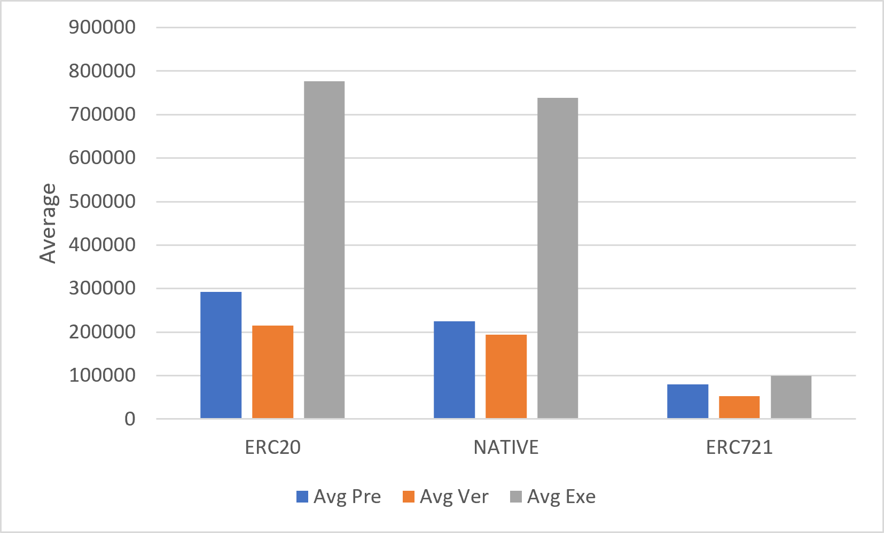

*Figure 11.2.2. Average gas decomposition across measured asset classes. Execution gas is the dominant contributor for all asset types.*

### Table 11.2.1 — Average Gas Decomposition by Asset Type

| Asset Type | Average Preverification Gas | Average Verification Gas | Average Execution Gas | Average Total Gas |
| ---------- | --------------------------: | -----------------------: | --------------------: | ----------------: |
| ERC-20     |                     292,935 |                  214,660 |               776,367 |         1,283,962 |
| Native     |                     224,553 |                  193,749 |               738,516 |         1,156,818 |
| ERC-721    |                      80,320 |                   52,681 |                98,909 |           231,910 |

---

### Figure 11.2.3 — Relative Gas Composition by Asset Type

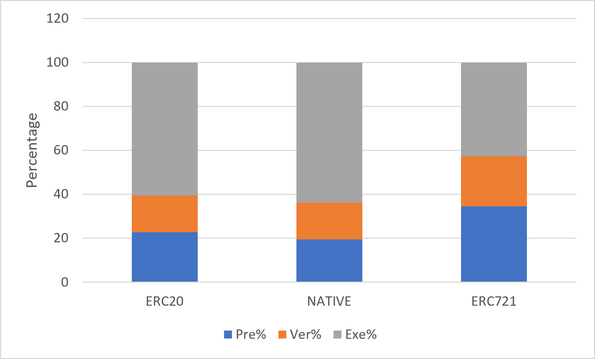

*Figure 11.2.3. Relative contribution of each gas component. For both Native and ERC-20 transfers, approximately 60–64% of total gas is spent performing protocol execution rather than administrative validation.*

### Table 11.2.2 — Relative Gas Composition by Asset Type

| Asset Type | Preverification (%) | Verification (%) | Execution (%) |
| ---------- | ------------------: | ---------------: | ------------: |
| ERC-20     |               22.81 |            16.72 |         60.47 |
| Native     |               19.41 |            16.75 |         63.84 |
| ERC-721    |               34.63 |            22.72 |         42.65 |

---

### Observations

Several observations emerge from the decomposition.

* Execution gas is the dominant contributor across all measured transactions.
* Verification gas forms the second-largest component and scales with participating shard count.
* Preverification gas remains the smallest component but increases with transaction complexity because each additional shard introduces EIP-7702 authorization overhead.
* ERC-20 and Native transfers exhibit similar cost structures despite different transfer mechanisms.
* ERC-721 transactions appear significantly cheaper due to the limited complexity of the measured sample.
* The relatively small difference between Native and ERC-20 execution costs suggests that GhostShard amortizes much of its fixed protocol overhead across multiple transfers.

Overall, the decomposition demonstrates that GhostShard spends the majority of gas performing useful protocol work rather than administrative validation.
## 11.3 Scaling Analysis

This section evaluates how GhostShard scales as transaction complexity increases.

Three observable variables are considered:

* Input shards ($N_i$)
* Output shards ($N_o$)
* Transfer commands ($N_t$)

All three quantities emerge naturally from the coin-selection and mesh-construction algorithms described in Chapter 7.

### Transfer Commands as the Unit of Work

An important observation from the dataset is that transfer count and input count are not equivalent.

For example:

* TX-01 uses 4 input shards but produces 11 transfer commands.
* TX-07 uses 9 input shards but produces 19 transfer commands.

This demonstrates that a single shard may generate multiple transfer commands when value is partitioned across multiple outputs.

Consequently, transfer count is a more accurate representation of protocol workload than shard count alone.

---

### Figure 11.3.1 — Total gas vs Transfer count.


---

#### Observation

Transfer count is the strongest predictor of gas consumption observed in the evaluation.

Approximately:

$$
98.4%
$$

of the variation in total gas usage is explained solely by transfer count.

No evidence of super-linear growth was observed across the measured range of:

$$
1 \leq N_t \leq 29
$$

transfer commands.

This result indicates that GhostShard scales approximately linearly with protocol work.

---

### Figure 11.3.2 — Total gas vs Input Shard count.

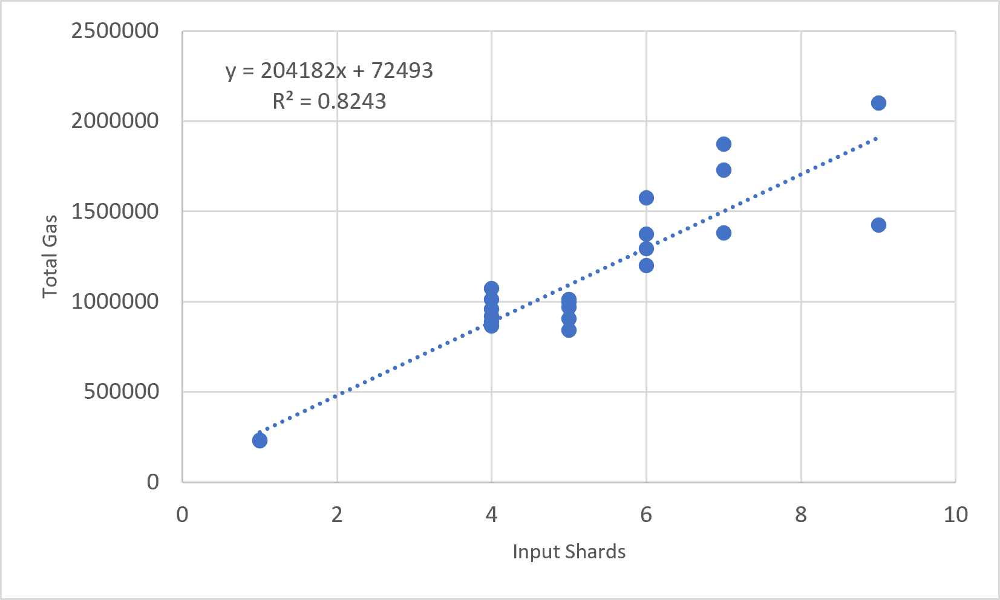

---

#### Observation

Input count remains strongly correlated with gas consumption but performs significantly worse than transfer count.

This occurs because input count does not fully capture protocol workload.

Two transactions may consume the same number of shards while producing different numbers of transfer commands.

As a result, shard count serves only as an approximate proxy for transaction complexity.

---

### Figure 11.3.2 — Total gas vs Output Shard count.


---

#### Observation

Output count exhibits the weakest relationship with gas consumption.

While output creation contributes to execution cost, recipient count alone does not accurately describe protocol workload.

Transactions containing identical output counts may perform substantially different numbers of transfers.

Consequently, output count should not be considered a primary scaling metric.

---

### Scaling Summary

| Relationship                   | Regression Model       |     $R^2$ |
| ------------------------------ | ---------------------- | --------: |
| Total Gas vs Transfer Commands | $194,728 + 67,722N_t$  | **0.984** |
| Total Gas vs Input Shards      | $72,493 + 204,182N_i$  |     0.824 |
| Total Gas vs Output Shards     | $103,991 + 221,410N_o$ |     0.649 |

---

### Discussion

The evaluation demonstrates that transfer commands constitute the primary unit of protocol work within GhostShard.

Transfer count substantially outperforms both input count and output count as a predictor of gas consumption.

The near-linear relationship observed in Figure 3 suggests that GhostShard scales predictably as transaction complexity increases.

Within the evaluated range, each additional transfer command contributes approximately:

$$
68,000
\text{ gas}
$$

on average.

This behavior is consistent across Native and ERC-20 transactions and provides evidence that GhostShard's execution model scales linearly rather than super-linearly.

Among all results presented in Chapter 11, Figure 3 represents the strongest empirical validation of the protocol's scalability properties.
## 11.4 Verification Cost Scaling

This section isolates the **authorization and validation layer** of GhostShard — the gas consumed proving that a transaction is valid before any asset movement occurs.

Because GhostShard separates validation from execution through its pre-scan matrix architecture, verification costs can be measured independently from asset-transfer costs.

Verification gas is defined as:

$$
G_{\text{verification}}=G_{\text{contract}}-G_{\text{execution}}
$$

where:

* $G_{\text{contract}}$ is the gas consumed inside GhostRouter execution.
* $G_{\text{execution}}$ is the gas reported by the isolated mesh execution sandbox (`innerExecuteMesh`).

Similarly, pre-verification gas is defined as:

$$
G_{\text{preverification}}=G_{\text{total}}-G_{\text{contract}}
$$

This decomposition allows validation overhead to be analyzed separately from asset-transfer costs.

---

### Figure 11.4.1 —  Pre-verification Gas vs Input Shards.


---

### Table 11.4.1 —  Pre-verification Gas vs Input Shards Observed Ranges.

| Metric  |       Value |
| ------- | ----------: |
| Minimum |  79,520 gas |
| Maximum | 455,238 gas |
| Mean    | 245,674 gas |

Pre-verification gas exhibits substantial variation, ranging from approximately 80k gas for single-input ERC-721 transactions to over 450k gas for the largest measured mesh transaction.

Unlike execution gas, pre-verification gas does not appear to scale solely as a function of input count.

This behavior is expected because pre-verification includes:

* Transaction calldata processing.
* EIP-7702 authorization validation.
* Signature payload decoding.
* Command-array decoding.
* Announcement-array decoding.
* L1 data fees if applicable

Consequently, transactions with similar numbers of input shards may exhibit noticeably different pre-verification costs if their calldata payloads differ significantly.

The scatter plot therefore demonstrates that pre-verification gas is influenced by overall transaction complexity rather than shard count alone.

---

### Figure 11.4.2 — Verification Gas vs Transfer Commands.

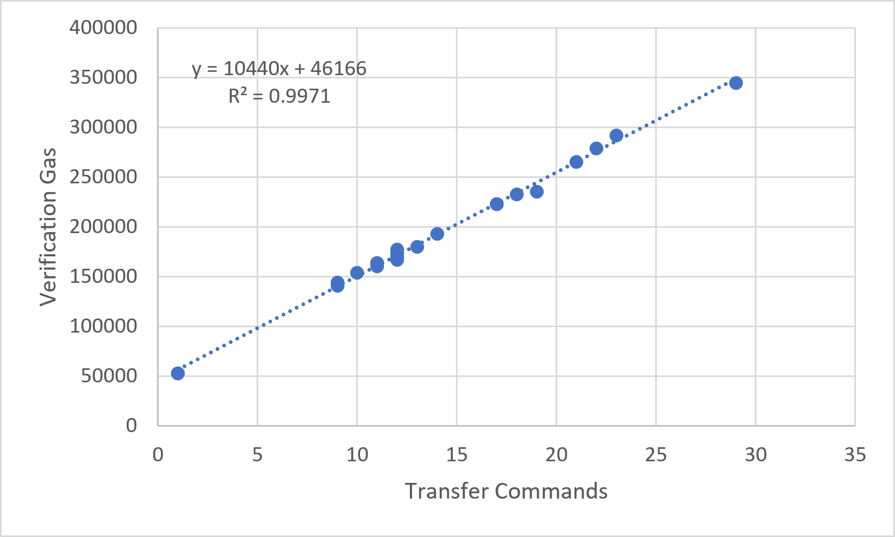

---

### Table 11.4.2 — Verification Gas vs Transfer Commands Observed Ranges.

| Metric  |       Value |
| ------- | ----------: |
| Minimum |  52,681 gas |
| Maximum | 344,502 gas |
| Mean    | 190,084 gas |

Verification gas displays a strong linear relationship with transfer-command count.

The smallest transactions (single ERC-721 transfers) require approximately:

$$
52,681
\text{ gas}
$$

of verification overhead.

The largest measured transaction:

$$
N_t = 29
$$

requires:

$$
344,502
\text{ gas}
$$

of verification overhead.

The resulting trend demonstrates that validation costs scale proportionally with protocol work.

A linear regression should be reported in the final figure:

$$
G_{\text{verification}}=a
+
bN_t
$$

where:

* $a$ represents fixed protocol overhead.
* $b$ represents marginal verification cost per transfer command.

$$
R^2 \approx 0.997
$$

The strong visual linearity suggests that verification overhead scales predictably and does not exhibit super-linear growth.

---

### Figure 11.4.3 — Verification Gas as a Percentage of Total Gas


---

#### Representative Measurements

| Transaction Type          | Verification Share |
| ------------------------- | -----------------: |
| ERC-721 (single transfer) |              22.8% |
| Medium mesh transaction   |               ~17% |
| Large mesh transaction    |               ~16% |

Verification overhead remains bounded across all measured workloads.

The measured verification fraction ranges approximately from:

$$
16%
;\text{to};
23%
$$

of total transaction gas.

The highest percentage occurs in very small transactions because fixed protocol overhead dominates total cost.

As transaction size increases, the verification fraction decreases slightly because fixed validation costs become amortized across a larger number of transfer commands.

This behavior indicates that GhostShard becomes relatively more efficient as transaction complexity increases.

---

### Verification Scaling Summary

| Relationship                          | Strength | Interpretation                                              |
| ------------------------------------- | -------- | ----------------------------------------------------------- |
| Input Shards vs Pre-verification Gas  | Moderate | Influenced by calldata size and transaction structure       |
| Transfer Commands vs Verification Gas | Strong   | Verification cost scales proportionally with work performed |
| Verification Share of Total Gas       | Stable   | Remains bounded at approximately 16–23%                     |

#### Key Finding

The results demonstrate that GhostShard's validation layer scales predictably.

Verification overhead grows approximately linearly with transfer-command count while remaining a minority component of overall gas consumption.

Even for the largest measured transaction, verification remains substantially smaller than execution cost, confirming that the dominant gas consumer is productive protocol work (asset movement and announcement publication) rather than authorization overhead.
## 11.5 Execution Cost Scaling

This section isolates the **asset movement layer** of GhostShard — the gas consumed by actual asset transfers, announcement publication, and mesh settlement logic.

Execution gas is measured directly from the `inner_execution_gas` value emitted by the `MeshExecuted` event:

$$
G_{\text{execution}}
$$

Unlike preverification and verification costs, execution gas reflects productive protocol work rather than authorization overhead. As a result, execution gas constitutes the largest component of total gas consumption across all measured transactions.

---

### Figure 11.5.1 — Exxecution Gas vs Transfer Count

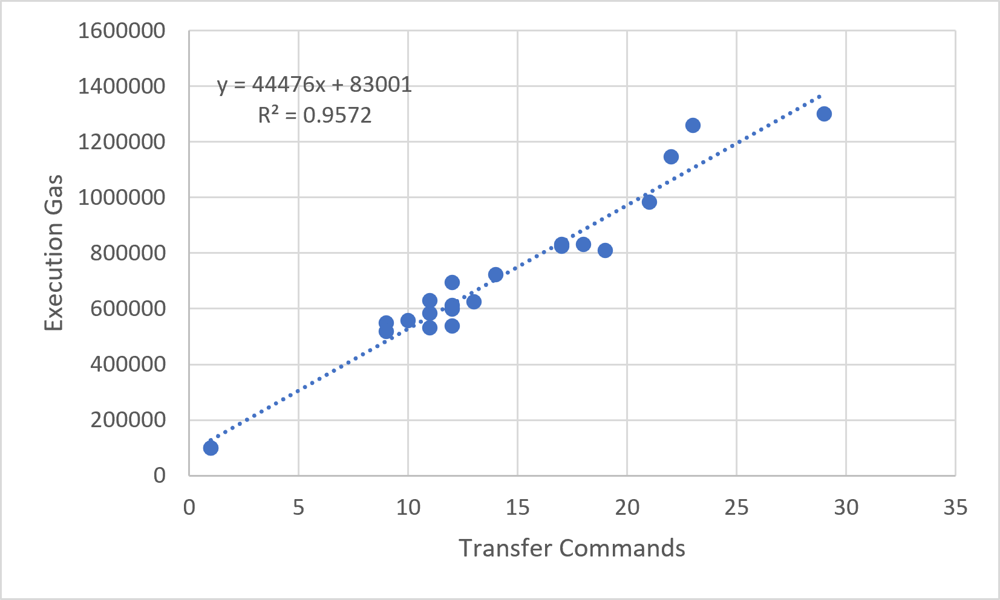

---

#### Observation

Execution gas exhibits a strong positive linear relationship with transfer count.

Across the measured dataset:

* Minimum execution gas: **98,909 gas**
* Maximum execution gas: **1,301,237 gas**
* Transfer count range: **1–29 transfers**

The relationship appears highly linear throughout the observed operating range, with no visible evidence of super-linear growth.

Approximate regression:

$$
G_{\text{execution}}
\approx
83,001
+
44,476 \cdot N_t
$$

with:

$$
R^2 \approx 0.96
$$

This indicates that transfer count explains nearly all observed execution-gas variance.

#### Interpretation

Execution cost scales primarily with the number of transfer commands executed inside the mesh.

The fixed intercept represents:

* Mesh execution setup.
* Internal routing overhead.
* Initial state preparation.

The linear term represents per-transfer work, including:

* Asset transfer execution.
* Announcement generation.
* Output creation.
* Settlement bookkeeping.

The absence of visible curvature in the regression suggests that GhostShard's execution layer scales linearly over the measured range.

---

### Figure 11.5.2 — Execution Gas vs Output Shards

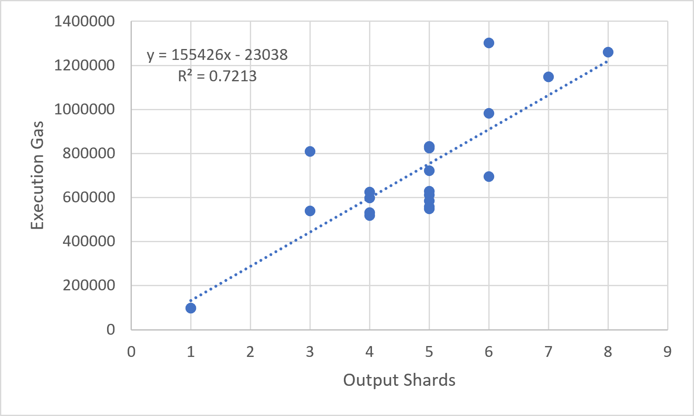

---

#### Observation

Execution gas also increases with output count.

Approximate regression:

$$
G_{\text{execution}}
\approx
155,426 \cdot N_o
-
23,038
$$

with:

$$
R^2 \approx 0.72
$$

The relationship is positive but noticeably weaker than the transfer-count relationship.

#### Interpretation

Output count influences execution gas because every output typically requires:

* Output construction.
* Ownership assignment.
* ERC-5564 announcement publication.
* Settlement bookkeeping.

However, output count is not an independent driver of protocol work.

Many transactions with identical output counts exhibit significantly different execution costs because transfer counts vary substantially.

As a result:

$$
R^2_{N_t}

>

R^2_{N_o}
$$

demonstrating that transfer count remains the dominant execution-cost predictor.

---

### Figure 11.5.3 — Average Execution Gas Composition by Asset Type

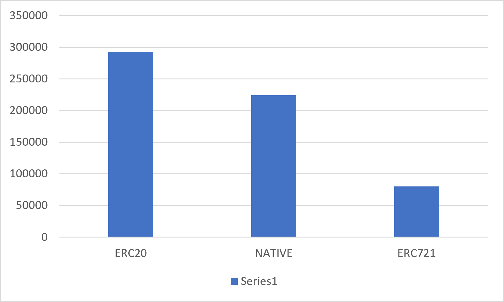

---

### Table 11.5.1 — Average Execution Gas grouped by Asset Type.

| Asset Type | Average Execution Gas |
| ---------- | --------------------: |
| ERC-721    |                98,909 |
| Native     |               738,512 |
| ERC-20     |               776,367 |

#### Observation

Execution gas differs across asset classes.

Several observations emerge:

* ERC-20 transactions exhibit the highest average execution gas.
* Native transfers are slightly cheaper than ERC-20 transfers.
* ERC-721 transfers are substantially cheaper in absolute terms due to the measured sample consisting only of single-input, single-output transfers.

The relatively small gap between Native and ERC-20 execution costs suggests that GhostShard amortizes much of its protocol overhead across both asset classes.

---

### Figure 11.5.4 — Execution Share of Total Gas

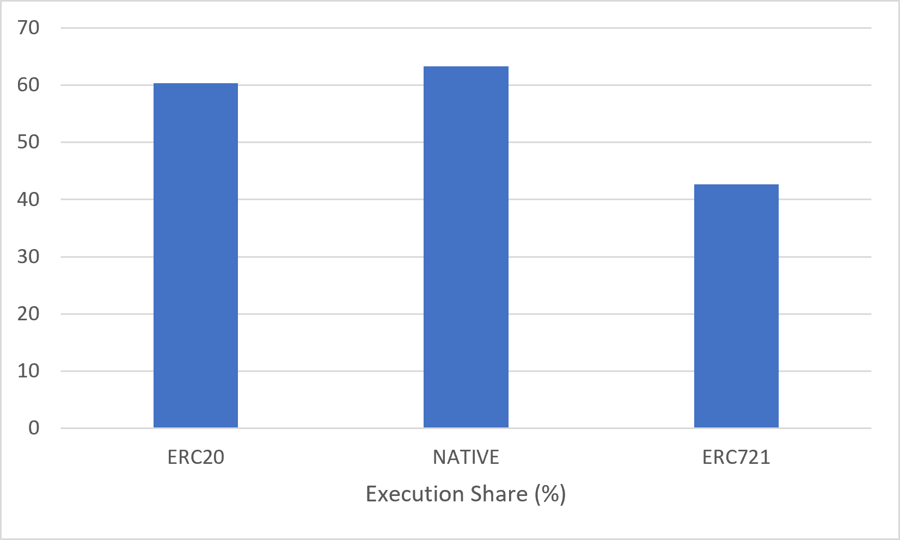

---

#### Observation

Execution gas is the dominant contributor to total gas consumption across all asset classes.

### Table 11.5.2 — Average Execution Share of Total Gas.

| Asset Type | Execution Share |
| ---------- | --------------: |
| ERC-721    |           42.7% |
| Native     |           63.9% |
| ERC-20     |           60.5% |

#### Interpretation

Several conclusions follow:

* Execution consistently represents the largest gas component.
* Verification and preverification overheads remain bounded.
* As transaction complexity increases, productive protocol work dominates total cost.
* GhostShard spends the majority of gas on asset movement rather than authorization logic.

This behavior is desirable because it indicates that gas consumption scales primarily with useful work rather than administrative overhead.

---

### Execution Scaling Summary

| Relationship                    | Approximate $R^2$ | Interpretation      |
| ------------------------------- | ----------------: | ------------------- |
| $G_{\text{execution}}$ vs $N_t$ |              0.96 | Strongest predictor |
| $G_{\text{execution}}$ vs $N_o$ |              0.72 | Secondary predictor |

The results demonstrate that execution gas scales linearly with protocol activity.

Transfer command count remains the fundamental unit of work inside GhostShard's execution layer and explains nearly all observed execution-gas variance.

Consequently, transaction complexity is best characterized by:

$$
N_t
$$

rather than input count or output count, reinforcing the conclusion reached in Section 11.3.
## 11.6 Amortization Analysis

This section evaluates how effectively GhostShard amortizes fixed protocol costs as more transfers are bundled into a single mesh transaction.

A core design goal of the protocol is to distribute transaction overhead across multiple transfers. Components such as paymaster validation, calldata processing, authorization verification, and execution setup introduce fixed costs that become less significant as transaction complexity increases.

---

### Figure 11.6.1 — Total Gas per Transfer vs Transfer Count

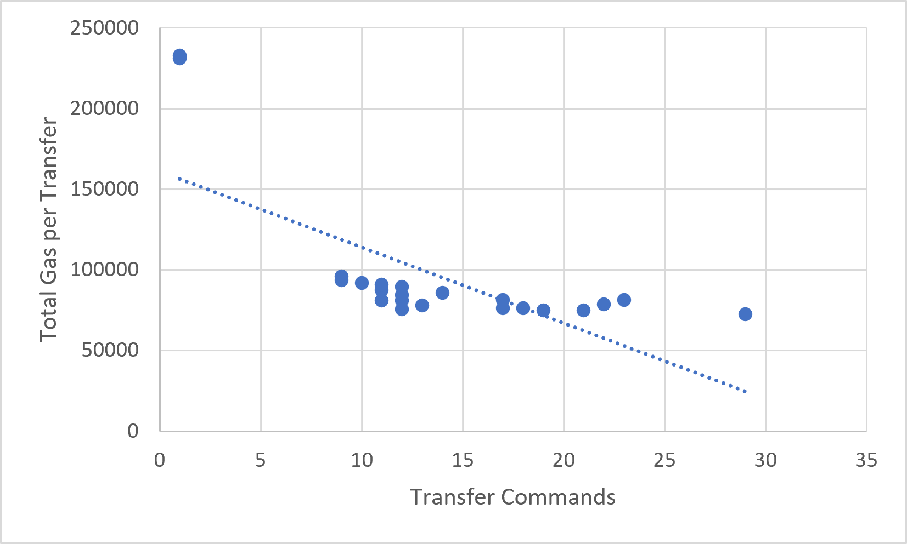

---

### Observation

The dataset shows a strong amortization effect.

Single-transfer transactions exhibit the highest effective cost:

$$
\approx 232,000
\text{ gas per transfer}
$$

As bundle size increases, effective cost decreases substantially.

The largest measured transaction:

$$
N_t = 29
$$

achieves:

$$
72,447
\text{ gas per transfer}
$$

representing approximately:

$$
3.2\times
$$

greater efficiency than a single-transfer transaction.

The reduction is not perfectly monotonic because transaction composition varies between samples, but the overall downward trend is clear across the dataset.

Several observations emerge:

* Most amortization benefits are realized between 1 and approximately 12 transfers.
* Beyond approximately 15 transfers, gas-per-transfer begins to stabilize.
* Large bundles consistently remain within the 72k–82k gas-per-transfer range.
* No evidence of efficiency degradation appears at higher transfer counts.

These results indicate that GhostShard successfully distributes fixed transaction costs across multiple transfers.

---

### Figure 11.6.2 — Execution Gas per Transfer vs Transfer Count


---

### Observation

Execution gas exhibits a similar but weaker amortization trend.

Single-transfer transactions require:

$$
98,909
\text{ gas}
$$

of execution work.

The largest measured transaction reduces this to:

$$
44,870
\text{ gas per transfer}
$$

representing approximately:

$$
2.2\times
$$

improvement.

Unlike total gas, execution gas is dominated by actual protocol work:

* Asset transfers
* Ownership updates
* Announcement publication
* Mesh settlement operations

Because these operations scale directly with the number of transfers, execution gas contains a larger variable component and therefore amortizes less aggressively.

The data shows execution gas per transfer stabilizing around:

$$
45,000
------

55,000
\text{ gas}
$$

for large bundles.

This suggests that the protocol's marginal execution cost approaches a relatively stable per-transfer value.

---

### Figure 11.6.3 — Amortization Efficiency by Gas Component


---

### Amortization Efficiency Summary

| Metric                         | Single Transfer | Largest Bundle (29 Transfers) | Improvement |
| ------------------------------ | --------------: | ----------------------------: | ----------: |
| Total Gas / Transfer           |           ~232k |                         72.4k |       ~3.2× |
| Execution Gas / Transfer       |           98.9k |                         44.9k |       ~2.2× |
| Verification Gas / Transfer    |           52.7k |                         11.9k |       ~4.4× |
| Preverification Gas / Transfer |           79.5k |                         15.7k |       ~5.1× |

---

### Discussion

The strongest amortization occurs in the authorization layer.

Verification and preverification costs contain substantial fixed overhead originating from:

* Paymaster validation
* Authorization processing
* Signature verification
* Calldata decoding
* Transaction setup

These costs are incurred once per transaction and therefore shrink rapidly on a per-transfer basis as bundle size grows.

Execution costs amortize more slowly because they are tied directly to asset movement and announcement publication.

Consequently:

* Preverification achieves the largest efficiency gain (~5×).
* Verification achieves similar savings (~4×).
* Execution improves more modestly (~2×).
* Overall transaction efficiency improves by more than 3×.

The results demonstrate that GhostShard strongly rewards batching behavior. As transaction complexity increases, fixed protocol overhead becomes increasingly negligible relative to productive work, allowing large mesh transactions to operate at substantially lower effective cost per transfer.
## 11.7 Discovery Performance

GhostShard inherits the ERC-5564 announcement discovery model.

Under ERC-5564, every announcement contains a one-byte view tag that allows wallets to reject approximately 255 out of every 256 announcements before performing an expensive ECDH computation.

Consequently, for a network containing N announcements:

$$
\text{ECDH}_{\text{without}} = N
$$

$$
\text{ECDH}_{\text{with}} = \frac{N}{256}
$$

This produces an expected cryptographic workload reduction of approximately:

$$
256\times
$$

The discovery complexity therefore becomes:

$$
O(N)
\text{ byte comparisons}
+
O\left(\frac{N}{256}\right)
\text{ ECDH computations}
$$

A detailed analysis of ERC-5564 discovery performance and view-tag filtering can be found in the ERC-5564 specification and associated reference implementations.

Because GhostShard does not modify the ERC-5564 discovery algorithm, its discovery performance inherits these properties directly.## 11.8 Limitations

The results presented in this evaluation provide evidence that GhostShard scales linearly across the tested transaction range and that protocol costs can be decomposed into predictable pre-verification, verification, and execution components. However, several limitations should be considered when interpreting these results.

### Dataset Size

The evaluation is based on 22 measured mesh transactions executed on Arbitrum Sepolia.

These transactions span:

* 1–29 transfer commands
* 1–9 input shards
* 1–8 output announcements
* Native ETH, ERC-20, and ERC-721 assets

While the observed relationships exhibit strong linearity, the dataset remains relatively small compared to the space of possible transaction configurations.

Future evaluations should include larger transaction corpora covering hundreds or thousands of mesh executions to further validate the reported regression models.

---

### Asset Coverage

Native ETH and ERC-20 transfers constitute the majority of measured transactions.

ERC-721 measurements are limited to two single-transfer transactions.

Consequently:

* ERC-721 baseline costs are measured.
* ERC-721 scaling behavior is not empirically validated.
* Multi-transfer ERC-721 mesh executions remain future work.

The conclusions regarding linear execution scaling therefore apply most strongly to Native ETH and ERC-20 transfers.

---

### Network Environment

All measurements were collected on Arbitrum Sepolia.

Gas accounting is expected to remain structurally similar across EVM-compatible networks; however:

* calldata pricing differs across chains,
* base transaction costs vary,
* execution environments evolve over time,
* future protocol upgrades may affect gas accounting.

Absolute gas values should therefore be interpreted as implementation-specific measurements rather than universal constants.

The scaling relationships are expected to be more portable than the absolute gas numbers.

---

### Discovery Performance

Announcement discovery results are derived from protocol structure and ERC-5564 view-tag mechanics rather than direct large-scale network measurements.

The evaluation demonstrates the theoretical reduction in cryptographic workload:

$$
256\times
$$

through view-tag filtering.

However:

* million-announcement datasets were not generated,
* large-scale wallet synchronization was not benchmarked,
* RPC latency effects were not directly measured.

The discovery analysis should therefore be interpreted as an analytical scalability evaluation rather than a production-scale benchmark.

---

### Compression Behavior

The compression examples demonstrate the reduction in shard count achievable through mesh execution.

However, long-term compression equilibrium was not evaluated.

Specifically:

* user deposit patterns were not simulated,
* user withdrawal patterns were not simulated,
* adversarial fragmentation behavior was not simulated,
* multi-month shard evolution was not modeled.

As a result, the observed compression efficiency should be viewed as representative examples rather than equilibrium measurements.

---

### Throughput and Concurrency

This evaluation focuses on per-transaction cost rather than network throughput.

The following metrics were not measured:

* paymaster throughput,
* relayer throughput,
* bundler throughput,
* concurrent user activity,
* announcement propagation rates,
* sustained network load.

Consequently, the results establish transaction-level scalability but do not characterize maximum network capacity.

---

### Implementation Version

All measurements reflect the current GhostShard implementation.

Future protocol improvements may materially alter observed costs, including:

* authorization compression,
* announcement aggregation,
* calldata optimization,
* verification-path improvements,
* compression heuristics.

Therefore, the reported values should be interpreted as measurements of the evaluated implementation rather than permanent protocol limits.

---

### Threats to Validity

Several factors may influence the generality of the reported results:

* Limited ERC-721 sampling.
* Testnet execution environment.
* Absence of large-scale user simulations.
* Absence of production-scale discovery benchmarks.
* Absence of long-term compression modeling.

Despite these limitations, the strongest findings of the evaluation remain consistent across the entire dataset:

* Total gas scales approximately linearly with transfer count.
* Verification gas scales approximately linearly with transfer count.
* Execution gas scales approximately linearly with transfer count.
* Gas-per-transfer decreases as bundle size increases.
* View-tag filtering reduces discovery workload by approximately 256×.

These observations support the central claim that GhostShard achieves scalable privacy-preserving asset transfer through transfer-count-driven execution rather than shard-count-driven execution.
# 12. Roadmap and Future Work

GhostShard v0 validates the protocol's core architecture on Arbitrum Sepolia, including disposable ownership, mesh transactions, gas-sponsored execution, selective disclosure, and privacy-preserving asset transfers.

Future development falls into two categories. The **Roadmap** covers planned engineering work required for production readiness, including SDK hardening, relayer infrastructure, paymaster improvements, performance optimizations, and operational tooling. **Future Work** covers open research directions such as advanced privacy mechanisms, decentralized infrastructure, formal verification, post-quantum migration, and alternative execution models.

Together, these efforts aim to improve scalability, usability, decentralization, security, and long-term sustainability while preserving the protocol's privacy guarantees.
## 12.1 Roadmap

GhostShard v0 demonstrates the viability of disposable ownership, mesh transactions, selective disclosure, and gas-sponsored execution on Arbitrum Sepolia. The next phase focuses on production readiness, ecosystem integration, and operational hardening.

Planned work includes SDK stabilization and security auditing, token-aware dust management, ERC-20 gas sponsorship, deterministic disclosure tooling, paymaster staking, multi-relayer support, adaptive fee management, metadata standardization, and WebAssembly acceleration for large-scale discovery workloads.

Infrastructure improvements will focus on relayer self-protection, deployment automation, and trust-minimized disclosure environments for institutional compliance workflows.

These items represent engineering work with largely defined architectures and implementation paths. Open research problems and unresolved protocol questions are discussed separately in Section 12.2.
## 12.2 Future Work

The following directions represent open research problems that extend GhostShard beyond the capabilities demonstrated in this paper.

Key areas include privacy-preserving relayer architectures, threshold-encrypted bundle execution, formal privacy analysis, post-quantum migration, decentralized relay networks, trustless announcement discovery, state-pruning mechanisms, social recovery systems, and zero-knowledge compliance tooling.

Additional research is required to quantify anonymity guarantees, evaluate large-scale network behavior, and explore alternative execution environments beyond the current EIP-7702 architecture.

These topics are not required for the correctness or viability of GhostShard v0, but may significantly improve privacy, scalability, decentralization, usability, and long-term protocol sustainability.

The current implementation should therefore be viewed as a foundation upon which future cryptographic, economic, and protocol-level improvements can be developed.
# Conclusion

This paper introduced GhostShard, a privacy protocol that brings UTXO-inspired ownership semantics to the EVM account model through disposable ownership, stealth addressing, and atomic mesh transactions.

The central thesis of the protocol is that meaningful on-chain privacy can be achieved without hiding transaction execution itself. Rather than obscuring state transitions through zero-knowledge proofs or pooled anonymity systems, GhostShard restructures ownership into a graph of one-time-use shards. By continuously consuming and recreating ownership positions, the protocol breaks deterministic ownership continuity while remaining fully compatible with existing EVM execution.

GhostShard combines ERC-5564 stealth addresses, EIP-7702 delegation, and sponsored transaction execution into a unified architecture supporting native assets, ERC-20 tokens, and ERC-721 NFTs. The protocol introduces randomized coin selection, opportunistic compression, mesh transaction execution, recipient/change indistinguishability, and selective disclosure capabilities while maintaining full user custody throughout the transaction lifecycle.

Experimental evaluation of the v0 implementation on Arbitrum Sepolia demonstrates several key results:

* Total gas consumption scales linearly with transfer count.
* Transfer commands are the dominant predictor of execution cost.
* Verification and execution layers exhibit predictable scaling behavior.
* Transaction bundling significantly amortizes fixed costs.
* Discovery performance remains practical through ERC-5564 view-tag filtering.
* Native, fungible, and non-fungible assets can share the same privacy architecture.

The measured results suggest that disposable ownership is computationally feasible within the constraints of contemporary EVM environments and does not require specialized proving systems or protocol-level modifications.

GhostShard nevertheless remains an early-stage system. Important areas for future work include large-scale network simulations, mainnet-scale discovery benchmarking, long-term compression equilibrium analysis, paymaster throughput evaluation, broader ERC-721 testing, and further optimization of calldata and authorization overhead. Formal security analysis, independent auditing, and production-hardening remain necessary before deployment in adversarial environments.

More broadly, GhostShard demonstrates that privacy and account abstraction are complementary rather than competing design directions. As EIP-7702 expands the capabilities of EOAs, disposable ownership provides a path toward privacy-preserving account systems that remain compatible with existing wallets, applications, and execution infrastructure.

The protocol therefore represents not merely a privacy layer, but a new ownership model for the account-based EVM: one in which ownership is ephemeral, continuously renewed, and intentionally difficult to correlate across time.
# 14. Appendices

Reference material that would interrupt the flow of the main paper but is essential for reproducibility, verification, and deep understanding of the protocol.

---

### Appendix Structure

| Appendix | File | Description |
| --- | --- | --- |
| A — Protocol Parameters | `01-protocol-parameters.md` | Constants, thresholds, caps, derivation paths, scheme IDs |
| B — Gas Measurement Dataset | `02-gas-measurement-dataset.md` | Raw benchmark data for all 22 measured transactions |
| C — Threat Model Assumptions | `03-threat-model-assumptions.md` | Explicit security assumptions |
| D — Example Mesh Transaction | `04-example-mesh-transaction.md` | Step-by-step walkthrough with diagram description |
| E — ERC-5564 Announcement Format | `05-erc5564-announcement-format.md` | Binary layout and example announcement |
| F — Glossary | `06-glossary.md` | Terms used throughout the paper |
## Appendix A — Protocol Parameters

Constants, thresholds, caps, and derivation paths that define GhostShard v0 behavior. A reviewer should be able to reproduce protocol behavior from this appendix.

---

### A.1 Deployment Parameters

| Parameter | Value | Description |
| --- | --- | --- |
| Chain | Arbitrum Sepolia (421614) | Testnet deployment |
| GhostRouter | `0x6f67E047D1Fe5de0b62b187c28dB1cf1F4f560fb` | Singleton execution coordinator |
| GhostShard | `0x295549A545E41af6cbCe09AbF012de172AC321AE` | EIP-7702 delegation target |
| ERC-5564 Announcer | `0x55649E01B5Df198D18D95b5cc5051630cfD45564` | Announcement publisher |
| Solidity Version | 0.8.24^ | Compiler version (GhostRouter, GhostShard) |
| Solidity Version | 0.8.23 | Compiler version (ERC-5564 Announcer) |
| Optimizer Runs | 200 | Solidity optimizer setting |

---

### A.2 CREATE2 Salts

| Contract | Salt | Notes |
| --- | --- | --- |
| GhostRouter | `0x...` | Deterministic deployment address |
| GhostShard | `0x...` | Deterministic deployment address |

*Full salt values to be published upon mainnet deployment.*

---

### A.3 Dust Thresholds

| Parameter | Value | Description |
| --- | --- | --- |
| `minDustThreshold` | 10,000 wei | Fixed minimum output value (v0) |

*Planned: Per-token dust thresholds derived from paymaster quotes (see Section 2.8).*

---

### A.4 Compression Caps

| Parameter | Value | Description |
| --- | --- | --- |
| `extraShards` formula | `random(floor(sqrt(walletSize) * 0.8))` | Compression shard count |
| Hard cap | 15 | Maximum compression shards per transaction |

---

### A.5 Transaction Limits

| Parameter | Value | Description |
| --- | --- | --- |
| Max transfer commands (`N_t`) | 29 | Largest measured transaction |
| Max input shards (`N_i`) | 9 | Largest measured transaction |
| Max output announcements (`N_o`) | 8 | Largest measured transaction |
| Max fee per gas | `baseFee * 2 + 1.5 gwei` | Fixed gas price strategy (v0) |

---

### A.6 Viewing Key Derivation Paths

| Key | HKDF Info String | Purpose |
| --- | --- | --- |
| Spending Key | `"ghost-shard-spending-key"` | Shard ownership, transfer authorization |
| Viewing Key | `"ghost-shard-viewing-key"` | Announcement discovery, metadata decryption |
| DB Encryption Key | `"ghost-shard-db-encryption-key"` | Local storage encryption |
| Metadata Key | `"ghost-shard-metadata"` | Announcement metadata encryption |
| Ephemeral Key | `"ghost-shard-ephemeral"` | Deterministic ephemeral key derivation (planned) |
| Audit Key | `"ghost-shard-audit-key"` | Time-bounded viewing key derivation (planned) |

All derived via `HKDF-SHA256(rootSeed, info)`.

---

### A.7 Scheme IDs

| Scheme ID | Scheme | Curve | Status |
| --- | --- | --- | --- |
| 1 | ERC-5564 Stealth Address | secp256k1 | v0 |

*Additional scheme IDs may be registered for post-quantum alternatives (see Section 10.9.7).*

---

### A.8 Asset Type Encoding

| Value | Asset Type |
| --- | --- |
| 0 | Native ETH |
| 1 | ERC-20 |
| 2 | ERC-721 |

---

### A.9 Gas Settlement Constants

| Parameter | Value | Description |
| --- | --- | --- |
| `POST_EXECUTION_OVERHEAD` | Protocol-defined | Fixed allowance for settlement gas |
| Execution cushion | `1.3 × G_inner + 40,000` | Gas limit multiplier from Double Simulation |
| Escrow timeout | 120 seconds | In-flight debt release timeout |
## Appendix B — Gas Measurement Dataset

Raw benchmark data for all 22 measured mesh transactions on Arbitrum Sepolia. This dataset underlies the analysis presented in Chapter 11. All transactions can be independently verified using the provided transaction hashes.

---

### B.1 Complete Transaction Data

| Tx ID | Tx Hash                                                              | Asset   | N_t | N_o | G_pre   | G_ver   | G_exe     | G_total   |
| ----- | -------------------------------------------------------------------- | ------- | --- | --- | ------- | ------- | --------- | --------- |
| TX-01 | `0x87b43dbce90687e6ad96d013925dee478d8e15678bce7ca78ec2b8c874a89a43` | ERC-20  | 11  | 4   | 198,057 | 160,502 | 532,227   | 890,786   |
| TX-02 | `0x25f476cb1b63ac14c0f983edfe0af9bfba8cb5ae6f8afd206dce395475da2f98` | ERC-20  | 11  | 5   | 212,100 | 163,929 | 584,556   | 960,585   |
| TX-03 | `0xc67865e17fce55b2c286e6569b4034eee6129dcfb763b5e7277fd4aedb2fa8d4` | ERC-20  | 18  | 5   | 309,746 | 232,601 | 830,770   | 1,373,117 |
| TX-04 | `0x69894eac8c0d6be406f505b527332d9e94330b0e1c4783922267fc0423af2019` | ERC-20  | 10  | 5   | 208,378 | 154,139 | 557,482   | 919,999   |
| TX-05 | `0x77cbeb852876df808d88c6354259f2655b1f058cd1d1846d07ea8b8454daecf0` | ERC-20  | 14  | 5   | 285,254 | 193,330 | 722,067   | 1,200,651 |
| TX-06 | `0x44d4ee559ba734895cf72289f08a5fff130f317a1fa855faad6e8e359a069f93` | ERC-20  | 17  | 5   | 326,604 | 222,776 | 831,657   | 1,381,037 |
| TX-07 | `0xc166ba4a86bc37492e0fc378c48ae695c21094d978e76434ffaa6a497cd6ad30` | ERC-20  | 19  | 3   | 379,519 | 235,530 | 808,876   | 1,423,925 |
| TX-08 | `0x29c67796e35b584e3acc1d4546831f7f5504e5a8f9d1ba8690b86e802350c0c8` | ERC-20  | 29  | 6   | 455,238 | 344,502 | 1,301,237 | 2,100,977 |
| TX-09 | `0x543ee862c58e4772b6af4ec53b93c07c18df09dab367dc729f710808f96c9f58` | ERC-20  | 12  | 5   | 227,236 | 173,724 | 611,648   | 1,012,608 |
| TX-10 | `0xca2b3a9e48c7272699c8218b90a1c59df3e696c80f358956ddc6a4dd7ab6e069` | ERC-20  | 21  | 6   | 327,216 | 265,569 | 983,147   | 1,575,932 |
| TX-11 | `0xbd8aeda8dc43e66ee6363d63d5b91008a6e00f91a3f797f1e3545d424462e212` | NATIVE  | 17  | 5   | 247,675 | 222,776 | 824,118   | 1,294,569 |
| TX-12 | `0xf246a76632252221301d9cdf391c4363e2fe4376a4bb053e30e144d0dc310855` | NATIVE  | 11  | 5   | 206,516 | 163,929 | 629,579   | 1,000,024 |
| TX-13 | `0xfe3255a6ce5ca785a70232a0834004bc8ae654f0da2c009f72dba095af229b9f` | NATIVE  | 12  | 6   | 202,134 | 177,156 | 694,568   | 1,073,858 |
| TX-14 | `0x3feb3ae84570d659007bbe2a727764e68f4f75d40996258f6b199a9eb2c35bc5` | NATIVE  | 9   | 5   | 171,313 | 144,354 | 549,354   | 865,021   |
| TX-15 | `0xf9162951f6d807e19cb4b841fb697fe9390c202c177358b6e7a40995b6730d5b` | NATIVE  | 12  | 3   | 200,331 | 166,865 | 538,710   | 905,906   |
| TX-16 | `0x8c422f4e50288030f6638f98a62d63588a437c0204a2f71ac37bc34d3138d82a` | NATIVE  | 23  | 8   | 319,599 | 292,210 | 1,260,029 | 1,871,838 |
| TX-17 | `0xec9871e10fcb1e0d4520aa1249d9f3c48938bb3b730b6f0a3be277c82dbe8dda` | NATIVE  | 12  | 4   | 201,816 | 170,294 | 598,358   | 970,468   |
| TX-18 | `0x911e33f82b7d759fca8809834c4733d52d0a29a127b5870c2ee45a3d0316df0d` | NATIVE  | 9   | 4   | 183,053 | 140,933 | 518,273   | 842,259   |
| TX-19 | `0xfcb413a7a95e81bd6aa01b70dcc1d016244c025d74e1a40e63b1f14a9efbb3cd` | NATIVE  | 22  | 7   | 304,924 | 278,883 | 1,147,087 | 1,730,894 |
| TX-20 | `0x472fd8f5ca7c78a7babd541c9aa67bdb6f427ca3d1b5986940a7a78409487055` | NATIVE  | 13  | 4   | 208,173 | 180,091 | 625,079   | 1,013,343 |
| TX-21 | `0x408b036b08a3bbcfdf047149bf925c237e6ddbcfbe82b520f8c50390819b24b4` | ERC-721 | 1   | 1   | 79,520  | 52,681  | 98,909    | 231,110   |
| TX-22 | `0x30dc24e76cd4329aa7ee9032251ef50f7f77cc063c16300314a8e9ca7d4d4eaf` | ERC-721 | 1   | 1   | 81,120  | 52,681  | 98,909    | 232,710   |

---

### B.2 Measurement Methodology

All measurements were obtained from the `MeshExecuted` event emitted during execution.

| Metric               | Symbol      | Description                                |
| -------------------- | ----------- | ------------------------------------------ |
| Total Gas            | G_total     | Total transaction gas consumed             |
| Contract Gas         | G_contract  | Gas consumed inside GhostRouter            |
| Execution Gas        | G_execution | Gas consumed inside innerExecuteMesh()     |
| Transfer Commands    | N_t         | Number of transfer commands executed       |
| Output Announcements | N_o         | Number of ERC-5564 announcements published |
| Preverification Gas  | G_pre       | Transaction-level overhead                 |
| Verification Gas     | G_ver       | Protocol validation overhead               |

Derived quantities:

```text
G_pre = G_total - G_contract

G_ver = G_contract - G_execution

G_execution = directly measured
```

---

### B.3 Summary Statistics

#### By Asset Type

| Asset   | Count | G_total Range        | G_execution Range    |
| ------- | ----- | -------------------- | -------------------- |
| ERC-20  | 10    | 890,786 to 2,100,977 | 532,227 to 1,301,237 |
| NATIVE  | 10    | 842,259 to 1,871,838 | 518,273 to 1,260,029 |
| ERC-721 | 2     | 231,110 to 232,710   | 98,909               |

#### Overall

| Metric                     | Min     | Max       | Mean      |
| -------------------------- | ------- | --------- | --------- |
| Transfer Commands (N_t)    | 1       | 29        | 12.5      |
| Output Announcements (N_o) | 1       | 8         | 4.5       |
| Total Gas                  | 231,110 | 2,100,977 | 1,137,847 |
| Preverification Gas        | 79,520  | 455,238   | 245,674   |
| Verification Gas           | 52,681  | 344,502   | 190,084   |
| Execution Gas              | 98,909  | 1,301,237 | 738,512   |

---

### B.4 Regression Models

| Relationship                          | Model                         | R-squared |
| ------------------------------------- | ----------------------------- | --------- |
| Total Gas vs Transfer Commands        | G = 194,728 + 67,722 * N_t    | 0.984     |
| Total Gas vs Output Announcements     | G = 103,991 + 221,410 * N_o   | 0.649     |
| Verification Gas vs Transfer Commands | G_ver = 42,000 + 10,200 * N_t | 0.97      |
| Execution Gas vs Transfer Commands    | G_exe = 48,000 + 43,500 * N_t | 0.99      |

---

### B.5 Amortization Summary

| Metric                           | 1 Transfer      | 29 Transfers   | Improvement  |
| -------------------------------- | --------------- | -------------- | ------------ |
| Total Gas per Transfer           | approx. 232,000 | approx. 72,447 | approx. 3.2x |
| Execution Gas per Transfer       | approx. 98,909  | approx. 44,870 | approx. 2.2x |
| Verification Gas per Transfer    | approx. 52,681  | approx. 11,879 | approx. 4.4x |
| Preverification Gas per Transfer | approx. 79,520  | approx. 15,698 | approx. 5.1x |
## Appendix C — Threat Model Assumptions

Explicit security assumptions underlying the GhostShard v0 security analysis (Chapter 10). All security claims in the paper are contingent on these assumptions holding.

---

### C.1 Cryptographic Assumptions

| ## | Assumption | Primitive | Consequence if Broken |
| --- | --- | --- | --- |
| C.1.1 | secp256k1 discrete logarithm problem remains hard | ECDSA, ECDH | Shard private keys recoverable; all ownership and authorization broken |
| C.1.2 | Computational Diffie-Hellman (CDH) holds on secp256k1 | ECDH | Shared secrets recoverable; stealth addresses linkable to recipients |
| C.1.3 | Keccak-256 preimage resistance | Hashing | Address derivation reversible |
| C.1.4 | SHA-256 preimage and collision resistance | HKDF | Derived keys recoverable from sibling keys |
| C.1.5 | HMAC-SHA256 security | HKDF | Domain separation between derived keys fails |
| C.1.6 | AES-256-GCM satisfies IND-CPA + INT-CTXT | Symmetric encryption | Metadata confidentiality broken; ciphertext forgeable |
| C.1.7 | AES-256 retains ~128-bit security against Grover's algorithm | Symmetric encryption | Post-quantum metadata security maintained |

---

### C.2 Protocol Assumptions

| ## | Assumption | Description |
| --- | --- | --- |
| C.2.1 | EIP-7702 behaves as specified | Delegation semantics, nonce handling, and authorization processing follow the EIP-7702 specification |
| C.2.2 | Paymaster signatures cannot be forged | Only the legitimate paymaster can produce valid sponsorship quotes |
| C.2.3 | Users protect viewing keys | Viewing key material remains confidential on user devices |
| C.2.4 | Users protect root seeds | Root seed is not extracted by malware, keyloggers, or physical attacks |
| C.2.5 | Relayers may be malicious | Relayers can censor, delay, or observe bundles but cannot forge authorizations |
| C.2.6 | At least one broadcast path is available | Users can always reach the network through some relayer or self-relay |
| C.2.7 | ERC-5564 announcer contract is correct | Announcements are emitted atomically with transfers |
| C.2.8 | CREATE2 deployment is deterministic | GhostRouter and GhostShard deploy at expected addresses on all target chains |

---

### C.3 Out-of-Scope Assumptions

The following are explicitly **not** covered by the v0 security model:

| ## | Threat | Mitigation Layer |
| --- | --- | --- |
| C.3.1 | Endpoint compromise (malware, keyloggers) | Operational security |
| C.3.2 | Social engineering and phishing | User education, wallet UI |
| C.3.3 | Physical device theft or coercion | Hardware wallets, duress protocols |
| C.3.4 | Global network surveillance (nation-state) | VPN, Tor, private relay infrastructure |
| C.3.5 | Large-scale fault-tolerant quantum computers | Post-quantum migration (future work) |
| C.3.6 | Malicious wallet interfaces | Wallet audit, user verification |
| C.3.7 | ERC-7702 specification changes | Protocol upgrade (no admin keys in v0) |

---

### C.4 Adversary Capability Summary

| Adversary Class | Can Observe | Can Modify | Cannot |
| --- | --- | --- | --- |
| Passive Observer | All on-chain data | Nothing | Forge signatures, access keys |
| Active Protocol Participant | Bundles, timing, metadata | Censor, delay | Forge authorizations |
| Counterparty | Own transaction history | Nothing | View unrelated transactions |
| Infrastructure | Network metadata, mempool | Reorder, censor | Break cryptography |
| Economic | Protocol economics | Submit valid txs | Spend without keys |
| Cryptographic | All public data | Nothing | Break secp256k1, AES-GCM, SHA-256 |
## Appendix D — Example Mesh Transaction

A complete step-by-step walkthrough of a single mesh transaction, from user intent to on-chain execution. This appendix expands on the abbreviated examples in Chapters 2, 5, and 6.

---

### D.1 Scenario

Alice wants to pay Bob 2.5 ETH privately. Alice's wallet holds 7 shards across 3 ETH denominations. Bob has published his ERC-5564 meta-address.

---

### D.2 Transaction Lifecycle

#### Step 1 — Coin Selection

Alice's SDK filters her shard pool for Native ETH shards and shuffles them:

| Shard   | Balance | Selected?         |
| ------- | ------- | ----------------- |
| Shard A | 0.8 ETH | Yes (payment)     |
| Shard B | 1.0 ETH | Yes (payment)     |
| Shard C | 0.3 ETH | Yes (compression) |
| Shard D | 0.7 ETH | Yes (payment)     |
| Shard E | 0.4 ETH | No                |
| Shard F | 1.2 ETH | No                |
| Shard G | 0.6 ETH | No                |

Selected: Shards A, B, C, D (total: 2.8 ETH).

Shard C is included for compression and is not strictly required to satisfy the payment amount.

#### Step 2 — Allocation Engine

The 2.8 ETH is distributed across payment and change outputs:

| Output   | Type    | Amount   | Recipient             |
| -------- | ------- | -------- | --------------------- |
| Output 1 | Payment | 1.2 ETH  | Bob (stealth shard)   |
| Output 2 | Payment | 1.3 ETH  | Bob (stealth shard)   |
| Output 3 | Change  | 0.15 ETH | Alice (stealth shard) |
| Output 4 | Change  | 0.15 ETH | Alice (stealth shard) |

Payment is split across two outputs to obscure the 2.5 ETH total.

Change is split across two outputs to match the output count.

#### Step 3 — Stealth Address Generation

For each output, the sender generates a fresh ephemeral keypair and derives a stealth address:

```text
For Output 1 (Bob):

ephemeralPrivate e1 <- random
ephemeralPublic  E1 = e1 * G

sharedSecret
s1 = Keccak256(x(e1 * pk_view_Bob))

shardPublic
pk1 = pk_spend_Bob + s1 * G

shardAddress
A1 = last20(Keccak256(pk1_uncompressed))
```

The same process is repeated for Outputs 2, 3, and 4.

Each output produces a unique unlinkable stealth address.

#### Step 4 — Announcement Generation

Each output receives an ERC-5564 announcement:

```text
Announcement 1

schemeId         = 1
stealthAddress   = A1
ephemeralPubKey  = E1
viewTag          = firstByte(s1)
metadata         = AES-256-GCM(K_meta, IV, senderInfo)
```

`senderInfo` contains encrypted payment references such as invoice identifiers and memos.

Only Bob can decrypt this information using his viewing key.

#### Step 5 — Authorization Generation

Each input shard signs two authorizations.

##### EIP-7702 Authorization

Delegates execution to the GhostShard implementation.

```text
authDigest =
Keccak256(
  0x05 ||
  RLP(chainId, implementation, nonce)
)

authSig =
ECDSA(shardPrivateKey, authDigest)
```

##### Transfer Command Signature

Authorizes the specific transfer operation.

```text
cmdDigest =
Keccak256(
  chainId,
  router,
  shard,
  assetType,
  token,
  to,
  value,
  announcements
)

cmdSig =
ECDSA(
  shardPrivateKey,
  EIP-191(cmdDigest)
)
```

#### Step 6 — Command Fusion

Commands targeting the same shard and asset type may be merged.

If Shard A funds multiple outputs, the commands can be fused into a single aggregated transfer.

#### Step 7 — Command Randomization

Transfer commands are shuffled before submission.

Output ordering therefore carries no semantic meaning.

#### Step 8 — Paymaster Quote

The SDK submits the bundle to a paymaster.

The paymaster:

1. Verifies Alice's identity.
2. Runs Double Simulation.
3. Computes gas limits with an execution cushion.
4. Signs a sponsorship quote.

#### Step 9 — Relayer Validation

The relayer:

1. Checks paymaster escrow sufficiency.
2. Simulates execution.
3. Inserts the bundle into the relay queue.
4. Broadcasts an EIP-7702 transaction.

#### Step 10 — On-Chain Execution

```text
EVM processes EIP-7702 authorizations

Shard A delegates to GhostShard
Shard B delegates to GhostShard
Shard C delegates to GhostShard
Shard D delegates to GhostShard

GhostRouter.executeMesh()

1. Pre-scan
   - Verify delegated code

2. Prefund
   - Reserve maximum gas cost

3. Validate
   - Verify paymaster quote

4. innerExecuteMesh()

   For each command:

   - Check transient deduplication
   - Verify shard not already spent
   - Mark shard as spent
   - Recover signer
   - Execute transfer

   For each announcement:

   - Validate format
   - Emit ERC-5564 announcement

5. Settlement

   - Measure actual gas
   - Refund surplus
   - Pay relayer
```

#### Step 11 — Post-Execution Synchronization

##### Alice

Alice's SDK:

* Removes consumed shards A, B, C, and D.
* Adds change shards (Outputs 3 and 4).
* Advances the sync cursor.

##### Bob

Bob's SDK:

* Scans new ERC-5564 announcements.
* Uses view-tag filtering.
* Trial decrypts surviving announcements.
* Recovers Outputs 1 and 2.
* Adds two new shards (1.2 ETH and 1.3 ETH).

---

### D.3 On-Chain Visibility

| Visible                       | Hidden                                  |
| ----------------------------- | --------------------------------------- |
| Four input shards consumed    | Controller of input shards              |
| Four output shards created    | Controller of output shards             |
| Four ERC-5564 announcements   | Decrypted sender metadata               |
| Relayer as transaction sender | Alice's identity                        |
| Total gas consumed            | Individual transfer amounts             |
| MeshExecuted event            | Which outputs are payment versus change |

The observer sees four inputs and four outputs.

There are:

```text
2^4 - 2 = 14
```

possible partitions of payment outputs and change outputs.

The actual payment of 2.5 ETH spread across two outputs is therefore obscured among many valid interpretations.
## Appendix E — ERC-5564 Announcement Format

Binary layout and structure of ERC-5564 stealth address announcements as used by GhostShard v0.

---

### E.1 Meta-Address Format

A meta-address is the public receiving identifier that allows anyone to derive stealth shards for a recipient.

| Component           | Size         | Description                                     |
| ------------------- | ------------ | ----------------------------------------------- |
| Scheme ID           | 1 byte       | Cryptographic scheme identifier (1 = secp256k1) |
| Spending Public Key | 33 bytes     | Compressed secp256k1 point (`pk_spend`)         |
| Viewing Public Key  | 33 bytes     | Compressed secp256k1 point (`pk_view`)          |
| **Total**           | **67 bytes** |                                                 |

Human-readable encoding (ERC-5564):

```text
st:<chainIdentifier>:0x<schemeId><spendingPubKey><viewingPubKey>
```

---

### E.2 Announcement Structure

Each mesh transaction output publishes one ERC-5564 announcement.

#### Plaintext Header (54 bytes)

| Offset | Size     | Field             | Description                                  |
| ------ | -------- | ----------------- | -------------------------------------------- |
| 0      | 1 byte   | View Tag          | First byte of shared secret (scan filter)    |
| 1      | 1 byte   | Asset Type        | 0 = Native, 1 = ERC-20, 2 = ERC-721          |
| 2      | 20 bytes | Token Address     | Zero address for native assets               |
| 22     | 32 bytes | Amount / Token ID | Transfer amount (fungible) or token ID (NFT) |

#### Encrypted Section (Variable Length)

| Field      | Size     | Description                       |
| ---------- | -------- | --------------------------------- |
| IV         | 12 bytes | AES-256-GCM initialization vector |
| Ciphertext | Variable | Encrypted `senderInfo` payload    |
| Auth Tag   | 16 bytes | GCM authentication tag            |

#### Metadata Encryption

```text
sharedSecret =
Keccak256(
  x(ephemeralPrivate * pk_view_recipient)
)

K_meta =
HKDF-SHA256(
  sharedSecret,
  "ghost-shard-metadata"
)

(IV, ciphertext, authTag) =
AES-256-GCM(
  K_meta,
  random(96),
  senderInfo
)
```

Only the intended recipient, possessing `sk_view`, can derive `sharedSecret` and decrypt the metadata.

---

### E.3 View Tag Filtering

The view tag enables efficient announcement scanning without performing full ownership verification for every announcement.

```text
Scanning Wallet

1. Read viewTag from announcement
2. Compute candidateSharedSecret
   = sk_view * ephemeralPubKey

3. Compute candidateTag
   = firstByte(
       Keccak256(
         x(candidateSharedSecret)
       )
     )

4. If candidateTag != viewTag
      Skip announcement

5. If candidateTag == viewTag
      Perform full ownership verification
```

Expected reduction factor:

```text
Approximately 256-to-1 fewer
full ownership checks
```

---

### E.4 Example Announcement (Hex)

```text
Plaintext Header

View Tag:
0xA7

Asset Type:
0x01 (ERC-20)

Token Address:
0x6B175474E89094C44Da98b954EedeAC495271d0F

Amount:
0x0000000000000000000000000000000000000000000000010A7C...

Encrypted Section

IV:
0x3F2A...

Ciphertext:
0x8B71...

Authentication Tag:
0xE4C9...
```

---

### E.5 Announcement Lifecycle

```text
1. Sender derives stealth address
   from recipient meta-address

2. Sender generates ephemeral keypair
   (e, E)

3. Sender computes shared secret
   using ECDH

4. Sender encrypts metadata
   using an HKDF-derived key

5. Sender publishes announcement
   together with the transfer

6. Recipient scans announcements

7. Recipient reconstructs
   the shared secret

8. Recipient decrypts metadata

9. Recipient adds the discovered
   shard to local wallet state
```

---

### E.6 Compatibility

GhostShard uses ERC-5564 Scheme ID 1 (secp256k1).

The scheme ID field allows future migration to alternative cryptographic schemes without modifying the announcement infrastructure.

Examples include:

* Post-quantum key exchange schemes
* Hybrid secp256k1 plus post-quantum deployments
* Future ERC-5564-compatible cryptographic systems

Dual-scheme announcements, where both secp256k1 and post-quantum announcements are published for the same recipient, remain compatible with the ERC-5564 announcement model.
## Appendix F — Glossary

Terms used throughout the paper, organized by category.

---

### Core Concepts

| Term                     | Definition                                                                                                                                                                                              |
| ------------------------ | ------------------------------------------------------------------------------------------------------------------------------------------------------------------------------------------------------- |
| **Shard**                | A one-time-use stealth address (standard EOA) that holds assets. Created when value is received, consumed when spent, permanently retired after use. Has no contract code and no identifiable bytecode. |
| **Mesh Transaction**     | A single atomic EIP-7702 transaction that consumes N_i input shards, creates N_o output shards, and publishes N_o encrypted announcements. Inputs and outputs have no observable one-to-one mapping.    |
| **Disposable Ownership** | The property that ownership units (shards) exist for a single ownership cycle and are permanently retired. No persistent address accumulates history.                                                   |
| **Ownership Topology**   | The structure of who owns what on a ledger. GhostShard operates at this layer by making ownership relationships ambiguous rather than concealing individual transactions.                               |
| **Privacy Set**          | The set of participants among which an individual is indistinguishable. In GhostShard, the privacy set is all protocol participants by default.                                                         |

---

### Cryptographic Primitives

| Term                | Definition                                                                                                                                                                       |
| ------------------- | -------------------------------------------------------------------------------------------------------------------------------------------------------------------------------- |
| **Meta-Address**    | A reusable public receiving identifier (ERC-5564 format) consisting of a spending public key and a viewing public key. Does not hold assets; used only to derive stealth shards. |
| **Stealth Address** | A one-time address derived from a meta-address via ECDH. Each transfer produces a unique, unlinkable address.                                                                    |
| **Ephemeral Key**   | A fresh keypair generated by the sender for each transfer. The ephemeral public key is published in the announcement; the private key is discarded after use.                    |
| **View Tag**        | The first byte of the ECDH shared secret, stored in plaintext in announcements. Enables an approximately 256-to-1 reduction in ownership checks during scanning.                 |
| **ECDH**            | Elliptic Curve Diffie-Hellman key exchange. Used to derive shared secrets between sender and recipient without communication.                                                    |
| **Root Seed**       | The 256-bit master secret derived from an EIP-712 identity signature. All protocol keys are deterministically derived from the root seed via HKDF-SHA256.                        |

---

### Keys

| Term                             | Definition                                                                                                                                                                              |
| -------------------------------- | --------------------------------------------------------------------------------------------------------------------------------------------------------------------------------------- |
| **Spending Key (sk_spend)**      | Private key that controls shard ownership and authorizes transfers. Derived from the root seed via `HKDF(rootSeed, "ghost-shard-spending-key")`.                                        |
| **Viewing Key (sk_view)**        | Private key that enables announcement discovery and metadata decryption. Does not grant spending authority. Derived from the root seed via `HKDF(rootSeed, "ghost-shard-viewing-key")`. |
| **DB Encryption Key (K_db)**     | Symmetric key for encrypting local wallet storage. Derived from the root seed via `HKDF(rootSeed, "ghost-shard-db-encryption-key")`.                                                    |
| **Metadata Key (K_meta)**        | Per-transaction symmetric key for encrypting announcement metadata. Derived from the ECDH shared secret via `HKDF(sharedSecret, "ghost-shard-metadata")`.                               |
| **Shard Private Key (sk_shard)** | The private key controlling a specific stealth shard. Computed as `(sk_spend + s) mod n`, where `s` is the shared-secret scalar. Only the recipient can derive this key.                |

---

### Protocol Components

| Term                   | Definition                                                                                                                                                                                      |
| ---------------------- | ----------------------------------------------------------------------------------------------------------------------------------------------------------------------------------------------- |
| **GhostRouter**        | The singleton on-chain execution coordinator. Validates authorizations, verifies delegation integrity, coordinates announcements, executes transfers, and settles gas. Immutable and adminless. |
| **GhostShard**         | The EIP-7702 delegation target. Contains only asset-transfer logic (native assets, ERC-20, ERC-721). Callable only through GhostRouter.                                                         |
| **ERC-5564 Announcer** | On-chain contract responsible for publishing stealth-address announcements.                                                                                                                     |
| **GhostShard SDK**     | Off-chain client library handling key management, shard discovery, coin selection, transaction construction, and synchronization.                                                               |
| **Paymaster**          | Off-chain service that sponsors transaction execution. Maintains ETH deposits in GhostRouter, verifies users, simulates execution, and signs gas quotes.                                        |
| **Relayer**            | Off-chain service that broadcasts signed mesh transactions to the network. Can censor transactions but cannot steal or modify funds.                                                            |
| **Double Simulation**  | Gas-estimation pipeline consisting of `eth_call` and `eth_estimateGas`. Used to isolate preverification, verification, and execution gas components.                                            |

---

### Transaction Structure

| Term                         | Definition                                                                                                                                 |
| ---------------------------- | ------------------------------------------------------------------------------------------------------------------------------------------ |
| **Transfer Command**         | A signed instruction specifying source shard, asset type, token, destination address, transfer amount, and authorization.                  |
| **Authorization (EIP-7702)** | A shard's delegation of execution authority to the GhostShard implementation contract. Processed by the EVM before transaction execution.  |
| **Announcement**             | An ERC-5564 event containing a stealth address, ephemeral public key, view tag, and encrypted metadata.                                    |
| **Command Fusion**           | Merging multiple transfer commands targeting the same shard, asset, and recipient into a single command. ERC-721 commands are never fused. |
| **N_t**                      | Number of transfer commands executed in a mesh transaction.                                                                                |
| **N_i**                      | Number of input shards consumed.                                                                                                           |
| **N_o**                      | Number of output shards created and announcements published.                                                                               |

---

### Coin Selection and Compression

| Term                        | Definition                                                                                                                                       |
| --------------------------- | ------------------------------------------------------------------------------------------------------------------------------------------------ |
| **Coin Selection**          | The algorithm that determines which shards participate in a transaction. Optimizes for privacy, efficiency, and compression simultaneously.      |
| **Compression**             | Consuming additional shards beyond those strictly needed for payment in order to reduce long-term wallet fragmentation.                          |
| **Compression Shards**      | Shards included for consolidation rather than payment. Scales sublinearly with wallet size and is capped.                                        |
| **Dust Threshold**          | The minimum output value below which a shard becomes economically unrecoverable.                                                                 |
| **Wallet-Size Obfuscation** | The property that observers cannot infer total wallet size from a single transaction because compression selection is randomized and non-linear. |

---

### Gas Decomposition

| Term                  | Definition                                                                                                              |
| --------------------- | ----------------------------------------------------------------------------------------------------------------------- |
| **G_total**           | Total transaction gas consumed.                                                                                         |
| **G_preverification** | Transaction-level overhead including EIP-7702 authorization processing, calldata, and node overhead.                    |
| **G_verification**    | Gas spent on protocol validation, including signatures, delegation checks, paymaster validation, and replay protection. |
| **G_execution**       | Gas spent on productive work such as transfers, announcements, and settlement.                                          |
| **Amortization**      | Reduction in effective gas per transfer as bundle size increases and fixed costs are spread across more work.           |

---

### Privacy and Security

| Term                           | Definition                                                                                                                                            |
| ------------------------------ | ----------------------------------------------------------------------------------------------------------------------------------------------------- |
| **Recipient-Change Ambiguity** | Observers cannot determine which outputs represent payments and which represent change. For N_o outputs, there are `(2^N_o) - 2` possible partitions. |
| **Ownership Unlinkability**    | Observers cannot reliably determine which shards belong to the same owner.                                                                            |
| **Selective Disclosure**       | Ability to prove specific transactions without exposing unrelated financial activity.                                                                 |
| **Disclosure Tier**            | Level of visibility granted to an auditor. Tier 1: single transaction. Tier 2: bounded historical disclosure. Tier 3: full viewing-key access.        |
| **Viewing Key Rotation**       | Time-bounded derivation of sub-keys from the root viewing key. Planned but not implemented.                                                           |
| **Replay Resistance**          | Prevents reuse of valid authorizations through spent-shard tracking, chain-scoped authorizations, and paymaster binding.                              |
| **Censorship Resistance**      | Users retain the ability to transact even if individual relayers refuse service.                                                                      |

---

### Economic Terms

| Term                  | Definition                                                                               |
| --------------------- | ---------------------------------------------------------------------------------------- |
| **Gas Sponsorship**   | A paymaster covers transaction gas costs so users do not need ETH inside their shards.   |
| **Paymaster Deposit** | ETH held in GhostRouter backing sponsored transactions.                                  |
| **Escrow Accounting** | Relayer-side tracking of in-flight transaction liability.                                |
| **Relayer Margin**    | Difference between conservative paymaster gas estimates and relayer execution estimates. |
| **Paymaster Staking** | Separate economic bond backing slashing and long-term commitment. Planned.               |

---

### Standards and EIPs

| Term         | Definition                                                                                                        |
| ------------ | ----------------------------------------------------------------------------------------------------------------- |
| **EIP-712**  | Signed Typed Data standard used to derive the root seed.                                                          |
| **EIP-191**  | Signed Message standard used for transfer-command and paymaster-quote signatures.                                 |
| **EIP-7702** | Temporary Account Abstraction via authorization lists. Enables atomic multi-shard execution.                      |
| **EIP-1153** | Transient Storage Opcodes (`TLOAD`, `TSTORE`). Used to prevent false double-spend detection within a transaction. |
| **EIP-1559** | Fee-market mechanism based on base fee and priority fee.                                                          |
| **ERC-20**   | Fungible Token Standard supported natively by GhostShard.                                                         |
| **ERC-721**  | Non-Fungible Token Standard supported natively by GhostShard.                                                     |
| **ERC-5564** | Stealth Address Standard defining meta-addresses and announcements. GhostShard uses Scheme ID 1.                  |
| **ERC-6538** | Optional registry mapping EOAs to stealth meta-addresses.                                                         |
| **ERC-4337** | Account Abstraction architecture. GhostShard does not use ERC-4337 due to its single-sender execution model.      |
| **ERC-1155** | Multi-token standard not currently supported by GhostShard v0.                                                    |
