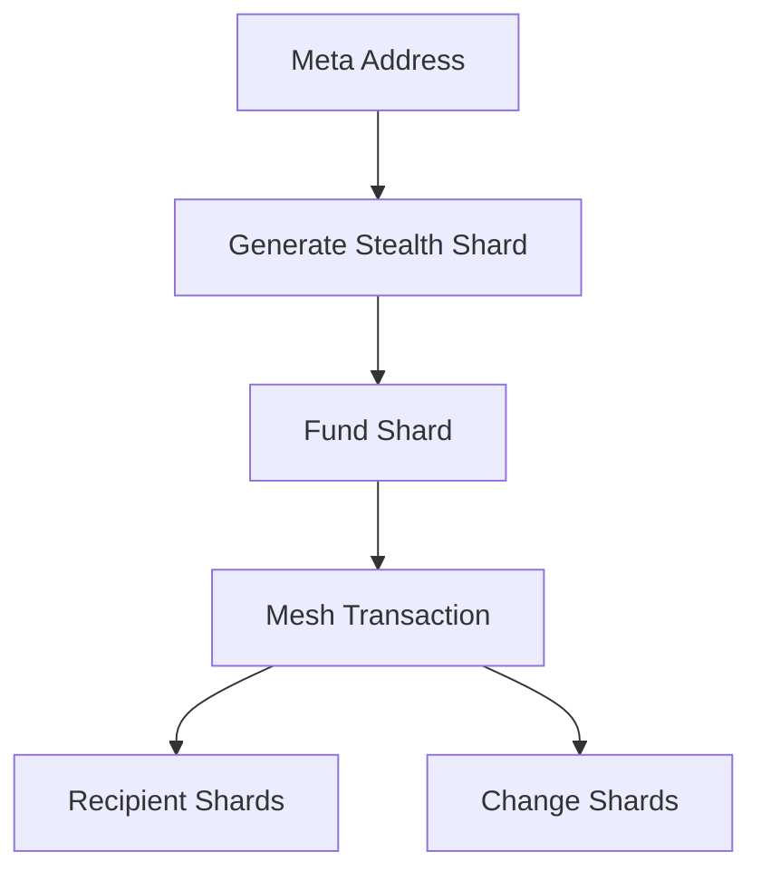

> **v0 — Testnet Only.** Not audited, and subject to change. Refer to the future paper for the full picture. Do not use with real funds.

# GhostShard Protocol

> **UTXO-style privacy for post-Pectra EVM chains**

GhostShard combines **ERC-5564 stealth addresses**, **EIP-7702 native account abstraction**, and a **shard-based UTXO model** to provide practical privacy on EVM chains without zk-proofs, mixers, trusted setup, or custom execution environments.

Every deposit creates a **Shard** — a one-time-use stealth EOA that holds assets.

Every spend destroys old shards and creates fresh recipient and change shards through a **Mesh Transaction**, making transaction flows difficult to correlate while remaining fully compatible with existing EVM infrastructure.

> ⚠️ Experimental software
>
> Not audited. Do not use with real funds.

---

## Contents

### Overview
- [Why GhostShard?](#why-ghostshard)
- [Protocol Overview](#protocol-overview)
- [Key Properties](#key-properties)
- [Privacy Model](#privacy-model)

### Technical Reference
- [Technology Stack](#technology-stack)
- [Architecture](#architecture)
- [Repository Structure](#repository-structure)

### Additional Resources
- [Documentation](#documentation)
- [Comparison With Existing Approaches](#comparison-with-existing-approaches)
- [Deployed Contracts](#deployed-contracts)

### Project Information
- [Status](#status)
- [License](#license)

---

## Why GhostShard?

Most EVM privacy systems require one or more of the following tradeoffs:

- Liquidity pools and mixers
- Expensive zero-knowledge proving
- Isolated privacy ecosystems
- Limited NFT support
- Custom execution environments

GhostShard takes a different approach.

Instead of hiding state behind encryption, it creates privacy through **UTXO topology and structural ambiguity**:

- One-time-use stealth shards
- Recipient/change ambiguity
- Multi-split fingerprint resistance
- Native NFT privacy
- Gas-sponsored execution
- Full DeFi composability

---

## Protocol Overview

### Lifecycle

1. Recipient publishes a Meta-Address.
2. Sender generates a fresh stealth shard.
3. Assets are deposited into the shard.
4. The shard is spent through a Mesh Transaction.
5. New recipient and change shards are created.
6. Outputs are announced through ERC-5564.

**Every shard is spent exactly once.**

Recipient and change shards are intentionally indistinguishable on-chain.

---

## Key Properties

| Property | Description |
|-----------|------------|
| Privacy | Sender, receiver, and flow unlinkability |
| No ZK Required | No proving systems or trusted setup |
| Native NFT Support | ERC-721 privacy as a first-class feature |
| Composable | Works directly with existing DeFi |
| Chain Agnostic | Same deployment model across EVM chains |
| Gas Sponsored | Relayer + paymaster architecture |
| Universal Wallet Support | Any wallet supporting signTypedData |

---

## Privacy Model

GhostShard achieves privacy through structural ambiguity rather than total encryption.

### Hidden

- Sender identity
- Receiver identity
- Sender ↔ receiver relationship
- Recipient vs change outputs
- Wallet-size inference
- Amount fingerprinting

### Public

- Announcement events
- Relayer activity
- Gas usage
- Paymaster sponsorship

For formal privacy analysis, anonymity-set discussion, attack modeling, and economic analysis, see the future GhostShard Paper.

---

## Technology Stack

| Standard | Role |
|----------|------|
| ERC-5564 | Stealth addresses, announcements, ECDH key exchange |
| EIP-7702 | Native account abstraction and delegation |
| ERC-6538 | Meta-address registry |
| EIP-191 | Command authorization and verification |
| Multicall3 | Batched shard verification |
| ERC-4337 Patterns | Relayer and paymaster architecture |
| ERC-721 | Native NFT privacy support |
| CREATE2 | Deterministic cross-chain deployment |

---

## Architecture

GhostShard consists of five major components:

1. GhostShard SDK
2. GhostRouter
3. GhostShard Delegation Contract
4. Paymaster
5. Relayer

Implementation details are documented in `ARCHITECTURE.md`.

---

## Repository Structure

| Package | Language | Description |
|---------|----------|-------------|
| ghost-router-singleton | Solidity / Foundry | Router, delegation contracts, deployment |
| ghost-shard-sdk | TypeScript | Key derivation, shard management, sync |
| ghost-services | TypeScript | Paymaster and relayer services |

---

## Documentation

| Document | Purpose |
|----------|----------|
| ARCHITECTURE.md | Implementation architecture |
| SECURITY.md | Security assumptions and threat model |
| PAPER.md | Comprehensive protocol paper (coming soon) |
| SDK Docs | SDK reference |
| Service Docs | Relayer and paymaster reference |

---

## Comparison With Existing Approaches

| Approach | Main Tradeoff | GhostShard Alternative |
|----------|--------------|------------------------|
| Mixers | Liquidity pools and denomination constraints | Independent stealth shards |
| zk Privacy Systems | Proving costs and circuit complexity | No proofs required |
| Stealth Addresses Alone | No lifecycle management | Full UTXO model |
| ERC-4337 | No privacy guarantees | Privacy-native execution |
| Privacy Chains | Fragmented liquidity | Existing EVM chains |
| Privacy Pools | Percentage-based fees | Gas-only cost model |

---

## Deployed Contracts

**Network:** Arbitrum Sepolia

| Contract | Address |
|----------|---------|
| GhostRouter | `0x51e492BdABC67C0b9A17C9d1bf1ee4A350B2eD2F` |
| GhostShard | `0x595CA02aa2B7aCef699a773a4572Dc4AaD8b4Fe3` |
| ERC-5564 Announcer | `0x55649E01B5Df198D18D95b5cc5051630cfD45564` |
| ERC-6538 Registry | `0x6538E6bf4B0eBd30A8Ea093027Ac2422ce5d6538` |
| Multicall3 | `0xcA11bde05977b3631167028862bE2a173976CA11` |

---

## Status

- v0
- Testnet only
- Not audited
- APIs may change
- Active research and development

---

## License

MIT
