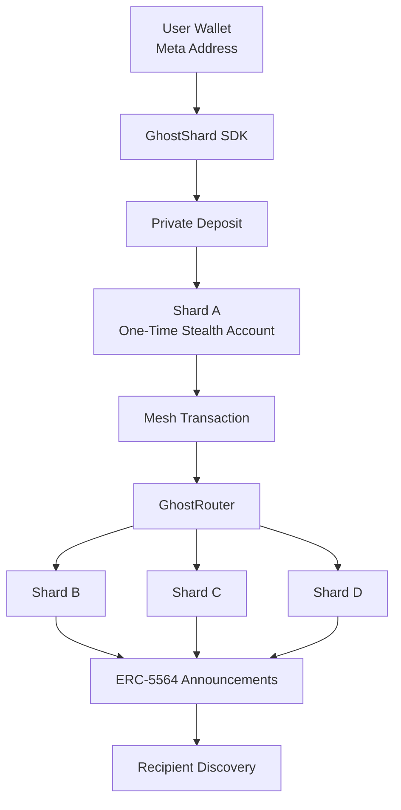
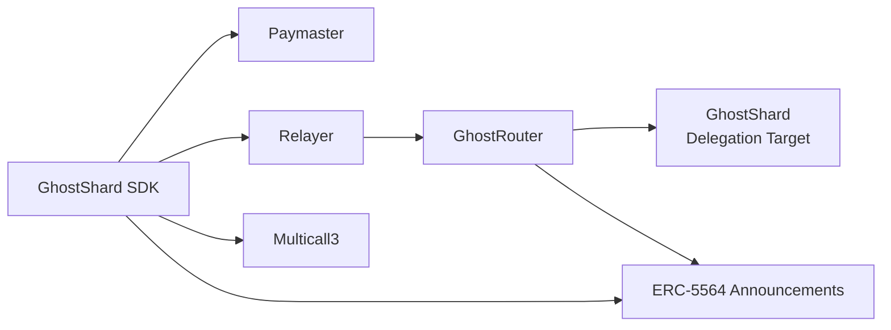
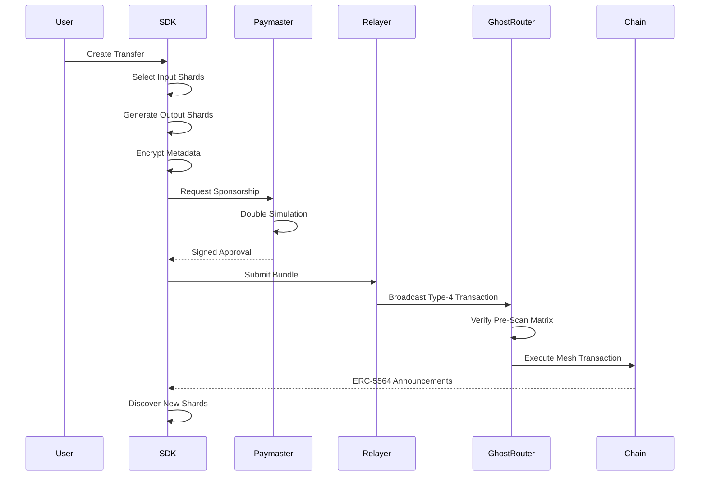

> **v0 — Testnet Only.** Not audited, and subject to change. Refer to the [GhostShard Paper](./GhostWhale.md) for the full picture. Do not use with real funds.

# GhostShard Protocol

**UTXO-style privacy for post-Pectra EVM chains**

GhostShard makes ownership on EVM chains disposable. Instead of assets accumulating in a traceable account, every deposit creates a one-time-use stealth account — a **shard** — that is permanently retired after a single spend. Privacy emerges from **ownership topology**, not transaction encryption: observers can see every transaction, but cannot reliably determine who owns what.

No zk-proofs. No trusted setup. No mixer pools. No custom execution environment. ERC-5564 stealth addresses + EIP-7702 account abstraction + sponsored mesh transactions.

---

## Why Privacy on the EVM?

On a standard EVM chain, every address is a permanent identity. It accumulates history, balances, counterparties, and behavioral fingerprints — indefinitely. Even if individual transactions were shielded, the persistence of ownership itself leaks information.

Existing approaches operate at the **transaction layer**: mixers pool funds, privacy pools shield state, and stealth addresses obscure recipients. All leave ownership visible.

GhostShard operates one layer deeper. It asks: *what if no ownership unit ever persists long enough to analyze?*

The answer: every asset lives in a one-time-use shard. Spend the shard, destroy the shard, create new shards.

---

## Architecture Overview



GhostShard transforms persistent account ownership into disposable ownership shards.

Every deposit creates a new one-time stealth account called a **shard**. Once spent, a shard is permanently retired and replaced with newly generated shards. Ownership therefore exists as a constantly evolving graph rather than a persistent account balance.

Privacy emerges from ownership topology rather than transaction encryption. Transactions remain visible on-chain, but determining asset ownership becomes significantly more difficult because ownership units are continuously destroyed and recreated.

### System Components



#### GhostShard SDK

Client-side software responsible for:

- Key derivation
- Shard discovery
- Coin selection
- Transaction construction
- Sponsorship requests
- Chain synchronization

#### GhostRouter

Singleton execution coordinator responsible for:

- Atomic mesh execution
- Pre-scan validation
- Paymaster accounting
- Announcement processing
- Transfer orchestration

#### GhostShard

EIP-7702 delegation target that enables stealth EOAs to transfer assets under GhostRouter control.

#### Paymaster

Gas sponsorship service powered by a Double Simulation engine for accurate gas estimation and reimbursement.

#### Relayer

Transaction broadcaster responsible for submitting sponsored mesh transactions to the network.

### Transfer Lifecycle



### Pre-Scan Matrix

Before executing any transfers, GhostRouter reads the 23-byte EIP-7702 designator (`0xef0100 || target`) from each shard via `extcodecopy` and verifies the claimed delegation target matches runtime code. This prevents execution against shards that have been re-delegated or corrupted since authorization.

### One-Time Use Enforcement

GhostRouter maintains `isShardSpent[shard]` — updated only during successful execution. Nonce-based detection fails under EIP-7702 (nonce increments even on revert). Code-based detection fails (delegation persists on revert). Explicit spent tracking is the only mechanism that satisfies correctness, retry safety, unambiguous state, and permanent persistence simultaneously.

### Shard Compression

Because every deposit creates a new shard and every spend retires shards, ownership naturally fragments. The SDK's coin-selection engine opportunistically includes extra shards as "compression shards" (scaling as `√walletSize` with a hard cap of 15), consuming excess shards alongside payment inputs and merging them into fewer outputs. This bounds wallet complexity and obscures wallet-size inference.

### Fragmentation → Atomicity → 7702 → Gas Sponsorship

Fragmentation means a single payment may require many shards. Partial execution would strand funds. The solution is atomic execution. Atomic multi-shard execution requires a shared execution context. EIP-7702 provides this natively via authorization lists. But shards hold assets, not ETH — so they need gas sponsorship. Hence: paymasters and relayers.

---

## Key Features

| Feature | Detail |
|---------|--------|
| **Hidden balances** | Asset ownership distributed across ephemeral stealth shards |
| **Private transfers** | Mesh transactions with many-to-many input/output mapping |
| **Unlinkable flows** | Recipient/change outputs are structurally indistinguishable |
| **NFT privacy** | ERC-721 tokens held by disposable shards — same model as fungible assets |
| **No zk-proofs** | No circuits, no trusted setup, no proving system |
| **Gas sponsorship** | EIP-7702 paymaster pipeline — shards never need ETH for gas |
| **Selective disclosure** | Transaction-level viewing keys for auditing without exposing full history |
| **Cross-chain** | CREATE2 deterministic deployment — same addresses on every EVM chain |
| **Composable** | Shards are standard EOAs — interact with any existing DeFi protocol |

---

## Technology Stack

| Standard | Role |
|----------|------|
| ERC-5564 | Stealth addresses, announcements, ECDH key exchange |
| EIP-7702 | Native account abstraction and multi-authorization delegation |
| ERC-6538 | Meta-address registry |
| EIP-191 | Command authorization and verification |
| Multicall3 | Batched shard balance verification and spent-status checks |
| ERC-721 | Native NFT privacy support |
| CREATE2 | Deterministic cross-chain deployment |

---

## Quick Start

### Install

```bash
npm install @ghost-shard/sdk
# peer deps: viem ^2.0.0, wagmi ^3.0.0, @tanstack/react-query ^5.0.0
```

### Initialize and Sync

```typescript
import { GhostClient } from '@ghost-shard/sdk';
import { privateKeyToAccount } from 'viem/accounts';
import { arbitrumSepolia } from 'viem/chains';

const account = privateKeyToAccount('0x...');
const ghost = new GhostClient({
  chain: arbitrumSepolia,
  rpcUrl: 'https://arb-sepolia.g.alchemy.com/v2/...',
  startBlock: 272_798_021n,
  paymasterUrl: 'http://localhost:3000/api/v0/paymaster/sign',
  relayerUrl: 'http://localhost:3000/api/v0/relay',
});

// Derives spending, viewing, and encryption keys from your wallet
await ghost.init(account);

// Scan for shards belonging to you
await ghost.syncWithChain();
console.log('Balance:', ghost.getBalance());
```

### Send a Private Transfer

```typescript
const { txHash, wait } = await ghost.relayTransfer(
  {
    metaAddress: 'st:eth:0x...',  // recipient's published meta-address
    amount: 500_000_000_000_000n,   // 0.0005 ETH
    type: 'NATIVE',
  },
  account, // viem WalletClient or PrivateKeyAccount
);

console.log('Transaction:', txHash);
const result = await wait();
console.log('Success:', result.success);
```

Full examples: [ghost-shard-sdk/examples/](./ghost-shard-sdk/examples/)

---

## SDK Architecture

```
@ghost-shard/sdk
├── GhostClient          Key derivation, shard store, tx building, sync, relay
├── @ghost-shard/sdk/identity   Stealth addresses, meta-addresses, announcement crypto
├── @ghost-shard/sdk/utils      parseLog, preparePrivateDeposit, isMetaAddress
└── @ghost-shard/sdk/rpc        JsonRpcClient, fetchAnnouncements, fetchNonces
```

**SDK lifecycle:** `init → sync → discover shards → build → sponsor → relay → confirm`

---

## Contracts

```
ghost-router-singleton/
├── src/GhostRouter.sol   Mesh execution, paymaster accounting, pre-scan matrix
├── src/GhostShard.sol    EIP-7702 delegation target (transferNative/ERC20/ERC721)
└── script/               Foundry deployment scripts (CREATE2)
```

Both contracts are deployed with deterministic salts — same address on every EVM chain. No admin keys, no proxy, no upgrade mechanism.

---

## Deployed Contracts

**Network:** Arbitrum Sepolia

| Contract | Address |
|----------|---------|
| GhostRouter | `0x6f67E047D1Fe5de0b62b187c28dB1cf1F4f560fb` |
| GhostShard | `0x295549A545E41af6cbCe09AbF012de172AC321AE` |
| ERC-5564 Announcer | `0x55649E01B5Df198D18D95b5cc5051630cfD45564` |
| ERC-6538 Registry | `0x6538E6bf4B0eBd30A8Ea093027Ac2422ce5d6538` |
| Multicall3 | `0xcA11bde05977b3631167028862bE2a173976CA11` |

---

## Repository Structure

| Package | Language | Description |
|---------|----------|-------------|
| `ghost-router-singleton/` | Solidity / Foundry | Router, delegation contracts, CREATE2 deployment |
| `ghost-shard-sdk/` | TypeScript / viem | Key derivation, shard management, tx building, sync |
| `ghost-services/` | TypeScript / Express | Unified paymaster + relayer service with FIFO queue |

---

## Documentation

- **[GhostShard Paper (GhostWhale.md)](./GhostWhale.md)** — Full protocol specification: design rationale, cryptographic foundations, execution model, privacy analysis, selective disclosure, security analysis, gas evaluation, and formal comparison with existing approaches
- [SDK README](./ghost-shard-sdk/README.md) — API reference, integration guides, React/wagmi patterns, IndexedDB storage adapter
- [Contracts README](./ghost-router-singleton/README.md) — Contract interface, CREATE2 deployment, security properties
- [SDK Quick Start](./ghost-shard-sdk/QUICKSTART.md) — Getting started guide

---

## Performance

Based on 22 measured transactions on Arbitrum Sepolia spanning Native ETH, ERC-20, and ERC-721 transfers.

### Scaling

Total gas scales linearly with transfer commands. Transfer count alone explains **98.4%** of observed gas variance (R² = 0.984). No super-linear growth observed across the measured range of 1–29 transfer commands.

**Regression model:** `G_total = 194,728 + 67,722 × N_t`

Each additional transfer command costs ~68k gas on average.

### Gas Decomposition

| Component | Native Avg | ERC-20 Avg | Share (Native) | Share (ERC-20) |
|-----------|-----------:|-----------:|---------------:|---------------:|
| Preverification | 224,553 | 292,935 | 19.4% | 22.8% |
| Verification | 193,749 | 214,660 | 16.8% | 16.7% |
| Execution | 738,512 | 776,367 | **63.8%** | **60.5%** |
| **Total** | **1,156,818** | **1,283,962** | — | — |

Execution (asset movement + announcements) dominates. Verification overhead stays bounded at 16–23% of total gas.

### Amortization

Fixed protocol costs (paymaster validation, authorization processing, calldata decoding) are paid once per transaction and amortize across all bundled transfers.

| Metric | 1 Transfer | 29 Transfers | Improvement |
|--------|----------:|------------:|------------:|
| Total gas/transfer | ~232,000 | ~72,447 | **~3.2×** |
| Execution gas/transfer | ~98,909 | ~44,870 | **~2.2×** |
| Verification gas/transfer | ~52,681 | ~11,879 | **~4.4×** |
| Preverification gas/transfer | ~79,520 | ~15,698 | **~5.1×** |

Most amortization benefit is realized between 1–12 transfers; beyond ~15 transfers, gas per transfer stabilizes.

### Discovery

ERC-5564 view tags reduce announcement-scanning cryptographic workload by **~256×** — only ~1 in 256 announcements requires a full ECDH computation.

### Full Dataset Summary

| | Range |
|--|-------|
| Transfer commands | 1–29 |
| Input shards | 1–9 |
| Output announcements | 1–8 |
| Total gas | 231,110–2,100,977 |
| Mean total gas | 1,137,847 |

Complete per-transaction data and on-chain transaction hashes: [Appendix B, GhostWhale.md](./GhostWhale.md#appendix-b--gas-measurement-dataset)

---

## Privacy Model

### Hidden
- Sender identity
- Receiver identity
- Sender ↔ receiver relationship
- Recipient vs. change output distinction
- Wallet-size inference (compression)
- Transfer amounts (randomized multi-split)

### Public
- Announcement events (encrypted metadata)
- Relayer activity
- Gas usage
- Paymaster sponsorship

For formal privacy analysis, anonymity-set modeling, attack surfaces, and economic analysis — see the [paper](./GhostWhale.md).

### Compliance

GhostShard supports **selective disclosure**: users can prove specific transactions to authorized auditors without exposing their full financial history. Deterministic proof generation from invoice references enables institutional-compliant privacy.

---

## Status

| | |
|---|---|
| **Version** | v0 |
| **Network** | Testnet (Arbitrum Sepolia) |
| **Audit** | Not audited |
| **APIs** | May change |
| **Development** | Active research & development |

**Implemented:** EIP-7702 delegation, multi-authorization atomic execution, pre-scan code integrity, transient storage deduplication, Double Simulation gas engine, paymaster deposit/withdrawal, ERC-20/ERC-721 relay, Multicall3 balance verification.

---

## License

MIT
