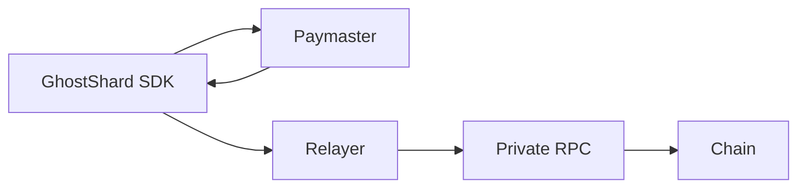
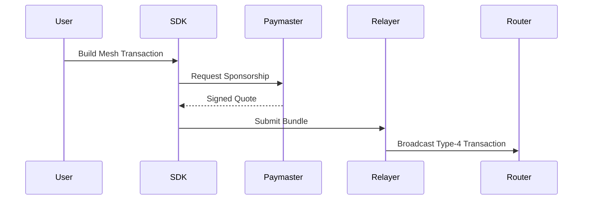
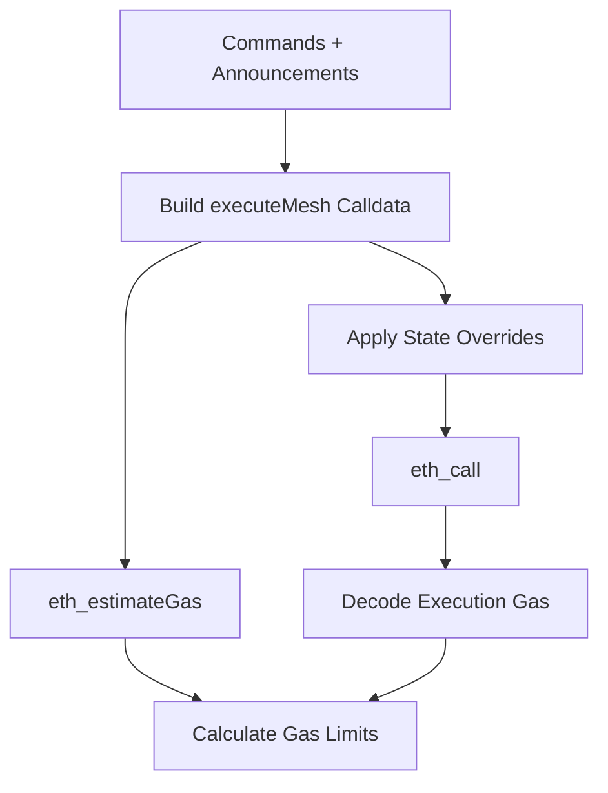
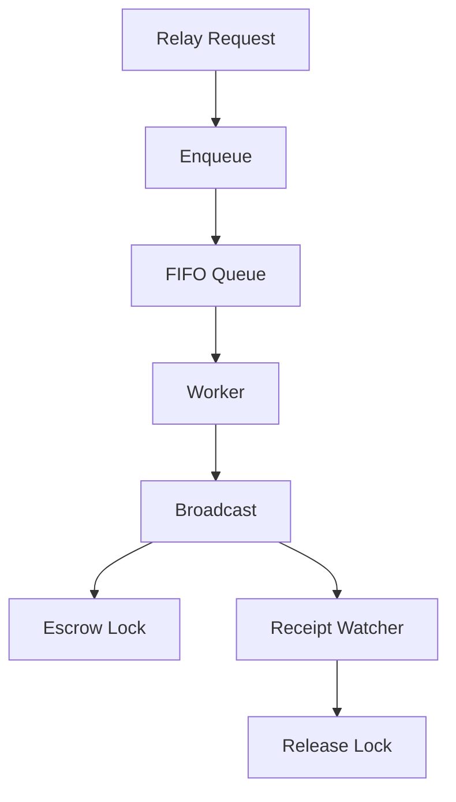

> **v0 — Testnet Only.** Not audited, and subject to change. Refer to the future paper for the full picture. Do not use with real funds.

# GhostShard Services

> Unified backend infrastructure powering GhostShard sponsorship and transaction execution.
>
> **@ghost-router/services** combines the Paymaster and Relayer into a single Express service.

The Paymaster uses a **Double Simulation Gas Engine** (`eth_call` + `eth_estimateGas`) to derive precise gas limits without heuristic estimation.

The Relayer enforces **strict sequential transaction submission** to prevent nonce conflicts and safely manage paymaster escrow accounting.

---

## Contents

- [Architecture Overview](#architecture-overview)
- [API Reference](#api-reference)
- [Double Simulation Gas Engine](#double-simulation-gas-engine)
- [Sequential Transaction Queue](#sequential-transaction-queue)
- [Configuration](#configuration)
- [Deployment](#deployment)
- [State Overrides (Simulation)](#state-overrides-simulation)
- [License](#license)

---

## Architecture Overview



### Request Lifecycle



---

## API Reference

### POST `/api/v0/paymaster/sign`
Quotes gas and signs a paymaster sponsorship.

### POST `/api/v0/relay`
Relays a signed paymaster-sponsored bundle.

### GET `/api/v0/health`
Unified service health endpoint.

### GET `/api/v0/paymaster/health`
Paymaster health endpoint.

### GET `/api/v0/relayer/health`
Relayer health endpoint.

---

## Double Simulation Gas Engine



### Output Metrics

| Metric | Purpose |
|----------|----------|
| preVerificationGas | Network overhead |
| verificationGasLimit | Validation execution |
| callGasLimit | Asset execution |
| maxFeePerGas | Fee ceiling |

---

## Sequential Transaction Queue



---

## Configuration

Environment-variable driven configuration.

## Deployment

```bash
npm run dev
npm run build
npm start
```

---

## State Overrides (Simulation)

| Address | Override | Purpose |
|---------|----------|---------|
| Dummy Relayer | Balance override | Simulation |
| Shard EOAs | Delegated code | EIP-7702 simulation |
| GhostRouter | Deposit override | Gas validation |

---

## License

MIT
