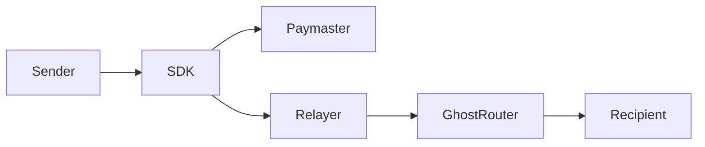
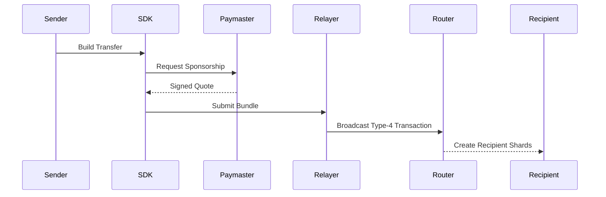
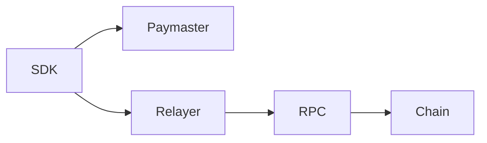
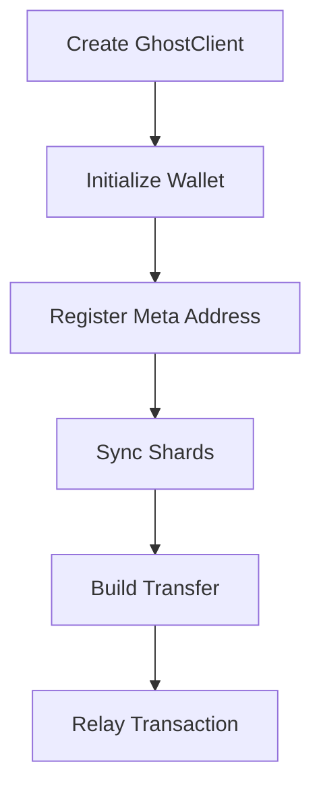
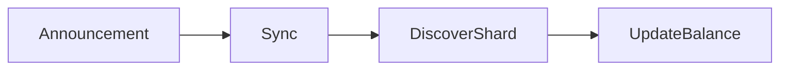

> **v0 — Testnet Only.** Not audited, not production-ready, and subject to change. Refer to the future paper for the full picture. Do not use with real funds.

# GhostShard Quickstart

Get a full GhostShard privacy flow running on Arbitrum Sepolia in under 10 minutes.

---

## Contents

- [Architecture Overview](#architecture-overview)
- [Prerequisites](#prerequisites)
- [Step 1: Deploy Contracts](#step-1-deploy-contracts-local--custom-chain)
- [Step 2: Start Ghost Services](#step-2-start-ghost-services)
- [Step 3: Run the SDK Examples](#step-3-run-the-sdk-examples)
- [Step 4: Minimal Integration](#step-4-minimal-integration)
- [Step 5: Receive Funds](#step-5-receive-funds)
- [Next Read](#next-read)

---

## Architecture Overview



### End-to-End Flow



---

## Prerequisites

- Node.js v18+
- Foundry (if deploying locally)
- Arbitrum Sepolia RPC
- Testnet ETH

---

## Step 1: Deploy Contracts (Local / Custom Chain)

If you're using Arbitrum Sepolia, the contracts are already deployed — skip to Step 2.

For a local chain or a new network:

```bash
cd packages/ghost-router-singleton
cp .env.example .env
# Edit .env:
#   DEPLOYER_PRIVATE_KEY=0x...
#   RPC_URL=http://localhost:8545

# Deploy GhostRouter
forge script script/DeployGhostRouter.s.sol --rpc-url $RPC_URL --broadcast

# Set GHOST_ROUTER_ADDRESS in .env, then deploy GhostShard
forge script script/DeployGhostShard.s.sol --rpc-url $RPC_URL --broadcast
```


## Step 2: Start Ghost Services

```bash
cd packages/ghost-services
cp .env.example .env
# Edit .env:
#   ROUTER_ADDRESS=0x6f67E047D1Fe5de0b62b187c28dB1cf1F4f560fb
#   PAYMASTER_PRIVATE_KEY=0x...
#   RELAYER_PRIVATE_KEY=0x...
#   READ_RPC_URL=https://arb-sepolia.g.alchemy.com/v2/YOUR_KEY
#   PRIVATE_RPC_URL=https://arb-sepolia.g.alchemy.com/v2/YOUR_KEY
#   PORT=3000

npm install
npm run dev
```

You should see:

```
[Ghost Services] Unified service listening on port 3000
[Ghost Services] Paymaster: http://localhost:3000/api/v0/paymaster/sign
[Ghost Services] Relayer:   http://localhost:3000/api/v0/relay
[Ghost Services] Chain:     Arbitrum Sepolia (421614)
[Ghost Services] Router:    0x51e492...
```

### Service Architecture



## Step 3: Run the SDK Examples

```bash
cd packages/ghost-shard-sdk
# Edit .env:
#   PRIVATE_KEY=0x...
#   RPC_URL=https://arb-sepolia.g.alchemy.com/v2/YOUR_KEY

npm install

# Example 1: Self-deposit (no relay needed — funds a shard directly)
npx tsx examples/01-native-setup.ts

# Example 2: ERC20 setup
npx tsx examples/02-erc20-setup.ts

# Example 3: Relay a native transfer (full privacy flow)
npx tsx examples/03-relay-native-transfer.ts

# Example 4: Relay an ERC20 transfer
npx tsx examples/04-relay-erc20-transfer.ts
```

## Step 4: Minimal Integration

### Client Lifecycle



```typescript
import { GhostClient } from '@ghost-shard/sdk';
import { privateKeyToAccount } from 'viem/accounts';
import { arbitrumSepolia } from 'viem/chains';

// 1. Create client
const ghost = new GhostClient({
  chain: arbitrumSepolia,
  rpcUrl: 'https://arb-sepolia.g.alchemy.com/v2/YOUR_KEY',
  paymasterUrl: 'http://localhost:3000/api/v0/paymaster/sign',
  relayerUrl: 'http://localhost:3000/api/v0/relay',
  startBlock: 272_798_021n,
});

// 2. Initialize with any wallet
const account = privateKeyToAccount('0x...');
await ghost.init(account);

// 3. Register your meta-address on-chain (one-time)
const { to, data } = ghost.prepareRegisterMetaAddress();
// Submit this transaction via your wallet (e.g. wallet_sendTransaction)

// 4. Sync incoming shards
await ghost.syncWithChain();
console.log('ETH Balance:', ghost.getBalance());
console.log('Shards:', ghost.getShards().length);

// 5. Send privately to a recipient
const recipientMetaAddress = 'st:eth:0x...'; // get this from the recipient

const { txHash, wait } = await ghost.relayTransfer({
  type: 'NATIVE',
  metaAddress: recipientMetaAddress,
  amount: 1_000_000_000_000_000n, // 0.001 ETH
}, account);

console.log('Tx hash:', txHash);

const result = await wait();
console.log(result.success ? 'Transfer complete!' : 'Transfer failed:', result.revertReason);
```

## Step 5: Receive Funds

### Receiver Flow



The recipient runs the same sync loop:

```typescript
// Receiver side
const ghost = new GhostClient({ chain, rpcUrl });
await ghost.init(receiverAccount);

// Listen for incoming shards
ghost.on('shard:discovered', ({ shard }) => {
  console.log('New shard discovered:', shard.address);
  console.log('Assets:', shard.assets);
});

// Sync periodically
await ghost.syncWithChain();
console.log('Total balance:', ghost.getBalance());
```

## Next Read

- ARCHITECTURE.md
- SDK README
- Contract README
- Services README
