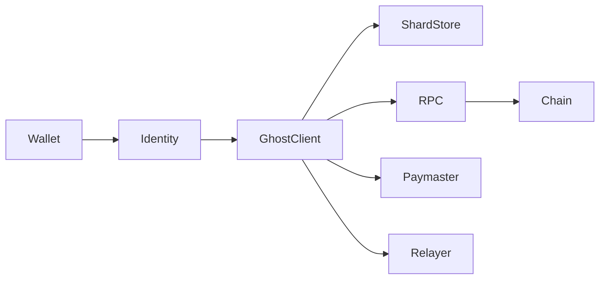
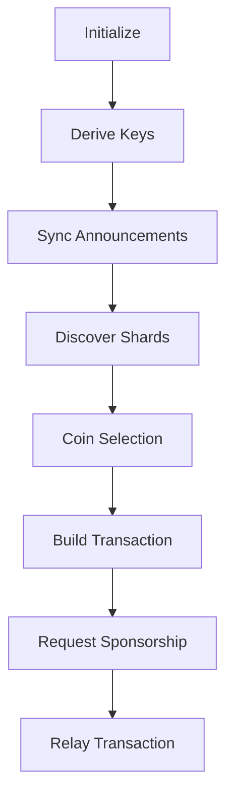

> **v0 — Testnet Only.** Not audited, and subject to change. Refer to the future paper for the full picture. Do not use with real funds.

# GhostShard SDK

**`@ghost-shard/sdk`** — TypeScript SDK for integrating GhostShard privacy into dApps, wallets, and scripts.

Handles the full lifecycle: key derivation from any wallet, shard discovery and management, multi-split coin selection, transaction building (EIP-7702 + EIP-191), paymaster/relayer integration, and on-chain balance verification.

---

## Contents

### Getting Started
- [Installation](#installation)
- [Package Exports](#package-exports)
- [GhostClient](#ghostclient)

### Core Concepts
- [Identity Layer](#identity-layer)
- [RPC Layer](#rpc-layer)
- [Coin Selection](#coin-selection)
- [Multicall3 Utilities](#multicall3-utilities)

### Integration Guides
- [Common Patterns](#common-patterns)
- [Build & Test](#build--test)
- [License](#license)

---

## SDK Architecture



## GhostClient Lifecycle



---

## Installation

```bash
npm install @ghost-shard/sdk
```

**Peer dependencies** (must be installed separately):

```
viem ^2.0.0
wagmi ^3.0.0
@tanstack/react-query ^5.0.0
```

---

## Package Exports

For tree-shaking, the SDK is split into subpath exports:

| Import | Contents |
|--------|----------|
| `@ghost-shard/sdk` | Full `GhostClient` — key management, shard store, tx building, relay, sync |
| `@ghost-shard/sdk/identity` | Key derivation, stealth address generation, meta-address encoding, announcement packing |
| `@ghost-shard/sdk/utils` | `parseLog`, `preparePrivateDeposit`, `isMetaAddress` |
| `@ghost-shard/sdk/rpc` | `JsonRpcClient`, `fetchAnnouncements`, `fetchNonces` |

---

## GhostClient

The primary interface. All high-level operations flow through this class.

### Constructor

```typescript
import { GhostClient } from '@ghost-shard/sdk';
import { arbitrumSepolia } from 'viem/chains';

const ghost = new GhostClient({
  chain: arbitrumSepolia,                          // viem Chain
  rpcUrl: 'https://arb-sepolia.g.alchemy.com/...', // JSON-RPC endpoint
  startBlock: 272_798_021n,                         // block to start scanning from
  paymasterUrl: 'http://localhost:3000/api/v0/paymaster/sign', // optional
  relayerUrl: 'http://localhost:3000/api/v0/relay',            // optional
  storage: myStorageAdapter,                        // optional ShardStorage
});
```

### Initialization

```typescript
import { privateKeyToAccount } from 'viem/accounts';

const account = privateKeyToAccount('0x...');
await ghost.init(account);
```

`init()` performs EIP-712 typed data signing to derive a root seed, then derives the spending key, viewing key, and DB encryption key via HKDF-SHA256. If a `ShardStorage` adapter is configured, persisted shards are loaded automatically.

The signer only needs to implement:

```typescript
interface GhostIdentitySigner {
  address: Hex;
  signTypedData(args: { domain, types, primaryType, message }): Promise<Hex>;
}
```

This is compatible with any viem `WalletClient`, `PrivateKeyAccount`, or custom signer.

### Key & Address Methods

```typescript
// Get your meta-address (share this with counterparties)
const metaAddress: string = ghost.getMetaAddress();
// → "st:eth:0x<134 hex chars>"

// Generate a fresh shard address for sending to a recipient
const { stealthAddress, ephemeralPubKey, sharedSecret } =
  ghost.generateStealthAddress('st:eth:0x...');

// Generate a fresh deposit address (self-addressed, for change or self-send)
const { stealthAddress, ephemeralPubKey, sharedSecret } =
  ghost.getNewDepositAddress();

// Register your meta-address on-chain (ERC-6538, one-time)
const { to, data } = ghost.prepareRegisterMetaAddress(schemeId?: number);

// Look up someone's meta-address from the on-chain registry
const meta: string | null = await ghost.lookupMetaAddress('0x...');
```

### Discovery & Sync

```typescript
// Full sync: fetch logs → trial-decrypt → check spent → verify balances
const result = await ghost.syncWithChain(syncFromStart?: boolean);
// result: { shards: DiscoveredShard[], processed: number, matches: number }

// Auto-sync every 15 seconds
ghost.startAutoSync(15000);
ghost.stopAutoSync();
```

**Sync pipeline:**

1. Fetch ERC-5564 `Announcement` events from the announcer contract.
2. Trial-decrypt each announcement using the viewing key (viewTag fast-reject).
3. Parse asset metadata from matched announcements.
4. Check `isShardSpent` on GhostRouter via Multicall3 batch.
5. Verify on-chain balances via Multicall3 batch.

**Events emitted during sync:**

```typescript
ghost.on('shard:discovered', ({ shard }) => { /* new shard found */ });
ghost.on('shard:spent',      ({ address }) => { /* shard was spent on-chain */ });
ghost.on('sync:complete',    ({ discovered }) => { /* sync finished */ });
ghost.on('sync:error',       ({ error }) => { /* sync failed */ });
```

### Balance & Shard Queries

```typescript
// Total balance for an asset type
const ethBalance: bigint = ghost.getBalance();                    // NATIVE
const usdcBalance: bigint = ghost.getBalance('ERC20', usdcAddress);

// List all held NFTs
const nfts: NFT[] = ghost.listNFTs();

// List shards (optionally including zero-balance)
const shards: Shard[] = ghost.getShards(includeZeroBalances?: boolean);

// Export/import for backup or migration
const state: PersistedState = ghost.exportShards();
await ghost.importShards(state);
```

### Transaction Building

#### Public Transfer (known recipient)

```typescript
// Build only (read-only, no state change)
const prepared: PreparedTransfer = await ghost.buildTransaction({
  type: 'NATIVE',
  to: '0xRecipient...',
  amount: 1_000_000_000_000_000n, // 0.001 ETH
});

// Build + confirm (marks input shards as pending, adds change shards)
const prepared: PreparedTransfer = await ghost.prepareTransfer({
  type: 'ERC20',
  to: '0xRecipient...',
  tokenAddress: '0xUSDC...',
  amount: 100_000_000n, // 100 USDC
});
```

#### Private Transfer (stealth recipient)

```typescript
const prepared: PreparedTransfer = await ghost.preparePrivateTransfer({
  type: 'NATIVE',
  metaAddress: 'st:eth:0x...',
  amount: 500_000_000_000_000n, // 0.0005 ETH
});
```

#### Full Relay Flow

```typescript
const { txHash, wait, commands, announcements, changeShards } =
  await ghost.relayTransfer(request, signer);

console.log('Transaction hash:', txHash);

// Wait for confirmation (decoupled — can be called later)
const result: MeshExecutionResult = await wait();
// result: { success, revertReason, relayer, paymaster, totalGasUsed, ... }
```

The relay flow: build → confirm → user signature → paymaster quote → relayer submit → return txHash immediately. The `wait()` promise resolves when the transaction is mined and the inner execution status is confirmed.

#### PreparedTransfer Structure

```typescript
interface PreparedTransfer {
  authorizations: Authorization[];           // EIP-7702 delegations (nonce=0)
  commands: TransferCommand[];               // EIP-191 signed transfer instructions
  announcements: Announcement[];             // ERC-5564 announcement data for new shards
  changeShards: {                            // Change output details
    address: Hex;
    ephemeralPubKey: Hex;
    amount: bigint;
  }[];
  shardAddresses: Hex[];                     // Input shard addresses being spent
  changeAmount: bigint;                      // Total change amount
}
```

### Transaction Confirmation & Rollback

```typescript
// After successful relay — spent shards are removed, change shards persist
await ghost.confirmTransaction(spentShardAddresses);

// On failure — pending status is reverted, change shards are removed
await ghost.confirmFailed(spentShardAddresses, changeAddress?);
```

### ShardStorage Interface

Implement this to persist shards to IndexedDB, localStorage, a database, etc.:

```typescript
interface ShardStorage {
  load(encryptionKey: Uint8Array): Promise<PersistedState>;
  save(state: PersistedState, encryptionKey: Uint8Array): Promise<void>;
}

interface PersistedState {
  shards: Shard[];
  lastSyncedBlock: bigint | null;
}
```

The `encryptionKey` is derived from the root seed — it is deterministic per user but not derivable from the wallet alone.

---

## Identity Layer

Import from `@ghost-shard/sdk/identity` for direct access to cryptographic operations.

### Key Derivation

```typescript
import { entropyFromEIP712, deriveKeys } from '@ghost-shard/sdk/identity';

// Step 1: Derive root seed from EIP-712 signature
const { rootSeed, account } = await entropyFromEIP712(signer, chainId);

// Step 2: Derive full key set
const keys = deriveKeys(rootSeed);
// keys: {
//   spendingPrivateKey: Uint8Array,   // 32 bytes
//   spendingPublicKey: Uint8Array,    // 33 bytes compressed
//   viewingPrivateKey: Uint8Array,   // 32 bytes
//   viewingPublicKey: Uint8Array,    // 33 bytes compressed
//   dbEncryptionKey: Uint8Array,     // 32 bytes
// }
```

### Stealth Address Generation

```typescript
import { generateStealthAddress, getNewDepositAddress } from '@ghost-shard/sdk/identity';

// For sending to a recipient
const { stealthAddress, ephemeralPubKey, sharedSecret } =
  generateStealthAddress('st:eth:0x...');

// For self-deposits / change
const { stealthAddress, ephemeralPubKey, sharedSecret } =
  getNewDepositAddress(keys);
```

### Meta-Address Encoding

```typescript
import { encodeMetaAddress, decodeMetaAddress, isMetaAddress } from '@ghost-shard/sdk/identity';

const encoded: string = encodeMetaAddress(keys);
// → "st:eth:0x<134 hex chars>"

const decoded = decodeMetaAddress(encoded);
// → { spendingPublicKey, viewingPublicKey, schemeId }

isMetaAddress('st:eth:0x...'); // → boolean
```

### Shared Secret

```typescript
import { computeSharedSecret } from '@ghost-shard/sdk/identity';

const sharedSecret: Uint8Array = computeSharedSecret(
  ephemeralPrivateKey,  // 32 bytes
  viewingPublicKey,     // 33 bytes compressed
);
// → keccak256(ECDH_point.x_coordinate)
```

### Announcement Packing

```typescript
import { prepareAnnounceTransfer, packMetadata, decryptMetadataPayload } from '@ghost-shard/sdk/identity';

// Build ERC-5564 announce() calldata
const tx = await prepareAnnounceTransfer(
  stealthAddress,
  ephemeralPubKey,
  announcerAddress,
  1, // schemeId
  {
    sharedSecret,
    assetInfo: { type: 'ERC20', tokenAddress: '0x...', amount: 1000n },
    senderInfo: 'alice.eth', // optional, AES-GCM encrypted
  }
);

// Pack metadata bytes directly
const metaBytes: Uint8Array = await packMetadata(sharedSecret, assetInfo, senderInfo);

// Decrypt senderInfo from received announcement
const sender: string = await decryptMetadataPayload(encryptedBytes, sharedSecret);
```

---

## RPC Layer

Import from `@ghost-shard/sdk/rpc` for direct RPC access.

```typescript
import { JsonRpcClient, fetchAnnouncements, fetchNonces } from '@ghost-shard/sdk/rpc';

const rpc = new JsonRpcClient(
  'https://arb-sepolia.g.alchemy.com/...',
  'http://localhost:3000/api/v0/relay',           // relayer URL (optional)
  'http://localhost:3000/api/v0/paymaster/sign',  // paymaster URL (optional)
);

// Standard Ethereum RPC (via viem)
const logs = await rpc.getLogs(address, fromBlock, toBlock, topics);
const balance = await rpc.getBalance(address);
const nonce = await rpc.getTransactionCount(address);
const result = await rpc.ethCall(to, data);
const receipt = await rpc.waitForTransactionReceipt(hash);

// Batched RPC
const nonces: number[] = await rpc.getTransactionCountBatch(addresses);

// Custom REST APIs (paymaster + relayer)
const quote = await rpc.callPaymaster({ commands, announcements, userSignature });
const relayResult = await rpc.callRelay({ commands, announcements, paymaster, validUntil, paymasterSignature, limits });

// Batched helpers
const announcementLogs = await fetchAnnouncements(rpc, announcerAddress, fromBlock);
const nonceChecks = await fetchNonces(rpc, addresses);
```

---

## Coin Selection

```typescript
import { selectCoins } from '@ghost-shard-sdk';

const result = selectCoins(shards, request, {
  maxSplitsPerSide: 3,    // max payment outputs per shard (default: 3)
  minDustThreshold: 10000n, // minimum wei per output (default: 10000)
});

// result: {
//   shards: Shard[],               // selected input shards
//   totalSelected: bigint,         // total input value
//   paymentSplitsByShard: bigint[][], // per-shard payment split matrix
//   changeSplitsByShard: bigint[][],  // per-shard change split matrix
//   minDustThreshold: bigint,
// }
```

---

## Multicall3 Utilities

```typescript
import { buildBalanceVerificationBatch } from '@ghost-shard-sdk';

const { calls, mapping } = buildBalanceVerificationBatch(
  shardAddresses,
  assetsByShard,
);

// Encode into Multicall3.aggregate3():
// NATIVE → Multicall3.getEthBalance(shard)
// ERC20  → token.balanceOf(shard)
// ERC721 → nft.ownerOf(tokenId)
```

---

## Common Patterns

### Implementing ShardStorage for IndexedDB

```typescript
import type { ShardStorage, PersistedState } from '@ghost-shard/sdk';

const DB_NAME = 'ghost-shard';
const STORE_NAME = 'shards';
const DB_VERSION = 1;

function openDB(): Promise<IDBDatabase> {
  return new Promise((resolve, reject) => {
    const req = indexedDB.open(DB_NAME, DB_VERSION);
    req.onupgradeneeded = () => req.result.createObjectStore(STORE_NAME);
    req.onsuccess = () => resolve(req.result);
    req.onerror = () => reject(req.error);
  });
}

export const indexedDBStorage: ShardStorage = {
  async load(encryptionKey: Uint8Array): Promise<PersistedState> {
    const db = await openDB();
    const tx = db.transaction(STORE_NAME, 'readonly');
    const store = tx.objectStore(STORE_NAME);
    const raw: string | undefined = await new Promise((res, rej) => {
      const req = store.get('state');
      req.onsuccess = () => res(req.result);
      req.onerror = () => rej(req.error);
    });
    if (!raw) return { shards: [], lastSyncedBlock: null };

    // Decrypt with AES-GCM (same scheme as the localStorage adapter)
    const combined = new Uint8Array(atob(raw).split('').map(c => c.charCodeAt(0)));
    const iv = combined.slice(0, 12);
    const ciphertext = combined.slice(12);
    const key = await crypto.subtle.importKey('raw', encryptionKey, 'AES-GCM', false, ['decrypt']);
    const plaintext = await crypto.subtle.decrypt({ name: 'AES-GCM', iv }, key, ciphertext);
    return JSON.parse(new TextDecoder().decode(plaintext), (_, v) =>
      v?.type === 'BigInt' ? BigInt(v.value) : v
    );
  },

  async save(state: PersistedState, encryptionKey: Uint8Array): Promise<void> {
    const db = await openDB();
    const tx = db.transaction(STORE_NAME, 'readwrite');
    const store = tx.objectStore(STORE_NAME);
    const json = JSON.stringify(state, (_, v) =>
      typeof v === 'bigint' ? { type: 'BigInt', value: v.toString() } : v
    );
    const iv = crypto.getRandomValues(new Uint8Array(12));
    const key = await crypto.subtle.importKey('raw', encryptionKey, 'AES-GCM', false, ['encrypt']);
    const ciphertext = await crypto.subtle.encrypt({ name: 'AES-GCM', iv }, key, new TextEncoder().encode(json));
    const combined = new Uint8Array(iv.length + ciphertext.byteLength);
    combined.set(iv, 0);
    combined.set(new Uint8Array(ciphertext), iv.length);
    store.put(btoa(String.fromCharCode(...combined)), 'state');
  },
};
```

### Handling Relay Errors

```typescript
const { txHash, wait } = await ghost.relayTransfer(request, signer);

try {
  const result = await wait();
  if (result.success) {
    console.log('Transfer confirmed');
  } else {
    // Inner execution failed — shards are NOT spent
    console.error('Execution reverted:', result.revertReason);
    // The SDK automatically calls confirmFailed() on revert,
    // so shards are back in ACTIVE state and can be retried.
  }
} catch (err) {
  // Transaction was not mined (timeout, dropped, etc.)
  // Shards are still in PENDING state — check on-chain status
  // before attempting to spend them again.
  console.error('Transaction not mined:', err);
}
```

### Private Deposit (Fund a Shard Without Relay)

```typescript
import { preparePrivateDeposit } from '@ghost-shard/sdk/utils';

// Build a batch of calls that fund a shard and announce it
// This does NOT require a paymaster/relayer — you send the batch directly
const { calls, stealthAddresses } = await preparePrivateDeposit({
  metaAddress: 'st:eth:0x...',
  amount: 1_000_000_000_000_000n, // 0.001 ETH
  type: 'NATIVE',
  senderAddress: myAddress,
});

// Submit via any wallet (e.g. wagmi sendTransaction batch, or a smart account)
// Each call is { to, data, value }
for (const call of calls) {
  await walletClient.sendTransaction(call);
}
```

### Key Rotation

```typescript
// To rotate keys, the user re-inits with a new EIP-712 signature.
// This produces a new root seed → new spending/viewing keys → new meta-address.
// Old shards remain discoverable only by the old viewing key.

// 1. Export old state for backup
const oldState = ghost.exportShards();
const oldMetaAddress = ghost.getMetaAddress();

// 2. Re-init (produces new keys from a fresh EIP-712 signature)
await ghost.init(newSigner);  // newSigner = same wallet, new signature = new entropy

// 3. Register new meta-address on ERC-6538
const { to, data } = ghost.prepareRegisterMetaAddress();

// 4. Old shards can still be spent if you retain the old ShardStore export.
// Import them into a separate GhostClient instance initialized with the old keys.
```

### React Integration (wagmi)

```tsx
import { GhostClient } from '@ghost-shard/sdk';
import { useAccount, useSignTypedData, useSignMessage } from 'wagmi';
import { arbitrumSepolia } from 'viem/chains';
import { createContext, useContext, useCallback, useState } from 'react';

const GhostContext = createContext(null);

export function GhostProvider({ children }) {
  const { address, isConnected } = useAccount();
  const { signTypedDataAsync } = useSignTypedData();
  const { signMessageAsync } = useSignMessage();
  const [ghost, setGhost] = useState(null);

  const init = useCallback(async () => {
    const client = new GhostClient({
      chain: arbitrumSepolia,
      rpcUrl: process.env.NEXT_PUBLIC_RPC_URL,
      paymasterUrl: process.env.NEXT_PUBLIC_PAYMASTER_URL,
      relayerUrl: process.env.NEXT_PUBLIC_RELAYER_URL,
    });
    await client.init({ address, signTypedData: signTypedDataAsync });
    setGhost(client);
  }, [address, signTypedDataAsync]);

  const send = useCallback(async (request) => {
    return ghost.relayTransfer(request, { address, signMessage: signMessageAsync });
  }, [ghost, address, signMessageAsync]);

  return (
    <GhostContext.Provider value={{ ghost, init, send }}>
      {children}
    </GhostContext.Provider>
  );
}
```

---

## Build & Test

```bash
npm run build   # tsup: ESM + CJS + .d.ts, tree-shaken, code-split
npm run test    # vitest
```

### Test Coverage

| Test File | Module |
|-----------|--------|
| `keys.test.ts` | Key derivation (EIP-712, HKDF, normalize) |
| `stealth.test.ts` | Stealth address generation |
| `metaAddress.test.ts` | Meta-address encode/decode/validation |
| `shard.test.ts` | ShardStore lifecycle (add, markPending, remove, confirmFailed) |
| `coinSelection.test.ts` | Multi-split coin selection algorithm |
| `announce.test.ts` | ERC-5564 announcement packing + AES-GCM round-trip |
| `discovery.test.ts` | Announcement trial-decrypt + viewTag filtering |
| `parse.test.ts` | ERC-5564 log parsing |
| `transaction.test.ts` | Transaction building (auth signing, command signing) |
| `multicall.test.ts` | Multicall3 batch building |
| `identity-flow.test.ts` | End-to-end identity derivation → stealth → meta-address |

---

## License

MIT
