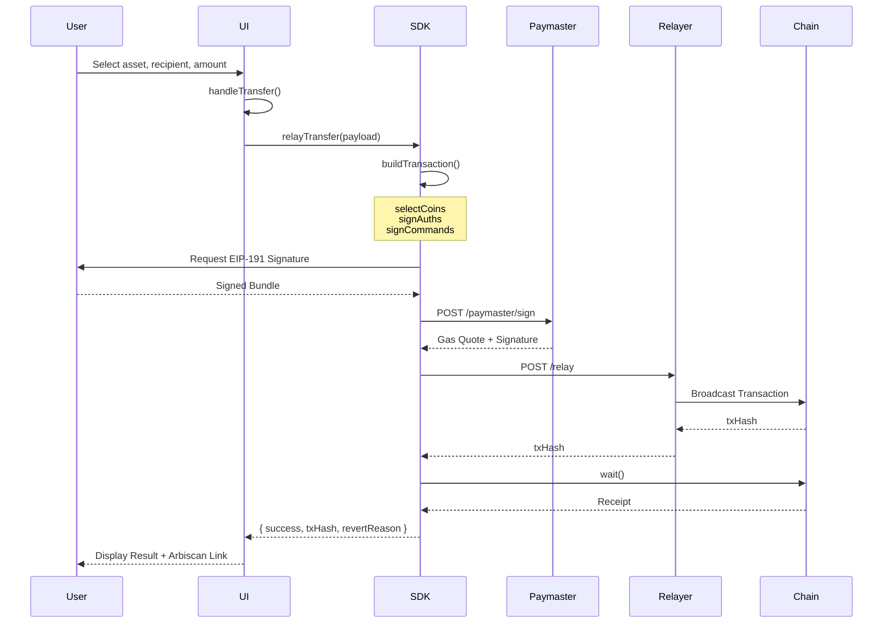

> **v0 — Testnet Only.** Not audited, and subject to change. Refer to the future paper for the full picture. Do not use with real funds.

# GhostShard Frontend

**Next.js 16 reference application** demonstrating a full GhostShard wallet UI.

Implements the complete SDK integration: wallet-based key derivation (EIP-712), shard discovery and filtering, balance management across NATIVE/ERC20/ERC721, public and private transfers via relay, compliance key display, and encrypted local storage persistence.

**Stack:** Next.js 16, React 19, wagmi v3, TanStack React Query v5, Tailwind CSS v4, shadcn/ui, `@ghost-shard/sdk` (workspace).

---

## Features

| Feature | Description |
|---------|-------------|
| **Wallet connection** | wagmi v3 `injected()` connector — works with MetaMask, Coinbase Wallet, Rabby, etc. |
| **Key derivation** | EIP-712 `signTypedData` via wagmi → `GhostClient.init()` → spending + viewing + DB encryption keys |
| **Shard discovery** | Auto-sync every 15s; manual sync button; trial-decrypt via viewing key |
| **Multi-asset balances** | NATIVE (ETH), ERC20 tokens, ERC721 NFTs — aggregated from shard inventory |
| **Shard filtering** | Filter by asset type, token address, token ID; derived from live shard data |
| **Public transfers** | Send to a known `0x...` address via `relayTransfer()` |
| **Private transfers** | Send to a meta-address (`st:eth:0x...`) via `relayTransfer()` |
| **Transfer flow** | Build → user sign → paymaster quote → relayer submit → `wait()` → `checkInnerExecutionStatus` |
| **Compliance keys** | Viewing key (safe to share) and spending key (hidden by default) display |
| **Encrypted persistence** | AES-GCM encrypted `ShardStorage` adapter backed by localStorage |
| **Disconnect** | Clears all in-memory state, stops auto-sync, disconnects wagmi |

---

## Architecture

```
ghost-frontend/
├── app/
│   ├── layout.tsx              # Root layout: <GhostProvider> + <QueryClientProvider>
│   ├── page.tsx               # Renders <Initialize> or <Dashboard> based on connection
│   ├── globals.css            # Tailwind v4 theme (dark gradient, purple accent)
│   └── providers.tsx          # wagmi config + React Query client provider
├── components/
│   ├── Dashboard.tsx           # Main view: header, status cards, balance, shards table
│   ├── Initialize.tsx          # Wallet connection screen (wagmi connect button)
│   ├── MetaAddressCard.tsx     # Displays meta-address + copy + compliance toggle
│   ├── ComplianceKeysCard.tsx  # Viewing key + spending key display (show/hide)
│   ├── BalanceSummary.tsx      # Aggregated balances: ETH, ERC20 list, ERC721 collections
│   ├── ShardsTable.tsx         # Filterable table: asset type, token address, token ID filters
│   └── TransferModal.tsx       # Public/private transfer modal with asset selection wizard
└── lib/
    ├── contexts/
    │   └── GhostContext.tsx    # Global React context wrapping GhostClient
    ├── wagmi.ts               # wagmi config: chains, connectors, transports
    └── storage.ts             # ShardStorage implementation (AES-GCM + localStorage)
```

### Data Flow

```
wagmi useAccount()
       │
       ▼
GhostProvider (context)
       │
       ├── initializeGhost()
       │     ├── new GhostClient({ chain, rpcUrl, paymasterUrl, relayerUrl, storage })
       │     ├── ghost.init({ address, signTypedData: signTypedDataAsync })
       │     ├── Extract viewingKey + spendingKey from ghostClient.keys
       │     └── syncWithChain()
       │
       ├── syncWithChain()
       │     ├── ghost.syncWithChain()
       │     ├── ghost.getShards() → ShardWithAssets[]
       │     └── Compute: balanceSummary, discoveredTokenAddresses, filteredShards
       │
       ├── sendAsset(txParams)
       │     ├── ghost.relayTransfer(txParams, { address, signMessage: signMessageAsync })
       │     ├── tx.wait() → MeshExecutionResult
       │     └── { ...receipt, txHash }
       │
       ├── startAutoSync() / stopAutoSync()
       │     └── setInterval(syncWithChain, 15000)
       │
       └── disconnect()
             ├── stopAutoSync()
             ├── Clear all state (ghost, metaAddress, shards, keys)
             └── wagmiDisconnect()
```

### GhostContext State Shape

```typescript
interface GhostContextType {
  // Connection
  isInitialized: boolean;
  isLoading: boolean;
  error: string | null;
  userAddress: string | null;

  // SDK instance
  ghost: GhostClient | null;
  metaAddress: string | null;

  // Keys
  viewingKey: string | null;
  spendingKey: string | null;
  showComplianceKeys: boolean;

  // Shard data
  shards: ShardWithAssets[];          // All discovered shards
  isSyncing: boolean;
  lastSyncTime: number | null;

  // Filters
  assetTypeFilter: AssetType | "ALL";
  tokenAddressFilter: string | null;
  tokenIdFilter: string | null;
  filteredShards: ShardWithAssets[];  // Filtered view

  // Computed balances
  discoveredTokenAddresses: string[];
  balanceSummary: {
    totalNativeBalance: bigint;
    ethShardCount: number;
    erc20Shards: Map<string, { balance: bigint; shards: ShardWithAssets[] }>;
    erc721Collections: Map<string, { nfts: ShardWithAssets[] }>;
    erc20TokenCount: number;
  };

  // Transfer
  isSending: boolean;

  // Methods
  initializeGhost: () => Promise<void>;
  syncWithChain: () => Promise<void>;
  sendAsset: (txParams) => Promise<MeshExecutionResult & { txHash: `0x${string}` }>;
  setAssetTypeFilter: (type) => void;
  setTokenAddressFilter: (address) => void;
  setTokenIdFilter: (id) => void;
  toggleComplianceKeys: () => void;
  startAutoSync: () => void;
  stopAutoSync: () => void;
  clearError: () => void;
  disconnect: () => Promise<void>;
}
```

### Transfer Flow (TransferModal)



### Encrypted Storage

The frontend includes a `ShardStorage` implementation that encrypts shard state at rest using AES-256-GCM, keyed with the user's `dbEncryptionKey` (derived from the root seed via HKDF):

```
localStorage["shard_persisted_state"]
    │
    ├── IV (12 bytes, random per write)
    └── Ciphertext (AES-GCM encrypted JSON)
            │
            └── JSON: { shards: [...], lastSyncedBlock: "12345" }
                    (bigints serialized as { type: "BigInt", value: "..." })
```

This ensures that even if localStorage is compromised, the shard data is unreadable without the user's wallet signature.

---

## Setup

### Prerequisites

- Node.js 18+
- pnpm (recommended) or npm
- A wagmi-compatible wallet (MetaMask, etc.)
- Arbitrum Sepolia funds (for transfers)

### Installation

```bash
cd packages/ghost-shard-sdk/examples/ghost-frontend
pnpm install
```

### Environment Variables

Create `.env.local`:

```env
NEXT_PUBLIC_RPC_URL=https://sepolia-rollup.arbitrum.io/rpc
NEXT_PUBLIC_PAYMASTER_URL=http://localhost:3000/api/v0/paymaster/sign
NEXT_PUBLIC_RELAYER_URL=http://localhost:3000/api/v0/relay
```

### Run

```bash
pnpm dev      # Development server at http://localhost:3000
pnpm build    # Production build
pnpm start    # Production server
```

### Running Against Ghost Services

The frontend expects a running Ghost Services instance (see [ghost-services README](../ghost-services/README.md)). Start it first:

```bash
cd packages/ghost-services
pnpm dev      # Runs on port 3000
```

Then configure the frontend's env vars to point to it.

---

## Component Reference

### Dashboard

The main view after wallet connection. Contains:

- **Status cards**: Total shard count, sync status, action buttons (sync now, send)
- **MetaAddressCard**: Copy-to-clipboard, compliance key toggle
- **BalanceSummary**: Aggregated ETH/ERC20/ERC721 balances with click-to-filter
- **ShardsTable**: Full shard list with three-column filtering

### TransferModal

A multi-step dialog for sending assets:

1. **Mode selector**: Private (meta-address) or Public (direct address)
2. **Asset type selector**: Derived from available shard inventory
3. **Token address selector**: Shown for ERC20/ERC721, derived from inventory
4. **Token ID selector**: Shown for ERC721 after token address selection
5. **Recipient input**: Validates meta-address format for private mode
6. **Amount input**: Auto-set to 1 for ERC721, free-form for others
7. **Result**: Success/failure with Arbiscan transaction link

### ShardsTable

Filterable table with:

- Asset type badge (color-coded: green=ETH, blue=ERC20, purple=ERC721)
- Status indicator (Active / Pending / Spent)
- Copy-to-clipboard for shard addresses
- Responsive overflow for mobile

---

## Theme

Dark gradient theme with purple accent:

| Token | Value |
|-------|-------|
| Background | `slate-900 → slate-800` gradient |
| Primary | Purple `262° 80%` |
| Secondary | Slate blue `217° 33%` |
| Accent | Purple-pink `263° 70%` |
| Muted | Slate gray `217° 33% 40%` |

---

## Supported Chains

- Arbitrum Sepolia (default)
- Ethereum Sepolia
- Ethereum Mainnet

---

## Troubleshooting

| Issue | Solution |
|-------|----------|
| Shards not discovering | Ensure wallet is on Arbitrum Sepolia; verify RPC URL; receive a test deposit first |
| Transfer failing | Check shard balance; verify recipient format; ensure paymaster/relayer are running |
| Sync stuck | Check browser console for RPC errors; try manual sync; verify `startBlock` is not too recent |
| Keys showing "N/A" | Re-initialize; the wallet must support `signTypedData` |

---

## License

MIT
