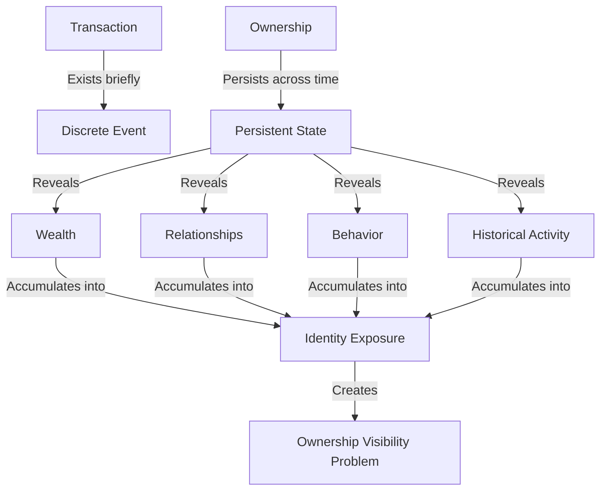

# 2. Design Rationale

GhostShard was not designed as a privacy wrapper around existing EVM accounts. It was designed from the observation that the primary source of information leakage in EVM systems is the persistence of ownership itself.

Most privacy discussions focus on hiding transactions. While transaction privacy is important, transactions are temporary events. Ownership, by contrast, is long-lived state that persists across every interaction performed by a user.

As addresses accumulate assets, interact with applications, and participate in economic activity, they gradually reveal relationships, balances, behavioral patterns, and historical activity. Over time these signals combine to create an increasingly complete picture of the owner.

This observation leads to a different design objective:

> Rather than hiding individual transactions, GhostShard attempts to reduce the visibility, persistence, and certainty of ownership.

To achieve this goal, the protocol introduces several architectural concepts that differ significantly from traditional account-based systems:

- Disposable ownership through independently controlled shards.
- Mesh transactions that coordinate multiple shards within a single execution.
- Ownership ambiguity rather than absolute anonymity.
- Separation of discovery, ownership, and execution.
- Selective disclosure mechanisms that preserve compliance without sacrificing privacy.

The following sections develop these ideas progressively, beginning with the fundamental ownership problem present in all conventional EVM systems and then motivating the design choices that ultimately lead to the GhostShard architecture.

## 2.1 The Fundamental Privacy Failure of EVM Systems

EVM systems are transparent by design. Every transaction publicly reveals the sender, receiver, transferred asset, amount, execution data, and timestamp. This transparency enables independent verification of network state and is fundamental to the operation of public blockchains.

However, transaction transparency is not the primary privacy failure of EVM systems.

The core insight of GhostShard is that **privacy failures on EVM networks are fundamentally ownership failures rather than transaction failures**.

A transaction is a discrete event. Ownership is persistent state.

While transactions occur momentarily, ownership persists across every block, every interaction, and every asset held by an address. As a result, ownership becomes a long-lived source of information that continuously leaks data about the user.

When an observer identifies an address, they can often determine:

* What assets the address owns
* How much value it controls
* Who it interacts with
* How its holdings evolve over time
* Which actions represent payments versus internal transfers

This information remains available indefinitely and accumulates throughout the lifetime of the address.

Consequently, the privacy problem extends beyond individual transactions. Even if specific transfers were partially obscured, persistent ownership would continue to reveal relationships, balances, behavioral patterns, and financial history.

GhostShard therefore approaches privacy from a different perspective. Rather than attempting to conceal individual transactions, it seeks to reduce the visibility and persistence of ownership itself.

The remainder of this chapter explores how this observation leads to an ownership-centric privacy model based on disposable ownership, shards, mesh transactions, and ownership ambiguity.
