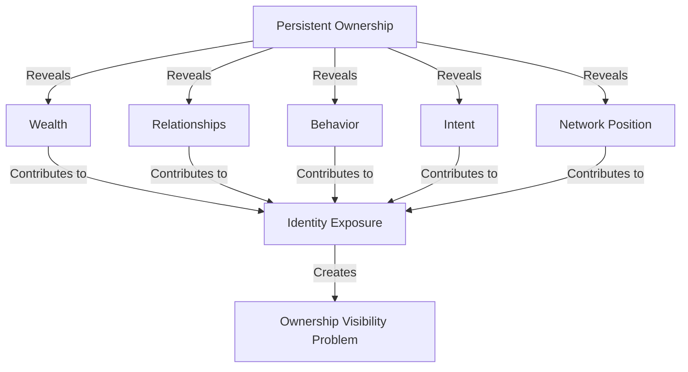
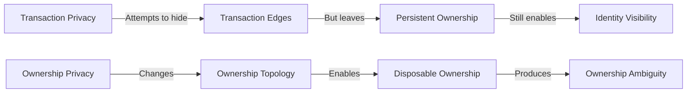

## 2.2 Why Ownership Topology?

### What Information Does Ownership Reveal?

On a transparent ledger, ownership is not a single fact. It is a composite of multiple information leaks, each of which can independently compromise privacy.

**Wealth.** The aggregate value of assets held by an address reveals a user's financial position. Once an address is associated with an identity, an observer can immediately determine balances, portfolio composition, and changes in wealth over time.

**Relationships.** Every transaction from address A to address B reveals a relationship. Not merely that value was transferred, but that two parties chose to interact. Over time, the transaction graph becomes a social graph, exposing business partnerships, organizational structures, personal relationships, and networks of influence.

**Behavior.** Transaction frequency, timing patterns, gas price preferences, and contract interaction habits form a behavioral fingerprint. An observer can infer when a user is active, which protocols they prefer, how sophisticated they are, and whether they are operating manually or through automation. Similar behavioral patterns can be used to cluster otherwise unrelated addresses.

**Intent.** The assets an address chooses to hold reveal information about its objectives and preferences. Governance tokens signal participation in a protocol. NFTs signal community membership or cultural affiliation. Stablecoin-heavy portfolios may indicate different risk preferences than portfolios dominated by volatile assets. Ownership becomes a behavioral profile.

**Network Position.** An address's location within the transaction graph reveals structural importance. Its centrality, connectivity, and role within liquidity or payment networks can indicate influence far beyond the value of its holdings. A large holder is not merely wealthy; it may be systemically significant.

Collectively, these information leaks transform ownership into a persistent identity layer. The observer learns not only what assets exist, but who likely controls them, how they are used, and how they relate to the broader network.

### The Fundamental Question

At what layer should privacy operate?

Most existing privacy systems operate at the **transaction layer**:

* **Transaction concealment** (mixers): Hide the relationship between transaction inputs and outputs.
* **Transaction encryption** (shielded systems): Hide transaction contents entirely.
* **Transaction obfuscation** (stealth addresses): Hide specific transaction participants.

Although these approaches differ technically, they share a common assumption: ownership remains persistent while transactions are hidden.

Privacy is therefore applied to what happens *between* ownership states rather than to ownership itself.

### Why Transaction Concealment Is Insufficient

Even a hypothetical system that makes every transaction perfectly untraceable does not solve the ownership problem.

Consider a user whose transactions remain permanently concealed for five years. Every transfer, swap, payment, and interaction is cryptographically hidden. Yet the assets must still exist somewhere on the ledger. They must still be owned.

If those ownership containers are persistent, they become long-lived observation points. A single identity leak—a KYC withdrawal, public donation, exchange interaction, or operational mistake—can attach a real-world identity to that ownership structure.

Once ownership is identified, an observer can often infer wealth, relationships, behavior, and historical activity regardless of how well individual transactions were concealed.

This reveals a fundamental distinction:

* **Transaction privacy protects actions.**
* **Ownership privacy protects identity.**

Actions occur momentarily. Ownership persists.

A transaction exists for a block. Ownership may exist for years.

For this reason, GhostShard treats ownership visibility—not transaction visibility—as the primary privacy problem.

### Why Ownership Topology Is the Correct Abstraction

The key insight is that ownership is not a property of transactions. Ownership is a property of the ledger's topology.

Who owns what is ultimately a question about the structure of the graph rather than any individual edge within it.

GhostShard therefore operates at the ownership layer.

Instead of asking:

> How do we hide this transaction?

GhostShard asks:

> How do we make ownership itself ambiguous?

The answer is **disposable ownership**.

Ownership units should not persist indefinitely. They should exist only long enough to participate in an ownership cycle and then be permanently retired.

Without persistent ownership containers:

* There is no long-lived address to observe.
* There is no stable identity to cluster.
* There is no persistent portfolio to analyze.
* There is no ownership graph to reconstruct over time.

This is not simply a stronger form of transaction privacy. It is a fundamentally different privacy model.

Transaction privacy attempts to hide the edges of the graph.

Ownership privacy changes the graph itself.

Instead of concealing activity between persistent owners, the protocol minimizes the persistence of ownership.

### Design Outcome

GhostShard adopts privacy through ownership topology.

Rather than concealing transactions, encrypting transaction data, or requiring dedicated privacy environments, the protocol seeks to make ownership itself ambiguous.

This represents a fundamentally different privacy model. Transaction privacy attempts to hide activity occurring within a visible ownership structure. Ownership privacy alters the structure itself.

The result is a system in which transactions may remain fully observable while ownership relationships become difficult to determine. An observer can inspect the ledger, follow every state transition, and verify every transaction, yet still be unable to reliably answer the most important question:

**Who owns what?**
