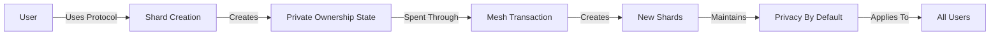
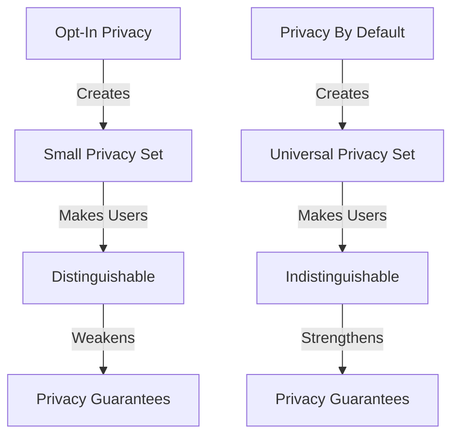
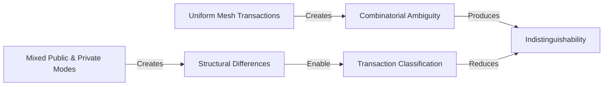

## 2.2b Why Privacy Must Be the Default

The previous section established that privacy should operate at the ownership layer. This section establishes a second requirement:

**Privacy must be the default state, not an optional feature.**

This is not primarily a usability consideration. It is an architectural requirement.

The privacy guarantees provided by GhostShard depend upon every user in the protocol participating in the same ownership model. If privacy were optional, the anonymity set would fragment, ownership patterns would become distinguishable, and the combinatorial ambiguity provided by mesh transactions would weaken significantly.

For this reason, GhostShard is designed around privacy by default.

### What Privacy by Default Means

In GhostShard, privacy is not a mode that users activate.

Every deposit creates one or more shards.

Every spend consumes shards and creates new shards.

Every ownership transition is announced through ERC-5564-compatible announcements containing encrypted metadata.

There is no public mode, private mode, shielded mode, or unshielded mode.

There is only the ownership model.

Privacy is therefore not a feature layered onto the protocol. It is a property of how ownership exists within the protocol.

### Argument 1: The Privacy Set Must Be Everyone

Privacy systems derive strength from the size of the set in which an individual becomes indistinguishable.

If only a small percentage of users choose privacy, then participation in the privacy system becomes a distinguishing signal. The privacy set becomes self-selecting, identifiable, and potentially suspicious.

An observer no longer asks:

> Which user performed this action?

Instead they ask:

> Which user among the small set of privacy users performed this action?

As the privacy set shrinks, anonymity weakens.

GhostShard avoids this problem by making privacy universal. Every participant uses the same ownership model, creating the largest possible anonymity set: the entire user base.

### Argument 2: The Opt-In Moment Is a Metadata Leak

Traditional privacy systems require users to perform a visible action to enter the privacy set.

Examples include:

* Depositing into a mixer
* Shielding assets into a privacy pool
* Activating a privacy mode
* Moving funds into specialized privacy infrastructure

Even if subsequent activity is concealed, the entry action remains permanently visible.

The act of choosing privacy becomes observable metadata.

GhostShard eliminates the entry point entirely.

There is no transaction that signals:

> This user is now entering a privacy system.

Users simply interact with the protocol. Every ownership transition follows the same model regardless of intent.

### Argument 3: Regulatory Targeting Requires a Target

Systems that separate public activity from private activity create identifiable regulatory surfaces.

When users explicitly enter a privacy environment, regulators can monitor entry events, track participation, sanction infrastructure providers, or classify participation itself as suspicious behavior.

GhostShard does not create a distinct privacy environment.

There is no privacy pool.

There is no shielding transaction.

There is no transition from public ownership into private ownership.

The ownership model itself is the protocol.

As a result, there is no singular event that identifies a user's decision to seek privacy.

### Argument 4: Defaults Determine Behavior

Most users interact with systems exactly as those systems are presented.

Opt-in privacy requires users to:

* Understand privacy risks
* Navigate additional workflows
* Accept additional complexity
* Pay additional costs
* Make a deliberate decision to become private

Most users will not do this.

This is not irrational behavior. It is normal behavior.

If privacy requires effort, adoption decreases.

If privacy is the default, adoption increases.

Because anonymity depends on participation, privacy systems cannot rely on widespread manual opt-in.

The default must be private.

### Argument 5: Indistinguishability Requires Uniformity

GhostShard's mesh transaction model derives privacy from ambiguity.

When an observer sees multiple inputs and multiple outputs, they cannot reliably determine:

* Which outputs are payments
* Which outputs are change
* Which outputs belong to which participant
* Which ownership transitions represent internal restructuring

This ambiguity emerges from uniform transaction structure.

If some transactions are private while others remain public, observers gain a baseline for comparison. Public transactions leak information that can be used to reduce uncertainty about private transactions.

The anonymity set begins to fragment.

For mesh transactions to achieve their intended privacy properties, all transactions must participate in the same ownership model.

Privacy therefore cannot be an optional mode.

It must be the default state of the system.

### Design Outcome

GhostShard makes privacy the default state of ownership.

There is no privacy toggle, no shielding phase, no opt-in workflow, and no special transaction type that signals a user's desire for privacy.

Every deposit creates shards.

Every spend consumes shards and creates new shards.

Every ownership transition follows the same model.

This is not merely a user-experience decision. It is a structural requirement for maintaining indistinguishability and preserving the combinatorial ambiguity on which GhostShard's privacy model depends.
