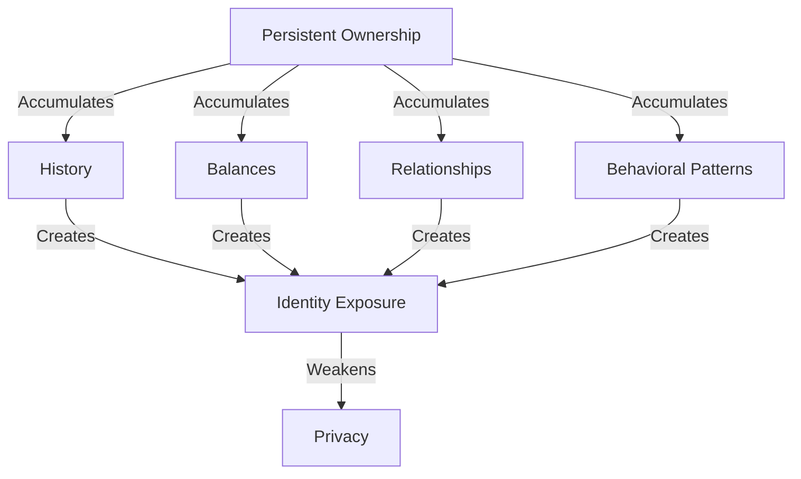
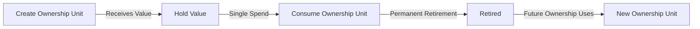

## 2.3 What Is Disposable Ownership?

The previous sections established two conclusions:

1. Privacy failures on EVM systems are fundamentally ownership failures.
2. Privacy must be the default state of the system rather than an optional mode.

The next question is therefore:

> If ownership visibility is the problem, why not simply hide owners?

The answer is that hiding owners does not eliminate the underlying issue.

The problem is not merely that ownership is visible.

The problem is that ownership is **persistent**.

### Why Persistent Ownership Fails

Persistent ownership continuously accumulates information over time.

Every interaction adds new information to the ownership record:

1. **History Accumulation** — Every transaction contributes to a growing historical record. An address with one hundred transactions reveals significantly more information than an address with one transaction.

2. **Balance Accumulation** — Assets received over time accumulate into visible balances. The balance itself becomes a source of information regarding wealth and economic activity.

3. **Relationship Accumulation** — Every interaction adds edges to a transaction graph. Over time, counterparties, organizations, and social relationships become visible.

4. **Behavioral Accumulation** — Transaction timing, spending frequency, preferred protocols, and usage patterns form recognizable behavioral signatures.

A long-lived ownership container becomes increasingly identifiable simply by existing.

Even if individual transactions were hidden, the ownership structure itself would continue accumulating information.

### The Disposable Ownership Insight

The key insight of GhostShard is that ownership does not need to be hidden.

It needs to be **disposable**.

Instead of attempting to conceal a long-lived ownership structure, the protocol eliminates the persistence of ownership itself.

Each ownership unit exists for a single ownership cycle and is then permanently retired.

Because ownership does not persist:

* History does not accumulate.
* Balances do not accumulate.
* Relationship graphs do not accumulate.
* Behavioral signatures do not accumulate.

The ownership container disappears before meaningful information can collect around it.

### What Disposable Ownership Means

A disposable ownership unit follows a simple lifecycle:

1. An ownership unit is created when value is received.
2. The ownership unit temporarily holds that value.
3. The ownership unit is consumed during a spend.
4. The ownership unit is permanently retired.
5. Future ownership is represented by entirely new ownership units.

No ownership unit participates in multiple spending cycles.

### Why Not Persistent Stealth Accounts?

Stealth addresses improve recipient privacy, but they do not eliminate ownership persistence.

A stealth address that remains active for months or years still accumulates:

* Transaction history
* Asset balances
* Counterparty relationships
* Behavioral signatures

Although the ownership container becomes pseudonymous, it remains persistent.

Eventually, sufficient information accumulates around the address to support clustering and analysis.

GhostShard addresses a different problem.

Rather than obscuring a persistent ownership container, it minimizes the lifetime of the ownership container itself.

### Why Not Note-Based Systems?

Note-based privacy systems hide ownership through encrypted notes and cryptographic commitments.

While powerful, they introduce a separate state-management problem.

Notes must be:

* Created
* Stored
* Tracked
* Proven
* Destroyed

This creates additional lifecycle complexity and introduces its own metadata management requirements.

GhostShard instead adopts a simpler ownership model:

> Receive. Hold. Spend. Retire.

The privacy mechanism emerges from ownership disposal rather than long-lived hidden state.

### Design Outcome

GhostShard adopts disposable ownership.

Assets are held by one-time-use ownership units that participate in exactly one ownership cycle before permanent retirement.

Privacy is achieved not by hiding persistent ownership, but by eliminating ownership persistence itself.

The next question naturally follows:

> If ownership is disposable, what form should these ownership units take?

The answer is introduced in the next section through the concept of **shards**.
