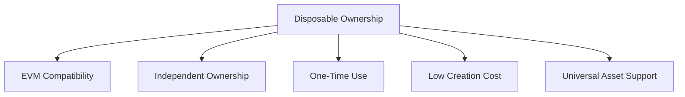
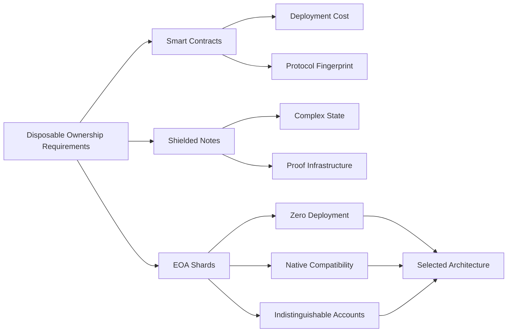
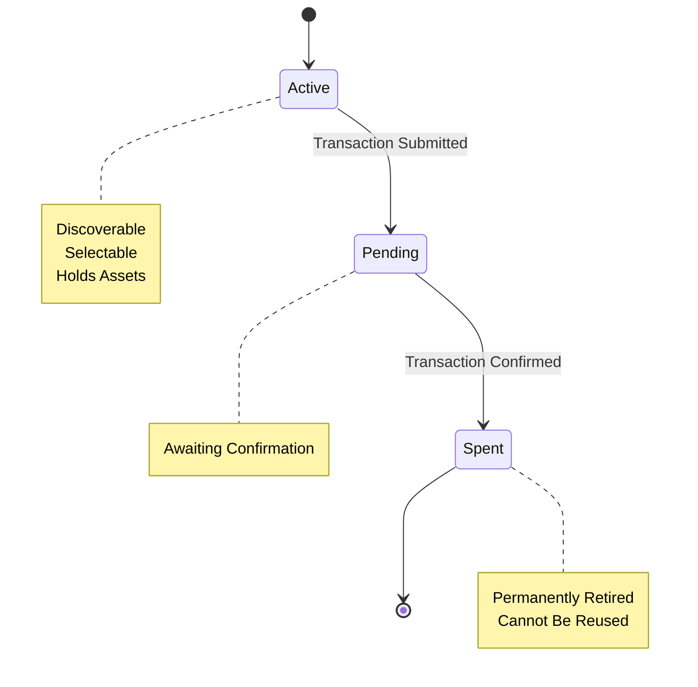
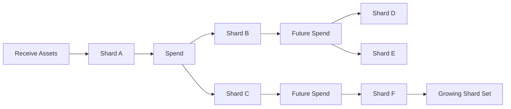

## 2.4 How Do We Achieve Disposable Ownership?

The previous section established that ownership should be disposable.

The next question is practical:

> If ownership units are disposable, what form should those ownership units take?

Disposable ownership is a privacy model. To implement that model, the protocol requires a concrete ownership representation.

The representation must satisfy a number of constraints imposed by the EVM itself.

### Requirements for the Ownership Representation

Any ownership representation used by GhostShard must satisfy the following requirements:

1. **Standard EVM Compatibility**

   Ownership units must interact with existing smart contracts without requiring protocol-specific integrations. Assets should remain usable throughout the broader EVM ecosystem.

2. **Independent Ownership**

   Each ownership unit must be independently controllable. Compromise of one ownership unit must not compromise all others.

3. **One-Time Use**

   Ownership units must support the disposable ownership model. After participating in a spend, they must be permanently retired.

4. **Minimal Creation Cost**

   Creating ownership units should be inexpensive enough to support large numbers of units without prohibitive gas costs.

5. **Universal Asset Support**

   The representation must support ETH, ERC-20 tokens, and ERC-721 assets without requiring different ownership models for different asset types.

### Evaluating Alternative Representations

Several possible ownership representations were considered.

#### Smart Contracts

One option is to represent each ownership unit as an independently deployed smart contract.

While this provides flexibility, it introduces significant drawbacks:

* Contract deployment costs are substantial.
* Large ownership sets become prohibitively expensive.
* Contract bytecode creates protocol-identifiable artifacts.
* Additional deployment transactions increase operational complexity.

The ownership representation becomes visible as a protocol-specific object rather than blending into normal EVM activity.

#### Shielded Notes

Another option is a note-based ownership model similar to shielded systems.

While note systems can provide strong privacy guarantees, they require:

* Specialized state management
* Note creation and destruction logic
* Proof generation infrastructure
* Additional discovery mechanisms
* Restricted interoperability with existing EVM protocols

The resulting architecture becomes significantly more complex than the ownership model requires.

### Why EOA Shards?

GhostShard adopts standard EVM accounts as ownership units.

Each ownership unit is represented by a unique EOA controlled by a unique private key.

This approach satisfies every design requirement:

* **Zero deployment cost** — EOAs require no contract deployment.
* **Native EVM compatibility** — EOAs interact with existing protocols without modification.
* **Independent ownership** — Every shard has independent cryptographic control.
* **Protocol indistinguishability** — Shards appear identical to ordinary EVM accounts.
* **Universal asset support** — ETH, ERC-20, and ERC-721 assets can all be held directly.

Most importantly, EOAs already exist as a fundamental EVM primitive.

Rather than inventing a new ownership container, GhostShard repurposes an existing one.

### The Shard Lifecycle

A shard progresses through three states during its lifetime.

#### Active

The shard currently holds assets and is available for selection during transaction construction.

At this stage:

* The shard is discoverable by its owner.
* Assets remain under the shard's control.
* The shard can participate in future mesh transactions.

#### Pending

The shard has been selected for spending and a transaction has been submitted.

At this stage:

* The spend has been initiated.
* The transaction has not yet finalized.
* The shard is temporarily unavailable for future selection.

#### Spent

The transaction has finalized successfully.

At this stage:

* The shard is permanently retired.
* Assets are no longer associated with the shard.
* The shard can never be reused.

### Design Outcome

GhostShard implements disposable ownership through **EOA shards**.

Each shard represents a one-time-use ownership unit controlled by an independent private key. Shards hold assets, participate in exactly one spending cycle, and are permanently retired after use.

The resulting ownership model achieves disposable ownership using only standard EVM primitives while remaining compatible with existing wallets, assets, and protocols.

However, disposable ownership immediately introduces a new challenge.

If every receipt creates a new shard and every spend retires existing shards while creating replacement shards, ownership naturally fragments over time.

A user who receives many payments may eventually control dozens or even hundreds of independent shards.

While fragmentation improves ownership privacy, it also creates practical challenges for transaction construction, balance management, and asset utilization.

This introduces the next architectural problem:

> How can a system preserve disposable ownership without making fragmented ownership unusable?

The next section examines fragmentation as the first major consequence of disposable ownership and the architectural pressures it creates.
