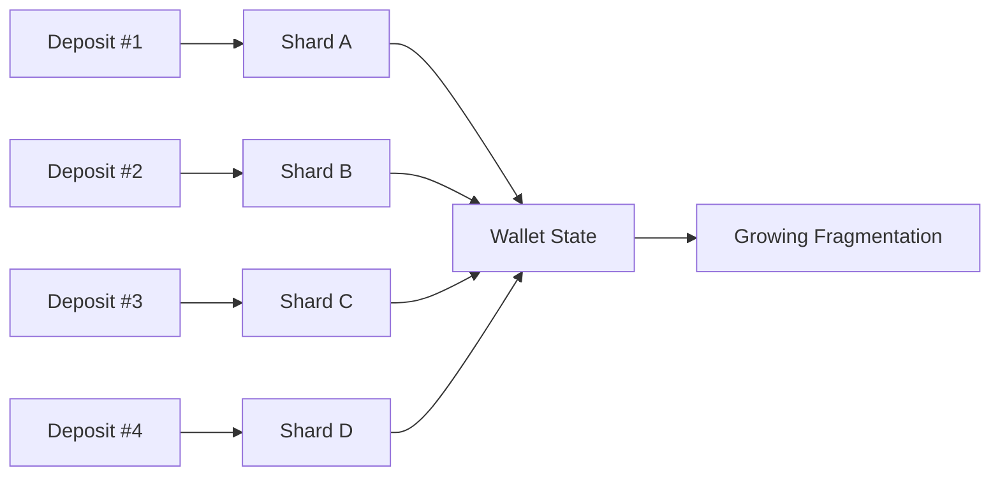
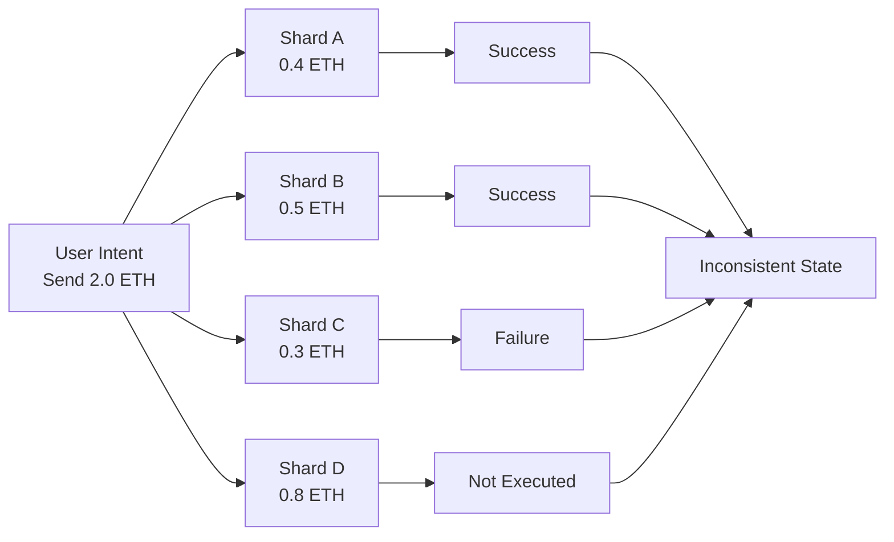
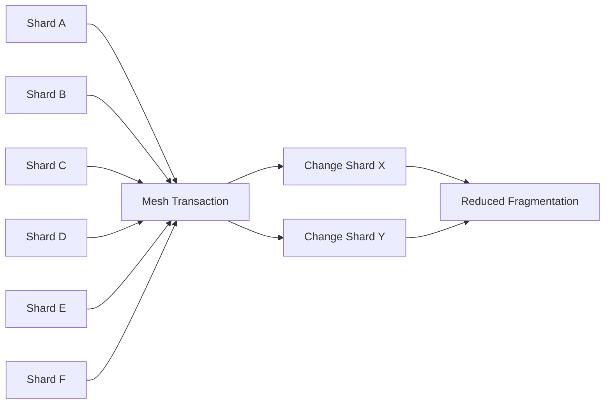
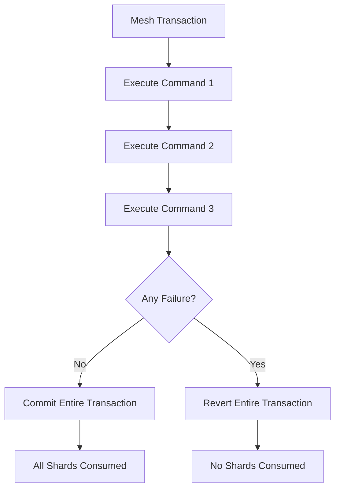

## 2.5 Fragmentation Problem

Shards provide disposable ownership.

However, disposable ownership introduces a new challenge:

> Ownership becomes fragmented across many independent units.

Every deposit creates a new shard. Over time, a user accumulates a growing collection of shards, each holding a portion of their total balance.

A user who receives 100 deposits may eventually own 100 separate shards.

This is not a flaw in the architecture. It is a direct consequence of disposable ownership.

The question becomes:

> How can a system maintain disposable ownership without allowing fragmentation to grow without bound?

### Why Fragmentation Is a Problem

Fragmentation introduces several operational challenges.

#### 1. Gas Cost

Spending from many shards requires processing many inputs.

As shard count increases, transaction construction and execution costs increase approximately linearly with the number of participating shards.

#### 2. Discovery Cost

Each shard must be discovered through announcement scanning, trial decryption, and balance verification.

More shards increase client-side computational requirements.

#### 3. State Growth

The client must maintain metadata for every shard:

* Ownership information
* Asset balances
* Spent status
* Synchronization cursors

Without management, shard state grows indefinitely.

### Fragmentation Growth



Each deposit increases ownership fragmentation.

Without intervention, wallet complexity grows continuously over time.

---

### The User Intent Execution Problem

Fragmentation creates a deeper problem than state growth.

Consider a user who wants to send:

> 2 ETH to Bob

The wallet may need to combine many shards to satisfy the payment amount.

For example:

```text
Shard A = 0.4 ETH
Shard B = 0.5 ETH
Shard C = 0.3 ETH
Shard D = 0.8 ETH

Total = 2.0 ETH
```

The user's intent is simple:

> Send 2 ETH.

The protocol's ownership model is fragmented:

> Spend four independent ownership units.

These are not the same thing.

The user's intent is singular.

The ownership representation is distributed.

This creates a coordination problem.

If one shard transfer succeeds while another fails, ownership becomes inconsistent.

Some shards may be consumed.

Others may remain unspent.

The intended transfer never completes.

The user's state becomes corrupted.

### Why Partial Execution Is Unacceptable



The user requested one transfer.

The system executed only part of it.

This outcome is worse than complete failure.

Funds become stranded across multiple ownership states and the intended transfer never occurs.

### Architectural Requirement

All shards participating in a transaction must behave as a single unit.

The protocol therefore requires:

> Either every shard transfer succeeds, or none of them succeed.

This is an atomicity requirement.

Not a privacy requirement.

Not a usability requirement.

A correctness requirement.

---

### Solution Part I — Compression

The first solution addresses shard growth.

When constructing a transaction, the wallet selects:

* Required payment shards
* Additional compression shards

Compression shards are included even when they are not strictly necessary for the payment.

The number of compression shards scales with wallet size with a hard cap of 15 to prevent fingerprinting:

```text
extraShards = random(floor(sqrt(walletSize) * 0.8))
```

These shards are consumed alongside the payment and merged into fewer outputs.

Over time:

* Fragmentation decreases
* State growth slows
* Average wallet complexity converges

#### Compression Effect



Compression continuously converts many shards into fewer shards.

Fragmentation therefore remains bounded rather than growing indefinitely.

---

### Solution Part II — Atomic Execution

Compression solves wallet growth.

It does not solve intent execution.

The second solution is atomic execution.

All shard transfers participating in a transaction execute within a single state transition.

If any transfer fails:

* The transaction reverts.
* All shard state changes roll back.
* No shard is consumed.

The user either receives complete execution or no execution at all.



---

### Why Atomic Execution Requires EIP-7702

Independent EOAs cannot coordinate execution.

Each shard possesses:

* Its own private key
* Its own nonce
* Its own state

Without coordination, multiple shard spends become independent transactions.

Independent transactions cannot provide atomic guarantees.

GhostShard solves this using EIP-7702 delegation.

All participating shards temporarily delegate execution authority to a shared execution environment:

**GhostRouter**.

GhostRouter executes every command within a single execution context.

If any command fails:

* `innerExecuteMesh()` reverts
* All state changes roll back
* Every shard returns to its original state

This transforms many independent ownership units into a single atomic execution unit.

---

### Additional Privacy Benefits

Compression provides privacy benefits beyond state management.

#### Wallet-Size Obfuscation

Because compression shard selection is randomized and scales non-linearly with wallet size, observers cannot reliably infer the number of shards owned by a user from a single transaction.

#### Partial Amount Obfuscation

Compression also obscures transaction amounts.

Observers can see the total value entering a mesh transaction, but cannot immediately determine:

* Which inputs funded the payment
* Which inputs were included solely for compression

Full amount ambiguity emerges only after compression is combined with output scattering (Section 2.7).

---

### Design Outcome

Fragmentation is an unavoidable consequence of disposable ownership.

GhostShard addresses fragmentation through two complementary mechanisms:

1. **Compression**, which continuously reduces shard growth and bounds wallet complexity.
2. **Atomic execution**, which guarantees that all shards participating in a user intent behave as a single execution unit.

The result is a system that preserves disposable ownership while remaining operationally practical.

Ownership may be fragmented.

User intent is not.
