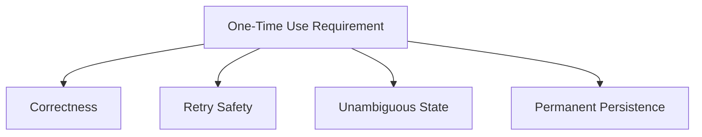
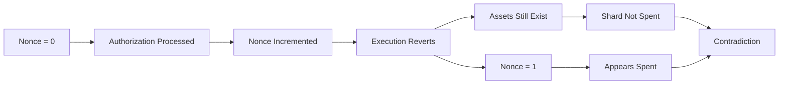
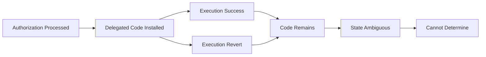
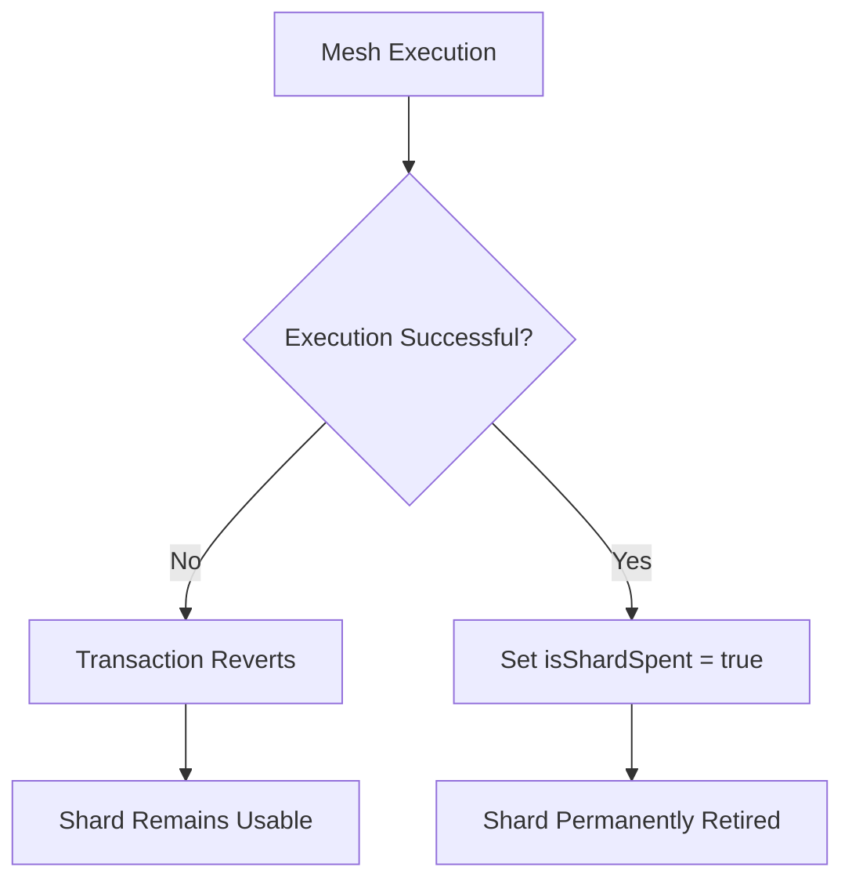

## 2.6 How Do We Guarantee One-Time Use?

Shards are designed to be used exactly once. After a shard participates in a mesh transaction, it must never be spendable again.

At first glance this appears straightforward. However, EIP-7702 introduces subtle execution semantics that make one-time-use enforcement significantly more complex than simply checking account state.

The protocol therefore evaluates multiple approaches before selecting a final mechanism.

### The Requirement

A one-time-use guarantee must satisfy four properties:

1. **Correctness**

   A successfully spent shard must never become spendable again.

2. **Retry Safety**

   A failed transaction must not permanently destroy an unspent shard.

3. **Unambiguous State**

   The protocol must be able to determine with certainty whether a shard has been consumed.

4. **Persistence**

   Once a shard is consumed, that state must be permanent and irreversible.



### Approach 1: Check the Shard Nonce

The most obvious solution is to verify that a shard's nonce is zero.

A shard that has already been used would have a nonce greater than zero and therefore be rejected.

#### Why It Fails

Under EIP-7702, authorization processing increments the nonce before transaction execution begins.

This increment occurs regardless of whether execution eventually succeeds or reverts.

Consider the following sequence:

1. Shard nonce is `0`.
2. The shard is included in a mesh transaction.
3. Another operation inside the mesh transaction fails.
4. The entire transaction reverts.
5. The shard nonce is now `1`.
6. The shard was never actually spent.

The shard's assets remain intact, but the nonce now falsely indicates that it has already been consumed.

The shard becomes permanently stranded despite never successfully participating in a transfer.



The nonce therefore measures **attempted execution**, not **successful consumption**.

For a system that relies on transaction reversion for atomicity, this distinction is fatal.

### Approach 2: Check the Shard Code

A second possibility is to inspect the shard's delegated code.

When EIP-7702 authorization is processed, the shard receives delegated execution code:

```text
0xef0100 || GhostRouter
```

One might attempt to treat the presence of delegated code as evidence that the shard has already been used.

#### Why It Fails

Delegation state is persistent.

The delegated code remains on the account even if execution later reverts.

This creates ambiguity:

1. Authorization is processed.
2. Delegated code is installed.
3. Execution reverts.
4. Delegated code remains.

Later observations cannot distinguish between:

* A shard that was successfully consumed.
* A shard whose transaction reverted.
* A shard that was delegated for some other purpose.

The delegated code only proves that authorization occurred.

It does **not** prove successful consumption.



Code-based detection therefore fails the unambiguous-state requirement.

### Approach 3: On-Chain Spent Tracking

The final approach introduces explicit protocol state.

GhostRouter maintains:

```solidity
mapping(address => bool) public isShardSpent;
```

Before processing a shard:

```solidity
require(!isShardSpent[shard], "ShardAlreadySpent");
```

After successful execution:

```solidity
isShardSpent[shard] = true;
```

The flag is written only during successful mesh execution.

#### Why It Works

Unlike nonce and code inspection, spent tracking records the exact event the protocol cares about:

> Successful shard consumption.

The mapping is:

* Independent of authorization processing.
* Independent of nonce changes.
* Independent of delegated code state.
* Updated only after successful execution.

If execution reverts, the state write reverts as well.

The shard remains spendable.

If execution succeeds, the flag becomes permanently true.



### Tradeoff Analysis

The primary drawback is storage cost.

The first write to a new storage slot incurs approximately:

```text
~20,000 gas
```

per shard.

However, this cost is paid exactly once during the shard's lifetime.

The protocol intentionally accepts this overhead because it provides the only mechanism that simultaneously satisfies:

* Correctness
* Retry safety
* Unambiguous state
* Permanent persistence

### Design Outcome

GhostShard guarantees one-time use through explicit on-chain spent tracking.

Neither nonce inspection nor delegated-code inspection can reliably distinguish successful consumption from failed execution under EIP-7702.

Instead, GhostRouter maintains a permanent `isShardSpent` mapping that is updated only after successful execution.

The result is a deterministic and irreversible one-time-use guarantee:

* Unspent shards remain spendable.
* Failed transactions remain retryable.
* Successfully consumed shards can never be reused.

Disposable ownership therefore becomes cryptographically enforceable rather than merely conventional.
