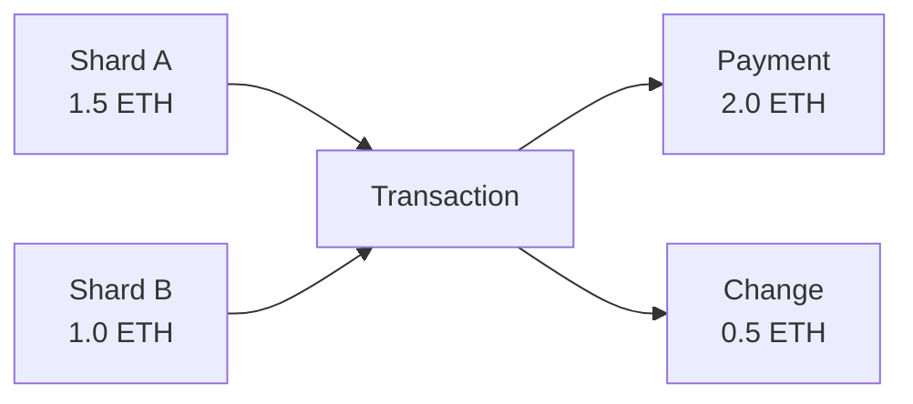
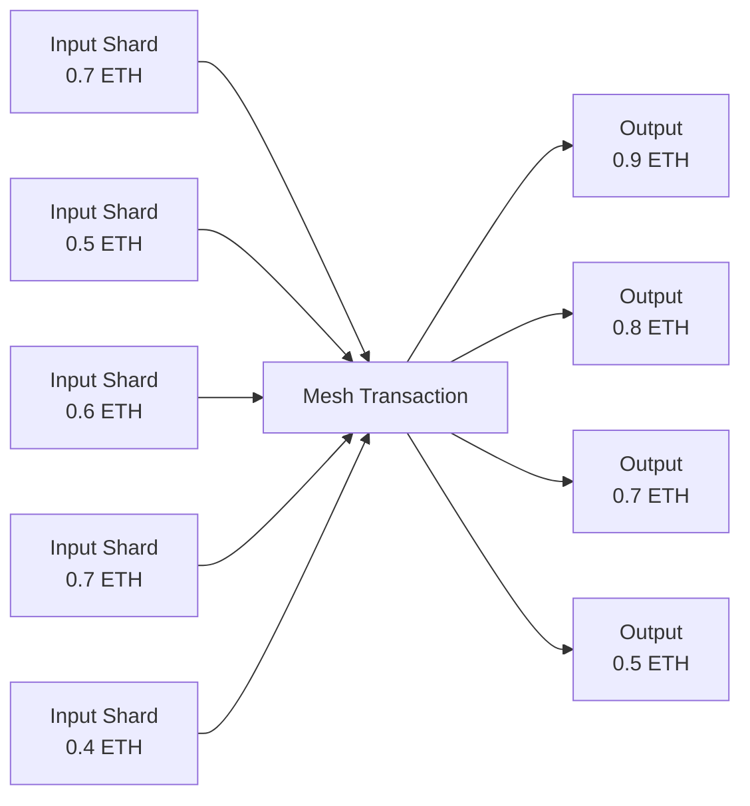
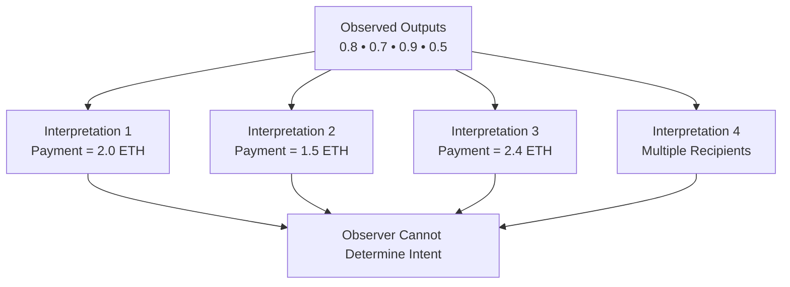
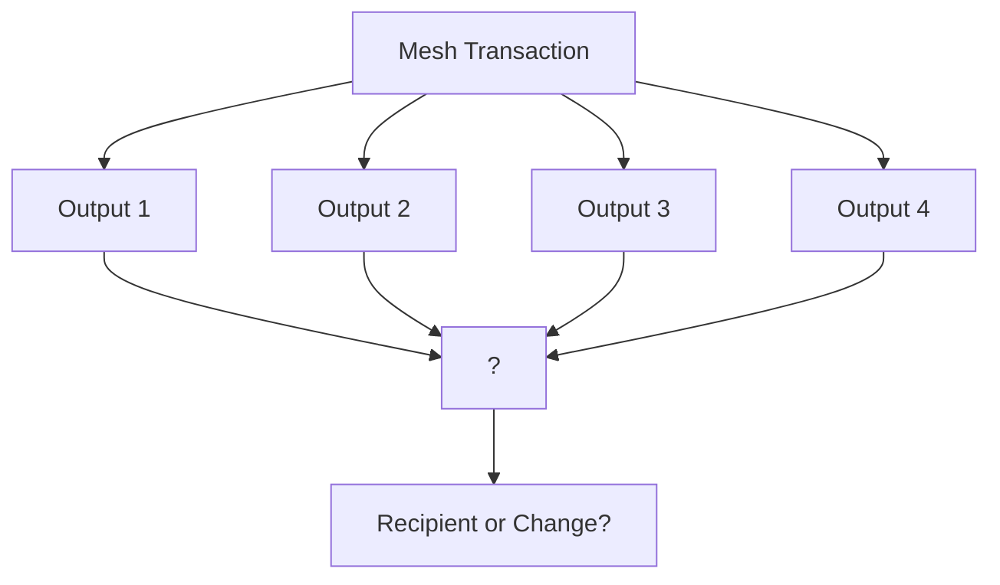

## 2.7 Transfer Amount as a Privacy Leak

The previous section established that compression manages fragmentation and that atomic execution preserves user intent.

However, even a perfectly coordinated spend still leaks information.

The remaining problem is **amount visibility**.

### The Amount Privacy Problem

Consider a user who controls two shards:

* Shard A: 1.5 ETH
* Shard B: 1.0 ETH

The user wishes to send 2.0 ETH to a recipient.

The resulting transaction appears as:

* Inputs: 1.5 ETH + 1.0 ETH = 2.5 ETH
* Payment Output: 2.0 ETH
* Change Output: 0.5 ETH

An observer can immediately infer the user's intent.

The privacy failure is not ownership.

The privacy failure is arithmetic.

Because the inputs and outputs are deterministic, the payment amount is directly observable.

The observer knows:

* Total value consumed
* Total value returned
* Exact payment amount
* Exact change amount

Ownership may be fragmented, but intent remains visible.

### Why Compression Alone Is Insufficient

Section 2.5 introduced compression shards.

Compression increases ambiguity by adding additional inputs that are not strictly required for the payment.

However, compression alone does not fully solve the amount problem.

Even if ten shards are consumed, an observer can still determine the payment amount whenever the payment output remains distinguishable from change outputs.

Compression obscures the input side.

Amount privacy also requires ambiguity on the output side.

### The Core Insight

Privacy requires **amount ambiguity**.

An observer should be unable to answer three questions:

1. Which outputs represent payment?
2. Which outputs represent change?
3. What amount was actually transferred?

As long as those questions remain unanswered, user intent remains private.

This requires payment and change to become structurally indistinguishable.

### Mesh Transactions

GhostShard achieves amount ambiguity through mesh transactions.

A mesh transaction:

1. Consumes many shards.
2. Produces many shards.
3. Splits value into randomized outputs.
4. Announces all outputs identically.

The result is that value no longer leaves the transaction as a single payment output and a single change output.

Instead, value exits as a collection of indistinguishable ownership units.

The observer sees four outputs totaling 2.9 ETH.

However, the observer cannot determine:

* Which outputs belong to the recipient.
* Which outputs belong to the sender.
* Whether there is one recipient or many.
* Which subset represents the payment.
* Which subset represents change.

Multiple interpretations become simultaneously valid.

The ambiguity is combinatorial.

As the number of outputs increases, the number of valid interpretations grows rapidly.

The observer sees every output but cannot reliably reconstruct intent.

### Why Atomic Execution Matters

The mesh structure alone is insufficient.

If transfers and announcements occur separately, observers can correlate outputs through:

* Block timing
* Transaction ordering
* Gas patterns
* Event sequencing

GhostShard therefore executes the entire mesh atomically.

Inputs are consumed, outputs are created, and announcements are published within a single state transition.

No intermediate state exists for an observer to analyze.

The transaction appears as one indivisible ownership transformation.

---

### 2.7.1 Recipient and Change Ambiguity

Mesh transactions provide more than amount privacy.

They also create **recipient ambiguity**.

Every output produced by a mesh transaction shares the same structure:

* Fresh shard address
* No transaction history
* ERC-5564 announcement
* Encrypted metadata
* Randomized value

From the observer's perspective, every output appears identical.

This creates a stronger privacy property than amount ambiguity alone.

The sender's change and the recipient's payment become structurally equivalent.

An observer cannot determine:

* Which outputs belong to the sender.
* Which outputs belong to the recipient.
* How many recipients exist.
* Whether value was split among multiple parties.

The recipient can identify their outputs through trial decryption using their viewing key.

Everyone else sees only a set of indistinguishable ownership units.

#### Design Outcome

GhostShard adopts mesh transactions as the fundamental spending primitive.

A mesh transaction consumes **N** shards, creates **M** shards, and publishes **M** announcements atomically.

Payment and change are both scattered across randomized outputs.

Because every output is structurally identical, observers cannot reliably determine:

* Payment amount
* Change amount
* Recipient count
* Recipient ownership
* Sender ownership

The ledger remains fully transparent.

The ownership relationships embedded within it do not.
