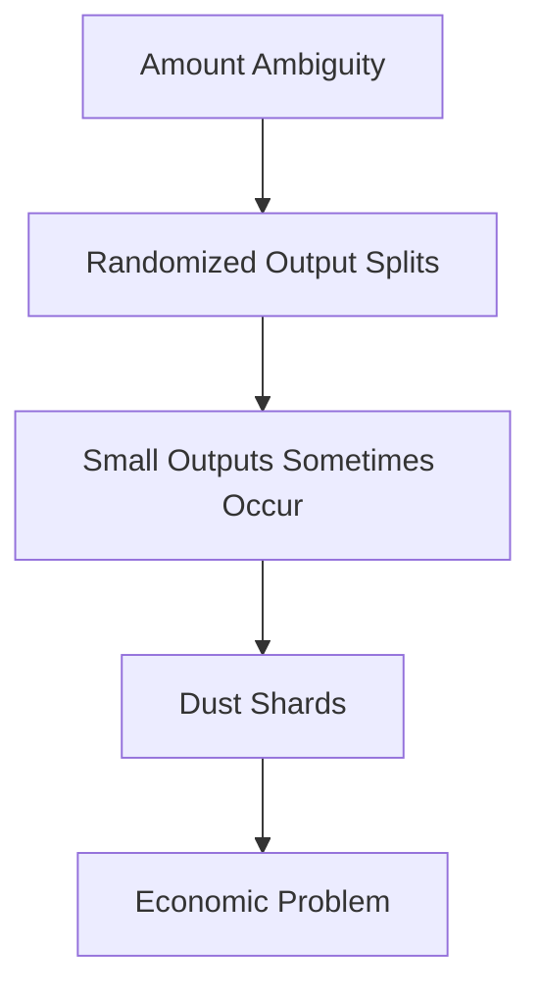
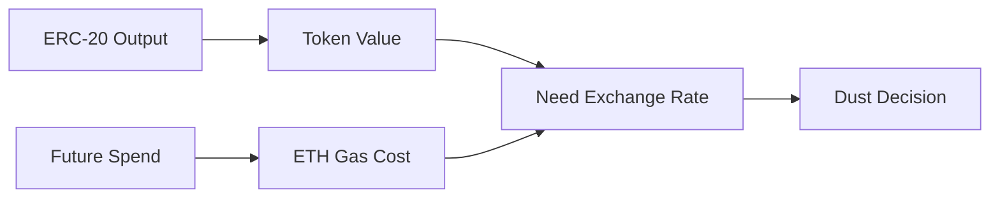
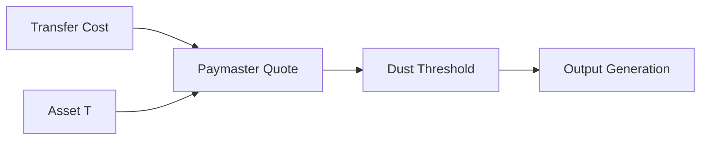
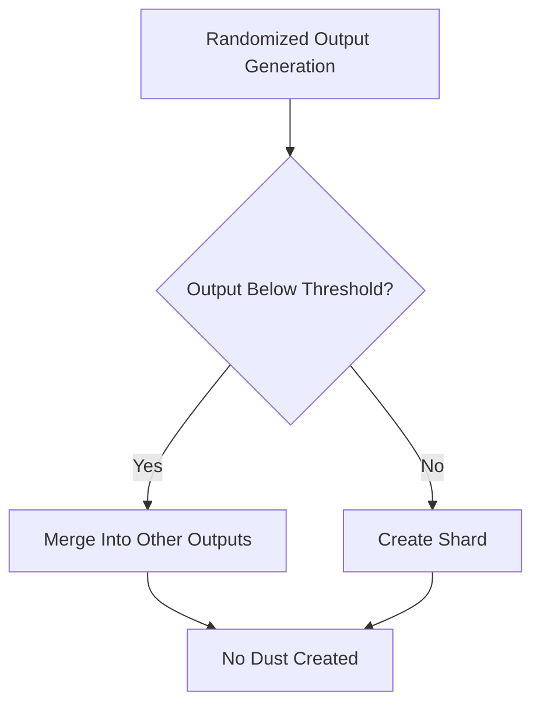

## 2.8 Dust Protection

Mesh transactions scatter outputs across multiple shards. This improves amount privacy but introduces a new problem:

**dust shards.**

Because output amounts are randomized, some outputs may receive values so small that spending them later costs more than the value they contain.

A shard may remain perfectly private and technically spendable while being economically irrational to use.

### Example

Consider a mesh transaction that creates four outputs:

| Output  | Amount     |
| ------- | ---------- |
| Shard A | 0.8 ETH    |
| Shard B | 0.7 ETH    |
| Shard C | 0.0001 ETH |
| Shard D | 0.9 ETH    |

The third output may require more gas to spend than the value it contains.

The shard is valid.

The shard is private.

The shard is recoverable.

But spending it would destroy economic value.

This is a dust shard.

---

### Why Dust Matters

Dust is not primarily a privacy problem.

All outputs remain structurally identical:

* Fresh shard addresses
* Fresh announcements
* Encrypted metadata
* Randomized output values

An observer cannot determine which outputs are dust.

The problem is operational.

Over time, dust shards accumulate inside the user's shard store:

* More shards to discover
* More balances to track
* More coin-selection candidates
* More synchronization work

Without protection, the wallet gradually fills with economically unusable ownership units.

---

### Why Dust Cannot Be Eliminated Completely

The root cause is output randomization.

Mesh transactions deliberately avoid deterministic output amounts because deterministic outputs leak payment information.

For example:

```text
2.9 ETH
   ↓
0.8 + 0.7 + 0.9 + 0.5
```

Some randomized distributions will inevitably create very small outputs.

Removing randomness would weaken amount ambiguity and reintroduce payment inference attacks.

Dust prevention must therefore coexist with randomized splitting rather than replace it.



---

### The Fundamental Difficulty

Preventing dust requires answering a deceptively difficult question:

> Is this output worth spending later?

For native assets this is relatively straightforward.

Both the output value and the spending cost are denominated in ETH.

For ERC-20 assets the problem becomes significantly harder.

The output value is denominated in the token.

The spending cost is denominated in ETH.

Determining whether an output is dust therefore requires some method of comparing:

```text
Token Value
      vs
Future Spending Cost
```

This immediately becomes a pricing problem.

The protocol must determine how much of a token is equivalent to the cost of spending that token.

Without a pricing mechanism, there is no reliable way to determine whether a token output is economically recoverable.



---

### Alternative Designs Considered

#### DEX-Based Pricing

One possibility is querying DEX liquidity directly.

The SDK could estimate:

> How much token T is equivalent to the ETH required to spend token T?

While theoretically accurate, this approach introduces several problems:

* Dependence on external liquidity
* Susceptibility to price manipulation
* Cross-chain implementation complexity
* Increased SDK responsibilities
* Inconsistent behavior during volatile markets

Dust prevention becomes dependent on market infrastructure rather than protocol infrastructure.

---

#### Oracle-Based Pricing

Another possibility is relying on price oracles.

This simplifies valuation but introduces new trust assumptions:

* Oracle availability
* Oracle correctness
* Oracle freshness
* Additional infrastructure dependencies

GhostShard avoids introducing separate oracle dependencies solely for dust estimation.

---

### Why Paymaster Quotes Are the Correct Abstraction

The paymaster already performs economic evaluation.

To sponsor gas using arbitrary assets, the paymaster must determine the relationship between:

* ETH-denominated gas costs
* Asset-denominated payments

The pricing infrastructure therefore already exists.

Rather than introducing separate DEX integrations or oracle dependencies, GhostShard reuses the same economic authority responsible for gas sponsorship.

The SDK can request a quote from the paymaster:

> How much of asset T is required to cover a transfer costing X gas?

The response directly provides the minimum economically meaningful amount for that asset under current conditions.

This makes the paymaster the natural source of truth for dust estimation.



---

### GhostShard v0 Approach

GhostShard v0 uses a fixed minimum output threshold.

Outputs below the threshold are not created.

Instead, the value is absorbed into other outputs during the split process.

The fixed threshold prevents obviously uneconomical shards from being generated while avoiding pricing dependencies in the initial implementation.



---

### Limitations of the v0 Approach

A fixed threshold is intentionally conservative.

However:

* Different assets have different transfer costs.
* Different chains have different gas markets.
* Different market conditions affect economic recoverability.

As a result, a threshold that is appropriate for one asset may be inappropriate for another.

The fixed threshold should therefore be viewed as an implementation compromise rather than the final architecture.

---

### Future Direction: Paymaster-Based Dust Estimation

Future GhostShard versions replace the fixed threshold with paymaster-derived dust thresholds.

For assets not yet known to the SDK:

1. The SDK requests a paymaster quote.
2. The paymaster determines the asset cost of spending that asset.
3. The SDK derives a minimum economically recoverable output.
4. Future mesh transactions enforce that threshold.

This allows dust protection to adapt automatically to:

* Asset type
* Chain conditions
* Transfer complexity
* Market pricing

while preserving the privacy guarantees of randomized output generation.

---

### Privacy Considerations

A fixed threshold introduces a recognizable output pattern.

If every transaction enforces the same minimum output value, that value becomes part of a visible fingerprint.

Paymaster-derived thresholds reduce this fingerprint.

Different assets naturally produce different minimum outputs, causing output distributions to more closely resemble ordinary asset transfers.

---

### Design Outcome

Randomized output splitting inevitably creates the possibility of dust.

GhostShard v0 mitigates this through a fixed minimum threshold.

Future versions derive asset-specific thresholds directly from paymaster quotes, reusing the same economic infrastructure already required for gas sponsorship.

This eliminates separate pricing dependencies while ensuring that created shards remain economically recoverable under current market conditions.
