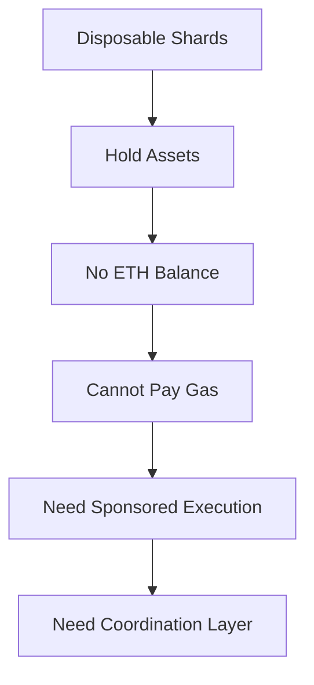
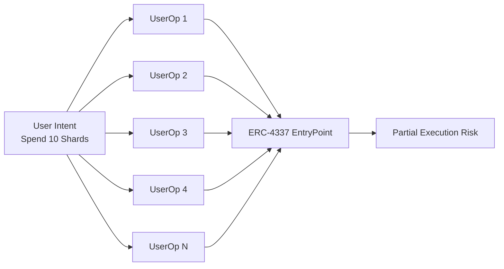
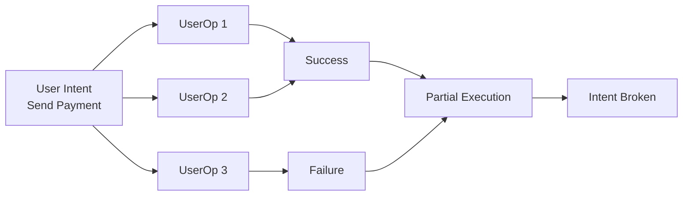
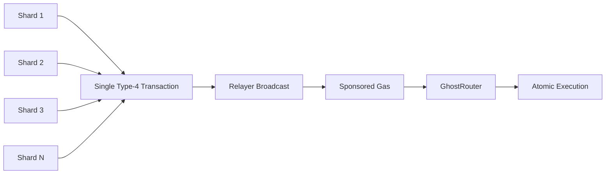

## 2.9 How Do We Coordinate Shards Without ETH?

The previous sections established two important properties of the GhostShard architecture:

1. Ownership is distributed across many disposable shards.
2. A user's intent may require spending multiple shards atomically.

This creates a practical challenge.

Shards are created at unpredictable addresses and typically hold no ETH. Yet they must still execute code, authorize transfers, and participate in mesh transactions.

The user cannot simply pre-fund shards with ETH:

* Pre-funding creates additional observable transactions.
* Pre-funding introduces identity-linkage opportunities.
* Shard addresses are derived through ECDH and are not known in advance.

The protocol therefore requires a mechanism for coordinating many independent shards without requiring those shards to maintain ETH balances.



### The Self-Sovereign Ideal

The ideal architecture is fully self-sovereign.

A shard holding assets should be capable of participating in transaction execution without relying on a custody layer, pooled funds, or protocol-controlled asset management.

Using EIP-7702, a shard can temporarily gain smart-contract functionality while retaining its identity as a standard EOA.

In principle, one shard could coordinate the entire transaction:

* Gathering shard authorizations
* Constructing the mesh transaction
* Managing transfer execution
* Returning change
* Coordinating payment delivery

The user's funds effectively manage themselves.

### What Self-Sovereignty Means

Self-sovereignty in GhostShard means that ownership never leaves the user's control.

No protocol contract holds user funds.

No liquidity pool aggregates ownership.

No custodian can freeze, seize, or redirect assets.

All assets remain controlled by user-owned shards throughout the transaction lifecycle.

The supporting infrastructure operates under minimal trust assumptions:

* **Relayer** — may broadcast or refuse to broadcast.
* **Paymaster** — may sponsor or refuse to sponsor.

Neither component can:

* Modify transfers
* Forge ownership
* Create valid shard signatures
* Redirect funds
* Spend assets without authorization

The architecture therefore preserves user custody even when sponsored execution is required.

### The ERC-4337 Path

At first glance, ERC-4337 appears to solve this problem.

ERC-4337 provides:

* Gas sponsorship through paymasters
* Transaction inclusion through bundlers
* Account abstraction infrastructure
* Broad ecosystem compatibility

A shard could use EIP-7702 delegation, behave as a smart account, and submit a UserOperation through the existing ERC-4337 ecosystem.

This would provide sponsored execution while remaining compatible with existing tooling.

### The Limitation

The difficulty arises from the structure of the current ERC-4337 EntryPoint.

Each UserOperation is centered around a single account.

The EntryPoint validation flow accepts a single sender:

```text
validateUserOp(...)
validatePaymasterUserOp(...)
```

Both validation paths assume one account per operation.

There is no mechanism for carrying multiple EOA authorizations inside a single UserOperation.

Importantly, this is not a limitation of account abstraction itself.

It is a limitation of the current ERC-4337 EntryPoint design.

A future EntryPoint could support multi-account authorization models.

The current infrastructure does not.

### Consequence: One UserOp per Shard

If a transaction requires N shards, the user must submit N independent UserOperations.



This immediately introduces two problems.

#### Gas Overhead

Every UserOperation pays EntryPoint overhead.

For large shard sets, overhead grows approximately linearly with shard count.

A transaction involving ten shards incurs the overhead of ten independent UserOperations before any transfer logic executes.

The coordination layer becomes increasingly expensive as shard count increases.

#### Loss of Atomicity

More importantly, atomicity is lost.

The user's intent is no longer represented by a single state transition.

Instead, it is fragmented across multiple independent operations.

Consider a transaction involving three shards:



If UserOperation 3 fails:

* UserOperations 1 and 2 may already have executed.
* Assets may already have moved.
* Remaining operations never execute.
* The user's intended transfer is only partially completed.

This recreates the same user-intent execution problem identified in Section 2.5.

The architecture requires all participating shards to succeed together or fail together.

The current ERC-4337 model cannot provide this property.

### Native Multi-Authorization with EIP-7702

EIP-7702 provides a different execution model.

A single type-4 transaction can carry multiple shard authorizations simultaneously.

Rather than creating N UserOperations, the transaction carries N authorizations directly.

All shards delegate into a shared execution context.

Execution occurs once.

Validation occurs once.

Atomicity is preserved.



### The GhostShard Coordination Model

GhostShard adopts a custom coordination layer built around EIP-7702's native multi-authorization capability.

The architecture combines:

* Multi-shard authorization through EIP-7702
* Sponsored execution through a paymaster
* Transaction broadcasting through a relayer
* Atomic execution through GhostRouter

Rather than coordinating many independent UserOperations, all shard authorizations are executed inside a single transaction.

If any transfer fails:

* Execution reverts.
* State rolls back.
* No shard is partially consumed.
* No ownership becomes stranded.

The user's intent succeeds completely or not at all.

### Design Outcome

The fragmentation problem established that a user's intent may span many disposable shards and therefore requires atomic execution.

This section explains how that atomicity is achieved despite shards holding no ETH and existing as independent EOAs.

GhostShard combines EIP-7702 multi-authorization, sponsored execution, and a custom relayer architecture to allow many disposable ownership units to behave as a single coherent actor.

The result is self-sovereign fund management with minimal trust assumptions, low coordination overhead, and full atomic execution across all participating shards.
