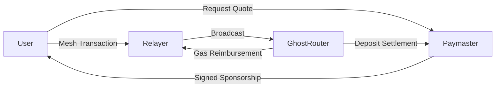
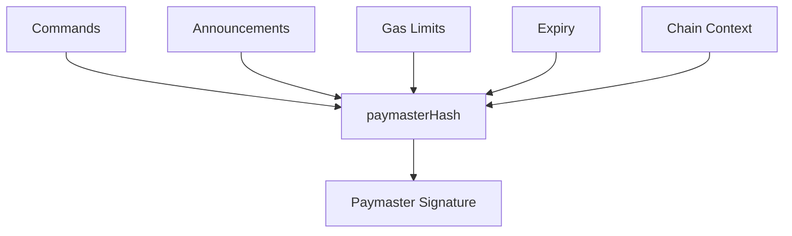
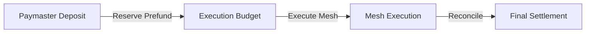
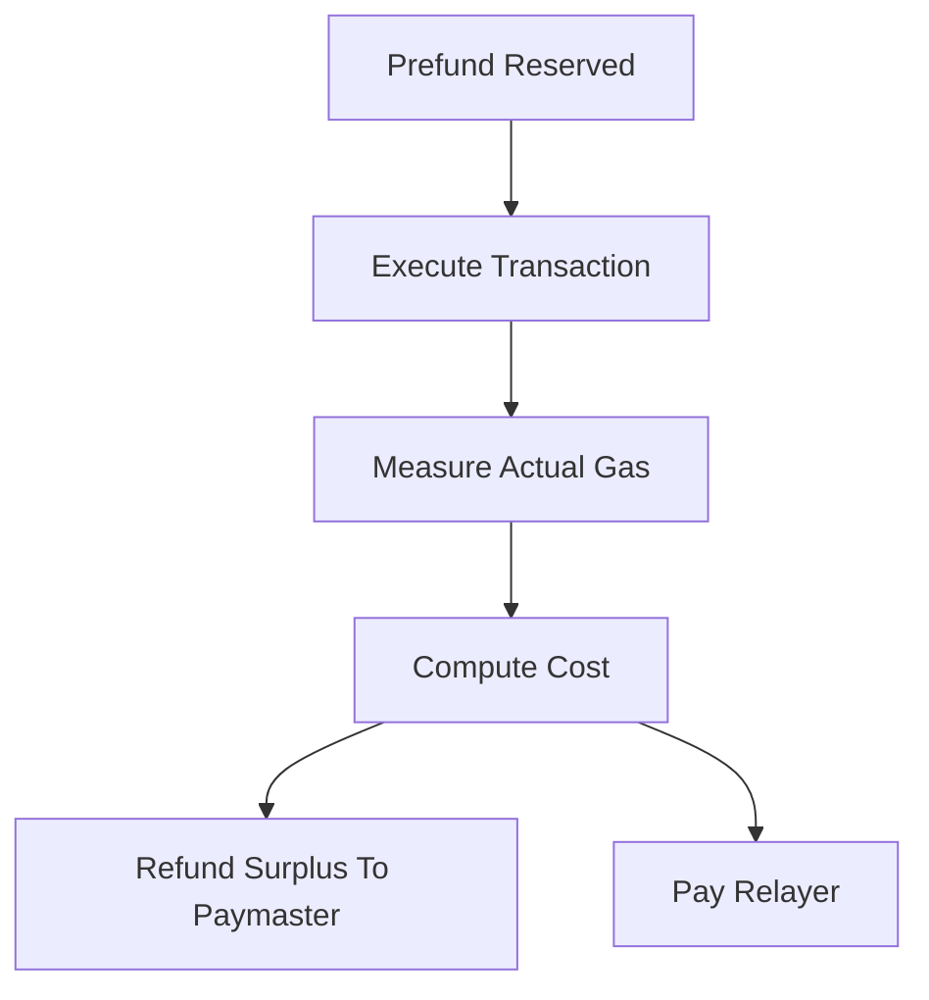

## 2.10 How Do We Verify and Execute Gas Sponsorship?

Shards are intentionally created without ETH.

This improves ownership privacy because users never need to fund newly created shard addresses directly. However, it introduces an immediate execution problem:

> How can a shard execute transactions if it cannot pay gas?

GhostShard solves this through sponsored execution.

A paymaster agrees to cover transaction costs, a relayer broadcasts the transaction, and GhostRouter enforces settlement rules that guarantee both parties are treated fairly.

The challenge is not simply paying gas.

The challenge is ensuring that:

* The paymaster cannot be overcharged.
* The relayer cannot be underpaid.
* The user cannot forge sponsorship approval.
* The router can verify sponsorship entirely on-chain.

This section describes how GhostShard achieves those guarantees.

---

### Participants

Gas sponsorship involves three actors:

#### User

Constructs the mesh transaction and obtains a sponsorship quote.

The user never pays ETH directly from participating shards.

#### Paymaster

Computes gas limits, approves sponsorship, and provides the economic backing for execution.

The paymaster maintains an ETH deposit inside GhostRouter.

#### Relayer

Broadcasts the transaction to the network and receives reimbursement after execution.

The relayer temporarily fronts gas costs and is compensated through post-execution reconciliation.



---

### Sponsorship Approval

Before execution, the paymaster performs gas estimation using the Double Simulation process described in Chapter 9.

From this simulation the paymaster derives:

* Verification gas limit
* Execution gas limit
* Pre-verification gas
* Expiration timestamp

The paymaster then signs a commitment covering the entire transaction context.

The commitment binds sponsorship approval to a specific transaction and prevents modification after signing.

```solidity
paymasterHash = keccak256(
    abi.encode(
        block.chainid,
        address(this),
        keccak256(abi.encode(commands)),
        keccak256(abi.encode(announcements)),
        validUntil,
        keccak256(abi.encode(limits))
    )
);
```

The signed payload commits to:

* The chain
* The GhostRouter instance
* The transfer commands
* The announcement set
* The expiration window
* The approved gas limits

Any modification changes the hash and invalidates the signature.



---

### On-Chain Verification

When `executeMesh()` is called, GhostRouter reconstructs the sponsorship hash from the submitted transaction parameters.

The router then:

1. Rebuilds the hash.
2. Applies the EIP-191 message prefix.
3. Recovers the signer.
4. Verifies the signer matches the configured paymaster.
5. Verifies the sponsorship has not expired.

Conceptually:

```solidity
ethHash = toEthSignedMessageHash(paymasterHash);

signer = ECDSA.recover(
    ethHash,
    paymasterSignature
);

require(signer = paymaster);
require(block.timestamp <= validUntil);
```

If either check fails, execution terminates before any asset movement occurs.

This ensures sponsorship cannot be forged, replayed outside its validity window, or modified after approval.

---

### Prefund Reservation

Before executing any mesh commands, GhostRouter reserves the maximum approved gas budget.

The reservation is computed as:

```solidity
prefund =
    (
        verificationGasLimit +
        callGasLimit +
        preVerificationGas
    ) * tx.gasprice;
```

The router verifies that the paymaster has sufficient deposited funds.

```solidity
require(
    paymasterDeposits[paymaster] >= prefund
);
```

The prefund amount is then temporarily deducted.

```solidity
paymasterDeposits[paymaster] -= prefund;
```

This guarantees that reimbursement funds already exist before execution begins.



---

### Gas Reconciliation

After execution completes, GhostRouter calculates actual gas consumption.

Conceptually:

```solidity
totalGasUsed =
    startGas -
    gasleft() +
    POST_EXECUTION_OVERHEAD +
    preVerificationGas;
```

The final charge is capped by the previously approved prefund amount.

```solidity
totalGasCost =
    min(
        totalGasUsed * tx.gasprice,
        prefund
    );
```

Any unused portion is returned to the paymaster.

```solidity
paymasterDeposits[paymaster]
    += (prefund - totalGasCost);
```

The relayer receives reimbursement for actual execution cost.

```solidity
msg.sender.call{
    value: totalGasCost
}("");
```

This creates a bounded-loss system:

* The paymaster cannot lose more than the approved prefund.
* The relayer cannot receive less than the measured execution cost.
* The user cannot manipulate reimbursement calculations.



---

### Relayer Self-Protection

The relayer does not blindly trust the paymaster's quote.

Before broadcasting, the relayer independently performs Double Simulation.

The simulated gas requirements are compared against the paymaster's signed limits.

If the quote appears underfunded, the relayer rejects the transaction.

This protects relayers from consistently broadcasting transactions that reimburse less than actual execution cost.

As a result:

* Paymasters verify transaction cost.
* Relayers verify paymaster estimates.
* GhostRouter verifies both.

No participant is required to trust the others blindly.

---

### Incentive Alignment

The sponsorship system is designed so that every participant acts in its own economic interest while preserving correct execution.

| Participant | Goal                | Protection                             |
| ----------- | ------------------- | -------------------------------------- |
| User        | Execute without ETH | Sponsored execution                    |
| Paymaster   | Avoid overpayment   | Signed limits + prefund cap            |
| Relayer     | Avoid losses        | Independent simulation + reimbursement |
| Router      | Enforce correctness | On-chain verification                  |

The system therefore achieves gas sponsorship through verification rather than trust.

---

### Design Outcome

GhostShard enables ETH-less shard execution through a sponsorship model built around signed approvals, prefunded deposits, and post-execution reconciliation.

The paymaster authorizes a bounded execution budget. GhostRouter verifies that authorization on-chain, reserves the approved funds, executes the mesh transaction, and reconciles actual gas usage after completion. Relayers independently verify quotes before broadcasting, ensuring they are not exposed to systematic losses.

The result is a trust-minimized sponsorship architecture in which shards can execute transactions without holding ETH while preserving economic safety for users, paymasters, and relayers.
