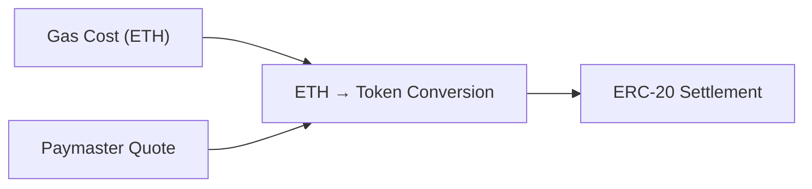
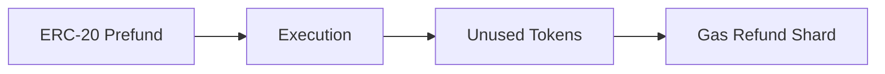
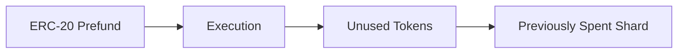

## 2.11 How Do We Enable ERC-20 Gas Sponsorship?

GhostShard v0 implements **ETH-based gas sponsorship only**.

Paymasters maintain ETH deposits inside GhostRouter, sponsorship approvals are signed off-chain, and execution costs are settled through ETH-based gas reconciliation.

This design keeps the initial architecture simple while validating the core sponsorship model.

However, many users may hold only ERC-20 assets and no ETH.

Supporting gas payments directly from ERC-20 balances is therefore a natural extension of the protocol.

The challenge is that gas is ultimately paid in ETH, while the user wishes to pay using a different asset.

This introduces an additional pricing and settlement layer that does not exist in the ETH sponsorship model.

---

### The Pricing Problem

ETH sponsorship is straightforward because both costs and settlement occur in the same asset.

ERC-20 sponsorship is different.

The protocol must answer a fundamental question:

> How many units of token T are equivalent to the ETH required to execute this transaction?

This requires an exchange rate between ETH and the selected ERC-20 token.

GhostShard's proposed approach is a paymaster-signed quote.

The paymaster provides a signed statement specifying:

* The token being accepted
* The ETH-to-token conversion rate
* The quote expiration timestamp

Conceptually:

```text
1 ETH = X TOKEN T
Valid Until = Timestamp
```

The quote is signed by the paymaster and included as part of the transaction context.

This allows the router to convert ETH-denominated gas costs into token-denominated settlement amounts.



---

### Quote Verification

Execution follows the same trust-minimized model used for ETH sponsorship.

The router reconstructs the quote payload, verifies the paymaster signature, and validates the expiration window.

Only quotes signed by an approved paymaster are accepted.

This ensures that users cannot fabricate exchange rates and relayers cannot modify settlement terms.

The paymaster remains fully responsible for determining the quoted conversion rate.

---

### ERC-20 Prefunding

Once a quote is verified, the router can calculate the maximum ERC-20 amount required to cover execution.

Conceptually:

```text
Maximum Token Cost
    =
Maximum ETH Cost
    ×
Quoted Exchange Rate
```

The corresponding token amount is reserved before execution begins.

This reservation serves the same purpose as ETH prefunding in the v0 architecture:

* Relayers receive guaranteed reimbursement.
* Users cannot spend the same funds twice.
* Paymasters can bound their economic exposure.

---

### The Remaining Funds Problem

Unlike ETH sponsorship, ERC-20 sponsorship introduces a new challenge.

The exact execution cost is unknown before execution begins.

As a result, the prefunded token amount must exceed the expected cost.

After reconciliation, excess tokens remain.

Those excess tokens must be returned to the user.

The question is:

> Where should they go?

This turns out to be surprisingly difficult.

---

### Option 1: Dedicated Gas Shards

One approach is to create a dedicated shard specifically for gas refunds.

Unused tokens would be transferred to this shard after reconciliation.



This approach preserves ownership of the excess funds but introduces several drawbacks:

* Additional shard management complexity
* Extra state growth
* Additional discovery overhead
* Potential linkage opportunities if refund shards are reused incorrectly

The refund mechanism itself becomes part of the ownership graph.

---

### Option 2: Sweep Back to a Spent Shard

Another possibility is returning excess funds to one of the shards consumed during execution.

The user already possesses the shard's private key and can theoretically recover the funds later.



This approach avoids creating additional ownership structures.

However, it introduces different tradeoffs:

* Recovery becomes an off-protocol operation.
* Small residual balances may be uneconomical to recover.
* Accurate gas estimation becomes more important.
* Excessive overestimation can strand value.

The economic cost of estimation error is shifted toward the user.

---

### Why This Remains Open Research

Both approaches solve part of the problem.

Neither solves it completely.

Dedicated refund shards preserve protocol-native recovery but increase complexity.

Spent-shard recovery simplifies protocol state but increases reliance on estimation accuracy.

Additional designs are possible, including:

* Dynamic refund shards
* Refund pools
* Deferred settlement models
* Hybrid approaches

Each introduces different privacy, complexity, and economic tradeoffs.

The optimal design remains an open research question.

---

### Current Status

GhostShard v0 deliberately avoids this complexity.

The current implementation supports:

* Paymaster verification
* ETH sponsorship
* Deposit prefunding
* Gas reconciliation
* Relayer reimbursement

ERC-20 gas sponsorship is not part of the v0 protocol.

The architecture described in this section represents a future extension rather than a deployed component.

---

### Design Outcome

GhostShard v0 implements gas sponsorship exclusively through ETH-backed paymaster deposits.

ERC-20 sponsorship introduces additional pricing and settlement challenges because transaction costs are denominated in ETH while user balances are denominated in arbitrary tokens.

The protocol's proposed approach uses paymaster-signed exchange-rate quotes and token-based prefunding. However, the problem of returning excess funds without introducing complexity, economic inefficiency, or privacy leakage remains unresolved.

ERC-20 gas sponsorship therefore remains future work and is intentionally excluded from the v0 implementation.
