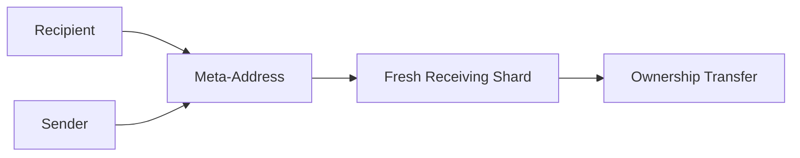
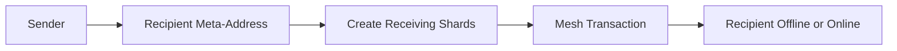
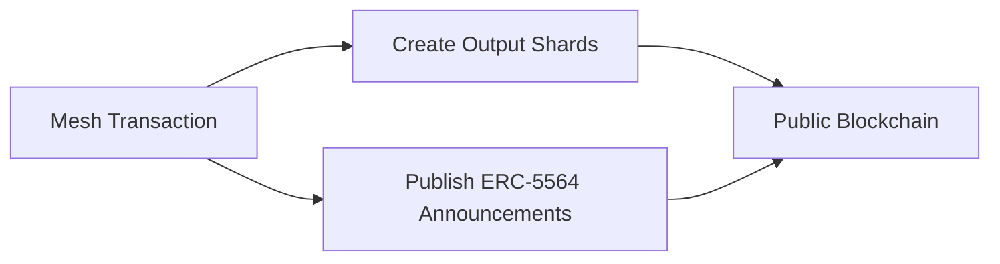
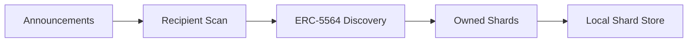
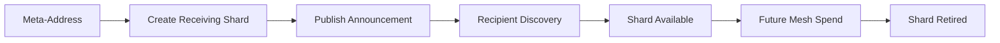

## 2.12 Announcement and Discovery

The previous sections established how ownership is created, fragmented, compressed, transferred, and coordinated.

A mesh transaction consumes existing shards and creates new shards.

This naturally raises two questions:

> How are receiving shards determined?

> How do recipients discover which shards belong to them?

These questions are fundamental.

GhostShard's ownership model requires **permissionless ownership transfer**.

A sender must be able to create ownership units for a recipient:

* Without prior coordination
* Without requiring the recipient to be online
* Without revealing the recipient's ownership publicly

At the same time, recipients must be able to discover newly received shards without exposing their ownership graph to observers.

The protocol therefore requires a discovery mechanism that satisfies three properties:

1. Anyone can send ownership units to a recipient.
2. Only the intended recipient can identify those ownership units.
3. Discovery does not reveal ownership to external observers.

---

### Meta-Addresses

Before a sender can create receiving shards, it must have a way to reference the recipient without learning or reusing the recipient's actual ownership addresses.

GhostShard solves this using **ERC-5564 meta-addresses**.

A meta-address is a public receiving identifier that allows anyone to derive receiving shards for a recipient without learning the recipient's ownership graph.

Importantly, a meta-address is **not** an ownership address.

It never directly holds assets.

Instead, it acts as a reusable destination from which fresh receiving shards can be derived.

A recipient may publish a meta-address through:

* Direct communication
* Application-level contact sharing
* QR codes
* An ERC-ERC6538 registry

The mechanism used to derive receiving shards from a meta-address is discussed in Chapter 4.

For the purposes of this chapter, the important observation is architectural:

> Meta-addresses allow recipients to expose a stable receiving identifier without exposing ownership addresses.

---

### Receiving Shards

GhostShard uses ERC-5564 as its ownership announcement and discovery mechanism.

When constructing a mesh transaction, the sender uses the recipient's meta-address to derive one or more receiving shards.

The recipient does not need to pre-generate receiving addresses, remain online, or participate in the transaction.

Ownership can therefore be transferred permissionlessly.

The mechanism used to derive receiving shards is defined by ERC-5564 and discussed in detail in Chapter 4.

For the purposes of this chapter, the important observation is architectural:

> Receiving ownership can be created without prior interaction between sender and recipient.

---

### Announcements

Creating a shard alone is insufficient.

The recipient must also learn that the shard exists.

GhostShard therefore publishes ERC-5564 announcements alongside mesh transaction outputs.

Announcements serve as ownership discovery signals.

They allow recipients to identify newly received ownership units without revealing ownership publicly.

Observers can see that announcements exist.

They cannot determine:

* Who the intended recipient is.
* Which shard belongs to which recipient.
* Whether a particular recipient owns any output at all.

The exact announcement format, encryption scheme, and key derivation process are discussed later in Chapter 4.

---

### Discovery

Recipients discover ownership by scanning announcements and applying the ERC-5564 discovery process.

Successful discovery reveals ownership information to the intended recipient.

Unsuccessful discovery reveals nothing.

From an external observer's perspective, all announcements appear identical.

The observer can see that discovery is possible.

They cannot determine who successfully discovered ownership.

The cryptographic mechanisms that make this possible are examined in Chapter 4.

This chapter focuses only on the architectural role of discovery within the ownership lifecycle.

---

### Architectural Significance

Announcements complete the disposable ownership model.

Without meta-addresses, senders would have no way to derive receiving ownership.

Without announcements, ownership could be transferred but not discovered.

Without discovery, ownership would exist but be unusable.

Together, meta-addresses and announcements provide the missing link between ownership creation and ownership utilization.

The important observation is architectural:

> Ownership can be transferred permissionlessly while remaining discoverable only by the intended recipient.

A shard can now be created, transferred, discovered, spent, and retired without exposing persistent ownership relationships on-chain.

This completes the ownership lifecycle.

The cryptographic foundations that make announcement and discovery possible are deferred to Chapter 4.

The next question naturally follows:

> If ownership remains private by default, how can users selectively prove ownership when required?

The answer leads directly to the selective disclosure model.
