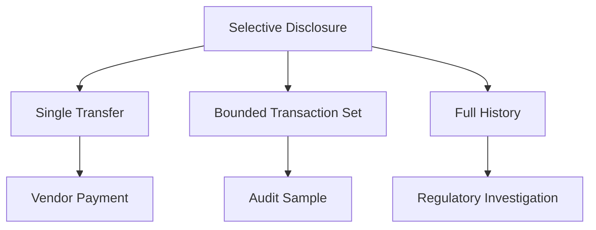
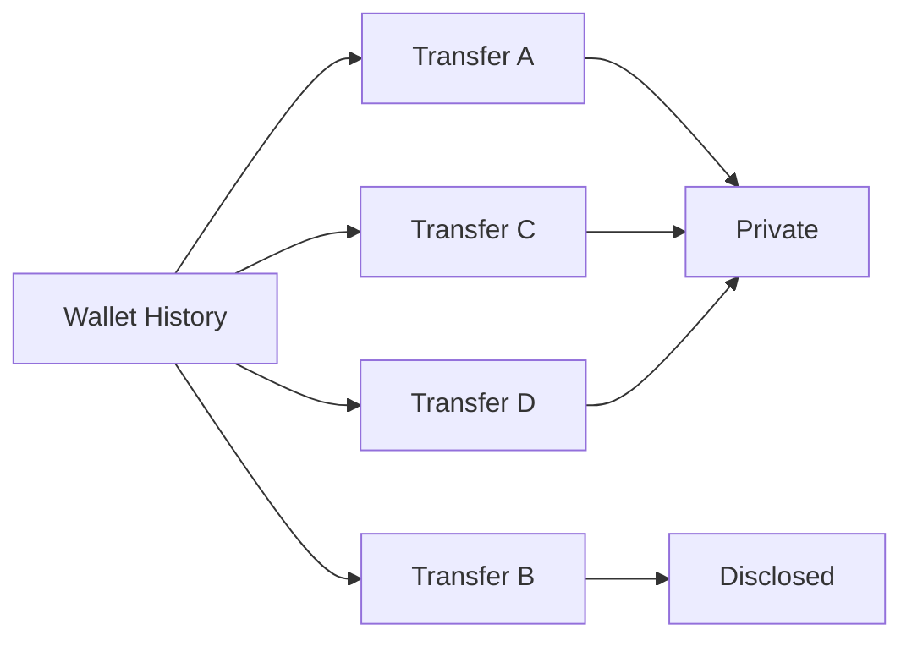
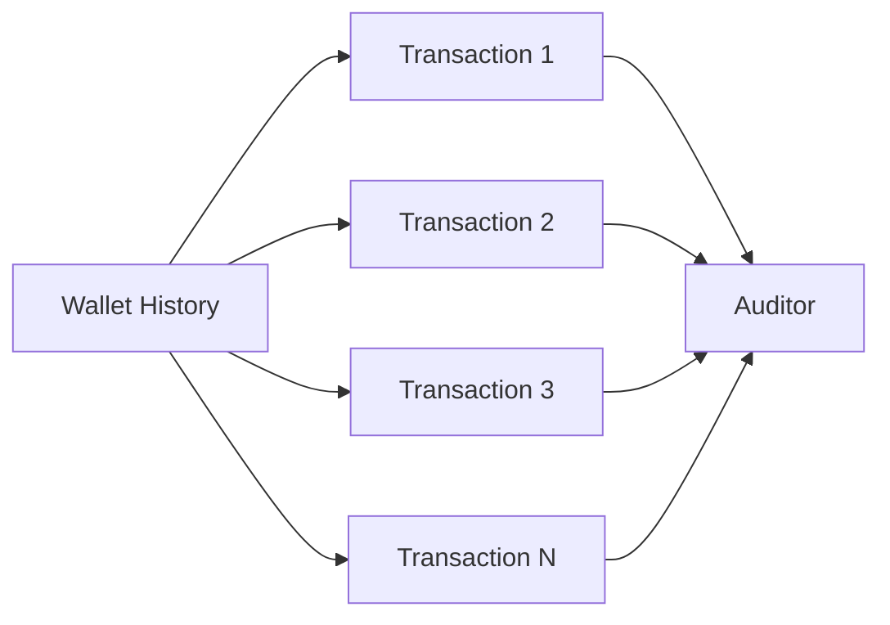
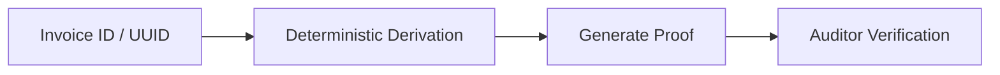

## 2.13 Selective Disclosure and Compliance

Privacy and compliance are often presented as opposing goals.

GhostShard rejects this assumption.

The objective of privacy is not to make information impossible to reveal.

The objective is to ensure that information is revealed **only when the owner chooses to reveal it**.

This distinction is critical for institutional adoption.

Organizations must regularly demonstrate compliance with tax authorities, auditors, regulators, counterparties, and internal governance processes.

A privacy system that prevents disclosure entirely is unusable for institutional finance.

A privacy system that exposes everything by default is incompatible with financial confidentiality.

GhostShard therefore adopts a model of **selective disclosure**:

> Reveal exactly what is required, and nothing more.

---

### The Compliance Problem

Institutions frequently need to prove that specific transfers occurred.

Examples include:

* Vendor payments
* Payroll distributions
* Treasury operations
* Tax reporting
* Regulatory investigations
* Financial audits

In a transparent blockchain system, proving a transfer is trivial because the transaction is publicly visible.

In a privacy-preserving system, the transaction is intentionally hidden.

This creates a new requirement:

> How can a user prove a transaction without exposing their entire financial history?

GhostShard addresses this through layered disclosure mechanisms.

---

### Disclosure Granularity

Not all compliance requirements require the same level of visibility.

Different situations require different disclosure scopes.

The goal is always to disclose the smallest amount of information necessary.

---

### Level 1: Transaction-Level Disclosure

The default disclosure mechanism in GhostShard v0 is transaction-level disclosure.

A user can prove a specific transfer without revealing unrelated activity.

The proof reveals only the information associated with the transfer being examined.

For example:

* Asset type
* Amount
* Timestamp
* Recipient relationship
* Relevant announcement data

All unrelated shards remain private.

All unrelated balances remain private.

All future activity remains private.

This represents the preferred disclosure model for most business use cases.

---

### Level 2: Bounded Historical Disclosure

Some compliance scenarios require proving multiple related transactions.

Examples include:

* Quarterly audits
* Treasury reviews
* Counterparty reconciliation
* Internal investigations

In these situations, a user may wish to disclose a specific subset of historical activity without exposing the remainder of their transaction history.

The disclosed set remains bounded and explicitly selected.

Only the chosen transactions become visible.

The rest of the ownership graph remains private.

Future activity remains private.

This capability is a future enhancement and is expected to rely on cryptographic proofs that demonstrate ownership relationships without exposing viewing credentials.

---

### Level 3: Full Historical Disclosure

As a last resort, a user may voluntarily disclose complete wallet history.

This level of disclosure may be appropriate for:

* Regulatory investigations
* Comprehensive audits
* Tax authority reviews
* Legal proceedings

Under full disclosure, an authorized reviewer gains visibility into all discoverable ownership associated with the disclosed wallet.

Because this disclosure scope is broad and difficult to revoke, it should be treated as an exceptional rather than routine action.

---

### Deterministic Institutional Proofs

Large institutions face a practical challenge when generating transaction proofs.

A payment may need to be verified months or years after it occurred.

Managing large volumes of transaction-specific proof material can become operationally expensive.

GhostShard therefore supports deterministic proof generation from existing business identifiers.

Examples include:

* Invoice identifiers
* Purchase order numbers
* Settlement references
* UUIDs
* Internal payment references

Rather than maintaining separate proof-management infrastructure, institutions can derive proof material from identifiers that already exist within their operational workflows.

This reduces operational complexity while preserving the ability to generate localized compliance proofs.

The cryptographic details of deterministic proof generation are discussed in Chapter 4.

For the purposes of this chapter, the important observation is architectural:

> Existing business identifiers can act as anchors for future compliance proofs.

---

### Privacy–Compliance Coexistence

GhostShard does not attempt to eliminate disclosure.

Instead, it transfers control of disclosure from the public blockchain to the asset owner.

The owner decides:

* What is disclosed.
* To whom it is disclosed.
* At what level of granularity disclosure occurs.

Privacy and compliance therefore become complementary rather than contradictory.

Privacy protects information by default.

Compliance reveals information by exception.

---

### Design Outcome

GhostShard adopts a selective disclosure model rather than a transparency model.

Transactions remain private by default, but users retain the ability to disclose information at multiple levels of granularity:

| Disclosure Level  | Scope                    | Typical Use Case                    |
| ----------------- | ------------------------ | ----------------------------------- |
| Transaction-Level | Single transfer          | Vendor payment verification         |
| Bounded History   | Selected transaction set | Audit samples, reconciliation       |
| Full History      | Complete wallet history  | Regulatory review, legal disclosure |

The result is a system that preserves privacy during normal operation while remaining compatible with institutional auditing, reporting, and compliance requirements.
