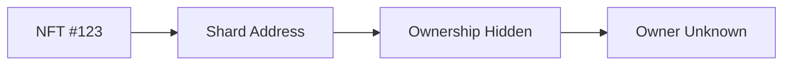
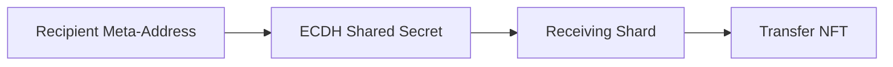
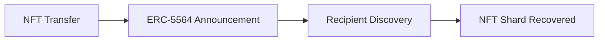
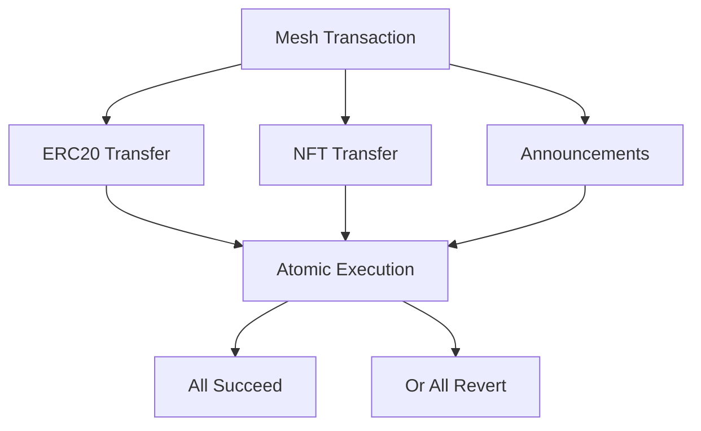
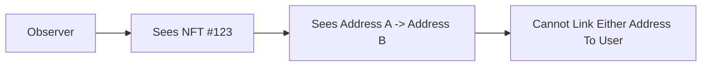

## 2.14 How Do We Privatize NFTs?

NFTs are fundamentally harder to privatize than fungible assets.

Fungible assets can be divided, pooled, merged, compressed, and redistributed across many ownership units.

NFTs cannot.

An NFT exists as a single indivisible token controlled by a single address at any point in time.

This creates a challenge for most privacy systems.

Privacy mechanisms designed for fungible assets typically rely on denomination pools, note systems, or balance aggregation. None of these approaches naturally apply to unique assets.

The question therefore becomes:

> How can ownership of a unique asset be privatized without modifying the NFT itself?

---

### Why Existing Approaches Struggle

Many privacy systems are built around fungibility.

#### Mixers

Mixers rely on identical denominations.

Users deposit assets into a common pool and later withdraw equivalent assets.

This works because one ETH is interchangeable with another ETH.

NFTs are unique.

A CryptoPunk cannot be exchanged for another CryptoPunk without changing the asset itself.

As a result, mixer-based privacy does not naturally extend to NFTs.

---

#### Privacy Pools

Privacy pools represent ownership as fungible notes.

Each note corresponds to some claim on pooled assets.

NFTs do not fit this model because ownership cannot be represented as interchangeable shares.

The NFT must either:

* Remain outside the pool
* Be wrapped into another asset type

Both approaches introduce additional complexity and trust assumptions.

---

#### Zero-Knowledge Ownership Systems

Some privacy systems use zero-knowledge proofs to hide NFT ownership.

These systems can provide strong privacy guarantees but often require:

* Specialized circuits
* Asset-specific logic
* Complex proving systems
* Additional protocol infrastructure

While powerful, they significantly increase implementation complexity.

---

### The GhostShard Observation

GhostShard does not attempt to privatize the NFT itself.

Instead, GhostShard privatizes the **ownership unit** that controls the NFT.

The NFT remains unchanged.

The ERC-721 contract remains unchanged.

The transfer mechanics remain unchanged.

Only ownership attribution changes.

The NFT is held by a shard.

That shard is unlinkable to the owner.

Therefore ownership of the NFT becomes unlinkable.

This is the same mechanism that privatizes:

* ETH
* ERC-20 tokens
* ERC-721 NFTs

GhostShard introduces no NFT-specific privacy infrastructure.

The shard model already provides the required ownership ambiguity.

---

### Receiving NFTs

NFT transfers follow the same recipient derivation process used for fungible assets.

The sender:

1. Uses the recipient's ERC-5564 meta-address.
2. Derives a shared secret.
3. Derives a receiving shard.
4. Transfers the NFT to that shard.

The recipient does not need to be online.

No interaction is required.

No receiving address must be pre-generated.

---

### NFT Announcements

After transferring the NFT, the sender publishes an ERC-5564 announcement.

The announcement allows the recipient to discover ownership of the newly created shard.

For NFT transfers:

* `assetType = ERC721`
* `identifier = tokenId`

The token identifier is encoded within the announcement payload.

Only the intended recipient can decrypt and interpret this information.

Observers see the announcement but cannot determine:

* The recipient
* The shard owner
* The decrypted metadata

---

### Discovery

Discovery is identical to the discovery process described in the previous section.

The recipient scans announcements and performs trial decryption.

If the announcement belongs to them:

* The shared secret is recovered.
* The shard address is reconstructed.
* The NFT ownership is added to the shard store.

No NFT-specific discovery logic is required.

The discovery pipeline is entirely asset-agnostic.

---

### Spending NFTs

NFT transfers are executed through the same mesh transaction mechanism used for fungible assets.

A mesh transaction may contain:

* Native transfers
* ERC-20 transfers
* ERC-721 transfers

within the same atomic execution context.

The NFT transfer is represented as a command executed inside the router's execution sandbox.

If any command fails:

* The NFT transfer reverts.
* All fungible transfers revert.
* All announcements revert.

The entire user intent succeeds or fails as a single unit.

---

### What NFT Privacy Protects

GhostShard provides **ownership privacy**.

GhostShard does not provide **asset invisibility**.

This distinction is important.

The ERC-721 contract remains public.

Anyone can still observe:

* `ownerOf(tokenId)`
* `Transfer(from, to, tokenId)` events
* The token identifier itself

An observer can see that a specific NFT moved between two addresses.

What they cannot determine is:

* Who controls the sending shard
* Who controls the receiving shard
* Whether multiple shards belong to the same user

The NFT remains visible.

The owner becomes ambiguous.

---

### Limitations

NFT privacy inherits the limitations of public NFT ledgers.

For highly recognizable assets, the token itself may reveal information.

Examples include:

* High-value collectibles
* Rare art NFTs
* Named institutional assets

An observer may know **what** was transferred.

GhostShard only prevents them from knowing **who controls it**.

This is fundamentally different from fungible assets, where both ownership and value can be obscured through output scattering.

---

### Design Outcome

GhostShard does not require special NFT privacy infrastructure.

NFTs are privatized through the same ownership ambiguity that privatizes fungible assets.

An NFT held by a shard is private because the shard itself is unlinkable to its owner.

No wrapping, pooling, note systems, or NFT-specific circuits are required.

The privacy guarantee is ownership ambiguity rather than transaction invisibility.

Observers can see that a particular token moved between two shard addresses, but they cannot determine who controls either address or whether multiple NFT shards belong to the same entity.
