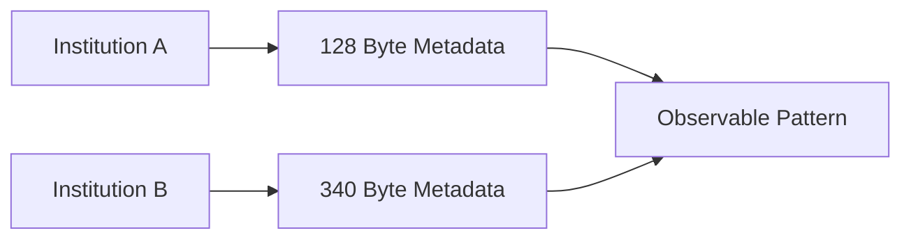
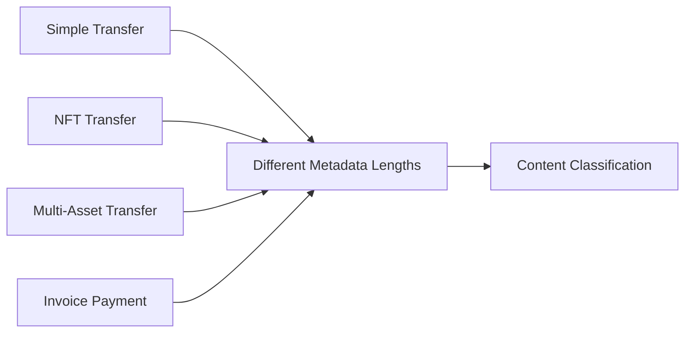
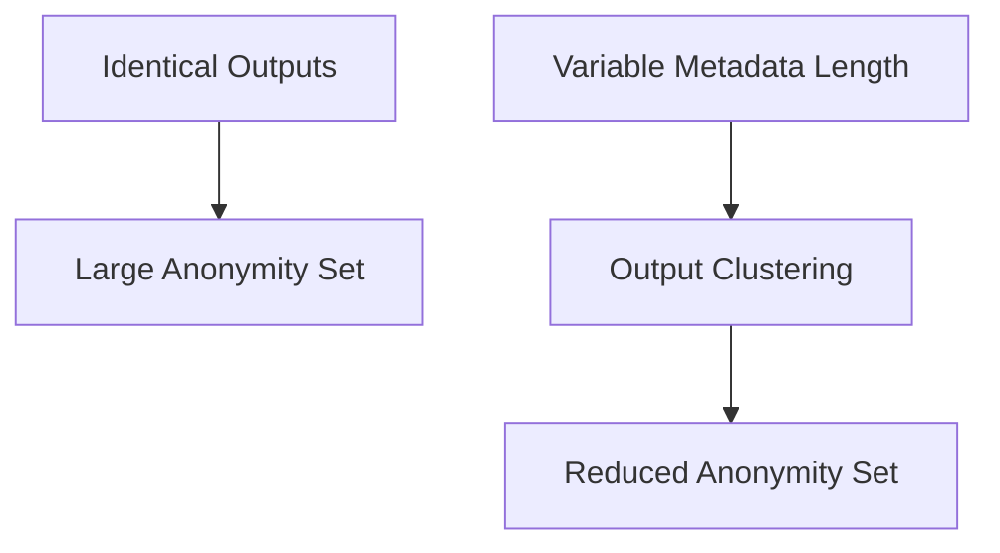
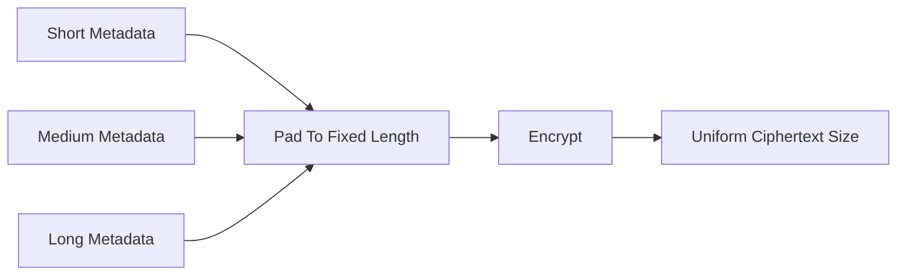

## 2.15 Metadata Length Standardization

Section 2.13 introduced **selective disclosure**, where transaction metadata (`senderInfo`) is encrypted within ERC-5564 announcements and can later be revealed to auditors, regulators, or counterparties on a transaction-by-transaction basis.

This capability introduces a subtle privacy challenge.

While the contents of `senderInfo` are encrypted, the **length** of the encrypted payload remains publicly visible on-chain.

If announcement metadata is allowed to vary in size, observers may be able to extract information without decrypting a single byte.

---

### The Metadata Fingerprinting Problem

Mesh transactions rely on structural uniformity.

Every output should appear indistinguishable from every other output.

Observers should not be able to determine:

* Which outputs belong to recipients.
* Which outputs are change.
* Which outputs belong to the same participant.
* Which outputs represent the same type of activity.

However, variable-length encrypted metadata introduces an unintended fingerprint.

Consider two announcements:

| Announcement | Encrypted Metadata Size |
| ------------ | ----------------------- |
| A            | 128 bytes               |
| B            | 340 bytes               |

Even though both payloads are encrypted, the difference in size is observable.

Over time, observers can begin clustering announcements according to metadata length.

This creates a new source of information leakage.

---

### Sources of Length-Based Fingerprinting

#### Sender Fingerprinting

Different institutions often use different metadata formats.

One sender may include only the minimum required information.

Another may include invoice references, payment identifiers, or internal accounting data.

As a result, announcements originating from the same institution may repeatedly produce similar ciphertext lengths.

Observers can gradually construct sender profiles based solely on metadata size.



---

#### Recipient Fingerprinting

Metadata may also vary according to recipient-specific information.

If certain counterparties consistently receive announcements of similar sizes, observers may be able to group outputs belonging to the same recipient even without identifying them directly.

The metadata remains encrypted.

The structure itself becomes the signal.

---

#### Content Fingerprinting

Different transaction types naturally produce different metadata footprints.

Examples include:

* Simple transfers
* Invoice-linked payments
* NFT transfers
* Multi-asset settlements
* Payments containing memos

Without standardization, these activities can become distinguishable through ciphertext size alone.



---

### Why This Matters

The privacy of mesh transactions relies heavily on **combinatorial ambiguity**.

With multiple outputs, an observer should face many plausible interpretations of ownership.

The observer should not know which outputs belong to recipients and which belong to change.

If output structures begin to differ, clustering becomes possible.

Outputs that share similar metadata lengths can be grouped together, reducing uncertainty and shrinking the effective anonymity set.

The encrypted contents remain private.

The observable structure becomes the leak.



---

### Standardized Metadata Length

To eliminate this fingerprinting vector, GhostShard standardizes the size of encrypted metadata.

Before encryption, every `senderInfo` payload is padded to a fixed length.

```text
plaintext  = senderInfo || randomPadding

ciphertext = AES-256-GCM(plaintext)
```

Regardless of the actual content:

* Every encrypted metadata blob has the same size.
* Every announcement appears structurally identical.
* Metadata length no longer reveals information about the sender, recipient, or transaction type.

Shorter payloads are padded before encryption.

Payloads that exceed the maximum supported size must be truncated or referenced through external data mechanisms.



---

### Design Properties

Metadata standardization provides several important guarantees:

1. **Sender Independence**
   Different institutions produce indistinguishable announcement sizes.

2. **Recipient Independence**
   Outputs cannot be clustered based on recipient-specific metadata length.

3. **Content Independence**
   Transaction type cannot be inferred from announcement size.

4. **Selective Disclosure Compatibility**
   The internal contents of `senderInfo` remain unchanged and can still be selectively disclosed when required.

5. **Authenticated Encryption Preservation**
   Padding occurs inside the AES-256-GCM authenticated boundary. Any modification to the ciphertext remains detectable.

---

### Cost of Standardization

Standardization increases calldata usage because additional padding bytes must be transmitted.

This introduces a modest gas overhead.

The exact cost depends on:

* The chosen fixed metadata size.
* The number of announcements.
* The deployment environment (L1 versus L2).

The additional cost is generally small relative to the privacy gained.

More importantly, the overhead scales predictably and does not introduce new trust assumptions or protocol complexity.

---

### Design Outcome

Selective disclosure enables institutions to reveal specific transactions without exposing their broader transaction history.

Metadata length standardization ensures that this capability does not create a new fingerprinting vector.

By enforcing a uniform encrypted metadata size across all announcements, GhostShard preserves the structural indistinguishability of mesh transaction outputs and prevents observers from classifying transactions based solely on ciphertext length.

Privacy therefore depends on cryptographic ownership ambiguity rather than accidental differences in metadata structure.
