## 2.16 Architectural Evolution

GhostShard was not designed in a single step.

The architecture emerged from a sequence of constraints.

Each solution introduced a new problem.

Each new problem forced another architectural decision.

Some decisions were unavoidable consequences of previous choices.

Others emerged independently from broader goals such as compliance, privacy hardening, and asset coverage.

This section maps the architectural evolution of the protocol and shows how the various components fit together.

---

### The Primary Causal Chain

The following sequence forms the architectural spine of GhostShard.

Each step is a direct consequence of the previous one.

Removing any link breaks the system.

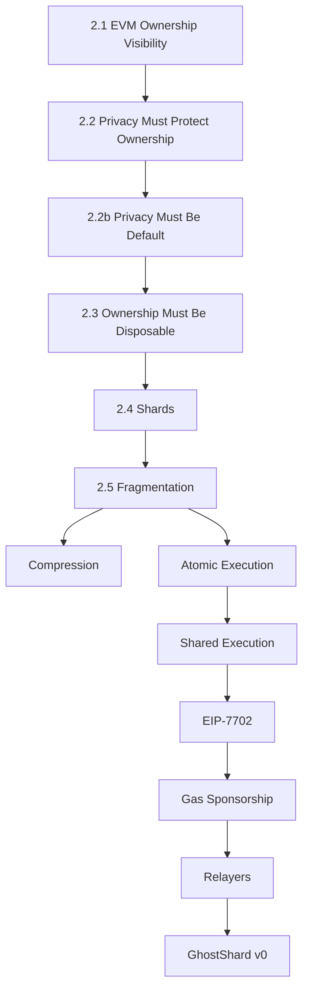

---

#### 2.1 → Ownership Visibility

The EVM exposes ownership directly.

Every address accumulates:

* Transaction history
* Balance history
* Relationship history
* Behavioral history

Even if transaction details are hidden, ownership remains observable.

This means transaction privacy alone is insufficient.

The ownership layer itself becomes the source of information leakage.

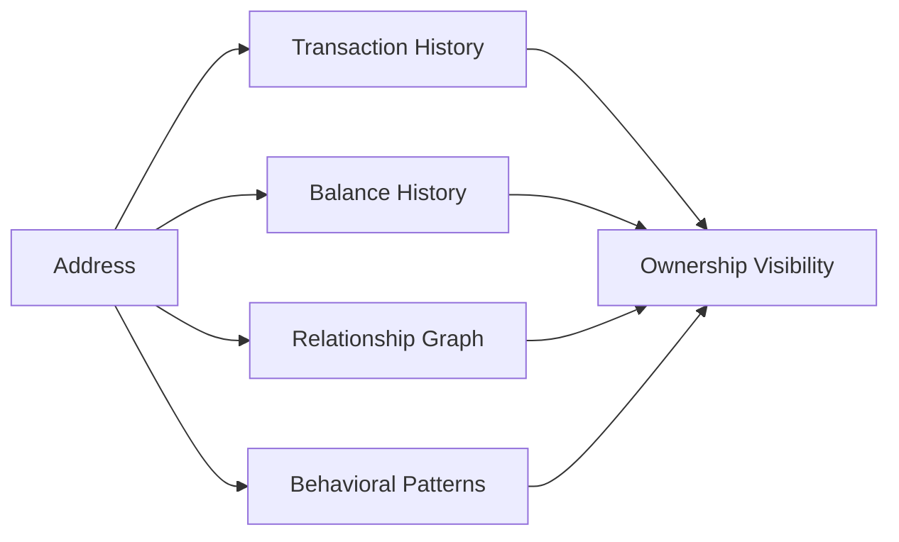

---

#### 2.2 → Privacy Must Protect Ownership

If ownership is the leak, ownership must become ambiguous.

Privacy cannot merely hide transfers between known owners.

It must prevent observers from confidently determining who owns what.

This shifts privacy from the transaction layer to the ownership layer.

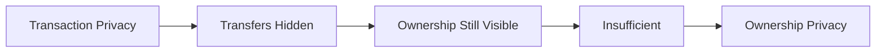

---

#### 2.2b → Privacy Must Be Default

Opt-in privacy creates a small identifiable anonymity set.

Users who actively choose privacy become distinguishable from those who do not.

A privacy system intended for institutional adoption must avoid this distinction.

Privacy therefore becomes the default behavior of the protocol rather than an optional feature.

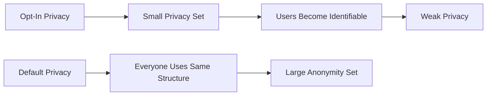

---

#### 2.3 → Ownership Must Be Disposable

Persistent ownership accumulates information over time.

Even unlinkable transactions become linkable if they continuously originate from the same address.

The solution is temporary ownership.

Ownership units are created, used, and permanently retired.

History never accumulates.

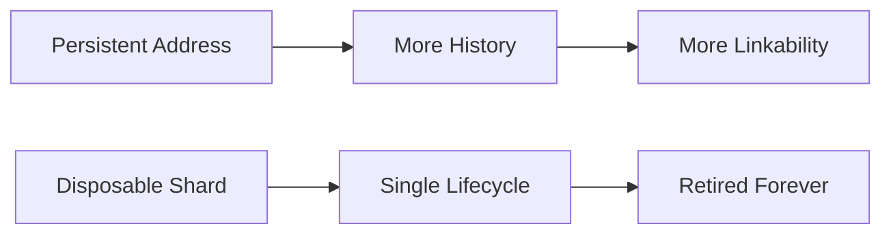

---

#### 2.4 → Disposable Ownership Requires Shards

Disposable ownership requires a concrete representation.

The ownership unit must be:

* Independent
* Cheap to create
* EVM-compatible
* Compatible with all asset types
* Disposable after use

EOAs satisfy these requirements naturally.

GhostShard therefore represents ownership using disposable EOAs called shards.

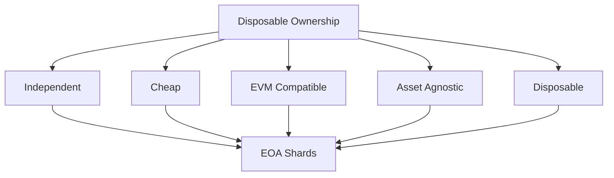

---

#### 2.5 → Shards Create Fragmentation

Each incoming transfer creates a new shard.

As activity grows, users accumulate increasingly large shard sets.

A single payment may require spending many shards simultaneously.

Fragmentation therefore becomes inevitable.

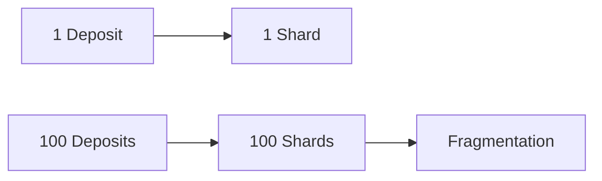

---

#### 2.5 → Fragmentation Requires Compression

Without intervention, shard count grows indefinitely.

Compression reduces long-term shard growth by consuming additional shards during ordinary spending operations.

The result is bounded shard-store growth.

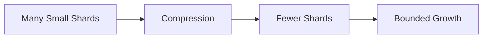

---

#### 2.5 → Fragmentation Requires Atomic Execution

Fragmentation creates another problem.

A single user intent may involve many shards.

Partial execution would leave funds stranded across partially completed operations.

User intent therefore requires atomicity.

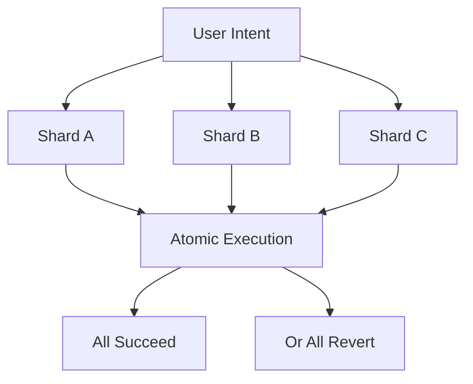

---

#### 2.7 → Atomic Execution Requires Shared Execution

Empty EOAs cannot coordinate themselves.

Multiple shards must temporarily act as a single execution unit.

This requires delegation into a shared execution environment.

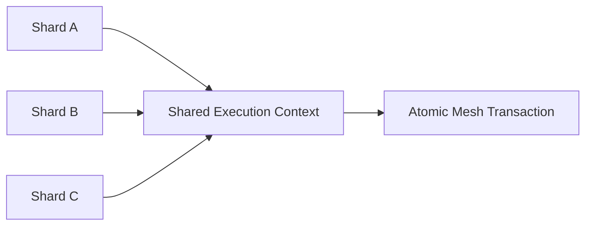

---

#### 2.7 → Shared Execution Requires EIP-7702

ERC-4337 provides account abstraction but currently processes only a single sender per UserOperation.

GhostShard requires multiple shard authorizations within a single execution context.

EIP-7702 provides this capability natively through authorization lists.

This enables true multi-shard atomic execution.

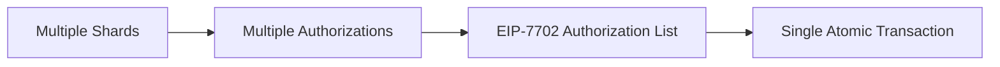

---

#### 2.9 → EIP-7702 Requires Gas Sponsorship

Shards contain assets but hold no ETH.

Without sponsorship, they cannot pay transaction fees.

The protocol therefore requires a mechanism that allows execution without pre-funding shards.

Paymasters solve this problem.

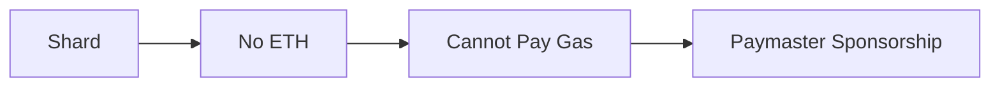

---

#### 2.10 → Gas Sponsorship Requires Relayers

Someone must broadcast the sponsored transaction.

The relayer performs this role.

Its authority is intentionally narrow.

The relayer can:

* Broadcast
* Refuse to broadcast

The relayer cannot:

* Modify transactions
* Forge transactions
* Steal assets

The result is minimal trust.

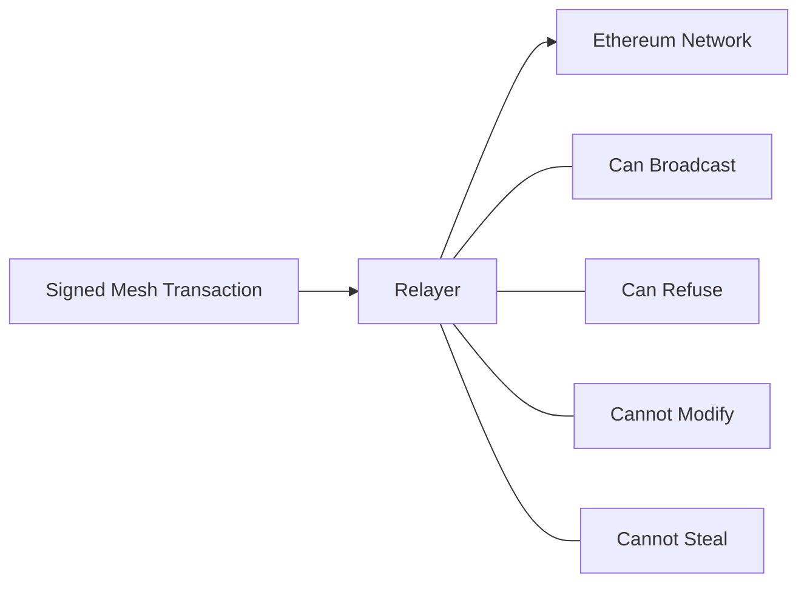

---

### Parallel Architectural Branches

Not every component emerged from the primary chain.

Several subsystems arise independently from separate design goals.

These branches complement the architecture rather than extend the causal spine.

---

### Compliance Branch

Driven by:

> Privacy without sacrificing auditability.

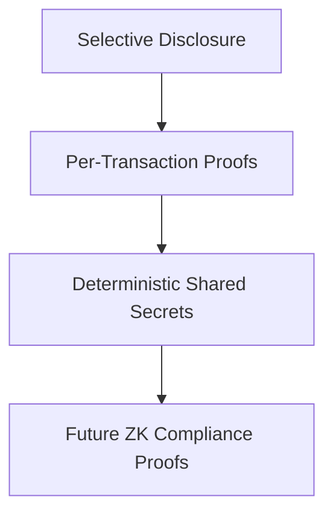

This branch allows institutions to reveal specific transactions without exposing complete wallet histories.

---

### Privacy Hardening Branch

Driven by:

> Maximum practical privacy.

#### Metadata Privacy

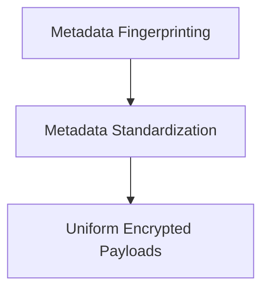

#### Dust Protection

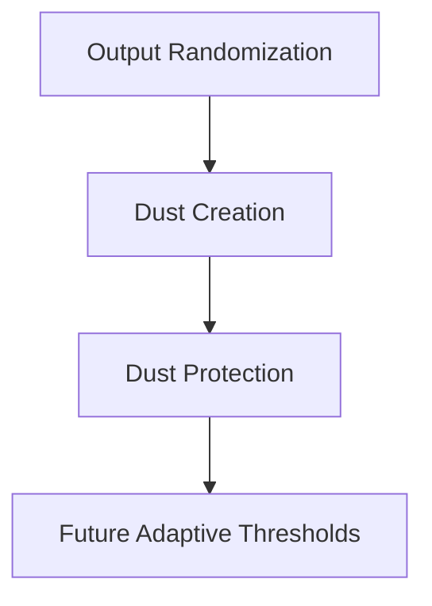

These decisions do not create privacy.

They preserve privacy by removing secondary information leaks.

---

### Asset Coverage Branch

Driven by:

> Privacy should apply to all ownership types.

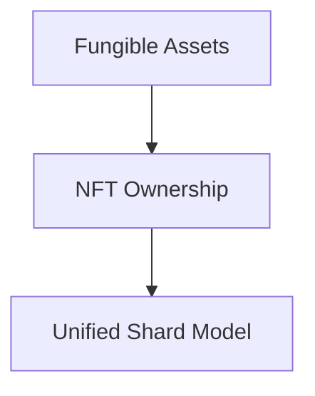

Rather than building separate privacy infrastructure for NFTs, GhostShard extends the same ownership model to all asset classes.

---

### Architectural Convergence

All branches ultimately converge into GhostShard.

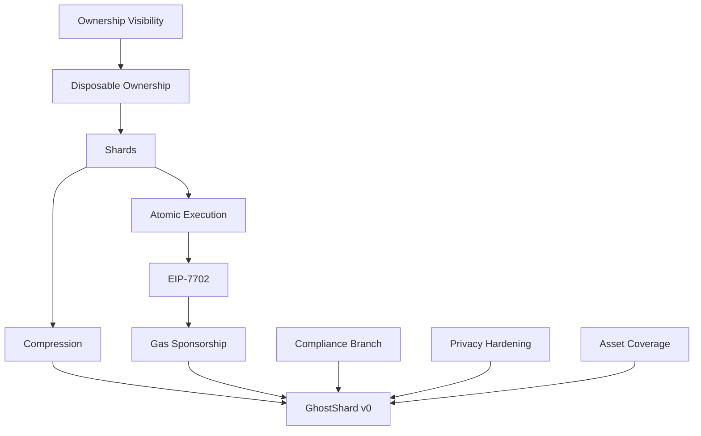

---

### What This Reveals

The most important observation is that GhostShard is not a collection of unrelated features.

Compression exists because shards fragment.

Atomic execution exists because compression alone is insufficient.

EIP-7702 exists because atomic multi-shard execution requires shared execution.

Relayers exist because sponsored execution requires transaction propagation.

Each decision is a response to a constraint introduced by the previous decision.

The architecture therefore resembles a dependency graph rather than a feature list.

The primary causal chain forms the protocol's structural backbone.

The compliance, privacy-hardening, and asset-coverage branches extend that backbone toward practical deployment.

Together they form GhostShard v0.

The next chapters distills these architectural decisions into the core design principles that govern the protocol.
