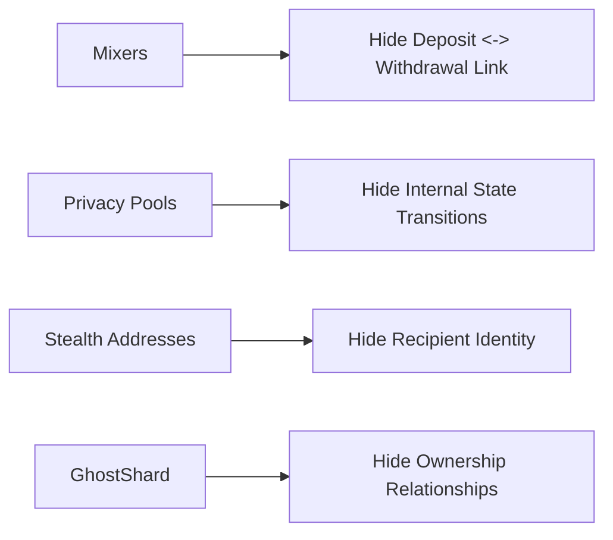

# 3. Comparison with Existing Privacy Systems

GhostShard does not attempt to solve privacy through the same mechanism as existing Ethereum privacy systems.

Most EVM privacy systems focus on obscuring relationships between transactions.

GhostShard instead focuses on obscuring relationships between ownership units.

This distinction influences every aspect of the architecture.

Mixers achieve privacy through pooled deposits and withdrawals.

Privacy pools achieve privacy through shielded balances and zero-knowledge proofs.

Stealth address systems achieve privacy through recipient unlinkability.

GhostShard combines stealth-address recipient privacy with disposable ownership, atomic mesh transactions, EIP-7702 execution, and sponsored transaction propagation.

The result is a privacy model centered on ownership ambiguity rather than transaction concealment.

---

## 3.1 Privacy Models

The major privacy approaches on Ethereum can be viewed as addressing different layers of the ownership lifecycle.

Each approach improves privacy, but they do so at different layers of the system.

---

## 3.2 System Comparison

| Property                              | Tornado Cash       | Railgun / Privacy Pools | ERC-5564 Stealth Addresses | GhostShard v0        |
| ------------------------------------- | ------------------ | ----------------------- | -------------------------- | -------------------- |
| Recipient Privacy                     | Yes                | Yes                     | Yes                        | Yes                  |
| Sender Privacy                        | No                 | Partial                 | No                         | Yes                  |
| Ownership Privacy                     | Partial            | Partial                 | Recipient Only             | Yes                  |
| Privacy by Default                    | No                 | No                      | Partial                    | Yes                  |
| Privacy Requires User Action          | Deposit Into Mixer | Shield Assets           | Use Stealth Address        | No                   |
| Exit Back To Public State Required    | Yes                | Often                   | N/A                        | No                   |
| Withdrawal Delay / Waiting Strategy   | Common             | Common                  | None                       | None                 |
| Self-Custody                          | Yes                | Yes                     | Yes                        | Yes                  |
| Native NFT Support                    | No                 | Limited                 | Yes                        | Yes                  |
| Wrapping Required                     | Yes                | Often                   | No                         | No                   |
| Gas Sponsorship                       | No                 | No                      | No                         | Yes                  |
| Selective Disclosure                  | Limited            | Partial                 | Not Defined                | Yes                  |
| Compliance-Friendly Auditing          | Limited            | Partial                 | Limited                    | Yes                  |
| Shared Capital Pool                   | Yes                | Yes                     | No                         | No                   |
| Honeypot Concentration Risk           | High               | Medium                  | None                       | None                 |
| Composable With Existing EVM Assets   | Limited            | Limited                 | High                       | High                 |
| Composable With Existing Wallet Model | Low                | Medium                  | High                       | High                 |
| User Experience (UX)                  | Low                | Medium                  | Medium                     | High                 |
| Developer Experience (DevX)           | Low                | Low                     | Medium                     | High                 |
| Trusted Setup                         | Required           | Required                | No                         | No                   |
| ZK Proof Generation                   | Required           | Required                | No                         | No                   |
| Protocol Fee                          | No                 | Often                   | No                         | No                   |
| Primary Privacy Mechanism             | Pool Mixing        | Shielded Notes          | Stealth Addresses          | Disposable Ownership |

---

## 3.3 Privacy as an Action vs Privacy as a State

A useful distinction between existing privacy systems and GhostShard is whether privacy is something users must actively enter.

### Mixers

Privacy is an action.

Users begin in a public ownership state.

To obtain privacy they must:

1. Deposit into a mixer.
2. Wait.
3. Withdraw to a fresh address.

Privacy exists only within the mixer workflow.

### Privacy Pools

Privacy is also an action.

Users must deliberately shield assets before obtaining privacy benefits.

Assets move from a public state into a private state and often back into a public state again.

Privacy therefore depends on entering and remaining inside the privacy system.

### ERC-5564 Stealth Addresses

Recipient privacy is automatic.

However ownership management remains external to the protocol.

Users must still manage gas funding, spending, consolidation, and ownership utilization.

Privacy applies primarily to receipt rather than the complete ownership lifecycle.

### GhostShard

Privacy is the default ownership state.

Assets are received, stored, transferred, and retired through disposable ownership units.

Users do not move assets into a dedicated privacy environment.

Ownership itself is private by construction.

---

## 3.4 Recipient Privacy

Recipient privacy concerns whether observers can determine who ultimately receives an asset.

### Mixers

Mixers achieve recipient privacy through pooled anonymity.

Users deposit assets into a common pool and later withdraw using a zero-knowledge proof.

Observers cannot directly determine which deposit corresponds to which withdrawal.

Privacy depends on the size and activity of the pool.

### Privacy Pools

Privacy pools achieve recipient privacy through shielded notes and commitment trees.

Transfers occur within a private state transition system.

Observers cannot determine which participant owns which note.

Privacy depends on the active note set within the pool.

### ERC-5564 Stealth Addresses

Stealth address systems derive a unique one-time address for every transfer.

Only the intended recipient can identify and spend from the resulting address.

No pool is required.

### GhostShard

GhostShard inherits recipient privacy from ERC-5564.

Every output shard is represented by a newly derived stealth address.

Only the intended recipient can discover ownership of the resulting shard.

Recipient privacy therefore derives from cryptographic unlinkability rather than pooled anonymity.

---

## 3.5 Sender Privacy

Sender privacy concerns whether observers can determine who initiated a transfer.

### Mixers

Deposits originate directly from a user's EOA.

The sender remains publicly visible even if the subsequent withdrawal is unlinkable.

### Privacy Pools

Shielding and unshielding operations originate from visible EOAs.

The sender's interaction with the privacy system remains observable.

### ERC-5564 Stealth Addresses

The sender directly funds the stealth address.

The recipient is hidden, but the sender remains visible.

### GhostShard

GhostShard separates ownership from transaction propagation.

Users authorize execution off-chain.

A relayer broadcasts the final transaction.

The user's EOA never appears as the transaction origin of a mesh transaction.

Sender privacy is therefore preserved alongside recipient privacy.

---

## 3.6 Ownership Privacy

Recipient privacy and sender privacy do not necessarily imply ownership privacy.

Observers may still reconstruct ownership relationships through balance accumulation, address reuse, and transaction history.

### Mixers

Mixers obscure deposit-withdrawal relationships.

Ownership remains visible before entering and after exiting the pool.

### Privacy Pools

Privacy pools conceal ownership within the shielded state.

Ownership becomes visible again whenever assets enter or leave the pool.

### ERC-5564 Stealth Addresses

Stealth addresses hide recipient identity.

However the standard does not define ownership lifecycle management.

Ownership relationships may reappear during spending, consolidation, or gas funding.

### GhostShard

GhostShard treats ownership as disposable.

Assets are held inside temporary ownership units called shards.

Shards receive assets, participate in a mesh transaction, and are permanently retired.

Because ownership units do not persist indefinitely, ownership history does not accumulate around a long-lived address.

Privacy is therefore applied at the ownership layer rather than solely at the transaction layer.

---

## 3.7 Capital Concentration and Honeypot Risk

Privacy systems differ significantly in where assets reside.

### Mixers

Assets are concentrated inside a common pool contract.

As adoption grows, the value stored within the pool increases.

This creates a highly visible target for exploits, surveillance, and regulatory scrutiny.

### Privacy Pools

Privacy pools similarly aggregate assets within a shared shielded state.

Ownership is hidden, but capital remains concentrated inside a common system.

### ERC-5564 Stealth Addresses

No pooling exists.

Assets remain distributed across independent stealth addresses.

### GhostShard

GhostShard never pools user funds.

Assets remain distributed across independent shards controlled by individual users.

There is no shared liquidity pool, shielded vault, or protocol treasury whose balance grows with adoption.

Privacy scales without concentrating capital.

---

## 3.8 Compliance and Selective Disclosure

Privacy and auditability are often treated as competing objectives.

Different systems make different trade-offs.

### Mixers

Withdrawals are intentionally unlinkable from deposits.

Demonstrating a specific payment relationship typically requires revealing additional information outside the protocol.

### Privacy Pools

Privacy pools may support selective proofs, but auditing often requires specialized proof systems or disclosure of note history.

### ERC-5564 Stealth Addresses

The standard focuses on recipient privacy and discovery.

It does not define a disclosure framework.

### GhostShard

GhostShard incorporates selective disclosure directly into the ownership model.

Users may disclose:

* Individual transfers
* Specific counterparties
* Transaction metadata
* Complete viewing histories

Disclosure remains granular and user-controlled.

Privacy and auditing can therefore coexist within the same architecture.

---

## 3.9 Composability

Privacy systems differ in how naturally they integrate with existing EVM infrastructure.

### Mixers

Assets must enter and exit a specialized pool.

Integration is limited to supported assets and workflows.

### Privacy Pools

Assets interact through a shielded execution environment.

Many integrations require protocol-specific support.

### ERC-5564 Stealth Addresses

Stealth addresses preserve the standard EOA ownership model.

Assets remain compatible with existing infrastructure.

### GhostShard

GhostShard preserves direct ownership of native assets, ERC-20 tokens, and ERC-721 tokens.

Assets are not wrapped, pooled, or moved into a separate privacy state.

Privacy is integrated into ownership itself rather than added through a separate execution environment.

---

## 3.10 User Experience and Developer Experience

Cryptographic privacy alone does not guarantee adoption.

Practical systems must also be usable by end users and integrators.

### Mixers

Users must understand deposit workflows, withdrawal workflows, anonymity considerations, and timing strategies.

Developers integrate against specialized pool contracts.

### Privacy Pools

Users must manage shielding, unshielding, notes, and proof generation.

Developers often require protocol-specific integrations and privacy-aware application logic.

### ERC-5564 Stealth Addresses

Recipient privacy is straightforward.

However discovery, gas funding, spending, consolidation, and ownership management remain implementation responsibilities.

### GhostShard

GhostShard attempts to make privacy infrastructure largely invisible.

Users interact with assets through familiar ownership workflows while the SDK manages discovery, shard management, coin selection, announcements, and execution orchestration.

Developers integrate through standard asset interfaces and SDK abstractions rather than pool-specific execution environments.

The objective is not merely stronger privacy, but privacy that can be adopted without fundamentally changing how users and applications interact with the EVM.

---

## 3.11 Summary

Tornado Cash, privacy pools, and stealth address systems each address important aspects of EVM privacy.

Mixers obscure deposit-withdrawal relationships.

Privacy pools obscure internal state transitions.

Stealth addresses obscure recipient identity.

GhostShard approaches the problem from a different direction.

Rather than attempting to hide relationships between persistent owners, GhostShard makes ownership itself temporary.

The protocol combines stealth-address recipient privacy, disposable ownership, atomic mesh execution, EIP-7702 delegation, sponsored transaction propagation, selective disclosure, and self-custodial asset management into a single ownership model.

The remainder of this paper describes the cryptographic, architectural, economic, and security mechanisms that make this model possible.
