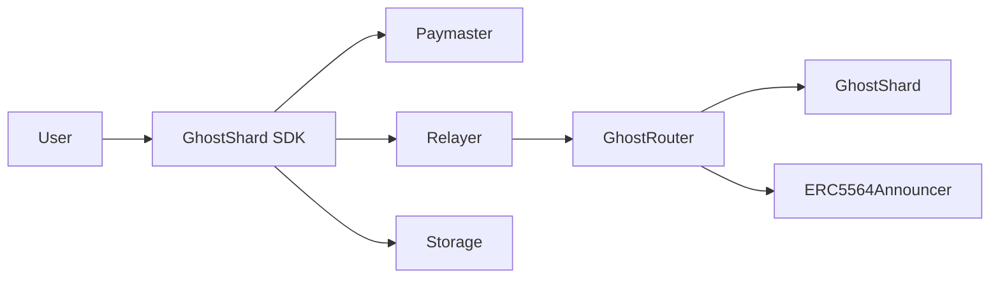
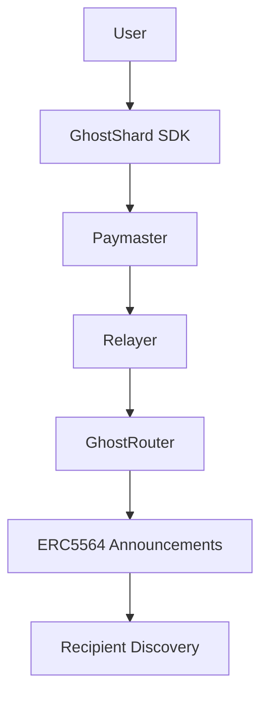
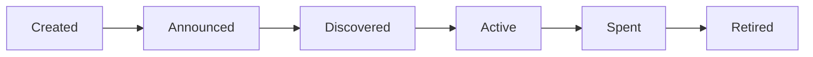
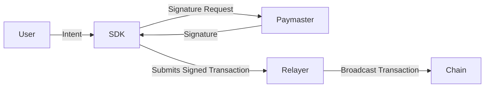
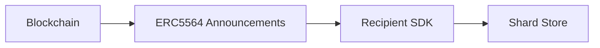
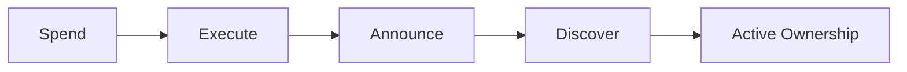

# 4. System Overview

This chapter introduces the major components of the GhostShard system and describes how they interact to provide private, permissionless asset transfers.

At a high level, GhostShard combines:

* Disposable ownership units (shards)
* ERC-5564 announcement-based discovery
* EIP-7702 delegated execution
* Sponsored transaction execution
* Off-chain coordination services

Together these components allow users to receive, discover, manage, and transfer assets without exposing persistent ownership relationships on-chain.

---

## 4.1 System Components

GhostShard consists of a small set of on-chain contracts and off-chain services.

| Component         | Type                         | Responsibility                                                                                  |
| ----------------- | ---------------------------- | ----------------------------------------------------------------------------------------------- |
| GhostRouter       | On-chain Contract            | Entry point for mesh transaction execution, validation, and gas reconciliation.                 |
| GhostShard        | On-chain Contract            | EIP-7702 delegation target that performs asset transfers on behalf of shards.                   |
| ERC5564Announcer  | On-chain Contract            | Publishes ERC-5564 announcements for recipient discovery.                                       |
| ERC6538 Registry  | On-chain Contract (Optional) | Stores recipient meta-addresses for public discovery.                                           |
| GhostShard SDK    | Off-chain Client             | Key management, shard discovery, coin selection, transaction construction, and synchronization. |
| Paymaster Service | Off-chain Service            | Sponsors transaction execution and authorizes gas expenditure.                                  |
| Relayer Service   | Off-chain Service            | Broadcasts sponsored mesh transactions to the network.                                          |
| Storage    | Off-chain Storage            | Persists discovered shard information and local wallet state.                                   |

The architecture intentionally separates ownership, execution, sponsorship, and discovery into independent components.

---

## 4.2 End-to-End Transaction Flow

A mesh transaction follows four stages:

1. Transaction construction
2. Sponsorship approval
3. Network execution
4. Recipient discovery

The user constructs a transaction locally using the SDK.

The SDK selects shards, creates recipient outputs, prepares announcements, and gathers the authorizations required for execution.

The transaction is then submitted to a paymaster for sponsorship approval.

Once approved, the bundle is forwarded to a relayer for network submission.

The relayer broadcasts a Type-4 transaction containing the required EIP-7702 authorizations.

GhostRouter validates the transaction, executes all transfers atomically, publishes recipient announcements, and reconciles gas costs.

Recipients later discover newly created shards through ERC-5564 announcement scanning.

---

## 4.3 Ownership Lifecycle

Every ownership unit in GhostShard follows the same lifecycle.

A shard is created, discovered, spent, and permanently retired.

The lifecycle is intentionally one-directional.

Once a shard is consumed, it can never become active again.

This prevents ownership accumulation and preserves the disposable ownership model.

The sender's shards transition from active to spent.

Simultaneously, newly created recipient shards transition from undiscovered to active.

This process transfers ownership without revealing a persistent relationship between participants.

---

## 4.4 Data Flow

GhostShard combines two complementary data flows.

### Spend Flow

The spend flow is user initiated.

A user constructs a transaction, obtains sponsorship approval, and submits the transaction through a relayer.

### Discovery Flow

The discovery flow is recipient initiated.

Recipients scan ERC-5564 announcements, identify ownership units intended for them, and update their local shard store.

Together these flows form a complete ownership cycle.

The spend flow creates new ownership units.

The discovery flow makes those ownership units usable by their recipients.

This separation between transaction execution and ownership discovery is a core architectural property of GhostShard and enables permissionless ownership transfer without exposing recipient identities.
