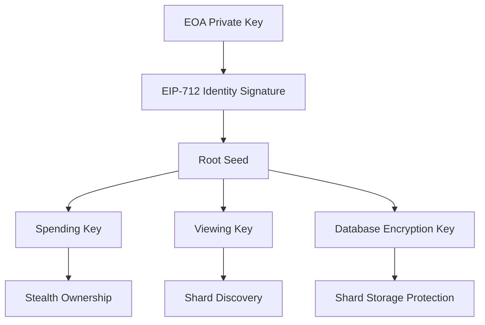

## 5.2 Identity and Key Hierarchy

The GhostShard cryptographic architecture begins from a single root identity and deterministically derives all protocol keys required for ownership, discovery, viewing, and local data protection.

This design provides three primary properties:

* **Recoverability** — a single wallet backup is sufficient to recover the entire GhostShard identity.
* **Key Separation** — spending, viewing, and encryption capabilities remain cryptographically independent.
* **Stateless Deployment** — no protocol-specific secrets must be stored on-chain or registered with a trusted service.

Every GhostShard user begins with a standard EVM Externally Owned Account (EOA). Through a deterministic derivation process, this EOA becomes the root of the entire GhostShard key hierarchy.

---

### 5.2.1 Key Hierarchy Overview

The derivation process can be viewed as a cryptographic tree.

A single identity signature produces a root seed.

The root seed is expanded into multiple protocol keys through domain-separated key derivation.

Compromise of one derived key does not reveal any other derived key.

---

### 5.2.2 Root Identity

GhostShard does not introduce a separate wallet system.

Instead, the user's existing EOA acts as the root cryptographic identity.

To initialize the protocol, the EOA signs a structured EIP-712 message containing its account address and protocol domain parameters.

The resulting signature serves as a deterministic identity proof from which all protocol keys are derived.

Because the signature originates from the user's existing wallet, no additional seed phrase or protocol-specific backup mechanism is required.

---

### 5.2.3 Root Seed Derivation

Let

$$
\sigma
$$

denote the EIP-712 identity signature produced by the user's EOA.

The protocol derives a root seed

$$
R
$$

by computing

$$
R = \operatorname{Keccak256}(\sigma)
$$

where

$$
R \in {0,1}^{256}
$$

is a uniformly distributed 256-bit value.

The signature itself consists of the standard ECDSA tuple

$$
(r,s,v)
$$

but only the final signature encoding is used as input to the hash function.

The root seed never leaves the client device and is never transmitted or stored on-chain.

---

### 5.2.4 Deterministic Key Derivation

GhostShard derives protocol keys from the root seed using HKDF-SHA256.

Let

$$
\operatorname{HKDF}(R,\texttt{info})
$$

represent a domain-separated HKDF invocation.

The protocol derives:

### Spending Key Material

$$
K_{\text{spend}}=\operatorname{HKDF}
\left(
R,
\texttt{"ghost-shard-spending-key"}
\right)
$$

### Viewing Key Material

$$
K_{\text{view}}=\operatorname{HKDF}
\left(
R,
\texttt{"ghost-shard-viewing-key"}
\right)
$$

### Database Encryption Key

$$
K_{\text{db}}=\operatorname{HKDF}
\left(
R,
\texttt{"ghost-shard-db-encryption-key"}
\right)
$$

Distinct context labels provide domain separation between outputs.

Consequently,

$$
K_{\text{spend}},
\quad
K_{\text{view}},
\quad
K_{\text{db}}
$$

are computationally independent despite sharing the same root seed.

---

### 5.2.5 Spending Keys

The spending key controls ownership and authorization of GhostShard assets.

The derived key material must be converted into a valid secp256k1 private scalar.

Let

$$
n
$$

denote the order of the secp256k1 elliptic curve.

The normalized spending key

$$
sk_{\text{spend}}
$$

must satisfy

$$
1 \leq sk_{\text{spend}} < n
$$

Invalid outputs are repeatedly hashed until a valid scalar is obtained.

The corresponding public key is

$$
pk_{\text{spend}}=sk_{\text{spend}} G
$$

where

$$
G
$$

is the secp256k1 generator point.

The spending key ultimately controls stealth ownership and authorizes shard spending.

---

### 5.2.6 Viewing Keys

The viewing key enables ownership discovery without granting spending authority.

The derived viewing scalar

$$
sk_{\text{view}}
$$

is normalized in the same manner:

$$
1 \leq sk_{\text{view}} < n
$$

Its public key is

$$
pk_{\text{view}}=sk_{\text{view}} G
$$

The viewing key is used during ERC-5564 announcement scanning and ownership detection.

Possession of

$$
sk_{\text{view}}
$$

allows a user to discover assets but does not permit asset movement.

This separation forms the foundation for selective disclosure and auditing workflows.

---

### 5.2.7 Database Encryption Keys

GhostShard maintains local metadata describing:

* Discovered shards
* Transaction history
* User labels
* Cached protocol state

This information may contain privacy-sensitive information despite never appearing on-chain.

The database encryption key is derived as

$$
K_{\text{db}}=\operatorname{HKDF}
\left(
R,
\texttt{"ghost-shard-db-encryption-key"}
\right)
$$

Unlike spending and viewing keys, no elliptic-curve normalization is required.

The key is used directly as symmetric encryption material for storage protection.

---

### 5.2.8 Security Properties

### Deterministic Recovery

The same identity signature always produces the same root seed:

$$
\sigma
\rightarrow
R
\rightarrow
{
K_{\text{spend}},
K_{\text{view}},
K_{\text{db}}
}
$$

Recovery therefore requires only access to the original wallet.

No protocol-specific backup procedure is necessary.

### Key Separation

Domain-separated HKDF invocations ensure that:

$$
K_{\text{spend}}
\not\Rightarrow
K_{\text{view}}
$$

$$
K_{\text{view}}
\not\Rightarrow
K_{\text{db}}
$$

$$
K_{\text{db}}
\not\Rightarrow
K_{\text{spend}}
$$

Compromise of one key does not reveal any other derived key.

### Minimal Trust Surface

No derived key material is transmitted over the network.

No protocol-specific secrets are stored on-chain.

All derivation occurs locally within the GhostShard SDK.

### Wallet Compatibility

Because the root identity originates from a standard EOA signature, GhostShard remains compatible with existing wallets and account-management infrastructure.

---

### 5.2.9 Future Extensions

The current implementation derives protocol keys from ECDSA-based identities and secp256k1 cryptography.

Future versions may support:

* Hardware Security Modules (HSMs)
* Trusted Execution Environments (TEEs)
* Multi-signature identity roots
* Post-quantum signature schemes

Because the architecture is built around deterministic key expansion rather than a specific signature algorithm, future identity systems can be introduced without redesigning the remainder of the protocol.

The hierarchy therefore provides a migration path for future cryptographic upgrades while preserving compatibility with existing GhostShard ownership structures.
