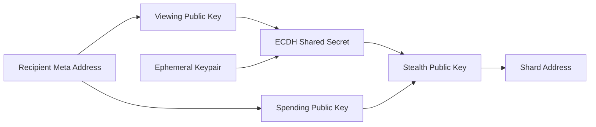

## 5.4 Stealth Address Generation

Stealth address generation is the process by which a sender creates a one-time ownership unit for a recipient using the recipient's meta-address.

The sender derives a fresh shard address that only the intended recipient can discover and control.

No interaction with the recipient is required, and no ownership information is revealed on-chain beyond the resulting shard address and announcement metadata.

GhostShard adopts the stealth address construction defined by ERC-5564 Scheme 1 and extends it as the foundation of the disposable ownership model.

---

### 5.4.1 Overview

The stealth address generation process can be summarized as:

The sender combines:

* The recipient's public keys
* A newly generated ephemeral keypair

to derive a unique shard address.

The recipient later performs the same computation and independently discovers ownership.

---

### 5.4.2 Ephemeral Key Generation

For every transfer, the sender generates a fresh ephemeral private key

$$
e \in [1,n-1]
$$

where

$$
n
$$

is the order of the secp256k1 curve.

The corresponding ephemeral public key is

$$
E = eG
$$

where

$$
G
$$

is the secp256k1 generator point.

The ephemeral keypair is used exactly once.

After announcement publication, the ephemeral private key is discarded.

The ephemeral public key

$$
E
$$

is included in the ERC-5564 announcement so that the recipient can later reconstruct the same shared secret.

---

### 5.4.3 Shared Secret Construction

Let

$$
pk_{\text{view}}
$$

denote the recipient's viewing public key.

The sender computes an Elliptic Curve Diffie–Hellman (ECDH) shared point

$$
S=e \cdot pk_{\text{view}}
$$

The x-coordinate of the resulting point is extracted and hashed:

$$
s=\operatorname{Keccak256}
\left(
x(S)
\right)
$$

where

$$
s
$$

is the shared secret scalar used throughout the remainder of the derivation process.

Only the sender and recipient can compute

$$
s
$$

because both parties possess one side of the ECDH exchange.

---

### 5.4.4 Stealth Public Key Derivation

Let

$$
pk_{\text{spend}}
$$

denote the recipient's spending public key.

The shard public key is computed as

$$
pk_{\text{shard}}=pk_{\text{spend}}
+
sG
$$

This operation produces a valid secp256k1 public key corresponding to a unique ownership unit.

The resulting key is mathematically independent from every previously generated shard.

Each transfer therefore produces a distinct ownership address even when the same recipient receives multiple assets.

---

### 5.4.5 Shard Address Creation

The shard public key is converted into a standard Ethereum address using the normal EVM address derivation procedure.

Let

$$
pk_{\text{shard}}^{u}
$$

denote the uncompressed shard public key.

The shard address is

$$
A_{\text{shard}}=\operatorname{last}*{20}
\left(
\operatorname{Keccak256}
\left(
pk*{\text{shard}}^{u}
\right)
\right)
$$

where

$$
\operatorname{last}_{20}
$$

returns the final twenty bytes of the hash output.

The resulting address is indistinguishable from any ordinary EVM externally owned account.

No protocol-specific address format is required.

---

### 5.4.6 Recipient Reconstruction

When scanning announcements, the recipient extracts the ephemeral public key

$$
E
$$

and computes

$$
S'=sk_{\text{view}}
\cdot E
$$

Substituting

$$
E=eG
$$

gives

$$
S'=sk_{\text{view}}
\cdot
(eG)=e
\cdot
(sk_{\text{view}}G)=e
\cdot
pk_{\text{view}}=S
$$

The sender and recipient therefore derive the same shared point.

The recipient computes the same shared secret

$$
s
$$

and reconstructs the identical shard public key

$$
pk_{\text{shard}}
$$

and shard address

$$
A_{\text{shard}}
$$

without any communication with the sender.

---

### 5.4.7 Shard Private Key Recovery

Because

$$
pk_{\text{shard}}=pk_{\text{spend}}
+
sG
$$

the corresponding private key is

$$
sk_{\text{shard}}=(sk_{\text{spend}} + s)\bmod n
$$

Only the recipient can compute this value because only the recipient possesses

$$
sk_{\text{spend}}
$$

The shard private key grants complete control over the ownership unit and is subsequently used for transaction authorization within the GhostShard execution model.

---

### 5.4.8 Relationship to Disposable Ownership

Every stealth address generation event produces a new shard.

No shard address is reused.

Repeated transfers to the same recipient therefore create independent ownership units:

$$
A_1,;A_2,;A_3,;\ldots
$$

rather than accumulating activity around a persistent address.

This property forms the cryptographic foundation of GhostShard's disposable ownership model.

Ownership becomes fragmented across ephemeral shards rather than concentrated around long-lived accounts.

---

### 5.4.9 Future Extensions

The current construction relies on secp256k1 and ECDH as defined by ERC-5564 Scheme 1.

Future versions may introduce alternate stealth-address schemes through the ERC-5564 scheme identifier mechanism.

Potential upgrades include:

* Alternative elliptic curves
* Threshold stealth ownership
* Hardware-backed key derivation
* Post-quantum key exchange systems

Regardless of the underlying cryptographic primitive, the high-level structure remains unchanged:

$$
\text{Meta Address}
\rightarrow
\text{Shared Secret}
\rightarrow
\text{Stealth Ownership Unit}
$$

The disposable ownership model therefore remains compatible with future cryptographic migrations.
