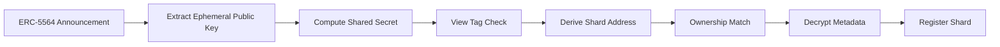

## 5.5 Announcement Discovery

Stealth address generation creates a shard, but creation alone is insufficient.

The recipient must also discover that the shard exists, determine that it belongs to them, and recover the information necessary to manage it.

GhostShard adopts the ERC-5564 announcement mechanism as its discovery layer.

Each newly created shard is accompanied by an on-chain announcement containing the information required for recipient discovery and metadata recovery.

The announcement reveals the existence of a shard while preserving recipient privacy.

Only the intended recipient can determine ownership of the announced shard.

---

### 5.5.1 Overview

The announcement discovery process can be viewed as a recipient-side filtering and reconstruction procedure.

Every recipient independently performs this process.

No trusted indexer, coordinator, or registry is required for ownership discovery.

---

### 5.5.2 Announcement Structure

GhostShard publishes one ERC-5564 announcement for every newly created shard.

Conceptually, an announcement contains four fields:

$$
\text{Announcement}=(
\text{schemeId},
A_{\text{shard}},
E,
M
)
$$

where:

* $\text{schemeId}$ identifies the stealth-address scheme.
* $A_{\text{shard}}$ is the resulting shard address.
* $E$ is the ephemeral public key.
* $M$ is the encrypted metadata payload.

The announcement is emitted atomically alongside shard creation.

If shard creation fails, the announcement is reverted as part of the same transaction.

This guarantees consistency between ownership creation and ownership discovery.

---

### 5.5.3 Recipient Scanning

Recipients continuously scan the ERC-5564 announcement stream.

For each announcement, the recipient extracts the ephemeral public key

$$
E
$$

and computes the shared point

S’=sk

Using the procedure defined in Section 5.4, the recipient derives

$$
s=\operatorname{Keccak256}(x(S))
$$

where

$$
s
$$

is the shared secret scalar.

Only recipients possessing the correct viewing key can derive the correct shared secret.

All other observers obtain meaningless results.

---

### 5.5.4 View Tag Filtering

Performing a complete stealth-address reconstruction for every announcement would be computationally expensive.

To reduce scanning cost, GhostShard uses the ERC-5564 view tag mechanism.

The view tag is defined as:

$$
v=\operatorname{firstByte}(s)
$$

where

$$
s
$$

is the shared secret.

The view tag is stored in plaintext within the announcement metadata.

Upon receiving an announcement, the recipient computes

$$
v'=\operatorname{firstByte}(s')
$$

and compares it against the published value.

If

$$
v' \neq v
$$

the announcement is immediately discarded.

Because the view tag contains eight bits, a random announcement passes the filter with probability

$$
\frac{1}{256}
$$

Consequently, approximately

$$
99.6%
$$

of unrelated announcements are rejected before any further processing is required.

The view tag improves discovery efficiency while revealing only a negligible fraction of the shared secret.

---

### 5.5.5 Ownership Verification

Announcements that pass the view tag filter undergo ownership verification.

Using the shared secret

$$
s
$$

the recipient reconstructs the shard public key

$$
pk_{\text{shard}}=pk_{\text{spend}}
+
sG
$$

and derives the corresponding address

$$
A'_{\text{shard}}
$$

If

$$
A'_{\text{shard}}=A_{\text{shard}}
$$

the announcement is confirmed as belonging to the recipient.

Otherwise the announcement is discarded.

Ownership detection therefore requires no interaction with the sender and no disclosure of recipient identity.

---

### 5.5.6 Metadata Recovery

After ownership has been confirmed, the recipient decrypts the announcement payload.

The metadata contains information describing the newly created shard, including:

* Asset type
* Token contract
* Token amount
* NFT identifier
* Optional encrypted sender metadata

The decryption process is described in Section 5.6.

Successful decryption completes the discovery process and transforms an anonymous on-chain address into a usable ownership object within the recipient's wallet.

---

### 5.5.7 Discovery Complexity

The discovery algorithm scales linearly with the number of announcements.

Let

$$
N
$$

represent the total number of announcements observed by a recipient.

The discovery cost is

$$
O(N)
$$

with view-tag filtering reducing the number of expensive ownership reconstruction operations to approximately

$$
\frac{N}{256}
$$

under normal conditions.

As network activity grows, recipients therefore process only a small fraction of announcements beyond the initial filtering stage.

This property enables practical large-scale stealth-address discovery without requiring specialized infrastructure.

---

### 5.5.8 Relationship to Ownership Privacy

Announcement discovery reveals that a stealth transfer occurred.

It does not reveal the recipient.

Observers can see:

* The announcement
* The shard address
* The ephemeral public key

Observers cannot determine:

* Which recipient owns the shard
* Which meta-address was used
* Whether two shards belong to the same recipient
* Whether a shard is a payment or change output

Ownership discovery therefore remains private even though announcements themselves are publicly visible.

---

### 5.5.9 Future Extensions

Future versions of GhostShard may introduce additional discovery optimizations, including:

* Larger view tags
* Indexed discovery services
* Chain-specific announcement aggregators
* Zero-knowledge ownership discovery schemes

These improvements affect discovery efficiency but do not alter the fundamental ownership model.

Regardless of the discovery mechanism used, ownership remains recoverable only by entities possessing the appropriate viewing key.
