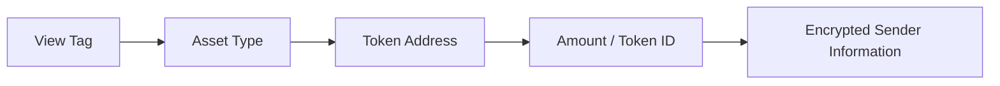

## 5.6 Metadata Confidentiality

Stealth address discovery identifies ownership, but ownership discovery alone is insufficient for practical asset management. Recipients must also learn what assets a shard contains and, in some cases, who created the shard.

GhostShard therefore associates each shard announcement with metadata describing the shard's contents. The protocol separates metadata into two categories:

* **Public asset metadata**, which describes the asset contained within the shard.
* **Private sender metadata**, which may contain sender identity information, payment references, invoice identifiers, or application-specific notes.

Public asset metadata remains unencrypted for efficient discovery and parsing, while private sender metadata is protected through authenticated encryption derived from the shard's ECDH shared secret.

---

### 5.6.1 Metadata Architecture

Each ERC-5564 announcement contains a metadata payload associated with a single shard.

The metadata structure is divided into a plaintext header and an optional encrypted section.



The plaintext header allows recipients to efficiently identify shard contents after discovery.

The encrypted section protects information that could reveal relationships between counterparties.

---

### 5.6.2 Shared Secret Derivation

Metadata encryption reuses the ECDH shared secret generated during stealth address creation.

Let

$$
S = e \cdot V
$$

where:

* $e$ is the sender's ephemeral private key.
* $V$ is the recipient's viewing public key.

The shared secret is derived as:

$$
sharedSecret = \text{Keccak256}(x(S))
$$

where $x(S)$ denotes the x-coordinate of the ECDH point.

A dedicated encryption key is then derived using HKDF-SHA256:

$$
K_{meta}=\operatorname{HKDF}_{SHA256}
(
sharedSecret,
\text{info}=\texttt{"ghost-shard-metadata"}
)
$$

The HKDF context string provides domain separation, ensuring that metadata encryption keys remain independent from any other keys derived from the same shared secret.

---

### 5.6.3 Metadata Layout

The metadata payload begins with a fixed-width plaintext header.

| Offset | Size     | Field              |
| ------ | -------- | ------------------ |
| 0      | 1 byte   | View Tag           |
| 1      | 1 byte   | Asset Type         |
| 2      | 20 bytes | Token Address      |
| 22     | 32 bytes | Amount or Token ID |

The total header size is:

$$
1 + 1 + 20 + 32 = 54\text{ bytes}
$$

Asset types are encoded as:

| Value | Asset        |
| ----- | ------------ |
| 0     | Native Asset |
| 1     | ERC-20       |
| 2     | ERC-721      |

For native assets, the token address field is set to the zero address.

When sender metadata is present, the encrypted section is appended after the header:

| Field              | Size     |
| ------------------ | -------- |
| IV                 | 12 bytes |
| Ciphertext         | Variable |
| Authentication Tag | 16 bytes |

The complete structure is therefore:

```text
+-----------------------------+
| Plaintext Header (54 bytes) |
+-----------------------------+
| AES-GCM IV (12 bytes)       |
+-----------------------------+
| Encrypted Sender Metadata   |
+-----------------------------+
| GCM Authentication Tag      |
+-----------------------------+
```

---

### 5.6.4 Authenticated Encryption

GhostShard v0 uses AES-256-GCM for sender metadata protection.

A random 96-bit initialization vector is generated for every encryption operation:

$$
IV \leftarrow {0,1}^{96}
$$

Sender metadata is encrypted as:

$$
(C,T)=AES\text{-}256\text{-}GCM
(
K_{meta},
IV,
senderInfo
)
$$

where:

* $C$ is the ciphertext.
* $T$ is the authentication tag.

Only recipients capable of deriving the correct shared secret can reconstruct $K_{meta}$ and decrypt the ciphertext.

---

### 5.6.5 Confidentiality and Integrity

The encrypted metadata provides both confidentiality and authenticity.

### Confidentiality

Only the intended recipient possesses the viewing key required to reconstruct the ECDH shared secret.

Consequently, only the intended recipient can derive $K_{meta}$ and recover the encrypted sender information.

Observers can view the ciphertext but cannot distinguish its contents from random data.

### Integrity

AES-GCM provides authenticated encryption.

Any modification of the ciphertext, initialization vector, or authentication tag causes decryption to fail.

Recipients can therefore detect tampering without requiring additional signatures or verification mechanisms.

---

### 5.6.6 Design Rationale

GhostShard intentionally leaves asset information unencrypted while protecting sender-specific information.

This design choice provides several advantages:

* Recipients can quickly understand shard contents after discovery.
* Wallet synchronization remains efficient.
* Asset balances can be indexed without decryption.
* Sender identity and payment references remain private.

The protocol therefore encrypts the information that reveals relationships between participants while leaving operational asset information directly accessible.

---

### 5.6.7 Summary

Metadata confidentiality extends stealth ownership by protecting information associated with a shard after discovery.

GhostShard derives a dedicated metadata encryption key from the stealth-address ECDH shared secret and uses AES-256-GCM to protect sender-specific information.

The resulting design preserves efficient asset discovery while ensuring that sensitive counterparty information remains visible only to the intended recipient.
