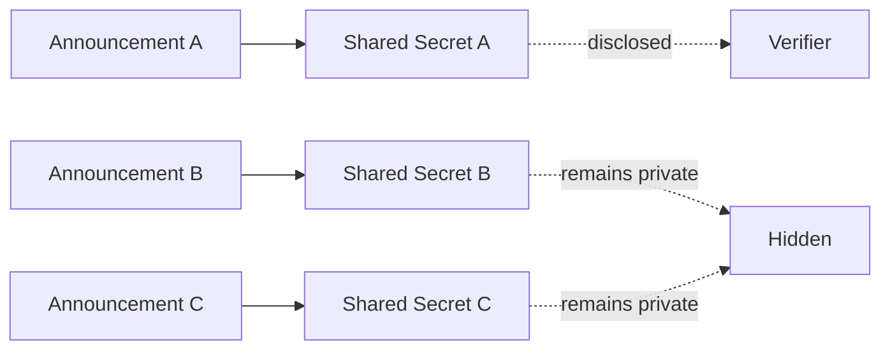

## 5.7 Selective Disclosure

GhostShard's announcement architecture naturally supports selective disclosure.

Because every shard announcement is derived from an independent ECDH exchange, disclosure can be scoped to individual announcements rather than entire ownership histories.

This property allows users to reveal information about specific transfers without exposing unrelated protocol activity.

---

### 5.7.1 Transaction-Scoped Shared Secrets

For each announcement, the sender generates a fresh ephemeral key pair:

$$
(e_i, E_i)
$$

and derives an ECDH shared secret with the recipient's viewing public key:

$$
SS_i = \operatorname{Keccak256}(x(e_i \cdot V))
$$

where:

* $e_i$ is the ephemeral private key.
* $V$ is the recipient's viewing public key.
* $x(\cdot)$ denotes the x-coordinate of the ECDH point.

Because a new ephemeral key is generated for every announcement,

$$
SS_i \neq SS_j
\quad\text{for}\quad i \neq j
$$

with overwhelming probability.

Each announcement therefore possesses an independent cryptographic disclosure boundary.

---

### 5.7.2 Metadata Confidentiality

The shared secret is used to derive the metadata encryption key through HKDF-SHA256:

$$
K_i =\operatorname{HKDF}
(
SS_i,
\texttt{"ghost-shard-metadata"}
)
$$

The resulting key encrypts announcement metadata using AES-256-GCM.

Only parties capable of reconstructing the corresponding shared secret can decrypt the protected metadata.

Consequently, metadata visibility is scoped to individual announcements rather than to an entire ownership identity.

---

### 5.7.3 Disclosure Isolation

A fundamental property of the design is disclosure isolation.

Knowledge of:

$$
SS_A
$$

provides no computational advantage in deriving:

$$
SS_B
$$

or

$$
SS_C
$$

because each secret originates from an independent ECDH exchange.

As a result, disclosure can remain bounded to individual announcements.

---

### 5.7.4 Deterministic Disclosure References

Section 5.8 introduces deterministic shared-key generation.

Instead of generating ephemeral keys randomly, an ephemeral key may be deterministically derived from an external reference such as:

* Invoice identifiers
* Payment references
* UUIDs
* Business records

For a disclosure reference $R$:

$$
e_R=\operatorname{Keccak256}(R)
$$

The corresponding ephemeral public key is:

$$
E_R = e_R G
$$

This allows announcements to be reconstructed from external records while preserving the same selective disclosure properties.

Deterministic references therefore provide a mechanism for reproducible transaction proofs without requiring persistent storage of ephemeral keys.

---

### 5.7.5 Security Properties

The selective disclosure mechanism provides the following properties:

### Bounded Disclosure

Disclosure of one announcement reveals no information about unrelated announcements.

### Independent Verification

Third parties can verify disclosed announcements without obtaining ownership-level visibility.

### Ownership Preservation

Selective disclosure reveals information about a specific transfer rather than a user's complete ownership graph.
