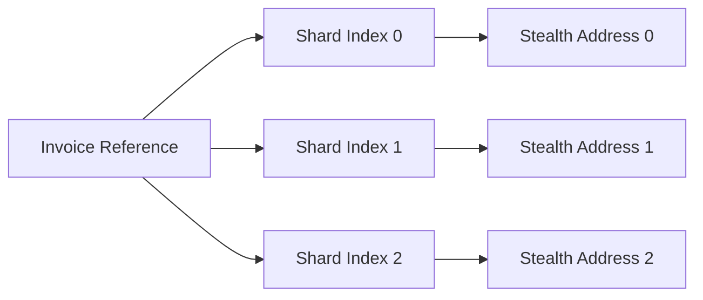

## 5.8 Deterministic Shared Key Generation

The selective disclosure model described in Section 5.7 assumes that each announcement is created using a randomly generated ephemeral key pair.

While this approach provides strong privacy properties, it introduces operational complexity for institutions processing large numbers of payments. In such environments, payment verification may require long-term retention of disclosure material associated with individual transactions.

Deterministic Shared Key Generation is a proposed extension that allows disclosure material to be reconstructed from structured off-chain data rather than stored indefinitely.

This mechanism is intended primarily for institutional accounting, auditing, and reconciliation workflows.

---

### 5.8.1 Motivation

Under the standard ERC-5564 workflow, each announcement uses a randomly generated ephemeral private key:

$$
e \in_R [1, n-1]
$$

The corresponding public key is included in the announcement and later participates in stealth-address derivation.

For ordinary users this approach is sufficient.

For institutions, however, maintaining disclosure records for thousands or millions of transactions can create operational overhead.

The objective of deterministic shared key generation is to allow transaction-specific proof material to be reconstructed from existing business records rather than permanently stored.

---

### 5.8.2 Deterministic Ephemeral Key Derivation

Instead of generating a random ephemeral key, the sender derives the key from structured transaction data using HKDF-SHA256.

$$
e =\operatorname{HKDF}
(
L,
\text{salt},
\text{"ghost-shard-ephemeral"}
)
$$

where:

* (e) is the ephemeral private key.
* (L) is a structured transaction label.
* (\text{salt}) is a fixed protocol value.
* `"ghost-shard-ephemeral"` is the HKDF context string.

The resulting public key is:

$$
E = eG
$$

where (G) is the secp256k1 generator point.

The derived key behaves identically to a randomly generated ephemeral key from the perspective of the stealth-address protocol.

---

### 5.8.3 Structured Transaction Labels

The label is intended to encode information already known to both parties during normal business operations.

A representative format is:

$$
L =
(
\text{assetType},
\text{tokenAddress},
\text{amount},
\text{reference},
\text{shardIndex}
)
$$

where:

| Component         | Purpose                                             |
| ----------------- | --------------------------------------------------- |
| Asset Type        | Prevents cross-asset collisions                     |
| Token Address     | Prevents cross-token collisions                     |
| Amount / Token ID | Prevents cross-value collisions                     |
| Reference         | Invoice ID, settlement reference, UUID, etc.        |
| Shard Index       | Distinguishes multiple outputs within a transaction |

The label is never published on-chain.

Only the resulting announcement is visible.

---

### 5.8.4 Mesh Transaction Support

GhostShard mesh transactions may generate multiple outputs associated with the same payment workflow.

To ensure that each output derives a unique stealth address, the label includes a shard index.

Each shard index produces a unique deterministic ephemeral key and therefore a unique stealth address.

This allows a recipient to reconstruct all disclosure material associated with a payment using only the original business reference and the output count.

---

### 5.8.5 Institutional Disclosure Workflow

A typical institutional workflow proceeds as follows:

1. An invoice or settlement reference is created.
2. The sender derives deterministic ephemeral keys from the reference and transaction parameters.
3. Announcements are published normally through the ERC-5564 workflow.
4. The recipient records the business reference rather than individual disclosure keys.
5. During an audit, the reference is supplied to a disclosure system.
6. The disclosure system reconstructs the deterministic ephemeral keys and verifies the associated announcements.

This eliminates the need to archive per-transaction disclosure material while preserving the ability to verify historical payments.

---

### 5.8.6 Entropy Requirements

The security of deterministic derivation depends on the unpredictability of the transaction reference.

Low-entropy identifiers such as sequential invoice numbers are unsuitable because they may be susceptible to enumeration attacks.

GhostShard recommends references containing at least 128 bits of entropy.

Examples include:

* UUIDv4 identifiers
* Cryptographically generated settlement references
* Randomized payment identifiers

High-entropy references ensure that deterministic derivation remains computationally infeasible to brute force.

---

### 5.8.7 Security Properties

Deterministic derivation preserves the fundamental security properties of the underlying stealth-address protocol.

### Independent Disclosure Boundaries

Distinct labels produce distinct ephemeral keys:

$$
L_i \neq L_j
\implies
e_i \neq e_j
$$

with overwhelming probability.

As a result, disclosure associated with one reference does not reveal information about another.

### No Viewing-Key Exposure

Verification relies on reconstruction of transaction-specific proof material rather than disclosure of the recipient's viewing key.

This preserves the bounded-disclosure philosophy introduced in Section 5.7.

### Operational Simplicity

Institutions may archive compact business references instead of maintaining large stores of disclosure artifacts.

The reference itself becomes the retrieval mechanism for future verification.

---

### 5.8.8 Scope and Future Work

Deterministic Shared Key Generation is not part of GhostShard v0.

The current implementation uses randomly generated ephemeral keys for all announcements.

The design is included here because it provides a natural extension of the selective disclosure model and enables future compliance workflows without requiring disclosure of viewing keys.

Future research directions include:

* Hierarchical deterministic disclosure trees.
* Time-bounded audit references.
* MPC-based disclosure reconstruction.
* Zero-knowledge proofs over deterministic references.
* Regulatory reporting systems built on reconstructed announcement histories.
