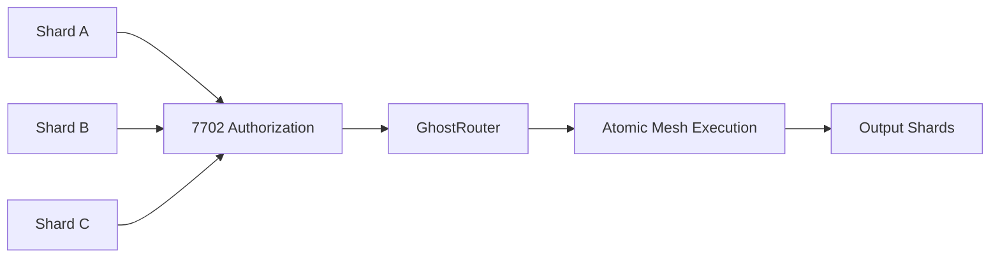

# 6. Execution Model

The cryptographic mechanisms described in Chapter 5 establish ownership, discovery, privacy, and selective disclosure. This chapter describes how those ownership units become executable transactions on the EVM.

GhostShard's execution model combines EIP-7702 delegation, multi-authorization execution, mesh transaction construction, paymaster-sponsored gas settlement, and relayer-assisted broadcasting. Together, these components enable multiple independent shards to participate in a single atomic transaction while preserving the ownership, privacy, and custody guarantees established by the protocol.

The execution model is designed around four principles:

1. **Atomicity** — all shard operations succeed or fail together.
2. **Independent custody** — assets remain under the control of individual shards until execution.
3. **Delegated programmability** — shards temporarily acquire execution logic through EIP-7702 delegation.
4. **Gas abstraction** — users may execute transactions without directly managing native gas assets.

## Status

| Component                               | Status      |
| --------------------------------------- | ----------- |
| EIP-7702 delegation                     | Implemented |
| Multi-authorization execution           | Implemented |
| Atomic mesh execution                   | Implemented |
| Pre-scan code integrity verification    | Implemented |
| Transient storage deduplication         | Implemented |
| Double simulation engine                | Implemented |
| Paymaster deposit and withdrawal system | Implemented |
| Relayer FIFO queue                      | Implemented |
| Batched authorization compression       | Implemented |
| Self-protection simulation              | Planned     |
| Alternative execution engines           | Research    |

Measured transaction costs are evaluated in Chapter 11.

---

## 6.1 EIP-7702

GhostShard requires execution capabilities that are not available to traditional EOAs and are difficult to achieve within existing account-abstraction architectures.

Specifically, the protocol requires:

### 1. Per-Transaction Code Execution

Shards must execute transfer operations such as:

* `transferNative`
* `transferERC20`
* `transferERC721`

without permanently deploying code to every shard address.

EIP-7702 enables temporary delegation of execution logic while preserving the shard as a standard EOA.

### 2. Multi-Authorization Execution

A single mesh transaction may consume multiple input shards.

Each shard must independently authorize participation in the transaction while contributing assets toward a common atomic state transition.

EIP-7702 allows a transaction to carry multiple authorizations, enabling atomic execution across multiple independently owned shards.

### 3. Independent Asset Custody

Each shard maintains direct ownership of its assets.

The protocol cannot rely on pooled balances or shared custody without undermining the shard ownership model.

EIP-7702 preserves per-shard ownership semantics by delegating execution to individual shards rather than routing assets through a centralized execution account.

---

### Comparison with Alternative Models

| Property                            | Traditional EOA | ERC-4337       | EIP-7702       |
| ----------------------------------- | --------------- | -------------- | -------------- |
| Programmable execution              | No              | Via EntryPoint | Via delegation |
| Multi-authorization per transaction | No              | No             | Yes            |
| Alternative mempool required        | No              | Yes            | No             |
| Asset custody model                 | Independent     | Independent    | Independent    |
| Bundler dependency                  | No              | Yes            | No             |
| Native paymaster support            | No              | Yes            | Via Router     |

---

### Design Rationale

GhostShard adopts EIP-7702 because its core operation—atomic execution across multiple independently owned shards—requires native support for multiple authorizations within a single transaction.

While ERC-4337 provides a powerful account abstraction framework, its execution model centers around a single user operation processed through a shared EntryPoint contract. This architecture is not naturally suited to GhostShard's ownership model, where multiple EOAs must authorize a common transaction while retaining independent custody of their assets.

GhostShard does not require:

* A mandatory EntryPoint contract.
* A specialized mempool.
* Bundler participation for correctness.
* Shared asset custody.

Instead, it requires only a temporary execution primitive capable of coordinating multiple EOAs within a single atomic transaction.

EIP-7702 provides precisely this capability.

By delegating execution logic to individual shards only for the duration of a transaction, EIP-7702 enables atomic mesh execution while preserving the protocol's privacy, custody, and ownership guarantees.

For these reasons, EIP-7702 forms the foundation of the GhostShard execution model.
