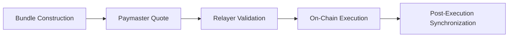
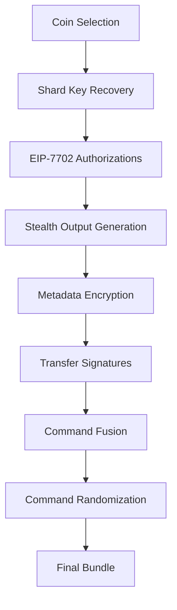
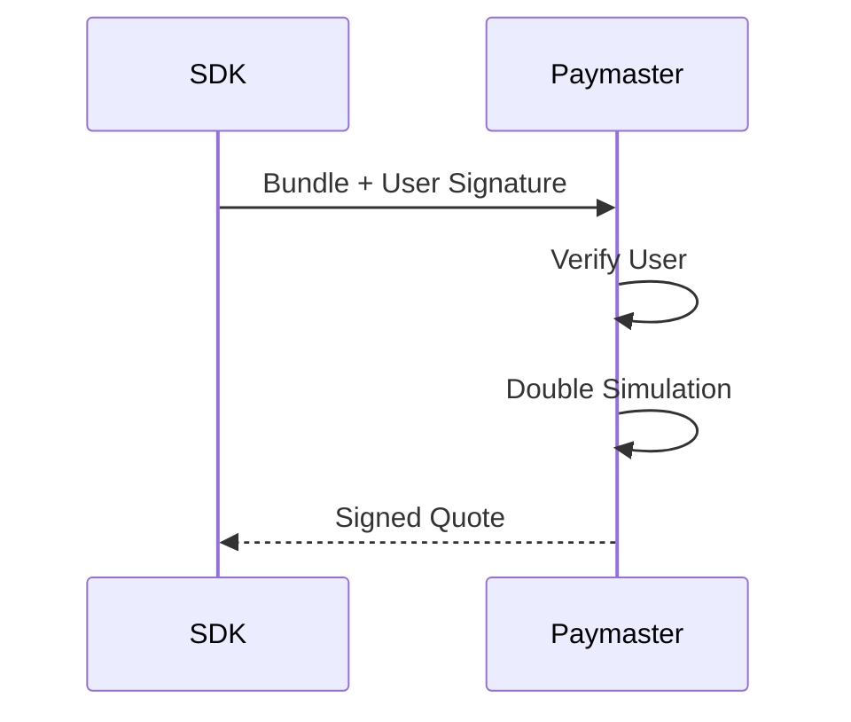
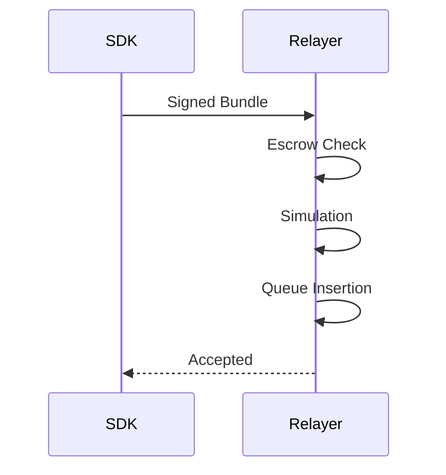
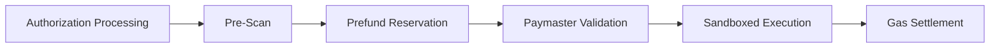
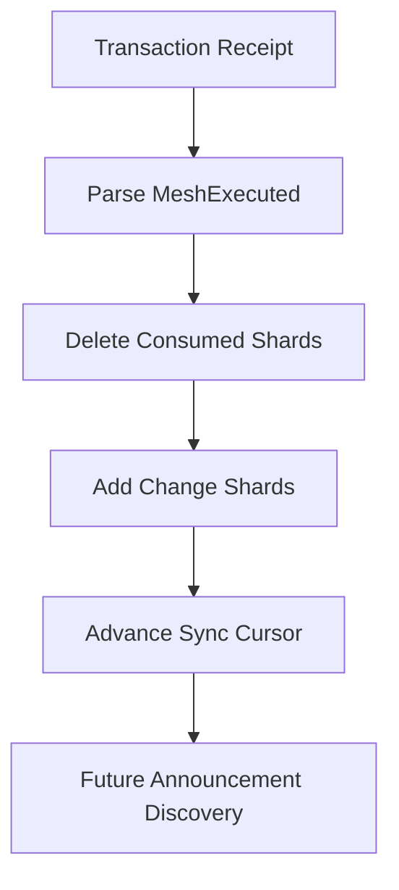

## 6.2 Transaction Lifecycle

A GhostShard transaction progresses through five distinct phases before reaching final settlement on-chain.

The lifecycle begins with local bundle construction inside the SDK, proceeds through sponsorship approval and relayer validation, executes atomically through the GhostRouter, and finally reconciles wallet state after confirmation.



Each phase has a clearly defined responsibility, security boundary, and failure domain.

---

### 6.2.1 Phase 1 — Bundle Construction (SDK)

The SDK constructs a complete mesh transaction bundle locally.



#### Coin Selection

The coin-selection engine selects input shards and computes:

* Payment outputs
* Change outputs
* Optional compression outputs

as described in Section 6.6.

#### Shard Key Recovery

For each selected shard, the SDK reconstructs the shard private key:

$$
[
k_{\text{shard}}=(k_{\text{spend}} + SS)
\bmod n
]
$$

where

$$
[
SS=\operatorname{Keccak256}
\left(
x(v \cdot E)
\right)
]
$$

and:

* (v) is the viewing private key.
* (E) is the announcement ephemeral public key.
* (n) is the secp256k1 curve order.

#### EIP-7702 Authorizations

Each input shard signs an EIP-7702 authorization delegating execution to the GhostShard implementation contract.

Because shards follow a UTXO-style ownership model, authorization nonces remain fixed at zero.

#### Stealth Output Generation

New payment and change shards are generated using the stealth-address construction described in Chapter 5.

Each output receives a fresh ephemeral keypair and therefore a unique ownership address.

#### Metadata Encryption

Output metadata is encrypted using the ECDH-derived shared secret and AES-256-GCM as described in Section 5.6.

#### Transfer Authorization

Each transfer command is authorized using an EIP-191 signature over:

$$
[
(
\text{chainId},
\text{router},
\text{shard},
\text{assetType},
\text{token},
\text{recipient},
\text{value},
\text{announcements}
)
]
$$

#### Command Fusion

Commands targeting the same recipient and asset may be merged into a single transfer operation.

ERC-721 transfers are never fused.

#### Command Randomization

Commands are shuffled before submission to avoid leaking construction order and wallet behavior patterns.

---

### 6.2.2 Phase 2 — Paymaster Quote

The completed bundle is submitted to a paymaster for sponsorship approval.



The paymaster:

1. Verifies user authorization.
2. Executes Double Simulation.
3. Computes precise gas limits.
4. Signs the sponsorship quote.

The resulting quote contains:

* Verification gas limit
* Execution gas limit
* Expiration timestamp
* Paymaster signature

The quote serves as a cryptographic commitment to sponsor execution under the specified conditions.

---

### 6.2.3 Phase 3 — Relayer Validation

The SDK submits the fully assembled bundle to a relayer.



Before broadcast, the relayer performs several defensive checks:

1. Verify paymaster escrow coverage.
2. Simulate execution using EIP-7702 state overrides.
3. Reject invalid bundles.
4. Insert valid bundles into a FIFO execution queue.

The relayer cannot modify transaction contents.

It may delay execution or refuse service, but correctness remains fully enforced on-chain.

---

### 6.2.4 Phase 4 — On-Chain Execution

The relayer broadcasts the bundle as an EIP-7702 transaction.

Execution proceeds through six stages.



#### Step 0 — Authorization Processing

The EVM processes all EIP-7702 authorizations.

Each shard temporarily delegates execution to the GhostShard implementation contract.

This delegation exists only for the duration of transaction execution.

#### Step 1 — Pre-Scan

GhostRouter verifies delegated code integrity.

For every transfer command:

1. Read shard bytecode using `EXTCODECOPY`.
2. Extract the delegated implementation address.
3. Verify the implementation matches the authorized target.

This prevents execution against missing, modified, or unauthorized delegated code.

#### Step 2 — Prefund Reservation

The router computes the worst-case execution cost:
$$
[
\text{requiredPrefund}=(
G_{\text{verification}}
+
G_{\text{execution}}
+
G_{\text{preVerification}}
)
\times
\text{gasPrice}
]
$$

The amount is reserved from the sponsoring paymaster deposit.

#### Step 3 — Paymaster Validation

The router:

1. Reconstructs the paymaster hash.
2. Verifies the EIP-191 signature.
3. Checks quote expiration.
4. Confirms sponsorship validity.

Execution proceeds only if all validation checks succeed.

#### Step 4 — Sandboxed Execution

The router executes:

```solidity
innerExecuteMesh(commands, announcements)
```

through an isolated internal execution boundary.

This ensures:

* External callers cannot trigger shard transfers directly.
* Protocol invariants are preserved.
* Settlement logic always surrounds execution.

##### Announcement Processing

Each announcement is validated and emitted through the ERC-5564 announcer contract.

Announcements and transfers remain fully atomic.

##### Transfer Processing

For every transfer command:

1. Check transient deduplication state.
2. Verify the shard has not already been spent.
3. Mark the shard as spent.
4. Recover the command signer.
5. Verify signer ownership.
6. Execute delegated transfer logic.

All transfers execute atomically.

If any transfer fails, the entire mesh transaction reverts.

#### Step 5 — Gas Settlement

After execution:

1. Actual gas consumption is measured.
2. Settlement is bounded by the prefunded amount.
3. Unused funds are refunded.
4. Relayer reimbursement is paid.
5. Settlement events are emitted.

---

### 6.2.5 Phase 5 — Post-Execution Synchronization

After confirmation, the SDK reconciles local wallet state.



The wallet performs the following updates:

* Deletes consumed input shards from the local shard store.
* Adds newly created change shards.
* Advances the synchronization cursor.
* Discovers future incoming shards through announcement scanning.

Spent shards are removed rather than retained.

Because shards follow a UTXO-style ownership model and may only be spent once, retaining spent shards provides little operational value while increasing local storage requirements. Deleting spent shards keeps wallet state compact and ensures synchronization cost remains proportional to active ownership rather than historical activity.

---

### 6.2.6 Failure Modes

| Failure Point                       | Outcome                                                   | Cost Bearer                              |
| ----------------------------------- | --------------------------------------------------------- | ---------------------------------------- |
| Missing delegated code              | Pre-scan fails and transaction reverts before execution   | Relayer                                  |
| Invalid delegated implementation    | Pre-scan fails and transaction reverts before execution   | Relayer                                  |
| Invalid paymaster/user signature    | Validation fails and transaction reverts before execution | Relayer                                  |
| Sponsorship expired                 | Validation fails and transaction reverts before execution | Relayer                                  |
| Gas price exceeds signed quote      | Transaction rejected before execution                     | Relayer                                  |
| Insufficient paymaster deposit      | Transaction rejected before execution                     | Relayer                                  |
| Relayer simulation failure          | Bundle never broadcast                                    | User                                     |
| Paymaster quote denied              | Transaction never constructed                             | User                                     |
| Relayer censorship                  | Transaction never broadcast                               | User (alternative relayer or self-relay) |
| Shard already spent                 | Atomic execution reverts                                  | Paymaster/User                           |
| Invalid shard signature             | Atomic execution reverts                                  | Paymaster/User                           |
| Transfer command validation failure | Atomic execution reverts                                  | Paymaster/User                           |
| Asset transfer failure              | Atomic execution reverts                                  | Paymaster/User                           |
| Announcement validation failure     | Atomic execution reverts                                  | Paymaster/User                           |

The atomic execution model guarantees that no partial state transitions occur.

If any validation step, announcement, or transfer operation fails, the entire mesh transaction reverts and all state changes are discarded.
