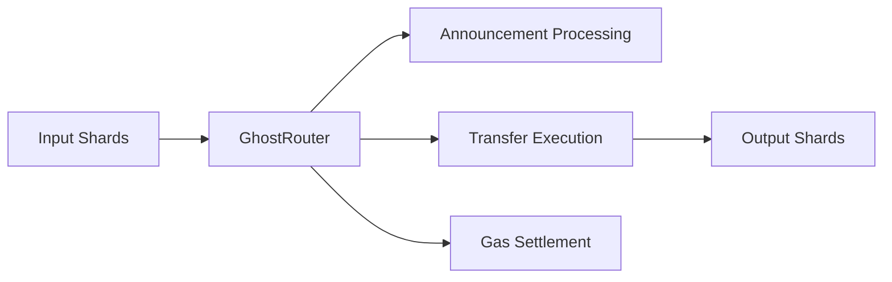
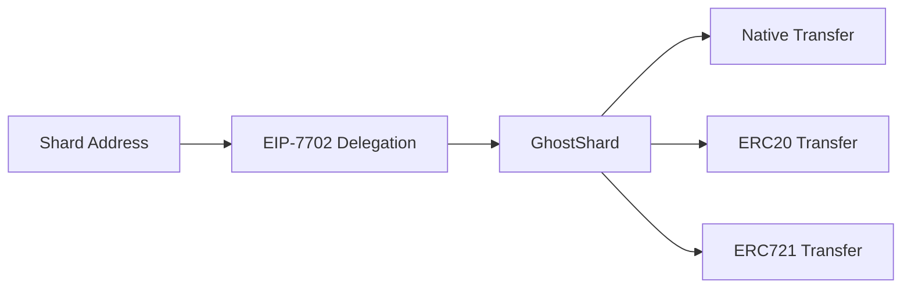

## 6.3 Execution Architecture

GhostShard's execution architecture consists of two on-chain components with strictly separated responsibilities:

* **GhostRouter:** validates, coordinates, and settles execution.
* **GhostShard:** performs asset transfers.

This separation minimizes the trusted execution surface while preserving atomic transaction execution.

---

### 6.3.1 GhostRouter

GhostRouter is the execution coordinator of the GhostShard protocol.

Every mesh transaction passes through a single router instance. The router validates execution prerequisites, coordinates announcements and transfers, enforces ownership rules, and settles sponsored gas costs.

GhostRouter never takes custody of user assets.

Assets remain held by shards throughout execution. The router's role is limited to validating and orchestrating state transitions.

#### Responsibilities

**1. Delegation Integrity Verification**

Before execution begins, the router verifies that every input shard is delegated to the expected implementation.

For each transfer command, the router:

1. Reads the shard's delegated code.
2. Extracts the delegated implementation address.
3. Verifies that the implementation matches the authorized delegation target.

This prevents execution against unexpected, modified, or substituted implementations.

**2. Sponsorship Prefunding**

Prior to execution, the router reserves the maximum potential gas cost from the sponsoring paymaster deposit.

After execution, the router:

* Measures actual gas consumption.
* Refunds unused prefunded value.
* Pays relayer compensation.
* Records execution results.

**3. Paymaster Authorization**

The router validates sponsorship approval before execution by:

1. Reconstructing the paymaster authorization payload.
2. Applying the EIP-191 signing domain.
3. Recovering the signing address.
4. Verifying signer ownership.
5. Verifying quote expiration.

Only valid sponsorships may proceed to execution.

**4. Sandboxed Mesh Execution**

Mesh execution occurs inside an isolated internal execution context controlled exclusively by the router.

This guarantees that:

* External callers cannot invoke shard transfer logic directly.
* Protocol validation always precedes execution.
* Settlement always follows execution.

**5. Announcement Coordination**

The router coordinates all ERC-5564 announcements associated with a mesh transaction.

Announcements and transfers execute atomically. If execution reverts, all announcements revert alongside it.

This guarantees that a shard can never exist without its corresponding announcement.

**6. Gas Reconciliation**

Following execution, the router:

1. Measures actual gas consumed.
2. Computes final settlement.
3. Refunds unused sponsorship funds.
4. Pays relayer compensation.
5. Emits execution records.

Settlement is always bounded by the amount prefunded before execution.

#### State

| Variable                  | Purpose                                             |
| ------------------------- | --------------------------------------------------- |
| `isShardSpent`            | Permanent tracking of consumed shards               |
| `paymasterDeposits`       | Sponsored gas deposits                              |
| `POST_EXECUTION_OVERHEAD` | Fixed allowance used during settlement calculations |

---

### 6.3.2 GhostShard

GhostShard is the execution implementation delegated to shards through EIP-7702.

Where GhostRouter coordinates protocol execution, GhostShard performs a single responsibility: moving assets under router authorization.

The design is intentionally minimal. Every additional capability increases attack surface, audit complexity, and execution cost. Consequently, GhostShard contains only the functionality required to transfer assets already owned by a shard.

The shard itself remains the asset owner. GhostShard merely provides executable logic when temporarily delegated through EIP-7702.

#### Design Principles

1. **Minimal execution surface** — no announcement handling, sponsorship logic, ownership tracking, upgrade mechanisms, or administrative controls.
2. **Router-only authority** — only GhostRouter may invoke shard transfer functions.
3. **Asset-specific execution** — transfer paths are specialized for each supported asset type.

#### Asset Transfer Responsibilities

| Asset Type | Operation                    |
| ---------- | ---------------------------- |
| Native ETH | Transfer value               |
| ERC-20     | Transfer fungible tokens     |
| ERC-721    | Transfer non-fungible tokens |

**Native assets** are transferred directly from the shard balance using a low-level call that forwards all remaining gas, ensuring compatibility with contract recipients.

**ERC-20 assets** are transferred through direct token contract invocation, supporting both standard and non-standard token implementations.

**ERC-721 assets** are transferred from the shard address to the recipient through the NFT contract's transfer interface. The shard must already own the token being transferred.

#### Receiving Assets

A shard may receive assets at any time, including:

* Direct ETH transfers.
* ERC-20 token transfers.
* ERC-721 token transfers.
* Stealth payments.

Because shards are ordinary EVM addresses, no special deposit logic is required. Assets remain dormant within the shard until consumed by a future mesh transaction.

---

### 6.3.3 Security Boundaries

GhostRouter and GhostShard deliberately separate coordination from asset movement.

| Component   | Responsibility                                       |
| ----------- | ---------------------------------------------------- |
| GhostRouter | Validation, authorization, announcements, settlement |
| GhostShard  | Asset movement only                                  |

The router determines **whether** a transfer may occur.

GhostShard determines **how** that transfer is executed.

This separation keeps shard implementations extremely small while centralizing protocol-critical validation inside a single audited execution coordinator.

#### Immutable Router Authority

The router address is fixed during deployment and cannot be modified.

This prevents execution from being redirected toward a malicious coordinator.

#### No Independent Execution

GhostShard cannot initiate transfers independently.

All execution must originate from a validated router invocation, preventing shards from bypassing protocol-level safeguards.

#### Atomic Failure Propagation

GhostShard never handles failures locally.

Any failed transfer propagates back to the router, causing the entire mesh transaction to revert.

As a result, execution remains atomic: either all transfers succeed or no state changes occur.

---

### 6.3.4 Core Invariants

GhostRouter enforces the following protocol invariants:

1. **Single-Spend Protection** — a shard may be consumed at most once.
2. **Atomic Discovery** — announcements and transfers succeed or fail together.
3. **Authorization Correctness** — only authorized shard owners may initiate transfers.
4. **Delegation Integrity** — delegated implementations must match authorized implementations.
5. **Bounded Settlement** — gas reimbursement cannot exceed prefunded limits.

These invariants hold regardless of relayer behavior, transaction ordering, or sponsorship configuration.
