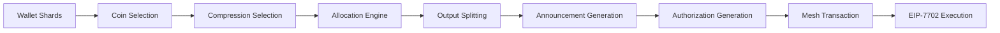
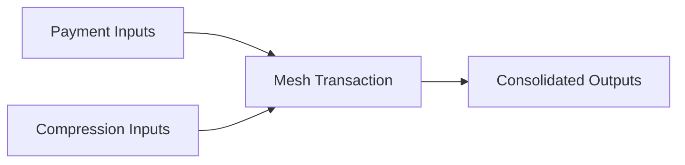
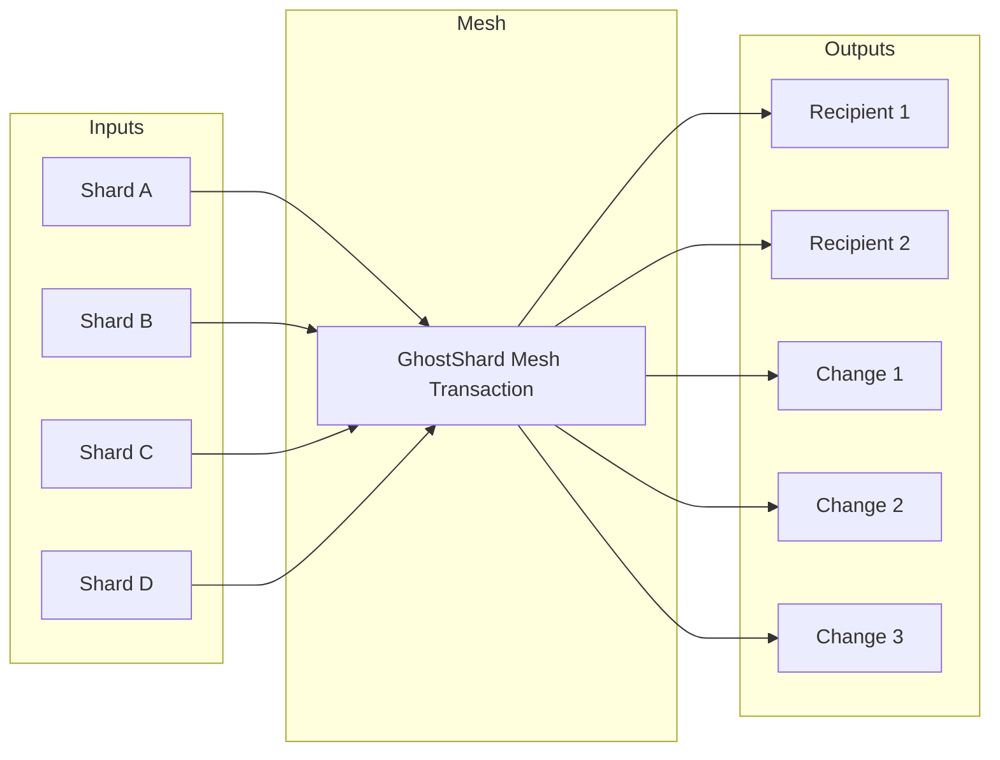
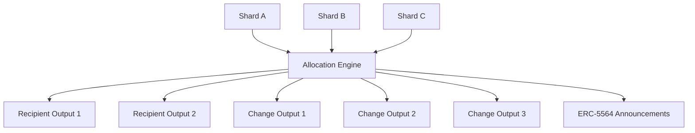
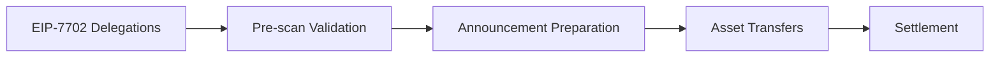

### 6.4 Transaction Construction

Before a mesh transaction can be executed, the SDK must determine which shards to consume, how their balances should be redistributed, and how the resulting transaction should be encoded for execution.

Transaction construction consists of three stages:

1. **Coin Selection** — selecting input shards and determining output allocations.
2. **Compression** — reducing long-term shard fragmentation during normal transaction activity.
3. **Mesh Assembly** — encoding the selected inputs and outputs into an atomic EIP-7702 transaction.

Together, these stages transform a set of independent shards into a single executable transaction while preserving privacy, efficiency, and atomicity.



The transaction construction pipeline converts a fragmented shard set into a single executable mesh transaction. Each stage contributes either privacy, efficiency, or fragmentation control before execution occurs on-chain.

---

### 6.4.1 Coin Selection

Coin selection determines which shards participate in a transaction and how their balances are distributed across payment and change outputs.

Unlike traditional UTXO systems, GhostShard coin selection is designed not only to satisfy a payment amount, but also to preserve privacy and improve long-term wallet health.

#### Objectives

Coin selection simultaneously pursues three goals:

| Objective   | Purpose                                                                           |
| ----------- | --------------------------------------------------------------------------------- |
| Privacy     | Prevent observers from inferring payment relationships from transaction structure |
| Efficiency  | Minimize unnecessary inputs and execution costs                                   |
| Compression | Reduce shard fragmentation during normal transaction activity                     |

#### Selection Strategy

The coin-selection engine follows a randomized, fingerprint-resistant strategy.

**Step 1 — Candidate Selection**

The wallet filters its shard pool to shards holding the required asset type and removes empty shards.

The resulting candidate set is shuffled using a cryptographically secure random number generator.

**Step 2 — Payment Coverage**

Shards are accumulated until the selected balance is sufficient to satisfy the payment amount and dust constraints.

**Step 3 — Compression Inclusion**

Additional shards may be selected for compression purposes, allowing wallet fragmentation to be reduced opportunistically during normal transactions.

The compression strategy is described in Section 6.4.2.

**Step 4 — Capacity Allocation**

The engine computes a safe allocation for each selected shard, ensuring that no shard contributes more value than it controls.

**Step 5 — Randomized Distribution**

Payment value is distributed across multiple shards using randomized allocations.

The final allocation phase deliberately avoids a deterministic "cleanup shard" pattern that could reveal the exact payment amount.

**Step 6 — Output Splitting**

Payment outputs and change outputs are further divided into multiple randomized allocations.

This creates the many-to-many transaction structure that forms the basis of GhostShard's execution model.

#### Dust Protection

Every participating shard must produce both:

* A payment contribution.
* A change contribution.

The protocol therefore enforces a minimum dust threshold to prevent the creation of economically unusable outputs.

#### Fingerprint Resistance

The construction process avoids deterministic transaction patterns by:

* Randomizing shard selection order.
* Randomizing payment allocations.
* Randomizing output counts.
* Avoiding final-shard cleanup behavior.
* Shuffling command execution order.

As a result, observers cannot reliably distinguish payment inputs from non-payment inputs.

---

### 6.4.2 Compression

Compression is the mechanism used to bound long-term wallet fragmentation.

Because every received payment creates a new shard, wallet shard counts naturally increase over time. Without intervention, transaction costs and local wallet state would grow indefinitely.

Compression reduces this growth by consuming additional shards during ordinary transactions and consolidating their balances into fewer outputs.

#### Fragmentation Growth

Consider a user who receives 100 independent payments.

Without compression:

* 100 deposits create 100 shards.
* Future transactions require increasingly large input sets.
* Execution costs increase with wallet fragmentation.

Compression counteracts this process by gradually reducing shard count whenever transactions are constructed.


#### Compression Strategy

During coin selection, the SDK may include additional shards beyond those strictly required for payment.

These shards are consumed alongside payment inputs and their balances are redistributed into the transaction's output set.



Compression therefore occurs naturally during normal wallet activity and requires no dedicated maintenance transaction.

#### Compression Scaling

The number of compression shards grows sublinearly with wallet size.

| Wallet Size | Compression Shards |
| ----------- | ------------------ |
| $\leq 3$    | 0                  |
| $\leq 100$  | $\sim \sqrt{n}/2$  |
| $\leq 500$  | 5--10              |
| $> 500$     | 8--15              |

A hard cap prevents compression from dominating transaction costs.

#### Privacy Benefits

Compression provides several secondary privacy benefits.

**Wallet Size Obfuscation**

Observers cannot infer total wallet size from the number of inputs participating in a transaction.

**Amount Obfuscation**

Additional compression inputs increase total transaction value, making it difficult to distinguish payment value from consolidation value.

**Output Ambiguity**

Compression outputs are indistinguishable from payment outputs once the transaction is constructed.

As a result, observers cannot reliably identify which shards are payment and which are for consolidation.

#### Atomicity

Compression occurs within the same atomic transaction as payment execution.

If execution fails:

* No shards are consumed.
* No compression occurs.
* No state changes are applied.

Compression therefore inherits the same atomicity guarantees as ordinary transfers.

---


### 6.4.3 Mesh Transactions

A mesh transaction is the fundamental execution unit of the GhostShard protocol.

It is a single EIP-7702 transaction that atomically:

* Consumes multiple input shards.
* Creates multiple output stealth addresses.
* Publishes ERC-5564 announcements.
* Transfers assets between participants.

The result is a many-to-many transaction structure with no deterministic relationship between inputs and outputs.



Unlike a traditional transfer, no output is funded by a single identifiable input. Every output may contain value originating from multiple shards, while every shard may contribute value to multiple outputs. The observable transaction therefore forms a many-to-many value graph rather than a one-to-one transfer.

#### Value Redistribution

Coin selection and allocation redistribute value across both payment and change outputs.



Because both payment and change outputs emerge from the same redistribution process, observers cannot reliably determine which outputs represent payments and which represent wallet-controlled change.

#### Structure

A mesh transaction consists of three payloads.

##### Authorization List

Each input shard contributes an EIP-7702 authorization.

Every authorization delegates execution to the GhostShard implementation contract.

```text
authorizationList = [
    auth_1,
    auth_2,
    ...
    auth_n
]
```

##### Transfer Commands

Transfer commands describe the asset movements to be executed.

Each command specifies:

* Source shard.
* Asset type.
* Token address.
* Destination stealth address.
* Transfer amount or token identifier.
* Shard authorization signature.

##### Announcements

Each output stealth address receives a corresponding ERC-5564 announcement containing:

* The stealth address.
* The ephemeral public key.
* Encrypted metadata.

Announcements enable recipients to discover outputs during future scans.

#### Execution Semantics

Mesh transactions execute atomically.



Execution proceeds as follows:

1. The EVM applies EIP-7702 delegations.
2. GhostRouter performs pre-scan validation and shard-spend checks.
3. Announcements are prepared and queued.
4. Asset transfers execute.
5. Settlement finalizes the transaction state.

If any step fails, the entire transaction reverts (apart from the EIP-7702 delegation itself).

No shards are consumed, no announcements are emitted, and no assets move.

#### Why "Mesh"

The term *mesh* refers to the transaction's many-to-many structure.

Unlike traditional transfers:

* Multiple inputs may fund multiple outputs.
* Multiple inputs may contribute to a single recipient.
* A single input may contribute to multiple outputs.

There is no observable one-to-one mapping between inputs and outputs.

This combinatorial ambiguity is a core source of privacy within the protocol.

#### Command Fusion

Before final assembly, compatible transfer commands may be merged.

Commands sharing the same:

* Source shard
* Asset type
* Token
* Recipient

can be fused into a single command.

This reduces:

* Signature verification overhead.
* Transfer execution overhead.
* Total transaction gas cost.

ERC-721 transfers are excluded because token identifiers cannot be aggregated.

#### Ordering Resistance

The SDK randomizes command ordering before submission.

Announcements inherit this randomized ordering.

Consequently, observers cannot distinguish payment outputs from change outputs based solely on transaction position.

#### Failure Semantics

Mesh transactions are atomic.

If execution fails:

* Shard consumption reverts.
* Asset transfers revert.
* Announcement publication reverts.
* Output creation reverts.

Only gas consumed before the revert remains spent.

No partial state transitions can occur.
