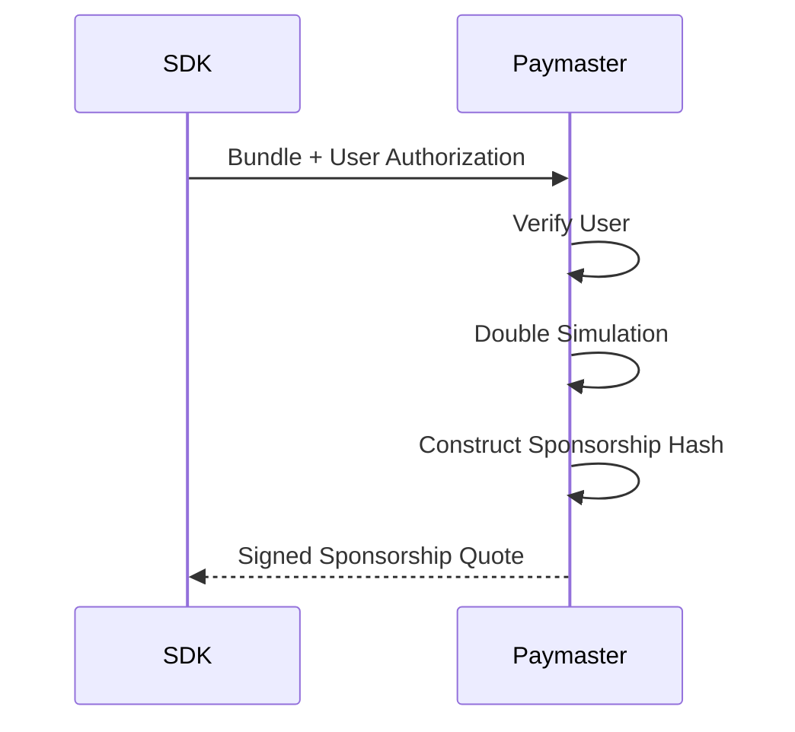

## 6.6 Sponsored Execution

GhostShard supports sponsored execution, allowing users to submit transactions without maintaining a native gas balance.

Execution sponsorship is provided through two cooperating entities:

* **Paymasters**, which authorize and fund transaction execution.
* **Relayers**, which broadcast transactions and assume execution risk.

Together, these components enable gas abstraction while preserving the protocol's trust-minimized execution model.

---

### 6.6.1 Paymaster Authorization

Before a transaction can be relayed, a paymaster must explicitly approve sponsorship.

This approval takes the form of a signed commitment that binds the sponsorship to a specific execution context.

#### Sponsorship Flow

The process proceeds as follows:

1. The SDK submits the completed bundle to a paymaster.
2. The paymaster verifies user eligibility.
3. The paymaster executes Double Simulation to estimate execution costs.
4. The paymaster computes a sponsorship commitment.
5. The paymaster signs the commitment and returns a sponsorship quote.

#### Sponsorship Commitment

The sponsorship hash commits to the complete execution context:

$$
H_{\text{paymaster}}=\operatorname{Keccak256}
\Big(
\text{chainId},
\text{router},
\text{commandsHash},
\text{announcementsHash},
\text{validUntil},
\text{limitsHash}
\Big)
$$

The paymaster signs this hash using EIP-191.

Any modification to the execution context invalidates the sponsorship.

#### Signature Scope

| Field               | Purpose                            |
| ------------------- | ---------------------------------- |
| `chainId`           | Prevents cross-chain replay        |
| `router`            | Prevents cross-contract replay     |
| `commandsHash`      | Prevents command modification      |
| `announcementsHash` | Prevents announcement modification |
| `validUntil`        | Limits sponsorship lifetime        |
| `limitsHash`        | Prevents gas-limit modification    |

#### On-Chain Verification

Before execution begins, GhostRouter validates the sponsorship by:

1. Verifying the sponsorship has not expired.
2. Reconstructing the sponsorship hash.
3. Recovering the signer.
4. Verifying signer ownership.

Execution proceeds only if all checks succeed.

#### User Authorization

Paymasters may impose arbitrary sponsorship policies.

The reference implementation uses an allowlist-based model in which users must first obtain sponsorship approval from the paymaster service.

Importantly, paymaster approval does not grant spending authority.

Even a compromised paymaster cannot move user assets because valid shard signatures remain mandatory for every transfer.

---

### 6.6.2 Relayer Escrow Accounting

Once a relayer accepts a sponsored transaction, the associated paymaster deposit becomes economically committed before on-chain settlement occurs.

To prevent over-allocation of sponsorship funds, relayers maintain an internal escrow accounting system.

#### In-Flight Debt Tracking

For each paymaster, the relayer tracks the worst-case cost of all pending transactions:

$$
\text{InFlightDebt}=\sum
\text{WorstCaseCost}_i
$$

This value represents sponsorship capacity that has been reserved but not yet settled on-chain.

#### Acceptance Rule

Before accepting a transaction, the relayer verifies:

$$
\text{AvailableCapacity}=\text{Deposit}-\text{InFlightDebt}
$$

and requires:

$$
\text{AvailableCapacity}
\ge
\text{WorstCaseCost}
$$

where:

$$
\text{WorstCaseCost}=(
G_{\text{verification}}
+
G_{\text{execution}}
+
G_{\text{preVerification}}
)
\times
\text{gasPrice}
$$

Transactions that exceed available capacity are rejected.

#### Escrow Guarantees

This mechanism provides two important guarantees:

1. **No sponsorship over-commitment.**
2. **No concurrent double-allocation of paymaster deposits.**

A relayer can never reserve more sponsorship capacity than is currently available.

#### Escrow Release

Reserved capacity is released once execution completes.

The relayer observes the transaction receipt, determines the final settlement outcome, and removes the corresponding reservation from the in-flight debt tracker.

If confirmation is not observed within a predefined timeout window, the reservation is released automatically.

#### Withdrawal Race Conditions

A paymaster may withdraw funds after sponsorship approval but before execution.

In such cases, the router's on-chain deposit checks remain authoritative.

If insufficient funds remain available, execution reverts before settlement occurs.

---

### 6.6.3 Gas Settlement

Gas settlement is the final stage of sponsored execution.

After mesh execution completes, GhostRouter reconciles actual gas consumption against the prefunded sponsorship amount.

#### Prefunding

Before execution begins, the router reserves the maximum potential execution cost:

$$
\text{Prefund}=(
G_{\text{verification}}
+
G_{\text{execution}}
+
G_{\text{preVerification}}
)
\times
\text{gasPrice}
$$

This amount is temporarily deducted from the sponsoring paymaster's deposit.

#### Cost Measurement

After execution completes, the router computes actual gas consumption:

$$
\text{TotalGasUsed}=(
G_{\text{start}}-G_{\text{end}}
)
+
G_{\text{overhead}}
+
G_{\text{preVerification}}
$$

The corresponding settlement cost is:

$$
\text{TotalGasCost}=\text{TotalGasUsed}
\times
\text{gasPrice}
$$

#### Settlement Bound

Settlement is capped by the prefunded amount:

$$
\text{TotalGasCost}
\le
\text{Prefund}
$$

A paymaster can never lose more than the amount reserved prior to execution.

#### Surplus Recovery

Unused sponsorship capacity is returned to the paymaster:

$$
\text{Refund}=\text{Prefund}

\text{TotalGasCost}
$$

This mechanism prevents overcharging while allowing conservative gas estimation.

#### Relayer Compensation

After settlement is finalized, the relayer receives reimbursement equal to the measured execution cost.

Settlement follows a strict checks-effects-interactions ordering:

1. Validate execution.
2. Update accounting state.
3. Compute refunds.
4. Compensate the relayer.

This prevents re-entrancy during settlement.

#### Execution Records

Every execution produces a settlement record containing:

* Relayer identity
* Paymaster identity
* Total gas consumed
* Total gas cost
* Inner execution metrics
* Execution status
* Revert information (if applicable)

These records provide an auditable history of sponsored execution.

#### Failed Execution

#### Failed Execution

Inner mesh execution may fail for several reasons:

* A shard has already been spent.
* A shard signature is invalid.
* Transfer validation fails.
* Asset transfer execution fails.
* Announcement validation fails.

When this occurs:

* All transfer operations revert.
* All announcement operations revert.
* All spent-state updates revert.
* No user assets move.
* No new shards are created.

However, the outer router execution continues.

The router still measures gas consumption, performs settlement, refunds any unused prefund, and reimburses the relayer.

As a result, failed execution remains economically chargeable.

---

### Sponsored Execution Guarantees

The sponsored execution system enforces four core properties:

1. **Users may execute without maintaining a native gas balance.**
2. **Paymasters retain explicit control over sponsorship approval.**
3. **Relayers cannot over-allocate sponsorship deposits.**
4. **Settlement is bounded by prefunded limits and fully auditable.**

Together, these properties provide practical gas abstraction without requiring users to surrender custody or execution authority.
