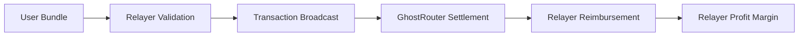
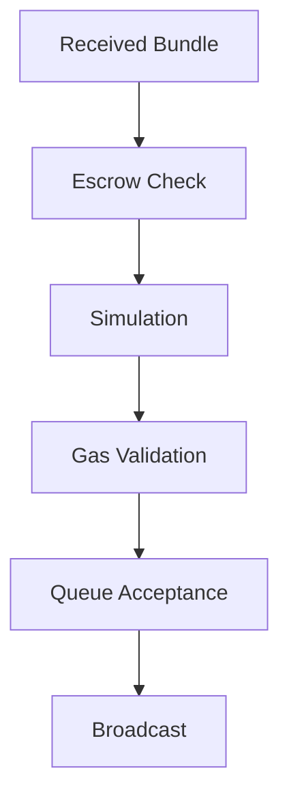

## 7.1 Relayer Economics

The relayer is responsible for transaction inclusion.

It receives signed mesh transaction bundles from users, verifies their validity, and broadcasts them to the network. Although the relayer does not participate in asset custody or protocol governance, it plays a critical role in transaction execution and sponsored gas settlement.

Economically, the relayer occupies an unusual position: it initiates transaction submission and temporarily assumes execution risk, but receives reimbursement through the protocol's settlement process.



---

### 7.1.1 Reimbursement Mechanism

Relayers are reimbursed through the settlement process executed by the GhostRouter.

After transaction execution completes, the router calculates the final gas cost and transfers the corresponding amount to the transaction submitter (`msg.sender`), which is the relayer.

```solidity
(bool callSuccess, ) = msg.sender.call{value: totalGasCost}("");
require(callSuccess, "Bundler fee payment failed");
```

The reimbursement amount is denominated in the chain's native asset and is bounded by the paymaster prefund established before execution.

As a result, relayers recover the cost of successful transaction execution directly from protocol settlement rather than from users.

---

### 7.1.2 Profit Model

Relayer revenue is derived from the difference between conservative sponsorship estimates and actual execution requirements.

Before sponsorship approval, the paymaster computes gas limits using Double Simulation and signs a transaction-specific sponsorship quote.

The signed value includes a `preVerificationGas` component:

$$
G_{\text{pvg}}^{\text{paymaster}}=
G_{\text{totalEstimate}}-G_{\text{execution}}
$$

This value accounts for costs that are difficult to predict precisely at signing time, including:

* L1 data availability fees
* EIP-7702 authorization payload overhead
* Calldata-related costs
* Network-specific execution overhead

Because these costs can fluctuate between quote generation and transaction inclusion, paymasters typically provision conservatively.

Prior to broadcast, the relayer performs its own simulation and computes an independent estimate:

$$
G_{\text{pvg}}^{\text{relayer}}=
G_{\text{totalSimulated}}-G_{\text{executionSimulated}}
$$

The difference between these values creates the relayer's execution margin:

$$
M_{\text{relayer}}=
G_{\text{pvg}}^{\text{paymaster}}-G_{\text{pvg}}^{\text{relayer}}
$$

When network conditions remain stable or improve between sponsorship approval and transaction inclusion, the relayer may realize a positive margin.

The relayer is therefore incentivized to:

* Submit valid transactions efficiently.
* Broadcast when execution conditions are favorable.
* Minimize failed executions.
* Maintain accurate simulation infrastructure.

---

### 7.1.3 Relayer Risk Management

Relayers assume execution risk and therefore perform independent validation before broadcasting transactions.



Before accepting a bundle, the relayer verifies:

#### Escrow Sufficiency

The sponsoring paymaster must possess sufficient available deposit capacity after accounting for all pending transactions.

This prevents acceptance of transactions that cannot be settled.

#### Execution Validity

The relayer independently simulates execution using the same state-override model used during sponsorship approval.

Transactions predicted to revert are rejected before broadcast.

#### Gas Adequacy

The relayer verifies that the paymaster's signed gas limits remain sufficient under current network conditions.

If the relayer determines that execution would exceed the approved limits, the transaction is rejected.

Together, these checks reduce the likelihood of executing transactions that would produce economic losses.

---

### 7.1.4 Censorship Power

The relayer's primary discretionary power is censorship.

A relayer may refuse to broadcast a valid transaction despite possessing the ability to do so.

The protocol cannot eliminate this possibility, but it minimizes its impact through architectural design.

#### Multiple Relayers

Bundles are not bound to a specific relayer.

Users may submit identical bundles to multiple relayers simultaneously.

#### Self-Relay

Users may bypass third-party relayers entirely and submit transactions directly through private RPC infrastructure or block-builder endpoints.

#### FIFO Processing

The reference implementation processes accepted transactions through a strict FIFO queue.

This limits discretionary reordering within a relayer's local execution pipeline.

Because censorship forfeits potential execution revenue while providing no direct economic benefit, relayers are generally incentivized to process valid transactions rather than ignore them.

---

### 7.1.5 Competitive Relay Market

GhostShard is designed to support a competitive relay ecosystem.

Because transaction bundles are self-contained and independently verifiable, any compatible relayer can execute them.

No protocol-level dependency exists on a specific relay operator.

Future relay markets may compete on:

* Reliability
* Inclusion speed
* Geographic distribution
* Fee efficiency
* Sponsorship partnerships

As relay participation increases, competition naturally encourages improved service quality and reduced execution friction.

In the long term, GhostShard anticipates a heterogeneous relay ecosystem similar to existing block-builder and transaction-relay markets.
