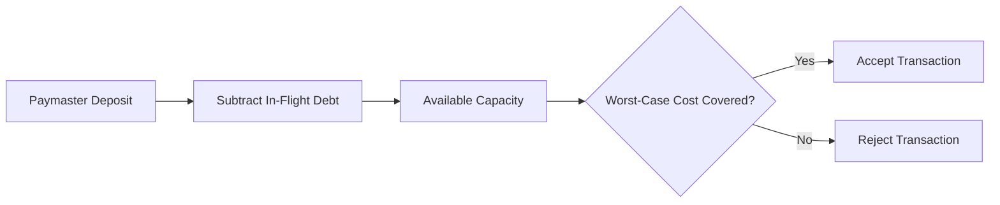
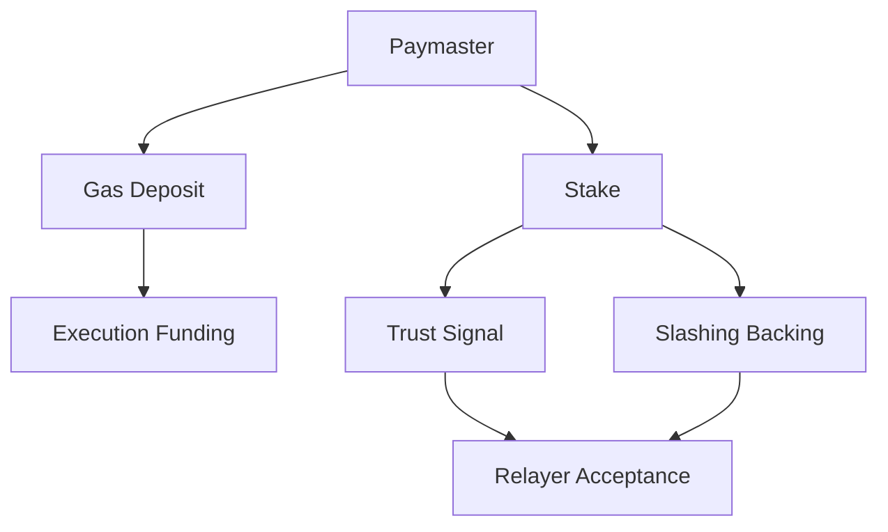

## 7.3 Escrow Accounting

Sponsored execution introduces a settlement timing problem.

When a relayer accepts a mesh transaction, it must determine whether the sponsoring paymaster possesses sufficient funds to cover the transaction's worst-case execution cost. However, the actual execution cost is not known until the transaction has been included and settled on-chain.

Between relay acceptance and on-chain settlement, a portion of the paymaster's deposit is economically committed but not yet charged. During this period, relayers must ensure that sponsorship capacity is not allocated multiple times.

Escrow accounting provides this protection.

---

### 7.3.1 In-Flight Debt Tracking

Each relayer maintains an internal accounting structure that tracks the total worst-case liability associated with pending transactions for every paymaster.

The accumulated liability is:

$$
\text{InFlightDebt}=\sum_i \text{WorstCaseCost}_i
$$

where each term represents the maximum potential settlement cost of a pending transaction.

Before accepting a new transaction, the relayer calculates the paymaster's remaining sponsorship capacity:

$$
\text{AvailableCapacity}=\text{Deposit}-\text{InFlightDebt}
$$

The transaction is accepted only if:

$$
\text{AvailableCapacity}
\ge
\text{WorstCaseCost}
$$

where:

$$
\text{WorstCaseCost}=\left(
G_{\text{verification}}
+
G_{\text{execution}}
+
G_{\text{preVerification}}
\right)
\times
\text{gasPrice}
$$

If the condition holds, the relayer reserves the corresponding capacity and records the transaction as in flight.

---

### 7.3.2 Economic Guarantees

Escrow accounting provides two important guarantees.

#### No Over-Allocation

The aggregate worst-case cost of all pending transactions can never exceed the paymaster's available deposit.

As a result, relayers cannot reserve sponsorship capacity that does not exist.

#### No Concurrent Deposit Reuse

Every accepted transaction immediately reserves capacity before entering the relay queue.

Even if multiple transactions are pending simultaneously, the same deposit balance cannot be allocated more than once.

Together, these guarantees ensure that relay acceptance remains economically conservative.

---

### 7.3.3 Escrow Release

Reserved capacity is released once the transaction reaches a terminal state.

After transaction confirmation, the relayer:

1. Observes the transaction receipt.
2. Releases the reserved worst-case allocation.
3. Updates local accounting.

The release process is independent of the actual settlement amount.

Actual gas reconciliation is performed entirely on-chain by GhostRouter. The relayer's escrow system exists solely to prevent over-allocation while transactions remain pending.

To avoid permanent lockups caused by networking failures or missed receipts, relayers may release reservations automatically after a configurable timeout period.

---

### 7.3.4 Edge Cases

#### Failed Execution

If inner mesh execution fails, the transaction still consumes gas and the sponsoring paymaster remains responsible for settlement.

However:

* All asset transfers revert.
* All announcement operations revert.
* All shard-spent state changes revert.

The relayer releases the escrow reservation once the failed receipt is observed.

#### Delayed Inclusion

A transaction may remain pending longer than expected.

If a timeout policy releases the reservation before inclusion occurs, subsequent on-chain settlement remains correct because sponsorship accounting is ultimately enforced by GhostRouter.

Escrow accounting only influences local relay acceptance decisions.

#### Deposit Withdrawal During Flight

A paymaster may withdraw funds after a transaction has been accepted but before it has been included.

If the remaining deposit becomes insufficient, the router's on-chain validation rejects execution.

The transaction fails safely, but the relayer may still incur gas costs associated with submission.

This represents the primary economic risk in the v0 sponsorship model.

---

### 7.3.5 Future Requirement: Paymaster Staking

The v0 architecture relies entirely on paymaster deposits.

Deposits are sufficient for funding gas costs, but they do not provide relayers with a reliable measure of paymaster trustworthiness.

A paymaster can possess sufficient funds at quote time, withdraw them before inclusion, and cause relayers to expend resources on transactions that ultimately fail.

To support a competitive multi-paymaster ecosystem, future versions of GhostShard will introduce a staking mechanism similar in spirit to the model used by ERC-4337 paymasters.

Importantly, **stake and gas deposits serve entirely different purposes.**

| Property                    | Gas Deposit             | Stake                      |
| --------------------------- | ----------------------- | -------------------------- |
| Purpose                     | Prefund execution costs | Economic trust signal      |
| Location                    | GhostRouter             | Dedicated staking contract |
| Used for gas payment        | Yes                     | No                         |
| Withdrawable immediately    | Yes                     | No                         |
| Subject to withdrawal delay | No                      | Yes                        |
| Subject to slashing         | No                      | Yes                        |

Gas deposits remain operational liquidity used during transaction settlement.

Stake functions as an economic bond that signals long-term commitment and provides backing against harmful behavior.

Under a future staking model:

1. Paymasters lock stake in a dedicated staking contract.
2. Stake becomes subject to a withdrawal delay.
3. Relayers evaluate both deposit sufficiency and stake size before accepting transactions.
4. Misbehavior that causes relayer losses may result in partial stake slashing.
5. Larger and longer-duration stakes increase relayer confidence.

This transforms relay participation from a binary trust decision into a market-driven assessment of economic credibility.

Paymasters seeking greater transaction volume must maintain stronger economic commitments, while relayers gain objective criteria for evaluating sponsorship risk.
