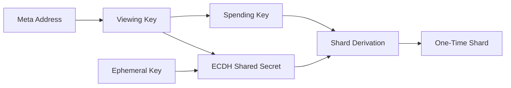

## 8.1 Ownership Unlinkability

> **Question:** Can an observer reliably determine who owns a shard?

Ownership unlinkability is the foundational privacy property of GhostShard.

If ownership can be reliably mapped to identities, then transaction graphs, transfer histories, and wallet reconstruction become possible regardless of any other privacy mechanisms. Consequently, the primary objective of the ownership model is to prevent observers from establishing durable links between on-chain ownership objects and real-world identities.

GhostShard achieves this through the combination of stealth address derivation, disposable ownership, shard retirement, and the elimination of persistent ownership containers.

---

### 8.1.1 Stealth Address Derivation

Every shard is represented by a stealth address derived from:

1. The recipient's viewing public key.
2. The recipient's spending public key.
3. A fresh ephemeral key pair generated by the sender.

The derivation procedure is described formally in Chapter 5.

The resulting shard address is uniquely derived for a specific recipient and transaction while remaining cryptographically unlinkable to the recipient's public meta-address.

An observer can see:

* The shard address.
* The sender's ephemeral public key.
* The associated transaction data.

However, without access to the recipient's private viewing key, the observer cannot determine which recipient produced the corresponding shared secret used during shard derivation.

Consequently, ownership cannot be inferred directly from on-chain address data.

This property establishes the first layer of ownership privacy: observers can identify that a shard exists, but cannot reliably determine who owns it.

---

### 8.1.2 Disposable Ownership

Every shard is intended for exactly one spend.

Once a shard participates in a valid transfer, its corresponding entry in the `isShardSpent` mapping is permanently set to `true`.

A spent shard can never be reused.

This eliminates ownership accumulation, a common weakness in traditional account-based systems.

In conventional wallet architectures, a single address may receive funds repeatedly over long periods of time. If an observer successfully links that address to an identity, all historical and future activity associated with the address becomes attributable to the same owner.

GhostShard prevents this form of longitudinal analysis.

Each shard appears exactly once as an ownership object and disappears after use, preventing observers from building persistent ownership histories around individual addresses.

---

### 8.1.3 Shard Retirement

After a shard is spent, it becomes economically inactive.

Although EIP-7702 delegation remains attached to the address unless explicitly cleared, the shard itself is permanently retired from the ownership graph.

A retired shard:

* Cannot be spent again.
* Cannot re-enter circulation.
* Cannot participate in future ownership transitions.

Consequently, even if ownership attribution were somehow achieved after a shard has been consumed, the information provides little value because the associated assets have already moved into newly derived shards.

Ownership knowledge does not propagate forward through the system.

---

### 8.1.4 Absence of Persistent Ownership Containers

GhostShard intentionally avoids persistent ownership containers.

The protocol does not maintain:

* Wallet accounts.
* Ownership registries.
* User balances.
* Address-based asset inventories.

The user's meta-address functions only as an off-chain discovery primitive and does not participate directly in transaction execution.

Ownership exists solely as a collection of independently derived shards.

The only persistent secret is the user's root seed, which never appears on-chain.

Because ownership is fragmented across disposable stealth addresses rather than aggregated into persistent containers, observers lack a stable object around which ownership attribution can accumulate.

This property forms the architectural foundation of GhostShard's privacy model.

> Privacy is achieved not by concealing ownership containers, but by eliminating them entirely.

---

### 8.1.5 Observer Knowledge

Given an arbitrary shard address observed on-chain, an external observer cannot reliably determine:

* Which meta-address owns the shard.
* Which real-world identity controls the shard.
* Whether two shards belong to the same owner.
* The complete set of shards controlled by a particular user.
* The historical ownership chain leading to the shard.

The observer can determine only that the shard exists and participated in protocol activity.

Ownership attribution requires information that never appears on-chain, namely the recipient's private viewing key and the secrets derived from it.

Under the assumption that secp256k1 and ECDH remain secure, ownership remains cryptographically unlinkable to external observers.
