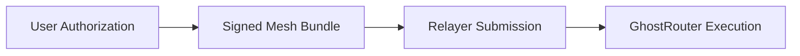

## 8.2 Sender Privacy

> **Question:** Can an observer determine who initiated a private transfer?

Sender privacy concerns whether protocol activity can be attributed to a specific user.

In conventional account-based systems, the account that authorizes a transfer is also the account that appears on-chain as the transaction sender. This creates a direct and persistent link between ownership and transaction activity.

GhostShard separates these roles.

Users authorize mesh transactions through shard signatures and delegated execution rights, while transaction inclusion is performed by a relayer. Consequently, the entity that appears on-chain as the transaction sender is not the entity that authorized the transfer.

As a result, transaction execution and transaction authorization become distinct observable events.

---

### 8.2.1 Separation of Authorization and Submission

In the v0 architecture, users never submit mesh transactions directly to the blockchain.

Instead, users construct and authorize a mesh bundle locally. The completed bundle is then forwarded to a relayer, which broadcasts the transaction and invokes the router.

As a consequence:

* The relayer appears on-chain as the transaction sender.
* The user's meta-address never appears as `msg.sender`.
* The user's identity is not exposed through transaction submission.

An observer can identify the relayer that submitted the transaction but cannot directly identify the user that authorized it.

---

### 8.2.2 Observer Knowledge

For a given mesh transaction, an external observer can determine:

* That a transaction occurred.
* Which relayer submitted it.
* Which shards participated in execution.
* Which output shards were created.

However, the observer cannot reliably determine:

* Which user authorized the transaction.
* Which real-world identity controlled the participating shards.
* Which meta-address originated the transfer.

The execution record therefore reveals protocol activity without revealing the identity responsible for authorizing that activity.

---

### 8.2.3 Architectural Note: Future Execution Models

The sender privacy properties described in this section are specific to the v0 execution architecture.

In v0, transaction submission is performed by a relayer because shard addresses do not maintain native-token balances and therefore cannot independently fund execution. As a result, the relayer appears on-chain as the transaction sender.

Future versions of GhostShard may explore execution models in which a shard itself acts as the transaction-originating account.

Such architectures could become possible if:

* Shards are capable of holding native assets sufficient to fund execution.
* Future account-abstraction systems support sponsored execution without requiring relayer-originated transactions.
* New execution frameworks allow ownership objects to initiate transactions directly while preserving privacy and sponsorship guarantees.

Under these models, a shard could potentially appear as the transaction sender while remaining unlinkable to a persistent user identity.

These approaches remain future work and are not part of the current protocol design.

Importantly, this would change the execution architecture rather than the ownership model. Ownership privacy in GhostShard derives from disposable stealth-address ownership and the properties described in Section 8.1, not from the identity of the transaction submitter.

---

### 8.2.4 Limitations

Sender privacy is not absolute.

#### Infrastructure Visibility

Paymasters and relayers may possess information unavailable to external observers.

A sponsoring paymaster may associate a user identity with a transaction request, while a relayer may observe network-level metadata associated with submission.

These observations arise from infrastructure participation rather than from information revealed on-chain.

#### Ownership Correlation Within a Transaction

All input shards participating in a mesh transaction are authorized together.

Consequently, observers can infer that the consumed shards belonged to the same authorization domain at execution time, even though they cannot determine the identity controlling that domain.

#### Infrastructure Collusion

A colluding paymaster and relayer may combine identity information and network metadata to perform stronger attribution analysis than either party could independently.

Mitigating this risk requires organizational separation, independent operators, or future trust-minimized infrastructure designs.
