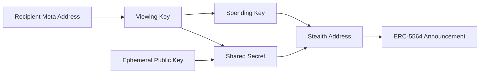

## 8.3 Recipient Privacy

> **Question:** Can observers determine the recipient of a payment?

Recipient privacy concerns whether an observer can identify the intended receiver of a transfer.

In conventional account-based systems, recipient addresses appear directly within transactions and often accumulate long-lived histories that can be linked to real-world identities.

GhostShard replaces persistent recipient addresses with disposable stealth addresses derived uniquely for each output. Consequently, recipients do not appear directly on-chain during transaction execution.

---

### 8.3.1 Announcement and Discovery

Every output shard created during mesh execution is accompanied by an ERC-5564 announcement.

The announcement contains:

* The newly derived stealth address.
* The sender's ephemeral public key.
* Encrypted metadata required for recipient discovery.

Announcements are publicly visible and are emitted as part of normal protocol operation.

However, visibility of an announcement does not imply visibility of its recipient.

An observer can determine that a shard was created, but cannot determine who owns that shard. Recipient discovery requires information available only to the intended recipient.

As a result, announcements reveal ownership creation without revealing ownership attribution.

---

### 8.3.2 Recipient Attribution Resistance

Recipient privacy derives from the stealth-address construction described in Chapter 5.

Each output is associated with a uniquely derived stealth address that can be recognized only by parties possessing the appropriate viewing key.

Because fresh randomness is used for every output:

* Payments sent to the same recipient produce unrelated on-chain addresses.
* Multiple outputs cannot be reliably linked to the same recipient.
* Recipient identities cannot be inferred from observed stealth addresses.

An observer therefore lacks a reliable method for mapping observed outputs to recipient identities.

---

### 8.3.3 Encrypted Announcement Metadata

The metadata associated with each announcement is encrypted before publication.

As described in Chapter 5, only parties capable of reconstructing the corresponding shared secret can decrypt the announcement contents.

To external observers, announcement metadata appears as authenticated ciphertext.

Consequently, observers cannot determine:

* Asset-specific transfer information.
* Recipient-specific transfer information.
* The contents of the announcement payload.

The announcement reveals that ownership was created, but not the context associated with that ownership.

---

### 8.3.4 Absence of Public Recipient Resolution

GhostShard does not maintain a public ownership registry.

Meta-addresses do not participate directly in transaction execution and are not required to be publicly associated with identities.

As a result, observers lack any authoritative mechanism for resolving stealth addresses back to recipient identities.

Even if a stealth address is observed, there is no public mapping that allows an observer to determine who controls it.

---

### 8.3.5 Observer Knowledge

Given an arbitrary ERC-5564 announcement, an external observer can determine:

* That a new shard was created.
* The stealth address associated with that shard.
* The ephemeral public key used during derivation.
* That encrypted metadata exists.

However, the observer cannot reliably determine:

* Which recipient owns the shard.
* Which meta-address the shard belongs to.
* Whether multiple announcements belong to the same recipient.
* The contents of the encrypted metadata.

Recipient attribution therefore remains computationally infeasible under the assumptions described in Chapter 5.
