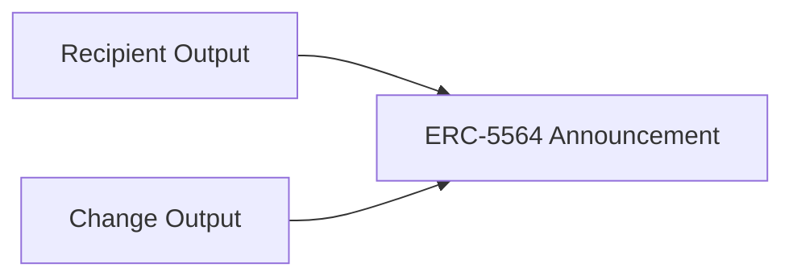

## 8.4 Recipient–Change Ambiguity

> **Question:** Given a mesh transaction's outputs, can an observer determine which outputs represent payments and which represent change?

Recipient–change ambiguity is one of GhostShard's primary privacy properties.

Even when all outputs of a mesh transaction are publicly visible, an observer cannot reliably determine which outputs belong to transaction recipients and which outputs return value to the sender. Because recipient outputs and change outputs are created using the same cryptographic construction and announced through the same protocol mechanisms, they appear indistinguishable on-chain.

---

### 8.4.1 Output Partition Ambiguity

Consider a mesh transaction that creates (M) output shards.

From an observer's perspective, the outputs must be divided into two categories:

1. Recipient outputs.
2. Sender change outputs.

Without additional information, every non-empty partition of the output set is a plausible interpretation.

The number of valid partitions is:

$$
N_{\text{partitions}}=2^M - 2
$$

where the subtraction of two excludes the trivial cases in which all outputs are interpreted as recipient outputs or all outputs are interpreted as change outputs.

The ambiguity grows exponentially with the number of outputs.

| Outputs ((M)) | Valid Partitions |
| ------------- | ---------------- |
| 2             | 2                |
| 4             | 14               |
| 6             | 62               |
| 8             | 254              |
| 10            | 1022             |

Even modest output counts therefore generate a large number of plausible ownership interpretations.

---

### 8.4.2 Multi-Recipient Ambiguity

Future versions of GhostShard may support batching payments to multiple recipient meta-addresses within a single mesh transaction.

In that setting, ambiguity extends beyond identifying recipient outputs versus change outputs.

Suppose an observer somehow knew which outputs belonged collectively to recipients. The observer would still be unable to determine how those outputs should be grouped into recipient ownership domains.

Given $(R)$ recipient-owned outputs, the number of possible ownership partitions is given by the Bell number:

$$
B_R
$$

The first few Bell numbers are:

| Recipient Outputs ($(R)$) | Bell Number ($(B_R)$) |
| ----------------------- | ------------------: |
| 1                       |                   1 |
| 2                       |                   2 |
| 3                       |                   5 |
| 4                       |                  15 |
| 5                       |                  52 |
| 6                       |                 203 |
| 7                       |                 877 |
| 8                       |               4,140 |

For example, three recipient-owned outputs $({A,B,C})$ can correspond to:

$$
({A,B,C})
$$

$$
({A}),({B,C})
$$

$$
({B}),({A,C})
$$

$$
({C}),({A,B})
$$

$$
({A}),({B}),({C})
$$

Thus:

$$
B_3 = 5
$$

Even if recipient-owned outputs could somehow be isolated, the ownership structure of those outputs remains ambiguous.

---

### 8.4.3 Amount Ambiguity

Even if an observer could correctly identify which outputs belong collectively to recipients and which belong collectively to change, a further inference problem remains:

> Which outputs collectively represent the logical payment amount?

GhostShard does not represent payments as single outputs.

Instead, value may be fragmented across multiple recipient-owned shards and multiple change shards. Consequently, observers cannot assume that any individual output corresponds directly to the transferred amount.

For a transaction producing a recipient-owned output set:

$$
R = \{r_1,r_2,\dots,r_n\}
$$

the observer must determine which subset of outputs represents the actual payment amount and which subsets represent ownership fragmentation.

This introduces an additional combinatorial search problem.

Given $(n)$ recipient-owned outputs, the number of possible non-empty output combinations is:

$$
N_{\text{amount}}=
2^n - 1
$$

Each combination represents a plausible interpretation of the logical payment value.

For example, consider four recipient-owned outputs:

$$
\{A,B,C,D\}
$$

An observer must consider:

$$
\{A\}
$$

$$
\{B\}
$$

$$
\{A,B\}
$$

$$
\{A,C,D\}
$$

and every other non-empty subset as a potential payment composition.

Consequently, identifying recipient-owned outputs does not automatically reveal the transferred amount.

Amount reconstruction therefore becomes a separate inference problem layered on top of recipient–change ambiguity and ownership ambiguity.

This ambiguity is particularly important because many blockchain-analysis techniques rely on value matching and arithmetic conservation to trace ownership relationships across transactions.

GhostShard intentionally weakens such analysis by allowing ownership value to be fragmented across multiple independent shards.

As a result, observers must determine:

1. Which outputs belong to recipients.
2. Which recipient outputs belong to the same owner.
3. Which subsets of those outputs collectively represent a logical payment amount.

Each stage compounds the uncertainty of the previous stage.

---

### 8.4.3 Structural Indistinguishability

The combinatorial ambiguity described above is meaningful only because recipient outputs and change outputs are structurally indistinguishable.

GhostShard achieves this through several mechanisms.

#### Uniform Announcement Format

Every output is announced through the same ERC-5564 announcement structure.

No field identifies whether an output represents a payment or change.

#### Uniform Cryptographic Construction

Recipient outputs and change outputs are derived using the same stealth-address construction described in Chapter 5 and Section 8.1.

Both use:

* ECDH-derived shared secrets.
* Identical address derivation procedures.
* Identical announcement formats.

Consequently, output addresses reveal no ownership role.

#### Encrypted Metadata

Announcement metadata is encrypted before publication.

Observers cannot inspect ownership information, recipient information, or transfer details contained within announcements.

#### Output Randomization

Output ordering carries no semantic meaning.

Observers cannot infer ownership roles from transaction layout or output position.
