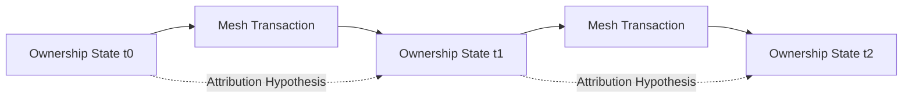

## 8.5 Wallet Reconstruction Resistance

> **Question:** Can an observer reconstruct a user's ownership graph over time?

Wallet reconstruction resistance is not an independent privacy mechanism. It emerges from the interaction of ownership unlinkability, sender privacy, recipient privacy, and recipient–change ambiguity.

However, GhostShard introduces an additional property:

> Ownership attribution does not accumulate over time.

In conventional account-based systems, ownership information compounds. Every new transaction adds information to an existing ownership graph. Addresses persist, balances accumulate, and historical observations remain useful indefinitely.

GhostShard behaves differently.

Each shard is a disposable ownership object that is consumed exactly once. When a shard is spent, the previous ownership state is destroyed and replaced by newly derived shards.

As a result, ownership observations do not naturally carry forward through time.

---

### 8.5.1 Temporal Fragmentation

Consider an observer attempting to track a user across multiple transactions.

At time $(t_0)$ the observer may identify a set of candidate shards.

At time $(t_1)$ those shards are consumed and replaced by new output shards.

To continue tracking ownership, the observer must determine:

* Which outputs belong to recipients.
* Which outputs belong to change.
* Which ownership transitions occurred.
* Which newly created shards remain under the original owner's control.

Because these questions cannot be answered deterministically, ownership attribution becomes increasingly uncertain after each transaction.

Each transition introduces additional uncertainty.

---

### 8.5.2 Non-Accumulating Ownership Information

Traditional blockchain analytics relies on the assumption that ownership information compounds over time.

GhostShard breaks this assumption.

Even if an observer develops a plausible ownership hypothesis for one transaction, subsequent transactions continuously fragment that hypothesis through:

* Disposable ownership.
* Stealth-address derivation.
* Recipient–change ambiguity.
* Independent output construction.

Ownership attribution therefore does not become progressively easier as transaction history grows.

Instead, uncertainty compounds alongside protocol activity.

---

### 8.5.3 Observer Knowledge

An observer may construct ownership hypotheses.

However, the observer cannot reliably determine:

* The complete set of shards controlled by a user.
* The historical ownership path connecting multiple shards.
* The future ownership state resulting from a transaction.
* The total balance controlled by a specific ownership domain.

Consequently, wallet reconstruction remains an inference problem rather than a graph-analysis problem.

Under the assumptions described in Chapter 5, ownership relationships become increasingly difficult to reconstruct as ownership transitions accumulate over time.
