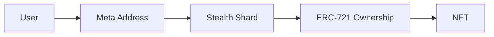

## 8.6 NFT Privacy

> **Question:** Can an observer determine which NFTs a user owns or track NFT ownership over time?

NFT privacy presents unique challenges because NFTs are indivisible, uniquely identifiable assets with publicly visible ownership records on transparent blockchains.

In conventional ERC-721 systems, ownership is permanently exposed through the `ownerOf(tokenId)` mapping. Anyone can query the current owner of a token and reconstruct ownership history through transfer events.

GhostShard changes the ownership layer rather than the NFT itself.

NFTs remain standard ERC-721 assets, but ownership is held by disposable stealth-address shards rather than publicly identifiable accounts.

---

### 8.6.1 NFT Ownership Privacy

When an NFT is deposited into GhostShard, ownership is transferred to a shard address.

From the perspective of the ERC-721 contract:

* The NFT is owned by the shard.
* The shard appears as an ordinary address.
* No relationship exists between the shard and the owner's meta-address.

Because shard addresses are derived through the stealth-address construction described in Chapter 5 and Section 8.1, observers cannot determine which user controls the NFT.

An observer can identify the address currently holding the NFT but cannot determine the identity behind that address.

---

### 8.6.2 NFT Transfer Privacy

NFT transfers inside GhostShard occur through mesh execution.

When an NFT moves between ownership domains:

1. The input shard is consumed.
2. A new output shard is created.
3. Ownership is transferred to the new shard.
4. The new shard is announced through ERC-5564.

Observers can see that ownership moved from one shard address to another.

However, they cannot determine:

* Who owned the original shard.
* Who owns the new shard.
* Whether the transfer was a payment, a self-transfer, or a change operation.
* Whether the transfer occurred between different users.

Ownership transitions remain visible, but ownership attribution remains hidden.

---

### 8.6.3 Portfolio Reconstruction Resistance

NFT portfolio analysis normally relies on ownership clustering.

If multiple NFTs belong to addresses that can be linked to the same owner, observers can reconstruct a user's complete collection.

GhostShard disrupts this process.

Each NFT may reside in an independent shard:

* Different NFTs may be held by different stealth addresses.
* Shards possess no observable ownership relationship.
* Ownership does not accumulate into a persistent account.

Consequently, observers cannot reliably determine:

* How many NFTs a user owns.
* Which NFTs belong to the same owner.
* The complete NFT holdings associated with a particular user.

Portfolio reconstruction therefore reduces to the broader wallet-reconstruction problem discussed in Section 8.5.

---

### 8.6.4 Asset-Type Confidentiality

GhostShard encrypts announcement metadata before publication.

As discussed in Chapter 5 and Section 8.3, asset-specific information is contained within encrypted announcement metadata that can only be decrypted by the intended recipient.

As a result, observers cannot determine:

* The asset type associated with an output.
* The token contract involved.
* NFT-specific metadata.
* Token identifiers associated with newly created shards.

To an external observer, output announcements appear as uniformly structured encrypted objects.

This means that NFT outputs are indistinguishable from other asset outputs at the announcement layer.

---

### 8.6.5 Observer Knowledge

An observer can determine:

* That an NFT exists.
* The shard address currently holding the NFT.
* That ownership moved between shard addresses.
* The public transfer history recorded by the underlying ERC-721 contract.

However, the observer cannot reliably determine:

* Which user owns the NFT.
* Which meta-address controls the holding shard.
* Whether multiple NFTs belong to the same owner.
* The complete NFT portfolio of a user.
* The ownership relationships between NFT-holding shards.

Under the assumptions described in Chapter 5, NFT ownership remains hidden behind the same stealth-address and ownership-fragmentation mechanisms that protect fungible assets.