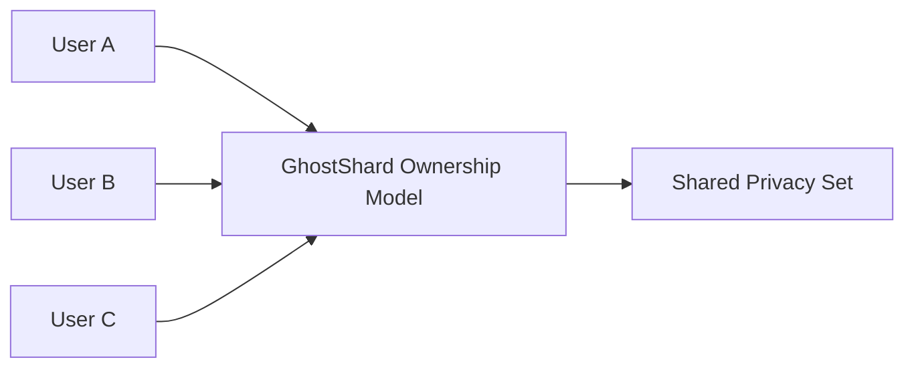

## 8.8 Privacy Set Growth

> **Question:** How do GhostShard's privacy guarantees evolve as protocol adoption increases?

Unlike privacy systems that rely on optional privacy pools or specialized transaction types, GhostShard embeds privacy directly into its ownership model.

As protocol participation grows, the set of plausible ownership interpretations available to an observer grows as well. Additional users, shards, and transactions increase uncertainty rather than reducing it.

---

### 8.8.1 Privacy by Architectural Default

GhostShard does not distinguish between "private users" and "normal users."

Every deposit creates shards.

Every transfer creates stealth-address outputs.

Every recipient discovers ownership through the same announcement mechanism.

As a result, all users participate in the same privacy system automatically.

There is no separate privacy pool, shielded mode, or alternate transaction format.

The protocol therefore avoids the anonymity fragmentation that often occurs when privacy features are optional.

---

### 8.8.2 Ownership Population Growth

Ownership unlinkability depends on the number of plausible owners that could control a shard.

Let

$$
U
$$

denote the number of protocol participants.

For an observed shard, an external observer must consider all users as potential owners.

Consequently, the ownership anonymity set grows approximately with protocol adoption:

$$
A_{\text{owner}}
\propto
U
$$

As additional users join the system, ownership attribution becomes increasingly uncertain.

---

### 8.8.3 Shard Population Growth

Each new deposit creates additional ownership objects.

Let

$$
N
$$

denote the number of active shards visible within the system.

Every additional shard introduces new ownership possibilities and increases the difficulty of ownership clustering.

Because shards are independently derived and disposable, increases in shard count do not create stronger ownership signals.

Instead, they expand the space of possible ownership assignments.

---

### 8.8.4 Transaction Growth

Every mesh transaction introduces additional ownership transitions and output interpretations.

As transaction volume increases:

* More stealth addresses are created.
* More announcements are emitted.
* More ownership paths become possible.
* More recipient-versus-change interpretations emerge.

Consequently, the number of plausible transaction interpretations grows significantly faster than transaction count itself.

Observers are therefore required to evaluate an increasingly large set of candidate ownership histories.

---

### 8.8.5 Growth Dynamics

| Growth Factor         | Privacy Effect                   |
| -------------------- | -------------------------------- |
| More users            | Larger ownership anonymity set   |
| More shards           | Greater ownership ambiguity      |
| More transactions     | More ownership interpretations   |
| More announcements    | More candidate recipients        |
| Uniform participation | No identifiable privacy subgroup |

---

GhostShard's privacy model strengthens as adoption increases.

Additional protocol activity expands the space of plausible ownership interpretations available to an observer, making attribution, clustering, and ownership reconstruction progressively more difficult over time.
