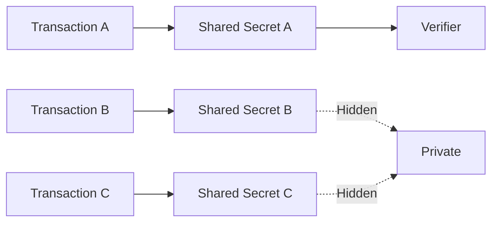
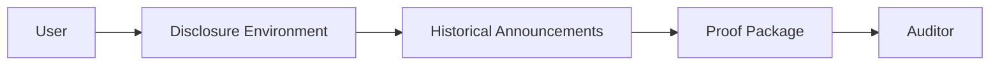
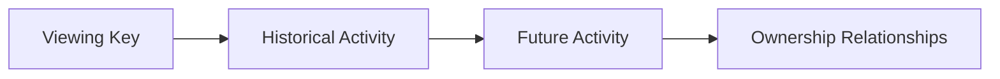

# 9. Selective Disclosure

> **Question:** How can a user or institution prove specific transactions without exposing unrelated financial activity?

Chapter 5 introduced the cryptographic foundations that make selective disclosure possible: metadata confidentiality (Section 5.6), transaction-scoped shared secrets (Section 5.7), and deterministic shared-key derivation (Section 5.8).

This chapter examines how those mechanisms can be used in practice to satisfy auditing, accounting, regulatory, and compliance requirements while preserving ownership privacy.

The core design principle is simple:

> Disclosure should be proportional to what is being verified.

Proving a single payment should not require revealing an entire transaction history.

---

## 9.1 Viewing Keys Are Not Disclosure Mechanisms

GhostShard intentionally distinguishes between **transaction proofs** and **viewing keys**.

A transaction proof reveals information about a specific transfer.

A viewing key reveals the ability to discover ownership.

Possession of a viewing key allows an observer to:

* Discover announcements intended for the owner.
* Reconstruct announcement shared secrets.
* Decrypt associated metadata.
* Correlate activity across time.

As a result, a viewing key may reveal:

* Historical announcements.
* Future announcements.
* Ownership relationships.
* Transaction patterns.
* Counterparty activity.

GhostShard v0 provides no mechanism for viewing-key rotation, revocation, or time-bounded access. Once disclosed, a viewing key effectively grants permanent visibility into future activity associated with that identity.

For institutions, such disclosure is often unacceptable. A viewing key can expose operational spending, revenue streams, customer relationships, and strategic activity far beyond the scope of a typical audit.

For this reason, GhostShard does not consider viewing-key sharing to be a selective disclosure mechanism.

Viewing-key disclosure should be treated as an exceptional procedure reserved for situations where complete transparency is legally required.

---

## 9.2 Transaction-Level Disclosure

GhostShard's primary disclosure mechanism is the **transaction proof**.

Every announcement derives its own ECDH shared secret using a unique ephemeral key. Consequently, each transaction creates an independent cryptographic disclosure boundary.

Knowledge of one transaction's shared secret provides no computational advantage in deriving the shared secret of any other transaction.

To prove a payment, the user discloses:

1. The relevant announcement.
2. The associated metadata.
3. The information required to reconstruct and verify that announcement.

The verifier can independently confirm:

* That the announcement exists on-chain.
* That the metadata is authentic.
* That the announcement corresponds to the claimed payment.
* That the disclosed information decrypts correctly.

No additional announcements become visible.

No ownership graph is revealed.

No account-level access is granted.

Disclosure remains limited to the transaction being verified.

### Compliance Applications

Transaction-level disclosure supports a variety of practical workflows.

#### Payment Verification

A recipient can prove receipt of a specific payment without revealing unrelated transfers.

#### Invoice Reconciliation

Businesses can associate individual payments with invoices while preserving privacy for other customers and transactions.

#### Accounting Evidence

Organizations may attach disclosure artifacts to accounting records, allowing auditors to verify specific transactions without obtaining visibility into broader financial activity.

#### Regulatory Requests

Where regulators require evidence for a particular transfer, users may disclose only the requested transaction rather than exposing an entire transaction history.

---

## 9.3 Disclosure Hierarchy

GhostShard supports multiple levels of disclosure, each corresponding to a different scope of visibility.

| Tier                            | Scope                       | Mechanism                        | Status           |
| ------------------------------- | --------------------------- | -------------------------------- | ---------------- |
| Transaction Proof               | Single payment              | Transaction-scoped shared secret | v0               |
| Delegated Historical Disclosure | Bounded transaction history | Trusted disclosure environment   | v0               |
| Full Audit                      | Complete visibility         | Viewing-key disclosure           | v0 (last resort) |

The hierarchy is designed around the principle of minimum necessary disclosure.

---

### Tier 1: Transaction Proof

Transaction proofs are the default disclosure mechanism in GhostShard v0.

The verifier learns only the information associated with a single announcement.

This level is sufficient for:

* Payment verification.
* Invoice reconciliation.
* Accounting workflows.
* Counterparty disputes.
* Most routine compliance obligations.

---

### Tier 2: Delegated Historical Disclosure

Some compliance workflows require visibility into a bounded set or full historical transactions rather than a single payment.

Examples include:

* Quarterly audits.
* Tax reporting periods.
* Counterparty-specific transaction histories.
* Internal compliance reviews.

A naive solution would be to share the viewing key directly.

GhostShard discourages this approach because viewing keys grant unrestricted ownership-discovery capability and expose both historical and future activity.

Instead, GhostShard v0 can support delegated historical disclosure through a trust-minimized disclosure environment.

Examples include:

* Trusted Execution Environments (TEEs)
* Hardware Security Modules (HSMs)
* Multi-Party Computation (MPC) systems
* Dedicated disclosure services

The viewing key remains inside the disclosure environment and is never revealed to the auditor.

The disclosure environment reconstructs only the requested or full transaction set and produces a proof package for the auditor.

The auditor receives:

* Verified transaction records.
* Decrypted metadata.
* Supporting cryptographic evidence.

The auditor does not receive:

* The viewing key.
* Ownership discovery capabilities.
* Visibility into future announcements.
* Access to unrelated transaction history.

This allows institutions to satisfy bounded disclosure requirements without permanently exposing ownership information.

Importantly, this capability exists in v0 because the disclosure environment performs reconstruction on behalf of the auditor rather than granting the auditor direct ownership-discovery capability.

#### Future Enhancements

Future versions of GhostShard may further reduce trust assumptions through:

* Zero-knowledge disclosure proofs.
* Time-bounded viewing permissions.
* Revocable auditor credentials.
* Epoch-based disclosure keys.
* MPC disclosure networks.

These mechanisms can reduce reliance on trusted disclosure environments, but they are not required for bounded historical disclosure.

---

### Tier 3: Full Audit

The final disclosure tier is direct viewing-key disclosure.

This grants visibility into:

* Historical announcements.
* Future announcements.
* Ownership relationships.
* Transaction activity patterns.

Because viewing keys provide broad ownership-discovery capabilities, this tier should be reserved for situations in which complete transparency is legally mandated and no narrower disclosure mechanism satisfies the requirement.

Viewing-key disclosure should therefore be treated as an exceptional operational procedure rather than a normal compliance workflow.

---

## 9.4 Regulatory Considerations

Privacy and compliance are often portrayed as competing objectives.

GhostShard adopts a different position:

> Compliance should require evidence of relevant activity, not unrestricted surveillance of unrelated activity.

Most regulatory processes focus on verifying specific events rather than monitoring every transaction performed by a participant.

Selective disclosure supports this model directly.

### Minimal Disclosure

The protocol allows users to reveal exactly the information required to verify a claim and nothing more.

A single payment requires a single transaction proof.

A bounded audit requires bounded disclosure.

Complete visibility is reserved for exceptional cases.

### User-Controlled Visibility

Disclosure remains under the control of the asset owner.

No third party obtains visibility beyond what has been explicitly authorized.

### Institutional Compatibility

Transaction histories often contain commercially sensitive information, including:

* Revenue streams.
* Supplier relationships.
* Customer activity.
* Strategic business operations.

GhostShard allows institutions to demonstrate the existence and validity of specific transactions without exposing unrelated financial activity.

### Proportionality by Construction

The disclosure hierarchy is enforced through cryptographic boundaries rather than organizational trust.

Each disclosure tier exposes only the scope of information associated with that tier.

As a result, disclosure naturally scales with the compliance objective being satisfied.

---

## 9.5 Summary

GhostShard separates ownership privacy from transaction verifiability.

Rather than granting account-level visibility, the protocol enables transaction-scoped disclosure through independent cryptographic boundaries created during announcement generation.

The result is a disclosure model in which users and institutions can prove specific payments, satisfy auditing requirements, and support regulatory workflows without exposing unrelated ownership information.

Future versions may extend this model with bounded-history proofs, delegated disclosure systems, and zero-knowledge auditing mechanisms. However, the fundamental principle remains unchanged:

> Reveal only what must be proven, and nothing more.
