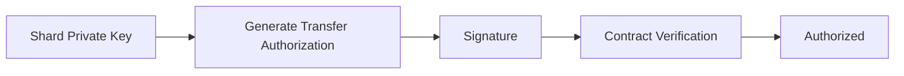
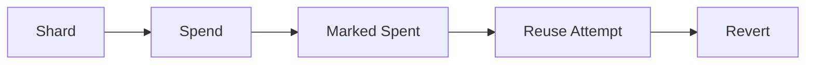
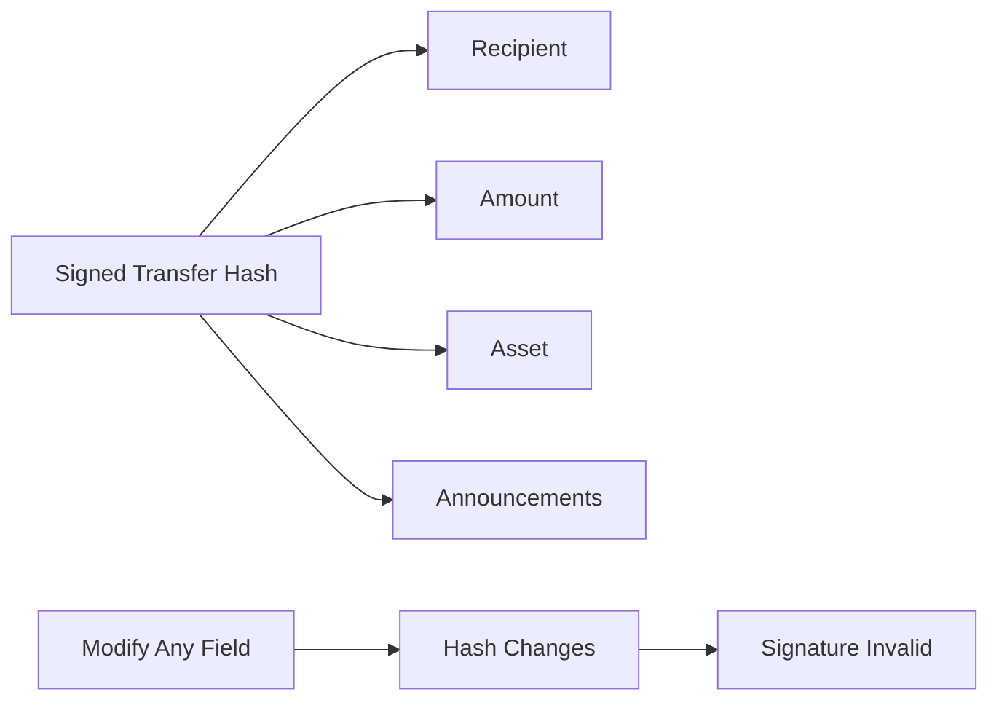
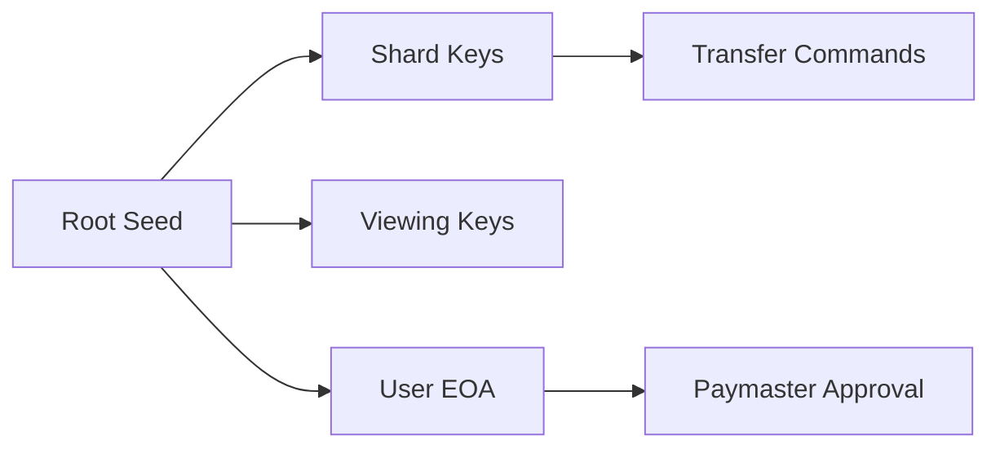

## 10.2 Authorization Security

> **Question:** Can an attacker spend assets they do not control?

Under the security assumptions defined in Section 10.1, the answer is no.

GhostShard's authorization architecture is designed such that asset movement requires possession of the private key corresponding to the shard being spent. Neither relayers, paymasters, builders, routers, nor other infrastructure participants can authorize transfers on behalf of a shard owner.

This section analyzes the mechanisms that enforce authorization ownership, prevent replay attacks, constrain authorization scope, and resist signature misuse.

---

### 10.2.1 Authorization Ownership

Every transfer command must be authorized by the private key corresponding to the shard being consumed.

Let

$$
H = \operatorname{Keccak256}
\left(
\operatorname{abi.encode}
(
chainId,
routerAddress,
shardAddress,
assetType,
token,
to,
value,
announcements
)
\right)
$$

The transfer authorization is then:

$$
\sigma = \operatorname{EIP191Sign}(H, shardPrivateKey)
$$

On-chain verification recovers the signer from the EIP-191 signature and requires it to match the shard being spent:

$$
[
\operatorname{Recover}
\Big(
\operatorname{EthSignedMessageHash}(H),
\sigma
\Big)=
S
]
$$

where:

* $(H)$ is the transfer-command hash.
* $(\sigma)$ is the EIP-191 signature.
* $(S)$ is the shard address being consumed.

Only the holder of the private key corresponding to $(\S)$ can produce a signature that satisfies this equality.

The authorization flow is therefore:

Only the holder of `shardPrivateKey` can produce a signature that recovers to `cmd.shard`.

Neither the relayer, paymaster, router, nor block builder possesses this key.

Consequently, an attacker cannot authorize asset movement without compromising the shard's private key itself.

This property ultimately relies on the unforgeability of ECDSA signatures over secp256k1.

---

### 10.2.2 Replay Resistance

GhostShard employs multiple independent replay-prevention mechanisms.

#### Permanent Replay Prevention

Each shard functions as a one-time-use ownership object.:

After successful execution, the shard is permanently marked as spent:

$$
\texttt{isShardSpent}[s] \leftarrow \texttt{true}
$$

where (s) denotes the shard being consumed.

Any subsequent attempt to consume the same shard causes execution to revert:

$$
\texttt{isShardSpent}[s] = \texttt{true}
;\Longrightarrow;
\texttt{revert}(\texttt{ShardAlreadySpent})
$$

The shard can therefore be spent at most once.

---

#### Authorization Replay Prevention

Replay protection also exists at the EIP-7702 layer.

Each authorization:

* Ghost Shard v0 Uses nonce `0`.
* Delegates to a specific implementation contract.
* Is bound to a specific chain.

Consequently, an authorization cannot be:

* Replayed on another chain.
* Replayed against another contract.
* Reused after shard consumption.

Authorization validity therefore terminates with the lifecycle of the shard itself.

---

### 10.2.3 Authorization Scope Binding

A valid authorization permits exactly one action.

The signed transfer hash commits to:

* `chainId`
* `routerAddress`
* `shardAddress`
* `assetType`
* `token`
* `to`
* `value`
* `announcements`

Any modification produces a different hash:
$$
[
H' \neq H
]
$$

which invalidates the corresponding signature.

As a result, an attacker cannot:

* Substitute recipients.
* Modify transfer amounts.
* Replace assets.
* Alter announcement sets.
* Redirect outputs.
* Execute the authorization against another contract.

The authorization remains cryptographically bound to the exact transfer intended by the signer.

---

### 10.2.4 Cross-Transaction Reuse Attacks

An attacker observing a valid transfer command may attempt to reuse it in a separate transaction.

Such attacks fail for three independent reasons.

#### Shard Consumption

The shard has already been marked spent:

$$
[
isShardSpent[s] = true
]
$$

Execution therefore reverts immediately.

#### Authorization Consumption

The corresponding EIP-7702 delegation is tied to a one-time-use shard lifecycle.

Once the shard is consumed, the authorization has no remaining utility.

#### Bundle Binding

Paymaster sponsorship commits to the specific bundle being sponsored.

Commands extracted from one bundle cannot be inserted into another without invalidating sponsorship approval.

Consequently, observing a valid transaction does not yield reusable authorization material.

---

### 10.2.5 Signature Phishing Resistance

GhostShard deliberately separates authorization responsibilities across multiple cryptographic domains.

| Scheme                   | Type             | Signed By | Purpose              |
| ------------------------ | ---------------- | --------- | -------------------- |
| EIP-7702 Authorization   | Type 0x05        | Shard Key | Delegation           |
| EIP-191 Transfer Command | Personal Message | Shard Key | Asset Transfer       |
| EIP-191 User Bundle      | Personal Message | User EOA  | Sponsorship Approval |

Each scheme uses a distinct encoding format and execution context.

#### Cross-Scheme Separation

EIP-7702 authorizations:

* Use transaction type `0x05`.
* Use RLP encoding.
* Authorize delegation.

EIP-191 signatures:

* Use the Ethereum signed-message domain.
* Authorize application-specific actions.

Therefore:

* An EIP-191 signature cannot be interpreted as an EIP-7702 authorization.
* An EIP-7702 authorization cannot be interpreted as a transfer command.
* A transfer command cannot be interpreted as a sponsorship approval.

Cryptographic domain separation prevents cross-scheme replay and signature confusion attacks.

---

#### Key Separation

GhostShard further separates authorization authority across distinct key classes.

Transfer commands are signed by shard keys.

Paymaster approvals are signed by the user's EOA.

Compromise of one authorization context does not automatically compromise another.

---

#### Wallet-Level Phishing

GhostShard's cryptographic protections do not eliminate UI-level deception.

A malicious website may attempt to misrepresent transaction details and induce a user to sign a valid authorization.

Users should therefore verify:

* Router address.
* Chain identifier.
* Recipient information.
* Sponsorship details.

before signing.

Such attacks target wallet interfaces rather than the protocol itself and are discussed further in Section 10.7.

---

### 10.2.6 Authorization Visibility

EIP-7702 authorizations are publicly visible within transaction authorization lists.

Observers can therefore determine:

* Which shards participated in execution.
* Which shards delegated execution authority.

However, visibility does not imply control.

An observer who sees an authorization still lacks:

* The shard private key.
* A valid transfer-command signature.
* The ability to generate new authorizations.

Authorization visibility therefore creates no direct spending vulnerability.

At most, it reveals participation of a shard in a transaction, a privacy consideration discussed separately in Chapter 8.
