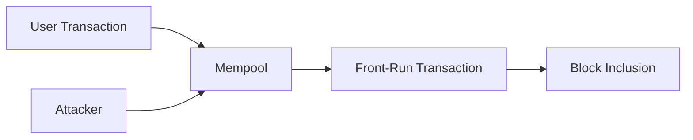
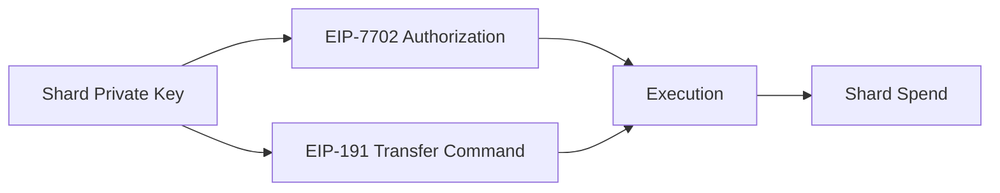
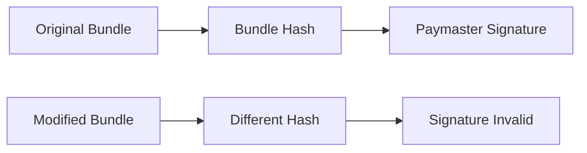
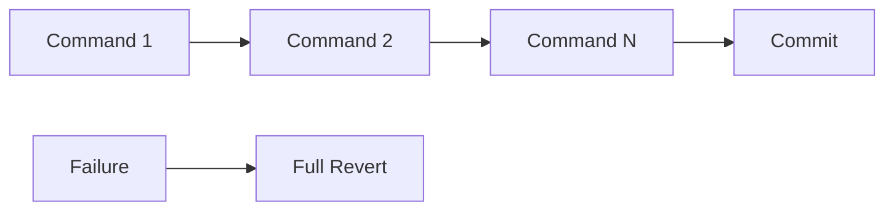

## 10.3 Front-Running and Transaction Ordering

> **Question:** Can transaction ordering compromise the security of GhostShard?

Transaction-ordering attacks are a common source of value extraction in public blockchain systems. In conventional account-based transactions, an adversary may observe a pending transaction, copy its parameters, and submit a competing transaction with a higher fee in an attempt to capture value or alter execution outcomes.

GhostShard's authorization architecture significantly limits the effectiveness of such attacks because transaction execution depends on ownership-bound signatures and one-time-use shards rather than publicly observable transaction intent alone.

This section analyzes front-running, authorization theft, bundle manipulation, mempool observation, and transaction reordering.

---

### 10.3.1 Front-Running Resistance

A front-running attack typically follows a simple pattern:

The attacker observes a pending transaction, copies its parameters, modifies the fee, and attempts to execute first.

This strategy is ineffective against GhostShard.

A mesh transaction spends specific shards that are controlled by specific private keys.

Even if an attacker observes every transaction parameter, they still cannot:

* Produce valid shard signatures.
* Modify transfer destinations.
* Alter announcement outputs.
* Substitute recipients.
* Redirect funds.

The attacker may copy the transaction, but they cannot produce the required authorizations.

Ownership remains the controlling factor rather than transaction ordering.

---

### 10.3.2 Authorization Theft Resistance

GhostShard separates delegation authority from spending authority.

An observed EIP-7702 authorization does not grant control over assets.

The authorization only delegates execution authority to the GhostShard implementation contract.

Actual asset movement requires a separate transfer command signed by the shard owner.

The authorization flow is:

Successful execution requires both components.

An attacker who observes an authorization still lacks:

* The shard private key.
* The transfer-command signature.
* The ability to create valid spending instructions.

Furthermore, because shards are single-use objects, even a copied authorization becomes useless once the shard has been consumed.

Authorization visibility therefore does not translate into authorization theft.

---

### 10.3.3 Mempool Observation

Relayers, builders, searchers, and other infrastructure participants may observe pending mesh transactions before inclusion.

Such observers may learn:

* Bundle contents.
* Announcement structures.
* Sponsorship information.
* Gas parameters.
* Transaction timing.

However, observation alone does not provide spending capability.

The observer cannot:

* Forge shard signatures.
* Modify transfer commands.
* Redirect assets.
* Create new valid announcements.
* Recover viewing keys.

The information exposed through mempool visibility is therefore operational rather than authorization-related.

This distinction is important:

> Observing a transaction is not equivalent to controlling a transaction.

GhostShard assumes mempool visibility is possible and remains secure under that assumption.

---

### 10.3.4 Bundle Manipulation Resistance

A malicious relayer may attempt to alter a transaction bundle before broadcasting it.

Potential modifications include:

* Adding commands.
* Removing commands.
* Reordering commands.
* Replacing announcements.
* Modifying outputs.

GhostShard prevents such manipulation through bundle binding.

The sponsorship approval commits to the exact command set and announcement set.

Conceptually:

$$
B =
H(\text{commands})
||
H(\text{announcements})
$$

where:

* (H(\text{commands})) is the hash of the command array.
* (H(\text{announcements})) is the hash of the announcement array.

The paymaster signature is generated over these values.

Any modification changes the committed bundle hash and invalidates sponsorship approval.

As a result, a relayer cannot successfully alter transaction contents without causing execution to fail.

---

### 10.3.5 Transaction Reordering

A block producer may reorder transactions before inclusion.

This capability is unavoidable on public blockchains.

The relevant question is whether reordering creates a security vulnerability.

For GhostShard, the answer is generally no.

Within a mesh transaction:

* Commands are executed atomically.
* Authorization validity is independent of ordering.
* Each shard is consumed at most once.
* Partial execution is impossible.

The execution model is:

Either:

* Every command succeeds, or
* The entire transaction reverts.

There is no intermediate state in which an attacker can insert a competing operation between commands.

Consequently, transaction ordering does not create a path to unauthorized asset movement.

---

### 10.3.6 MEV Considerations

Although front-running does not compromise ownership security, infrastructure participants may still attempt to extract value through transaction observation.

Examples include:

* Transaction censorship.
* Delayed inclusion.
* Selective bundle forwarding.
* Priority manipulation.

These attacks affect transaction execution quality rather than authorization correctness.

Users may reduce exposure through:

* Private RPC infrastructure.
* Self-relaying.
* Multiple relayer options.
* Alternative sponsorship providers.

Because no single relayer is required for protocol operation, users retain the ability to route transactions through alternative infrastructure when necessary.
