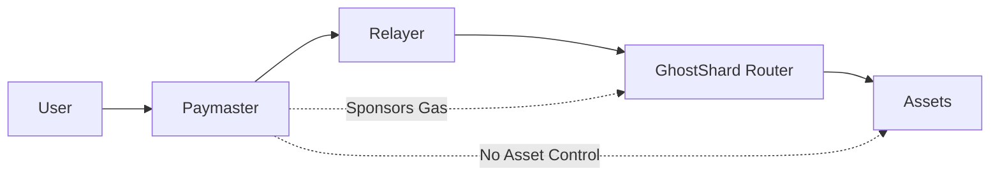
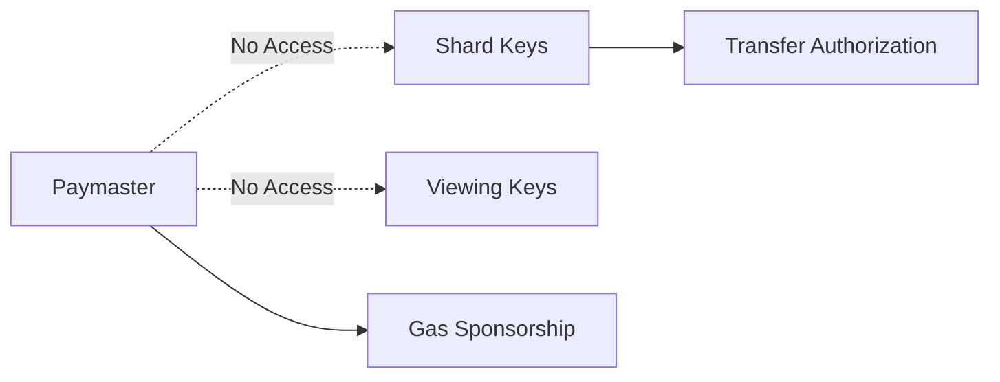
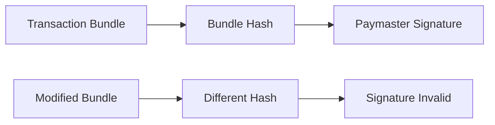
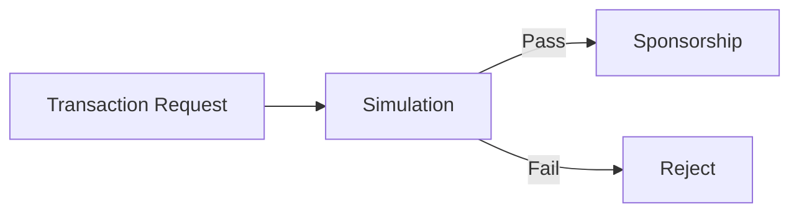
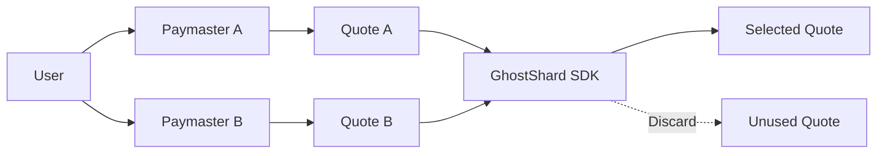

## 10.4 Paymaster Security

> **Question:** Can users abuse, drain, or otherwise compromise sponsorship infrastructure?

This section analyzes the trust assumptions, attack surfaces, and economic security properties of the GhostShard paymaster model.

The primary objective is to ensure that sponsorship infrastructure can participate in transaction execution without gaining authority over user assets, while simultaneously preventing users from imposing unbounded costs on sponsoring entities.

---

### 10.4.1 Security Model

The paymaster occupies a unique position within the GhostShard architecture.

It participates in transaction execution by providing gas sponsorship, but it does not participate in asset ownership, authorization generation, or shard control.

This separation creates an important security boundary:

* Sponsorship authority is distinct from spending authority.
* Sponsorship approval does not grant asset access.
* Sponsorship approval does not grant transfer authority.
* Sponsorship compromise cannot directly result in asset theft.

As a result, the paymaster may influence transaction execution but cannot independently move user funds.

---

### 10.4.2 Trust Assumptions

GhostShard assumes that a paymaster:

* Validates sponsorship requests before approval.
* Simulates execution before accepting economic exposure.
* Maintains sufficient deposits to cover sponsored transactions.
* Enforces its own sponsorship policies.

GhostShard does **not** assume that a paymaster is honest, benevolent, censorship-resistant, or continuously available.

A malicious paymaster may:

* Refuse sponsorship.
* Log user activity.
* Enforce restrictive policies.
* Attempt to correlate transactions.

However, the paymaster is intentionally excluded from critical security functions.

#### Fund Safety

Asset transfers remain exclusively controlled by shard owners.

The paymaster cannot:

* Spend user assets.
* Create transfer commands.
* Modify transfer recipients.
* Redirect outputs.
* Authorize transfers.

Even a fully compromised paymaster cannot move assets without valid shard signatures.

---

#### Authorization Integrity

The paymaster does not possess:

* Shard private keys.
* Viewing keys.
* Transfer-authority credentials.

Consequently, sponsorship authority and spending authority remain cryptographically independent.

---

### 10.4.3 Sponsorship Scope Binding

A sponsorship approval is valid only for a specific transaction bundle.

Conceptually, the paymaster signs:

$$
H(
\text{commands},
\text{announcements},
\text{limits},
\text{chain},
\text{router},
\text{expiry}
)
$$

The approval therefore commits to:

* The command set.
* The announcement set.
* Gas limits.
* Chain identifier.
* Router address.
* Expiration time.

As a result:

* A sponsorship approval cannot be reused for another transaction.
* A sponsorship approval cannot be moved to another chain.
* A sponsorship approval cannot survive expiration.
* A sponsorship approval cannot be modified after signing.

Bundle-substitution attacks therefore fail automatically.

---

### 10.4.4 Economic Abuse and Bleeding Attacks

The primary threat against a paymaster is economic rather than cryptographic.

An attacker may attempt to:

* Consume sponsorship deposits.
* Waste simulation resources.
* Increase operating costs.
* Trigger denial-of-service conditions.
* Force the paymaster into unfavorable sponsorship decisions.

GhostShard is designed so that these attacks remain bounded.

---

#### Expensive Transaction Requests

An attacker may repeatedly submit large or computationally expensive sponsorship requests.

GhostShard mitigates this through pre-sponsorship validation.

The paymaster evaluates a request before signing and remains free to reject any transaction that exceeds acceptable limits.

Examples include:

* Excessive gas requirements.
* Large command sets.
* Unacceptable sponsorship exposure.
* Policy violations.

The paymaster therefore controls its own exposure.

---

#### Simulation Abuse

A malicious user may attempt to obtain sponsorship for transactions that ultimately fail.

GhostShard assumes sponsorship occurs only after simulation.

Transactions that fail validation or violate policy constraints never receive sponsorship approval.

The protocol imposes no obligation on a paymaster to sponsor any request.

---

#### Gas Exposure Control

Maximum exposure is bounded before execution begins.

Conceptually:

$$
\text{Maximum Exposure}=
\text{Maximum Gas}
\times
\text{Gas Price}
$$

Execution reserves sufficient funds to cover the worst-case scenario permitted by sponsorship policy.

Consequently:

* Exposure is known before execution.
* Exposure is bounded.
* Exposure cannot exceed approved limits.

A user therefore cannot create unlimited gas liability for a paymaster.

---

### 10.4.5 User Protection Against Paymaster Abuse

The trust relationship is intentionally asymmetric.

Users should not be able to abuse paymasters, but paymasters should not be able to control users.

---

#### Sponsorship Refusal

A paymaster may refuse sponsorship for any reason.

However, users are not dependent on a particular paymaster.

Alternative sponsorship providers may be used, including self-funded execution.

A refusal therefore affects only a specific sponsorship request and does not prevent protocol usage.

---

#### Sponsorship Quote Independence

In GhostShard v0, sponsorship approval is represented as a signed sponsorship quote.

The approval remains cryptographically independent from transaction execution.

The GhostShard SDK may:

* Request quotes from multiple paymasters.
* Compare sponsorship terms.
* Discard previously received quotes.
* Request replacement quotes.
* Fall back to self-funded execution.

Importantly, receipt of a sponsorship quote does not obligate the user to use it.

Quote selection remains entirely under user control.

---

#### v0 Sponsorship Architecture

In the current GhostShard v0 architecture, a verifying paymaster may directly submit the sponsored transaction after approval.

Consequently, quote independence is primarily an SDK-level workflow property rather than an onchain requirement.

A user may:

* Execute through the sponsoring paymaster.
* Use an alternative execution path.
* Request sponsorship elsewhere.

Future ERC-20 paymaster architectures introduce a stronger form of quote independence.

In those systems:

1. The paymaster returns a signed sponsorship quote.
2. The user selects which shard pays gas fees.
3. The user signs the gas-payment authorization.
4. The quote becomes part of the execution bundle.

Under that model, the paymaster cannot finalize execution independently because the user must explicitly choose the gas-paying shard.

GhostShard v0 does not require this flow, but the architecture remains compatible with it.

---

#### Sponsorship Policy Control

Each paymaster defines its own sponsorship policies.

Examples include:

* User allowlists.
* KYC requirements.
* Transaction-size limits.
* Spending limits.
* Geographic restrictions.
* Risk-scoring systems.

GhostShard does not impose a universal sponsorship policy.

Instead, sponsorship decisions remain local to the paymaster.

Users remain free to choose providers whose policies best match their requirements.

---

#### Expiration Controls

Every sponsorship approval contains an expiration window.

After expiration,

$$
t > t_{\text{validUntil}}
$$

the sponsorship becomes invalid.

This prevents indefinite reuse of previously approved sponsorships and limits long-term exposure for both users and paymasters.

Expiration also ensures that discarded sponsorship quotes naturally become unusable after their validity period ends.

---

### 10.4.6 Denial-of-Service Considerations

Paymasters remain exposed to conventional infrastructure-level denial-of-service attacks.

Examples include:

* Excessive sponsorship requests.
* Repeated simulation requests.
* API flooding.
* Network abuse.
* Automated probing.

These attacks target infrastructure resources rather than protocol security.

Typical mitigations include:

* Rate limiting.
* Authentication.
* Reputation systems.
* Request pricing.
* Operational monitoring.

Such protections are operational concerns rather than protocol-level mechanisms.

---

### 10.4.7 Future Sponsorship Models

GhostShard v0 adopts a single-paymaster sponsorship architecture.

Future versions may explore more decentralized alternatives, including:

* Threshold-signed sponsorship.
* Multi-paymaster approval systems.
* Sponsorship marketplaces.
* Shared sponsorship pools.
* Reputation-based sponsorship networks.
* ERC-20 settlement paymasters.

These designs may reduce trust concentration and improve infrastructure resilience, but they are not required for the security of GhostShard v0.

---

### 10.4.8 Security Conclusion

The GhostShard paymaster model intentionally separates sponsorship authority from asset ownership.

A paymaster may decide whether a transaction is sponsored, but it cannot:

* Spend user assets.
* Forge transfer authorizations.
* Redirect funds.
* Modify valid transaction bundles.

At the same time, sponsorship exposure remains bounded through simulation, policy enforcement, expiration controls, and bundle-specific approvals.

As a result, paymaster compromise primarily affects sponsorship availability and infrastructure trust rather than fund safety or authorization integrity.
